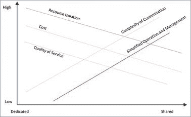

# 第 1 章简介

## 关于本书

这是一本关于使用 ASP.NET 构建多租户应用程序的书。我们将讨论多租户对一般 Web 应用程序的意义，然后我们将研究 ASP.NET 框架如 Web Forms 和 MVC 如何帮助我们实现多租户解决方案。

您可以在这里找到针对所概述问题的工作解决方案，其中一些当然可以得到增强和发展。在适当的时候，我会留下参考资料，以便有兴趣的读者可以改进我所建立的内容并进一步理解这些问题。

需要一些 ASP.NET（Web 窗体或 MVC）知识，但您不必是专家。希望初学者和专家都能找到他们可以在这里使用的东西。

在整本书中，我们将提到两个想象中的租户/域名， **ABC.com** 和 **XYZ.net** ，它们都将托管在我们的服务器中。

## 什么是多租户？为什么要关心？

多租户是一种在过去几年中作为多重部署的替代方案而获得一些声誉的概念。这个概念很简单：单个 Web 应用程序可以以一种可以让他们认为自己正在与不同应用程序通信的方式响应客户端。此应用程序的不同“面”称为**租户**，因为从概念上讲，它们位于同一空间 - Web 应用程序中 - 并且可以单独处理。只需翻转配置开关即可添加或删除租户。

为什么这有用？嗯，首先，它使得没有必要在线拥有多台服务器，并且需要所有维护和成本。一般而言，除其他事项外，还必须考虑以下因素：

*   **资源隔离**：与共享解决方案相比，专用服务器可以更好地屏蔽其他基础架构组件中的故障。
*   **成本**：当我们需要为每个服务，应用程序或客户提供一个物理服务器而不是共享服务器时，成本会更高。
*   **服务质量**：如果您有单独的服务器，则可以实现更高的质量和自定义水平，因为您不关心它如何影响不同的服务，应用程序或客户。
*   **定制的复杂性**：我们必须特别注意定制多租户解决方案，因为我们通常不希望以相同的方式将所有租户应用于所有租户。
*   **操作和管理**：当我们只有一台服务器时，“硬”管理（如备份，监控，物理分配，电源，冷却等）要容易得多。

图 1：专用（多租户）部署的决策标准

通常，多租户框架应该可以帮助我们处理以下问题：

*   **品牌**：不同租户的不同品牌;通过品牌我的意思是徽标图像，样式表和布局。
*   **验证**：不同的租户应该有不同的用户注册;在特定租户中注册的用户不应该能够登录到其他租户。
*   **工作流程**：不同的租户以（稍微）不同的方式处理相同的基本事物是有道理的;多租户框架应该使代码尽可能透明。
*   **数据模型**：不同的租户可能（稍微）有不同的数据需求;再一次，考虑到我们正在谈论相同的共享应用程序，我们应尽可能满足这种需求。

在整本书中，我们将关注这些问题。

## 多租户要求

作为高级需求，我们的应用程序框架应该能够：

*   自动加载一些租户及其信息
*   从每个 HTTP 请求中确定租户的意图，或使用回退值
*   为每个租户请求的页面应用品牌主题
*   允许用户仅登录与其关联的租户
*   为所有不碰撞的租户提供通用的应用服务;例如，存储在一个租户的应用程序缓存中的内容不会被另一个租户覆盖

## 申请服务

应用程序服务提供.NET / ASP.NET 提供的常用功能，但不是多租户方式。这些将在第 9 章“应用程序服务”中讨论。

## 框架

ASP.NET 是一个不同框架共存的保护伞：虽然古老的 [Web Forms](http://www.asp.net/web-forms) 是微软推出的第一个公开实现， [MVC](http://www.asp.net/mvc) 自推出以来已经获得了很大的发展，现在被一些人认为是一种更现代的 Web 开发方法。 [SharePoint](http://products.office.com/en-us/sharepoint/collaboration) 也是一个强有力的竞争者，甚至更多的 [SharePoint Online](https://products.office.com/en-us/sharepoint/sharepoint-online-collaboration-software) ， [Office 365](http://products.office.com/en-us/office-365-home) 产品的一部分。现在看来 [OWIN](http://owin.org/) （以及 [Katana](http://katanaproject.codeplex.com/) ）是这个街区的新酷儿，而 Redmond 最近推出的一些最新框架甚至依赖它（采取[]例如，SignalR](http://www.asp.net/signalr) ）。

在数据方面，[实体框架代码优先](https://msdn.microsoft.com/en-us/data/ef.aspx)现在是使用 Microsoft .NET 框架进行数据访问的标准，但其他同样可靠 - 有些人认为，甚至更强的替代方案存在，例如 [NHibernate](http://nhibernate.info/) ，我们也将介绍这些内容。

身份验证也是从 ASP.NET 2 中引入的古老但过时的[提供程序机制](https://msdn.microsoft.com/en-us/library/aa478948.aspx)发展而来的。许多 Microsoft（或其他）赞助的框架和标准（想想 [OAuth](http://oauth.net/) ）已经介绍，开发者社区当然欢迎他们。在这里，我们将讨论[身份](http://www.asp.net/identity)框架，这是微软最新的身份验证框架，旨在取代旧的 ASP.NET 2 提供程序和 MVC 4 中引入的 [Simple Membership](http://www.asp.net/web-pages/overview/security/16-adding-security-and-membership) API（之后未涵盖）随着[身份](http://www.asp.net/identity)的引入，它已经变得有些过时了。

最后，将这些东西放在一起的粘合剂，加上我们将要生成的代码，是 [Unity](http://unity.codeplex.com) ，微软的[控制反转](http://martinfowler.com/bliki/InversionOfControl.html)（IoC），[依赖注入](http://martinfowler.com/articles/injection.html) ]（DI）和[面向方面编程](http://en.wikipedia.org/wiki/Aspect-oriented_programming)（AOP）框架。这主要是因为我有使用 Unity 的经验，但是，无论如何，您都可以自由使用您喜欢的任何 IoC 框架。 Unity 仅用于注册组件;它的检索是通过[公共服务定位器](https://commonservicelocator.codeplex.com/)完成的，这是大多数 IoC 框架遵循的标准 API。大多数代码都可以与您选择的任何其他框架一起使用，前提是它提供（或您自己推出）与 Common Service Locator 的集成。除了可以追溯到单个引导方法的组件注册代码之外，所有其余代码都依赖于公共服务定位器，而不是特定的 IoC 框架。