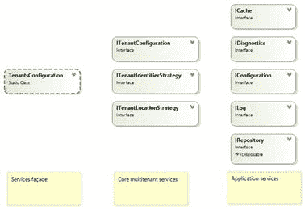
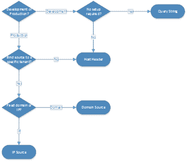
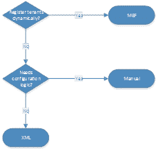
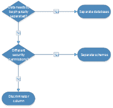
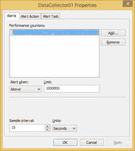

# 第 12 章全部放在一起

## 班级模型

我们在示例中使用的框架类是：

图 38：高级接口

他们共同的实施：

图 39：高级接口的典型实现

## 选择合适的租户识别策略

第 3 章介绍的所有租户识别策略都有一些优点和缺点;有些需要一些额外的配置，其他只适用于简单的场景。一些标准包括：

*   易于测试一个或另一个租户
*   需要将租户绑定到特定源（IP 范围或域）
*   易于设置

您可以使用以下决策流程：

图 40：选择租户识别策略的简单决策流程

## 选择合适的租户位置策略

在选择租户位置（和注册策略）时，您需要考虑以下问题：

*   您需要动态注册新租户吗？
*   注册新租户可以接受多少工作（例如，更改某些配置文件，重新编译应用程序，重新启动它）？
*   租户的某些方面是否只能通过配置进行配置？

在做出决定之前，您需要权衡所有这些约束。以下图片总结了这一点：

图 41：选择租户位置策略的简单决策流程

## 选择正确的数据访问策略

提供的两个 API，NHibernate 和 Entity Framework，支持所有数据访问策略。最后，我认为决定性因素是我们想要的隔离级别：单独的数据库提供最高级别，而通过鉴别器列的数据分区提供最低级别。标准可能包括：

*   合同要求
*   服务水平协议
*   监管要求
*   技术原因
*   需要按使用空间充电

图 42：选择数据分离策略的决策流程

至于 API 本身，在 Entity Framework 的易用性方面可能会有一些好处，但这一切都归结为开发人员最了解的内容，尽管使用 NHibernate 时使用单独的模式确实有点棘手。无论如何，使用 ORM 似乎比坚持使用普通的 ADO.NET 更明智，因为 ORM 提供了所有其他服务。只有当您不需要任何 API 特定功能时，使用 Generic Repository 模式抽象出数据访问 API 可能是一个好主意，并且只需坚持使用最小公分母。

## 监测

即使您不使用自定义性能计数器，内置的计数器也可以提供很好的工具来监控 - 也许还有计费个人租户。一些性能计数器提供了有关正在发生的事情的良好见解，租户方式（您可以选择要独立监控的站点）：

*   **ASP.NET 应用程序**
*   **ASP.NET 应用程序 v4.0.30319**
*   **APP_POOL_WAS** （应用程序池信息）

您可以查看其中某些指标的报告，这些报告可以帮助您做出决策或作为结算基础：

图 43：报告性能计数器

甚至可以添加在某些值超过其正常阈值时触发的警报：

图 44：添加性能计数器警报

此示例显示了为 **_LM_W3SVC_1_ROOT** 生成 ****ASP.NET 应用程序**计数器的**管理内存使用（估计）**指标超过 1,000,000 时的警报的规则网站（ **abc.com** ），每 15 秒评估一次。**

## 布局

如果您需要为每个租户支持不同的布局，请确保遵循现代指南来定义页面的标记;即，强制内容（HTML）和布局（CSS）之间的严格分离，并使用适当的 HTML 元素来组织您的内容。例如，不要使用[表](https://developer.mozilla.org/en-US/docs/Web/HTML/Element/table)元素进行布局或分组内容，因为它不能很好地扩展并对我们可以更改的内容施加限制。

|  | 注意： [CSS Zen Garden 网站](http://www.csszengarden.com/)提供了关于 CSS 功能的精彩示例。 |