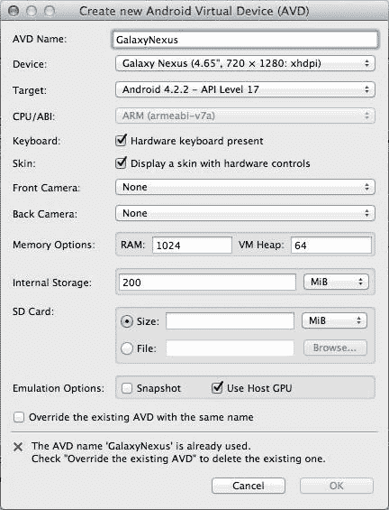
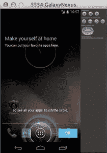
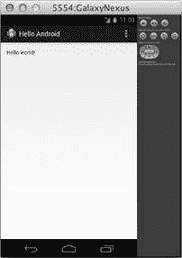

# 第 1 章配置

在我们开始编写任何代码之前，我们的首要任务是建立一个开发环境。构建 Android 应用程序所需的主要组件如下：

*   用于编写代码的文本编辑器。
*   用于链接应用程序代码的 Android 框架。
*   用于将代码编译为工作应用程序的 Android 命令行工具。
*   用于测试已编译应用程序的模拟器或实际设备。

虽然可以使用几乎任何 IDE 或文本编辑器来创建应用程序，但开始使用 Android 平台的最简单方法是官方 Android 软件开发工具包（SDK），它包含所有这些组件，只需一个方便的下载。

## Android SDK

[Android SDK](http://developer.android.com/sdk/index.html) （适用于 OS X，Windows 和 Linux）包括带有 Android Developer Tools（ADT）插件的 Eclipse IDE，以及模拟器，图形布局编辑器和一些其他有用的功能。这也是我们将在本书中使用的开发环境，因此请继续下载并立即下载，以便您可以继续学习。

### 安装

下载完成后，解压缩文件并打开`eclipse`文件夹。它应该包含一个`Eclipse`可执行文件，您可以启动它来启动 IDE。系统将提示您选择工作区文件夹，然后 Eclipse 就可以开始了。这就是安装！

### 创建项目

让我们通过创建一个新的 Android 项目直接进入。在**文件**菜单上，单击**新建**。在结果向导中，选择 **Android 应用程序项目** _。_

图 2：创建一个新的 Android 项目

这将提示您提供有关新项目的一些信息：

*   **应用程序名称**：应用程序的名称。对此字段使用 _Hello Android_ 。
*   **项目名称**：项目目录的名称。这应该使用 _HelloAndroid_ 自动填充，您可以保留此值。
*   **包名称**：项目的唯一命名空间。由于它只是一个示例应用程序，您可以保留默认 _com.example.helloandroid_ ，但您应该使用组织的反向域名作为实际应用程序。

其余字段定义了重要的平台要求，您可以将它们全部保留为默认值。完成后，您的配置应如下所示：

图 3：配置新的 Android 项目

接下来的两个窗口会询问您其他一些杂项细节和应用程序图标。您可以将所有这些值保留为默认值。最后，您将进入以下窗口，询问您是否要创建活动：

图 4：创建初始活动

我们将在下一章详细讨论活动，但您现在需要知道的是，活动代表您的应用程序的单个屏幕。我们想要最初查看一些内容，因此请确保选中**创建活动**，然后选择**空白活动**以指定空白屏幕。在下一个窗口中，您可以使用**活动名称**和**布局名称**字段的默认 **MainActivity** 和 **activity_main** 值（同样，我们我们将在下一章讨论布局。单击**完成**以创建一个全新的 Eclipse 项目。

### 设置模拟器

不幸的是，我们无法立即编译模板项目以查看它的功能。首先，我们需要设置一个设备来测试我们的新应用程序。 Android 旨在让您在具有截然不同的尺寸和功能的设备上运行单个应用程序，使其成为将应用程序从智能手机移植到平板电脑以及介于两者之间的任何设备的高效平台。 SDK 中包含的 Android 虚拟设备管理器允许您模拟市场上的任何设备。

要查看模拟设备列表，请导航至**窗口**并选择 **Android 虚拟设备管理器**。通过此窗口，您可以轻松查看应用程序在各种 Android 设备上的行为，测试不同的屏幕分辨率和尺寸，并体验各种设备功能（例如，硬件键盘，相机，存储容量）。

要为我们的项目创建模拟设备，请单击 **New ...** 并使用 **GalaxyNexus** 作为 **AVD 名称**，然后选择 **Galaxy Nexus** 从**设备**下拉菜单中，将其他所有内容保留为默认值。出于开发目的，检查**使用主机 GPU** 以使用计算机的 GPU 也是一个好主意，因为模拟动画可能非常缓慢和笨重。您的配置应类似于以下内容：

图 5：创建新的模拟设备

单击 **OK** 后，您应该在 **Android 虚拟设备管理器**窗口中找到您的设备。要启动模拟器，请选择 **GalaxyNexus** 项目，然后单击**开始**。将启动选项保留为默认值，然后单击**启动**。这将开始启动模拟器，类似于以下内容：

图 6：Android 设备模拟器

模拟器必须启动 Android 操作系统（就像真实设备一样），因此您可能会在模拟器实际可以使用之前盯着该 Android 徽标一段时间。当它最终准备就绪时，您将看到典型的 Android 主屏幕，您可以单击以启动应用程序并浏览模拟设备：

图 7：模拟器准备好后使用

由于启动需要很长时间，因此您需要在开始编写代码时保持模拟器运行（Eclipse 可以在模拟器上重新启动应用程序而无需重新启动它）。

### 编译应用

我们终于准备好编译示例项目了。回到 Eclipse，确保在 Package Explorer 中选择了一个源文件，然后单击 **Run** ，选择 **Run as** ，然后选择 **Android Application** 。花一点时间编译后，您应该在设备模拟器中看到您的第一个 Android 应用程序。如您所见，默认模板包含一个单词文本字段，显示“Hello world！”

图 8：已编译的模板项目

在下一章中，我们将学习如何更改此文本字段的内容，添加其他 UI 组件以及组织简单的 Android 应用程序。