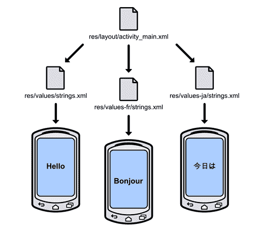
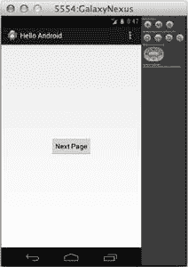
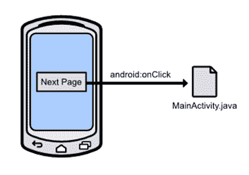
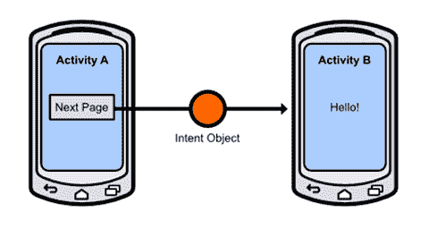
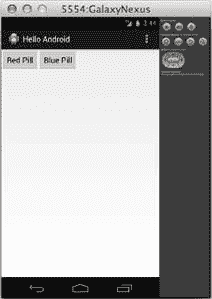
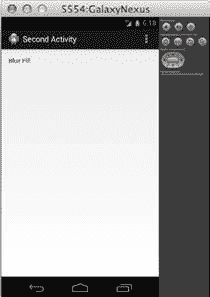

# 第 2 章你好，Android

在本章中，我们将发现所有 Android 应用程序的基本设计模式。我们将学习如何使用活动，通过编辑 XML 布局文件来显示 UI 元素，处理按钮单击以及使用 intent 对象在活动之间切换。我们还将了解表示维度和字符串值的最佳实践，以实现最大的可移植性。

Android 应用中的每个屏幕都由 [Activity](http://developer.android.com/reference/android/app/Activity.html) 的自定义子类表示。子类定义活动的行为，它还负责从 XML 布局文件加载用户界面。通常，此 XML 布局文件是定义给定活动的整个接口的位置。要向用户显示文本字段，按钮，图像和其他小部件，您需要做的就是将 XML 元素添加到布局文件中。

[Intent](http://developer.android.com/reference/android/content/Intent.html) 对象用于在组成应用程序的各种活动之间切换。例如，当用户单击按钮导航到另一个屏幕时，您将创建一个`Intent`对象并将目标活动传递给它。然后，您“执行”意图告诉 Android 切换到下一页。这是构建多屏幕应用程序的一般模式。

本章解释了所有这些 android 体系结构组件如何使用动手实例进行交互。您可以按照上一章中创建的空白 Android 项目进行操作，也可以在本书示例代码中包含的 HelloAndroid 应用程序中查看已完成的代码。

## 应用结构概述

让我们首先看看我们的模板项目为我们创建的文件和目录。看起来 Eclipse 的 Package Explorer 中有很多文件，但不要让人不知所措 - 只需要担心的是三个项目：

*   `AndroidManifest.xml` - 此文件声明 Android 操作系统启动它所需的应用程序的所有内容。这包括组成应用程序的类，应用程序所需的权限，元数据（如应用程序的最低 Android API）以及应用程序所依赖的库。它必须位于项目的根目录中。通常，SDK 会自动为您更新此文件，因此您不必直接编辑它。
*   `src/` - 此目录包含所有应用的源文件。这是所有 Java 源代码所在的位置。
*   `res/` - 此文件夹包含应用程序**资源**，它们是将显示给用户的图像，视频和字符串。通过从应用程序代码中抽象出资源，添加对新屏幕分辨率，方向和语言的支持是微不足道的。

清单和源目录相对简单，但资源文件夹需要更多解释。如果在 Package Explorer 中展开此文件夹，您将找到三种类型的子目录：`drawable/`，`layout/`和`values/`。 `drawable/`文件夹包含应用程序的所有图形，可以是图像文件，也可以是定义形状的特殊 XML 文件。 `layout/`目录存储应用程序显示的每个屏幕的 UI，`values/`文件夹包含 UI 使用的字符串列表。

现在，有趣的部分是连字符后面的内容。文件夹名称的这一部分是**限定符**，它告诉系统何时使用包含的资源。例如，当主机设备具有高密度屏幕（~240dpi）时，将显示`drawable-hdpi/`中的图像，而具有低密度屏幕（~120dpi）的设备将使用`drawable-ldpi/`中的图像。

只需将高分辨率图像和低分辨率图像放在适当的文件夹中，您的应用就可以用于两种类型的设备，而无需更改代码。同样，您的应用程序可以通过在`values/`子目录后附加`en`，`es`，`fr`，`ar`或任何其他语言代码移植到其他语言。通过这种方式，`res/`目录可以非常轻松地支持新设备并吸引新的受众。

## 创建用户界面

Android 应用程序使用 XML 来定义其用户界面。布局文件中的每个 XML 元素表示 [ViewGroup](http://developer.android.com/reference/android/view/ViewGroup.html) 或 [View](http://developer.android.com/reference/android/view/View.html) 对象。 `ViewGroup`是其他`View`对象的不可见容器，它们的主要工作是将子视图（或嵌套视图组）排列成令人愉悦的布局。 `View`对象是可见的 UI 组件，如文本字段，按钮和表。要配置视图或视图组的属性，请编辑相应 XML 元素的属性。

我们使用的模板项目带有一个名为`activity_main.xml`的默认布局，您可以在`res/layout/`目录中找到它。双击该文件时，ADT 默认显示图形 UI 编辑器。虽然您可以使用它来直观地编辑基础 XML，但对于本书，我们将直接编辑 XML 标记，以深入了解 Android 用户界面的工作方式。要显示原始 XML，请单击 Eclipse 编辑区域左下角的 **activity_main.xml** 选项卡，以橙色突出显示，如下图所示：


图 9：主布局的原始 XML 选项卡

单击此选项卡后，您将找到定义当前布局的 XML。它应该类似于以下内容：

```
<RelativeLayout xmlns:android="http://schemas.android.com/apk/res/android"
    xmlns:tools="http://schemas.android.com/tools"
    android:layout_width="match_parent"
    android:layout_height="match_parent"
    android:paddingBottom="@dimen/activity_vertical_margin"
    android:paddingLeft="@dimen/activity_horizontal_margin"
    android:paddingRight="@dimen/activity_horizontal_margin"
    android:paddingTop="@dimen/activity_vertical_margin"
    tools:context=".MainActivity" >

    <TextView
        android:layout_width="wrap_content"
        android:layout_height="wrap_content"
        android:text="@string/hello_world" />

</RelativeLayout>

```

如您所见，这定义了两个元素：`&lt;RelativeLayout&gt;`和`&lt;TextView&gt;`。 [RelativeLayout](http://developer.android.com/reference/android/widget/RelativeLayout.html) 是`ViewGroup`的子类，用于定义其子项相对于彼此的位置。 [TextView](http://developer.android.com/reference/android/widget/TextView.html) 是`View`的子类，表示标准文本字段组件。我们将调查最常见的 UI 元素以及本书后面的内容。

`android`命名空间中的所有属性都确定了相关元素的各种属性。例如，`android:layout_width="match_parent"`使`RelativeLayout`拉伸到与其父级相同的大小（在这种情况下，应用程序的主窗口）。每种元素类型的可用属性和值列在相应类的文档中（例如， [View](http://developer.android.com/reference/android/view/View.html) ， [ViewGroup](http://developer.android.com/reference/android/view/ViewGroup.html) ， [RelativeLayout](http://developer.android.com/reference/android/widget/RelativeLayout.html) ， [TextView](http://developer.android.com/reference/android/widget/TextView.html) ）。 `android:text`的值是对字符串资源的引用，我们稍后会解释。

## 添加按钮

但首先，我们将简化默认布局并将其更改为单个按钮，以屏幕为中心。用以下内容替换现有的`activity_main.xml`：

```
<RelativeLayout xmlns:android="http://schemas.android.com/apk/res/android"
xmlns:tools="http://schemas.android.com/tools"
android:layout_width="match_parent"
android:layout_height="match_parent"
android:gravity="center"
tools:context=".MainActivity" >

<Button
android:layout_width="wrap_content"
android:layout_height="wrap_content"
android:text="@string/button_next" />

</RelativeLayout>

```

我们在这做了两件事。首先，我们用`android:gravity`替换了`&lt;RelativeLayout&gt;`的填充属性。这告诉它将所有子视图居中。其次，我们将`&lt;TextView&gt;`元素更改为`&lt;Button&gt;`并为其`android:text`属性赋予了新值。

不幸的是，您还无法编译项目以查看按钮。相反，您会在`android:text`属性旁边看到一条错误消息，说明有关缺少资源的信息，如下图所示：


## 定义字符串资源

在为 Android 设计布局时，您很少需要将按钮标题，标签和其他文本字段的值硬编码到布局的 XML 文件中。而是在单独的文件中定义**字符串资源**，并从布局中链接到它。这个额外的抽象层使得可以重用具有不同字符串资源的相同布局文件。例如，您可以在纵向模式与横向模式下显示较短的指令，或根据设备的区域设置显示英语，德语，阿拉伯语或中文指令。



图 10：在同一布局中显示不同的字符串资源

无论何时要链接到任何外部资源，都使用以下格式：`@<type>/<identifier>`。例如，`activity_main.xml`中的`android:text="@string/button_text"`属性引用标识为`button_text`的`string`资源。但是，由于我们尚未创建该资源，编译器无法找到它，因此它给我们一个错误。我们现在解决这个问题。

在`res/values/`目录中，打开 **strings.xml** 文件。这是定义将向用户显示的字符串的常规位置（文件名实际上是任意的，因为资源完全由包含的 XML 定义）。你会在`&lt;resource&gt;`元素中找到一些`&lt;string&gt;`元素。继续并添加以下元素：

```
<string name="button_next">Next Page</string>

```

`name`属性定义资源的标识符。 Eclipse 应该停止抱怨缺少的资源，现在您应该能够成功编译项目了。在模拟器中，您应该在屏幕中央看到一个按钮，其标题为 Next Page：



图 11：向 UI 添加按钮

将 UI 字符串与布局构造分离似乎是一种不必要的麻烦，但是一旦您开始使用更复杂的用户界面并希望支持多种语言，您就会非常欣赏将所有字符串放在一个地方的便利。

## 检测按钮输入

因此，我们有一个用户可以与之交互的按钮，当您点按它时，它甚至还具有标志性的蓝色突出显示。下一步是检测水龙头。这是通过`android:onClick`属性完成的，该属性告诉系统在点击按钮时调用相关活动的方法。这将布局图层与行为图层绑定在一起，如下图所示。



图 12：使用 android：onClick 属性检测按钮单击

在`activity_main.xml`中，将`&lt;Button&gt;`元素更改为以下内容。这会将按钮连接到`MainActivity.java`的`nextPage()`方法（我们仍然需要实现）。

```
<Button
android:layout_width="wrap_content"
android:layout_height="wrap_content"
android:text="@string/button_next"
android:onClick="nextPage" />

```

## 测井输出

要确定我们的按钮是否正常工作，只要点击按钮，就可以将消息记录到控制台。我们将使用 Android 平台附带的 [Log](http://developer.android.com/reference/android/util/Log.html) 类，而不是 Java 的常规`System.out.println()`。这是在 Android 应用中将消息输出到控制台的首选方式，因为它具有明确定义的优先级，可让您轻松过滤不同类型的消息。下面列出了最常见的`Log`方法，从最高优先级到最低优先级：

*   `Log.e(String tag, String msg)` - 记录错误消息。
*   `Log.w(String tag, String msg)` - 记录警告消息。
*   `Log.i(String tag, String msg)` - 记录信息消息。
*   `Log.d(String tag, String msg)` - 记录调试消息。

具有多个级别的消息日志记录可以根据编译目标过滤某些消息。例如，调试消息在运行时从生产应用程序中剥离，使其成为开发期间使用的最佳选择。即使在生产应用程序中，也始终记录错误，警告和信息性消息。

所有这些方法的第一个参数是一个标识日志消息源的字符串。您通常希望这是进行日志记录的类的名称，定义此值的传统方法是使用类本身中的私有静态 final 变量。因此，在`MainActivity.java`中，在类定义的开头添加以下行：

```
private static final String TAG = "MainActivity";

```

并且，与任何其他 Java 类一样，我们需要在使用它之前导入`Log`类，因此将以下 import 语句添加到`MainActivity.java`的顶部（我们也需要`View`类） ：

```
import android.util.Log;
import android.view.View;

```

然后，实现`nextPage()`方法输出调试消息，如下所示：

```
public void nextPage(View view) {
Log.d(TAG, "Switching to next page");
}

```

请记住，这是我们在`activity_main.xml`中连接的方法的名称，因此每次用户单击按钮时都应调用它。用作`android:onClick`目标的任何方法都需要具有上述签名（即，它必须是`public`，返回`void`，并接受单个`View`对象作为参数）。该参数是对发起调用的 UI 组件的引用，在这种情况下是用户按下的按钮。

您现在应该能够编译项目，点击按钮，并在 IDE 底部的 LogCat 面板中查看上面的消息。这是从 Eclipse 中启动应用程序时将显示所有日志消息的位置。要显示 LogCat 面板，请单击**窗口**，**显示视图**， **Android** ，然后选择 **LogCat** 。


图 13：Eclipse 中的 LogCat 面板

## 创造另一个活动

记录是确保 UI 组件正常工作的一种便捷方式，但您可能希望大多数按钮不仅仅是向控制台显示消息。为了扩展我们的示例，当用户按下按钮时，我们将切换到另一个活动。

第一步是为第二个活动创建另一个类。在 Eclipse 中，按 **Cmd + N** （如果你在 PC 上，则按 Ctrl + N）打开 New Document 向导并选择 **Android Activity** 将新类添加到当前项目。为模板选择**空白活动**。在下一个窗口中，对**活动名称**字段使用 **SecondActivity** ，为**布局名称**使用 **activity_second** ，并使用**第二活动** ]对于**标题**字段。您配置的活动应如下所示：


图 14：配置新的 Activity 类

单击**完成**将创建`SecondActivity.java`和`activity_second.xml`文件，将它们添加到清单中，并在`res/values/strings.xml`中添加定义活动标题的字符串资源。这是准备使用新活动所需的一切。

## 将活动与意图联系起来

单个 Android 应用程序的用户体验通常由几个不同的活动组成（例如，浏览用户的联系人列表，编辑联系人和查看联系人都是单独的活动，但都是 People 应用程序的一部分）。每个活动都是作为一个完全独立的组件实现的，即使它们是同一个应用程序的一部分。这使得任何其他活动（包括来自其他应用程序的活动）都可以启动任何活动。例如，如果您的应用程序需要向用户的联系人列表添加新联系人，则可以直接跳转到 People 应用程序的活动以创建新条目。

为了将所有这些独立活动粘合在一起形成一个连贯的应用程序，Android 提供了一个 [Intent](http://developer.android.com/reference/android/content/Intent.html) 类，它表示要执行的任意操作。一般模式是创建`Intent`对象，指定目标类，并传入目标类执行操作所需的任何数据。下图显示了 intent 对象如何链接两个活动。



图 15：使用 Intent 对象从一个活动切换到另一个活动

这些活动之间的松散耦合使得模块化的应用程序架构具有灵活的代码重用机会。

在我们的示例中，我们要在`MainActivity`类中创建一个 intent 并使用`SecondActivity`作为目标。我们将担心本章末尾的数据传递部分。首先，将`Intent`类导入`MainActivity.java`：

```
import android.content.Intent;

```

然后，将`nextPage()`方法更改为以下内容：

```
public void nextPage(View view) {
Intent intent = new Intent(this, SecondActivity.class);
startActivity(intent);
}

```

创建 intent 之后，我们可以将它传递给内置的`startActivity()`函数来执行它。当您单击第一个活动中的“下一页”按钮时，结果应该是转换到第二个活动。现在，第二个活动只是一个静态文本字段，上面写着“Hello world！”，但我们将在下一部分中对其进行更改。

## 另一个按钮

在本节中，我们将向主活动添加另一个按钮，然后我们将所选按钮传递给第二个活动以供显示。将`activity_main.xml`更改为以下内容：

```
<LinearLayout xmlns:android="http://schemas.android.com/apk/res/android"
xmlns:tools="http://schemas.android.com/tools"
android:layout_width="match_parent"
android:layout_height="match_parent"
android:orientation="horizontal"
tools:context=".MainActivity" >

<Button
android:layout_width="wrap_content"
android:layout_height="wrap_content"
android:text="@string/button_red"
android:onClick="nextPage" />

<Button
android:layout_width="wrap_content"
android:layout_height="wrap_content"
android:text="@string/button_blue"
android:onClick="nextPage" />

</LinearLayout>

```

请注意，当用户点击它们时，两个按钮都会调用相同的`nextPage()`方法。这需要两个新的字符串资源：`button_red`和`button_blue`。在`strings.xml`中，继续添加以下资源：

```
<string name="button_red">Red Pill</string>
<string name="button_blue">Blue Pill</string>

```

您可以删除`button_next`元素，因为我们将不再使用它。在我们开始使用`Intent`对象传递数据之前，让我们确保使用简单的`Log`消息告诉我们按下了哪个按钮。在`MainActivity.java`中，将`nextPage()`方法更改为以下内容：

```
public void nextPage(View view) {
Intent intent = new Intent(this, SecondActivity.class);
Button button = (Button)view;
String message = button.getText().toString();
Log.d(TAG, message);
startActivity(intent);
}

```

所有这一切都是通过`getText()`方法获取按钮的标题，并通过`Log.d()`调用显示它。您还需要导入文件顶部的`Button`类：

```
import android.widget.Button;

```

现在，当您编译应用程序时，您应该会在左上角看到两个按钮。



图 16：向主活动添加另一个按钮

当您点击其中一个按钮时，您应该会看到 LogCat 面板中显示的相应标题。

## 用意图传递数据

接下来，我们将使用现有的`Intent`对象将此信息传递给下一个活动。您可以通过调用`putExtra()`方法将数据存储在`Intent`实例中，该方法有两个参数：名称和字符串。您可以将此视为在`Intent`对象上创建键值对。例如：

```
public void nextPage(View view) {
Intent intent = new Intent(this, SecondActivity.class);
Button button = (Button)view;
String message = button.getText().toString();
intent.putExtra(EXTRA_MESSAGE, message);
startActivity(intent);
}

```

`intent.putExtra(EXTRA_MESSAGE, message);`行将按钮的标题添加到`Intent`对象，我们稍后可以通过`EXTRA_MESSAGE`常量检索该对象。我们仍然需要定义这个常量，所以一定要在`MainActivity`类的顶部包含以下内容：

```
public static final String EXTRA_MESSAGE = "com.example.helloandroid.MESSAGE";

```

我们现在已成功编码了一些数据，以便从主活动发送到第二个活动。接下来，我们需要允许第二个活动接收此信息。这需要两个步骤：

1.  获取发送到第二个活动的 Intent 实例。
2.  使用 EXTRA_MESSAGE 键返回关联的值。

要执行这两项操作，请将以下方法添加到`SecondActivity.java`：

```
@Override
protected void onCreate(Bundle savedInstanceState) {
super.onCreate(savedInstanceState);
setContentView(R.layout.activity_second);

Intent intent = getIntent();
String message = intent.getStringExtra(MainActivity.EXTRA_MESSAGE);
Log.d(TAG, message);
}

```

`onCreate()`方法是由`Activity`类定义的特殊方法。每当启动`Activity`时，Android 框架都会调用`onCreate()`，并且通过在子类中重写它，我们可以添加自定义初始化行为。现在，您可以将其视为`Activity`实例的构造函数方法，但我们将在下一章中对此概念进行一些改进。

最后三行获取我们从`MainActivity.java`发送的`Intent`数据并用`Log.d()`显示。 `getIntent()`方法是`Activity`类定义的另一种方法，它只返回启动活动的`Intent`实例。然后，我们使用 [Intent](http://developer.android.com/reference/android/content/Intent.html) 类的`getStringExtra()`方法来查找与`MainActivity.EXTRA_MESSAGE`键相关的值。请注意，在`MainActivity.java`中将键定义为常量是最佳做法，因为它允许编译器确保正确键入键。其他数据类型有类似的方法（例如，`getFloatExtra()`返回`float`值）。

上面的方法仍然需要访问`Intent`和`Log`类，所以在`SecondActivity.java`的顶部添加以下行：

```
import android.content.Intent;
import android.util.Log;

```

我们还需要在`SecondActivity.java`中定义另一个`TAG`变量：

```
private static final String TAG = "MainActivity";

```

您现在应该能够编译该项目。单击其中一个按钮，然后`SecondActivity`记录所选按钮标题：


图 17：记录所选按钮的标题

为了完整性，让我们使`SecondActivity`中的文本字段显示值而不是仅在 LogCat 中显示它。首先，将`id`属性添加到`activity_second.xml`中的`TextView`：

```
<TextView
android:id="@+id/selected_title"
android:layout_width="wrap_content"
android:layout_height="wrap_content"
android:text="@string/hello_world" />

```

如果要从应用程序的其他位置访问 UI 元素，则需要`id`属性。 `@+id`中的加号仅在首先定义 UI 元素时才需要（如果您想从另一个 UI 文件引用它，则不需要它）。 `selected_title`部分定义了元素的唯一 ID，可以按如下方式使用（在`SecondActivity.java`中定义）：

```
protected void onCreate(Bundle savedInstanceState) {
super.onCreate(savedInstanceState);
setContentView(R.layout.activity_second);

Intent intent = getIntent();
String message = intent.getStringExtra(MainActivity.EXTRA_MESSAGE);
TextView textField = (TextView)findViewById(R.id.selected_title);
textField.setText(message);
}

```

全局`findViewById()`方法由`Activity`类定义，它返回具有提供的 ID 的`View`实例。请注意，我们必须将返回值强制转换为`TextView`，以便我们可以使用`setText()`方法显示所选按钮。 `R.id.selected_title`片段是引用 XML 文件中定义的 UI 组件的传统方式。编译项目时会自动生成`R`类，并且框架使用`android:id`属性为每个元素填充常量。这种使用静态常量来引用 UI 元素的方法消除了引用未定义元素的可能性（例如，来自布局文件中的拼写错误或省略的 ID）。

请注意，您必须导入上述`onCreate()`方法的`TextView`类进行编译：

```
import android.widget.TextView;

```

Android 初学者的一个常见错误是在调用`setContentView()`之前调用`findViewById()`。该字母必须首先调用，否则`findViewById()`将返回`null`。

第二个视图现在应显示“Red Pill”或“Blue Pill”，具体取决于您在主活动页面中点击的按钮。要在按钮之间切换，请使用设备上的“返回”按钮返回主页面并选择要测试的按钮。如下图所示，选择 Blue Pill 按钮将显示其文本。



图 18：在第二个活动中显示所选按钮标题

## 小结

在本章中，我们了解了 Android 应用程序的基本结构，如何使用 XML 文件创建用户界面，定义媒体资源，处理用户输入以及使用`Intent`对象在活动之间切换。我们还通过简要介绍`Log`类获得了一些实用的调试技巧。

这几乎是您开发基本 Android 应用时需要了解的一切。下一章将更详细地解释`Activity`的生命周期，这对于正确管理应用程序的内存占用非常重要。本书的其余部分探讨了使应用程序更具交互性，数据驱动和用户友好性的中间功能。