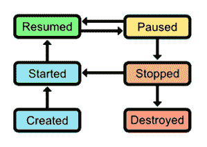

# 第 3 章活动生命周期

一旦掌握了 Android 应用程序的基本结构，下一步就是要了解构造和销毁`Activity`对象背后的复杂性。我们已经看到`onCreate()`如何用于初始化`Activity`，但这只是管理活动生命周期的一个方面。在本章中，我们将学习如何通过正确实现活动的生命周期来最小化 CPU，内存和电池使用，处理电话呼叫中断，保存用户状态以及在横向和纵向之间切换。这是 Android 应用程序开发的一个非常重要的方面，因为如果不这样做将导致您的应用程序经常崩溃（这是一个非常糟糕的用户体验）。下图显示了应用程序的活动生命周期。



图 19：活动生命周期

活动生命周期包括以下六种状态：

*   **已创建**：已创建活动并准备显示。
*   **已启动**：活动可见，但用户尚无法与之交互。该状态通常紧接着 _ 恢复 _ 状态。
*   **Resumed** ：活动在前台运行，用户可以与之交互。
*   **暂停**：活动已被电话呼叫或对话消息（例如，电量不足警报）中断。这通常会立即导致 _ 停止 _ 状态。活动通常在暂停时仍然可见，但是被对话框遮挡，因此用户无法与之交互。
*   **已停止**：活动已移至后台并且不再可见，但实例仍存在于内存中。可以从此状态重新启动活动而无需重新创建它。
*   **Destroyed** ：该活动已被系统释放，不再存在。这将在 Android 操作系统认为必要时自动发生。

当一个活动被创建时，它会通过前三个状态，当它被销毁时，它会通过后半个状态。然而，这很少以严格的线性方式发生。当用户与您的其他活动进行交互时，典型应用程序将在 _ 已启动 _，_ 已恢复 _，_ 暂停 _ 和 _ 已停止 _ 状态之间切换应用程序并被重要警报打断。

为了管理这些状态之间的转换，`Activity`类提供了几种方法。要定义自定义启动和拆卸行为，您所要做的就是在`Activity`子类中覆盖这些方法。下面列出了所有`Activity`转换方法，以及何时应该使用它们的常见示例：

*   `onCreate()` - 当活动进入 _ 创建的 _ 状态时调用。正如我们在上一章中所看到的，这是您要初始化 UI 元素以及准备要使用的活动的位置。
*   `onStart()` - 当活动进入 _ 开始 _ 状态时调用。这是一个加载需要显示给用户的数据的好地方，尽管这也可以在`onResume()`中完成，具体取决于数据类型和使用方式。
*   `onResume()` - 当活动进入 _ 恢复 _ 状态时调用。这是初始化传感器输入（例如，GPS，相机）并开始用户界面所需的任何动画的最佳位置。
*   `onPause()` - 当活动进入 _ 暂停 _ 状态时调用。在这里您应该停止使用稀缺的系统资源（例如，动画，GPS，相机）来最大化设备的电池寿命并减少应用程序的内存占用。这是`onResume()`方法的拆解对应物。
*   `onStop()` - 当活动进入 _ 停止 _ 状态时调用。这是在应用程序进入后台之前调用的，因此它是保存稍后需要重新使用的用户数据的好地方（例如，电子邮件草稿）。请注意，`onPause()`也可以是一个合适的时间，因为它总是在`onStop()`之前调用。是否要使用`onPause()`或`onStop()`在很大程度上取决于您的具体应用要求。 `onStop()`是`onStart()`方法的拆解对应物。
*   `onDestroy()` - 当活动进入 _ 销毁 _ 状态时调用。这是您必须清理在销毁应用程序时可能会泄漏的任何资源的最后机会。这是`onCreate()`方法的拆解对应物;但是，当活动被销毁时，系统将自动释放类引用，因此除非您在`onCreate()`中启动了后台线程或创建了内存缓冲区，否则通常不需要实现`onDestroy()`。

如您所见，上述过渡方法之间存在对称性。 `onStart()`中发生的任何事情都应在`onStop()`中撤消，`onResume()`中的任何内容都应在`onPause()`中撤消。

覆盖上述任何方法时，请记住 _ 必须 _ 调用超类的版本才能使应用程序正常工作。

## 常见活动转换事件

如果您对所有这些转换感到有些困惑，可能有助于从用户的角度讨论它们。在本节中，我们已经包含了一些可以触发下面的活动状态转换的最常见事件。同样，所有这些在应用程序的正常使用中经常发生，因此必须确保相应的转换方法有效地消耗和释放系统资源。

### 按下电源按钮

当用户按下设备的电源按钮使其处于待机状态时，当前活动将移至后台（即 _ 暂停 _，然后 _ 停止 _）。正如您所料，当它们退出待机状态时会发生相反的过程：当前活动将 _ 开始 _，然后 _ 恢复 _。

如果您考虑在活动过程中您在自己的 Android 设备上进入待机状态的次数，您将很快了解正确管理`onPause()`，`onStop()`，`onStart()`的重要性，和`onResume()`方法。例如，如果您在设备进入待机状态后让加速计传感器保持运行，则用户在重新打开手机时会发现电池意外低电量。

### 旋转设备

Android 系统处理设备方向更改的方式可能有点违反直觉，特别是对于新开发人员。当屏幕旋转时，前景活动实际上被破坏并从头开始重新创建。这是因为某些布局需要为纵向和横向模式加载不同的资源，并且使用相同的实例可能会浪费。

### 点击后退按钮

当用户点击“返回”按钮时，操作系统将其解释为不再需要当前活动，因此它会销毁它而不是仅将其发送到后台。这意味着如果用户导航回已销毁的活动，则将从头开始创建。如果您尝试在被破坏的活动中记录用户的进度，这意味着您需要将该信息 _ 存储在活动的 _ 之外，并将其重新加载到`onCreate()`，`onStart()`或`onResume()`中。如果您尝试将任何数据存储为实例变量，则在销毁活动时它将丢失。

## 重建被破坏的活动

当用户点击“后退”按钮或手动终止自身时销毁的活动将永远消失;但是，当由于系统限制而销毁活动时，情况并非如此。例如，如果活动即将被销毁，因为 Android OS 需要内存，它首先将 [Bundle](http://developer.android.com/reference/android/os/Bundle.html) 对象中`Activity`的**实例状态**归档，保存到磁盘，并将`Bundle`与`Activity`子类关联起来。

然后可以使用此`Bundle`对象创建一个新的`Activity`对象，其状态与被破坏的对象相同。从本质上讲，这使得看起来好像原始的`Activity`实例始终处于 _ 停止 _ 状态而不消耗任何资源。

### 恢复实例状态

如果`Activity`存在关联的`Bundle`，则会将其传递给`onCreate()`方法。例如，如果您正在开发电子邮件客户端并将电子邮件正文存储在名为`message`的实例变量中，则您的`onCreate()`方法可能如下所示：

```
@Override
protected void onCreate(Bundle savedInstanceState) {
super.onCreate(savedInstanceState); setContentView(R.layout.activity_main);

if(savedInstanceState != null) {
// Restore the archived instance state
this.message = savedInstanceState.getString(STATE_MESSAGE);
} else {
// Initialize with default values
this.message = "Hello, World!";
}
}

```

这还需要在课程顶部的以下两行：

```
private static final String STATE_MESSAGE = "MainActivityMessageState";
public String message;

```

`STATE_MESSAGE`是一个常量，它定义在归档捆绑包中的`message`实例变量时使用的密钥。这类似于在`Intent`对象中存储信息的键值模式。

### 保存实例状态

要归档自定义实例变量，您需要做的就是覆盖`Activity`定义的`onSaveInstanceState()`方法。例如，要保存上述消息状态，您可以使用以下内容：

```
@Override
public void onSaveInstanceState(Bundle savedInstanceState) {
savedInstanceState.putString(STATE_MESSAGE, this.message);
super.onSaveInstanceState(savedInstanceState);
}

```

与`Activity`状态转换方法一样，在覆盖它时调用`onSaveInstanceState()`的超类版本很重要。

### 查看状态

Android 框架将自动保存整个视图层次结构的状态，这意味着每个文本字段，按钮和图像将与系统销毁之前完全一样。对于许多活动，这是唯一真正需要保存的状态 - 实际需要实现自定义`onSaveInstanceState()`的次数之一是当`Activity`有多个步骤并且用户的进度被记录在实例中时变量。

本书资源包中的`ActivityLifecycle-transitions`项目是一个简单的应用程序，演示了上面讨论的所有过渡方法。它有两个可以在它们之间切换的活动，它们都使用`Log.d()`在它们改变状态时通知你。在模拟器中运行项目并单击按钮时，您应在 LogCat 中看到以下消息：

```
05-23 12:27:41.178: D/MainActivity(4042): Created Main Activity
05-23 12:27:41.178: D/MainActivity(4042): Started Main Activity
05-23 12:27:41.178: D/MainActivity(4042): Resumed Main Activity
// Click the "Next Activity" button
05-23 12:27:44.788: D/MainActivity(4042): Paused Main Activity
05-23 12:27:45.018: D/SecondActivity(4042): Created Second Activity
05-23 12:27:45.018: D/SecondActivity(4042): Started Second Activity
05-23 12:27:45.018: D/SecondActivity(4042): Resumed Second Activity
05-23 12:27:45.728: D/MainActivity(4042): Stopped Main Activity

```

另请注意，如果按模拟器上的电源按钮（模拟实际设备上的物理电源按钮），您将看到当前活动暂停，然后停止。按模拟器的“后退”按钮时，您还可以看到当前活动被破坏。

当然，您通常希望做的不仅仅是在`onCreate()`，`onStart()`和其他活动转换方法中记录消息，但是这个项目确实为您提供了一个方便的地方来开始尝试各种状态。 `Activity`。在我们学习如何创建动画和保存用户数据之后，我们将在本书后面看到这些方法的一些更实用的版本。

## 小结

在本章中，我们介绍了`Activity`对象的生命周期。当用户导航应用程序时，每个`Activity`对象通过 _ 创建的 _，_ 启动 _，_ 恢复 _，_ 暂停 _，_ 停止 _，_ 摧毁 _ 状态，经常在中间四个状态之间循环几次，然后被摧毁。由于这些状态转换频繁发生，并且移动设备具有如此稀缺的系统资源，因此在这些状态之间正确转换是满足用户体验的基本组成部分。

本章更多地关注`Activity`生命周期的概念方面，因为`onResume()`等转换方法的具体实现是特定于应用程序的。您应该从本章中学到的内容是对 Android 框架如何管理其`Activity`对象的高级理解。一旦理解了这一点，就可以很容易地将这些概念适应您的实际应用需求。

在接下来的两章中，我们将稍微改变一下，专注于配置 Android 应用程序的前端。首先，我们将学习如何将 UI 元素安排到用户友好的布局中，然后在下一章中，我们将探索按钮，文本字段，微调器和其他常见输入控件的 API。