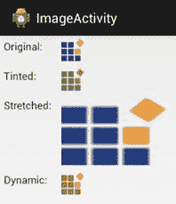
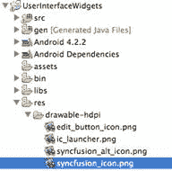
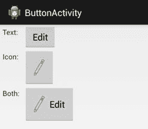
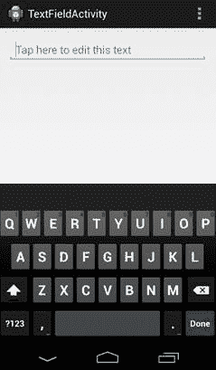
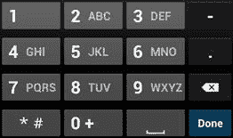
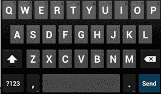
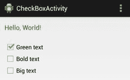
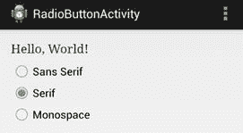

# 第 5 章用户界面小部件

在本章中，我们将调查 Android 的基本用户界面小部件：按钮，文本字段，复选框，滑块，微调器和拾取器。了解如何配置和查询这些组件使您能够向用户收集或显示几乎任何类型的信息，这是任何高质量 Android 应用程序的基础。我们还将简要介绍如何更改这些 UI 元素的外观以及 Android 的内置主题。

本章旨在介绍 Android 提供的许多 UI 组件。您应该基本了解可用的组件以及如何在实际应用程序中开始使用它们。本章包含了提供更多信息的官方文档的链接。

本章的所有示例都可以在本书示例代码中包含的 _UserInterfaceWidgets_ 项目中找到。该项目的主要活动提供了与其他几个活动的链接，每个活动都包含特定类型小部件的具体示例。

## 图像

可以使用 [ImageView](http://developer.android.com/reference/android/widget/ImageView.html) 对象显示图像。 `ImageView`可以显示任何类型的位图，它负责基本的对齐和缩放功能。您可以在`activity_image.xml`布局文件中找到各种`ImageView`配置的几个示例：



图 45：本章示例应用程序中定义的 ImageActivity

要在 XML 布局文件中包含`ImageView`，您可以开发以下代码：

```
<ImageView
android:layout_width="wrap_content"
android:layout_height="wrap_content"
android:padding="5dp"
android:src="@drawable/syncfusion_icon" />

```

`ImageView`最重要的属性是`android:src`。这定义了它将显示的图像。在上述情况下，`@drawable/syncfusion_icon`是指应用程序源代码中包含的图像文件。注意，这具有与字符串资源类似的格式（例如，`@string/button_title`）。但是，`@drawable`前缀是指**可绘制资源**，它是任何类型的图形资产。

### 添加可绘制资源

当然，为了使上面的代码片段起作用，我们需要将一个名为`syncfusion_icon`的图像文件添加到 Eclipse 项目中。 _UserInterfaceWidgets_ 示例项目已包含此文件，但添加您自己的图形资源就像从硬盘驱动器复制它们并将它们粘贴到 Eclipse Package Explorer 中的一个或多个`res/drawable`目录一样简单。请记住，`hdpi`，`ldpi`和其他后缀对应于不同的屏幕分辨率，因此为您计划支持的每个分辨率包含替代图像是一种很好的做法。



图 46：向 Eclipse 项目添加图形资源

请注意，可绘制资源可以是 PNG，GIF 或 JPG 文件 - 将自动推断文件扩展名。

### 缩放图像

您可以通过在`ImageView`元素上定义`layout_width`和`layout_height`属性来缩放图像。 `ImageView`提供了几种[缩放行为](http://developer.android.com/reference/android/widget/ImageView.html#attr_android:scaleType)。 `ImageView`的`android:scaleType`属性的值决定了它是否将图像拉伸到指定的尺寸（`fitXY`），按比例缩放以显示整个图像（`centerInside`），将未缩放的图像置于指定尺寸的中心（`center`），或以其他几种预定义的方式将图像尺寸映射到`layout_width`和`layout_height`值。

```
<ImageView
android:layout_width="150dp"
android:layout_height="100dp"
android:scaleType="fitXY"
android:src="@drawable/syncfusion_icon" />

```

例如，上面的代码会将`syncfusion_icon`图像拉伸到 150x100 设备无关的像素。

### 以编程方式定义图像源

如果要动态设置`ImageView`实例的源图像，可以将可绘制资源传递给其`setImageDrawable()`方法。以下代码片段可以在`ImageActivity.java`中找到，它演示了如何将名为`syncfusion_alt_icon.png`的图像加载到 XML 布局文件中定义的`ImageView`中。

```
// Dynamically load an image into an ImageView
ImageView imageView = (ImageView) findViewById(R.id.dynamicImage);
Resources resources = getResources();
Drawable image = resources.getDrawable(R.drawable.syncfusion_alt_icon);
imageView.setImageDrawable(image);

```

在 Android 框架中，**资源包**包含所有 XML 布局文件，字符串资源和可绘制资源。应用程序的资源包由 [Resources](http://developer.android.com/reference/android/content/res/Resources.html) 类表示，活动包可以通过全局`getResources()`函数获取。 `Resources`类定义了几种将资源 ID 转换为有用对象的有用方法。在这种情况下，`getDrawable()`方法允许我们将`res/drawable`文件夹中的一个图像文件转换为 [Drawable](http://developer.android.com/reference/android/graphics/drawable/Drawable.html) 对象，该对象可以由`ImageView`对象显示。请注意，图像文件的 ID 是通过`R.drawable`访问的，就像通过`R.layout`访问 XML 布局文件一样。

`setImageDrawable()`方法是一种非常灵活的显示图像的方法，因为可以从远程 URL 或用户定义的位置加载资源包中的位图（如上所示）。

## 按钮

我们在本书中一直在使用`Button`视图，但有一些常见的修改值得调查。到目前为止我们使用的按钮纯粹是基于文本的，但是可以创建基于图标的按钮，以及组合图标和文本的按钮。包含的示例项目中包含的`activity_button.xml`布局文件包含基于文本，基于图标和组合的按钮。



图 47：本章示例应用程序中定义的 ButtonActivity

我们已经看过几个基于文本的按钮的例子，所以我们将直接进入图标按钮。图标按钮使用名为`ImageButton`的专用类创建。这些类型的按钮不显示文本标题，它们使用与上一节`ImageView`相同的`android:src`属性。例如，以下代码段使用名为`edit_button_icon.png`的图像文件作为其图标：

```
<ImageButton
android:layout_width="wrap_content"
android:layout_height="wrap_content"
android:padding="20dp"
android:src="@drawable/edit_button_icon" />

```

与`ImageView`一样，`android:src`属性必须指向您已添加到项目中的可绘制资源。

在单个按钮中组合图标和文本有点复杂。我们必须回到熟悉的`Button`类，并告诉它应该使用以下属性之一显示与其文本标题相关的图标：

*   `android:drawableBottom` - 在文本下添加图标
*   `android:drawableEnd` - 在文字后添加图标（根据文字方向而有所不同）
*   `android:drawableLeft` - 添加文本左侧的图标
*   `android:drawableRight` - 添加文本右侧的图标
*   `android:drawableStart` - 在文本前添加图标（根据文字方向而有所不同）
*   `android:drawableTop` - 在文本上方添加图标

每个都将可绘制资源作为值，就像`ImageView`的`android:src`属性一样。例如，如果要在文本标题的左侧显示图像文件`edit_button_icon.png`，可以使用以下内容：

```
<Button
android:layout_width="wrap_content"
android:layout_height="wrap_content"
android:padding="20dp"
android:text="Edit"
android:drawableLeft="@drawable/edit_button_icon"
android:drawablePadding="10dp" />

```

另请注意`android:drawablePadding`属性，该属性允许您定义图标和文本之间的空间量。

所有这些按钮类型都可以使用`android:onClick`属性来定义在点击时调用的方法，但如果您以编程方式创建它们，则此 XML 属性不可用。相反，您需要设置按钮的`onClickListener`属性，就像我们在上一章中检测`ListView`和`GridView`项目的点击一样。例如，如果您想以编程方式定义本章示例应用程序的`ButtonActivity`中`textImageButton`的行为，您将使用以下内容：

```
Button button = (Button) findViewById(R.id.textImageButton);
button.setOnClickListener(new View.OnClickListener() {
public void onClick(View sender) {
Button senderAsButton = (Button) sender;
String title = senderAsButton.getText().toString();
Log.d(TAG, String.format("You clicked the '%s' button", title));
}
});

```

这种定义按钮行为的方法比静态`android:onClick` XML 属性开辟了更多的可能性。动态生成按钮时，它是必要的，它可以根据其上下文更改按钮的行为。

## 文本字段

静态文本字段（即标签）在本书前面介绍过。在本节中，我们将学习如何更改其颜色，大小和其他属性。我们还将学习如何通过可编辑的文本字段接受用户输入，这是从用户收集输入的最基本方法之一。可以在 _UserInterfaceWidgets_ 项目的`activity_text_field.xml`布局中找到本节中所有代码的具体示例。有关文本字段的更详细概述，请参阅开发人员指南的[输入控件](http://developer.android.com/guide/topics/ui/controls/text.html)部分以及 [TextView](http://developer.android.com/reference/android/widget/TextView.html) 类文档。

### 文本字段的样式

请记住，可以使用`&lt;TextView&gt;`元素将文本字段添加到布局中，并且可以使用`android:text`属性定义其文本。可以通过在其上定义其他属性来更改特定文本字段的外观，其中最常见的属性如下所示：

*   `android:textColor` - 文本字段的颜色，以`#AARRGGBB`的形式指定为十六进制数字。
*   `android:textSize` - 文字的大小。缩放像素（`sp`）是首选使用的单位。
*   `android:textStyle` - 类型的风格。必须是`normal`，`bold`或`italic`。
*   `android:typeface` - 要使用的字体。值必须是`normal`，`sans`，`serif`或`monospace`。
*   `android:textIsSelectable` - 用户是否可以选择文本。必须是`true`或`false`。

以下`&lt;TextView&gt;`演示了所有这些属性。请注意，缩放像素单位（`sp`）基于用户的首选字体大小，这意味着它将与周围文本适当缩放。使用像素（`px`），与设备无关的像素（`dp`）或英寸（`in`）明确定义文本大小时，情况并非如此。

```
<TextView
android:layout_width="wrap_content"
android:layout_height="wrap_content"
android:text="Look, a big red serif font"
android:textColor="#ffff0000"
android:textSize="20sp"
android:textStyle="italic"
android:typeface="serif"
android:textIsSelectable="true" />

```

这将创建一个如下所示的标签：


图 48：具有自定义外观的 TextView

并且，由于`android:textIsSelectable`设置为 true，用户可以点击并按住文本进行选择和复制。


图 49：选择可选 TextView 的一部分

### 可编辑文本字段

可编辑的文本字段具有与静态文本字段不同的外观和行为。他们使用下划线和提示向用户显示它用于收集输入，当用户点击可编辑的文本字段时，屏幕键盘 - 也称为软键盘（与 _ 硬[TAG1 相对]） ]洁具键盘） - 出现。_



图 50：使用软键盘编辑文本字段

使用`&lt;EditText&gt;`元素创建可编辑的文本视图，而不是`&lt;TextView&gt;`元素。例如，上面屏幕截图中的文本视图是从以下 XML 创建的：

```
<EditText
android:layout_width="fill_parent"
android:layout_height="wrap_content"
android:hint="Tap here to edit this text"
android:inputType="text" />

```

可编辑的文本字段提示是要设置的最重要的属性之一。它们用作标签，告诉用户期望输入的类型。

`android:inputType`属性允许您指定您期望的输入类型。这会对可用性产生巨大影响，因为它决定了显示何种类型的软键盘。例如，如果您只想收集电话号码，则可以使用`phone`作为此值。这将使 Android 显示拨号盘，而不是全键盘，从而更容易输入所需的输入。



图 51：使用 android：inputType 显示数字键盘而不是完整键盘

有许多内置输入类型，其中许多可以组合在一起，为应用程序开发人员提供对用户体验的精细控制。下面列出了`android:inputType`值的一些最常见的值（有关所有可用选项，请参阅 [android：inputType 文档](http://developer.android.com/reference/android/widget/TextView.html#attr_android:inputType)）：

*   `text` - 使用普通文本键盘。
*   `textEmailAddress` - 使用随时可用的`@`字符的文本键盘。
*   `textUri` - 使用随时可用的`/`字符的文本键盘。
*   `number` - 使用没有传统拨号盘字母的数字键盘。
*   `phone` - 使用带传统拨号盘字母的数字键盘（例如， _2_ 键也显示 _ABC_ ）。
*   `textCapWords` - 大写用户键入的每个单词。
*   `textCapSentences` - 将每个句子的第一个字母大写。
*   `TextAutoCorrect` - 使用 Android 的内置字典自动纠正拼写错误的单词。
*   `textPassword` - 键入后隐藏字符。
*   `datetime` - 使用带有/字符的数字键盘。

其中一些值可以使用按位运算符`(|)`组合。例如，如果您希望`&lt;EditText&gt;`元素使用文本输入，大写句子和自动更正拼写错误的单词，您将使用以下内容：

```
android:inputType="text|textCapSentences|textAutoCorrect"

```

自定义软键盘的另一种方法是使用`android:imeOptions`属性。这定义了用作完成按钮的内容。例如，如果要在用户输入输入后显示 _ 发送 _ 作为最终操作，则可以将以下行添加到`&lt;EditText&gt;`元素：

```
android:imeOptions="actionSend"

```

生成的键盘显示在以下屏幕截图中。请注意前面示例中的“完成”按钮如何变为“发送”按钮。



图 52：更改 android：imeOptions 属性以显示“发送”按钮

`android:imeOptions`最常见的值是：`actionDone`，`actionSend`，`actionSearch`和`actionNext`，所有这些都是不言自明的。请访问 [android：imeOptions 文档](http://developer.android.com/reference/android/widget/TextView.html#attr_android:imeOptions)获取完整列表。

#### 收集文本输入

当然，如果您正在使用`&lt;EditText&gt;`元素，那么在用户输入后，您可能会想要对输入执行某些操作。此过程类似于使用`OnClickListener` 监听按钮单击。在 `TextFieldActivity.java` 中，您将找到一个最小的示例，向您展示如何收集输入。

让我们首先查看需要导入的类，以便我们的示例能够工作：

```
import android.view.KeyEvent;
import android.view.inputmethod.EditorInfo;
import android.widget.TextView;
import android.widget.TextView.OnEditorActionListener;
import android.widget.EditText;
import android.util.Log;

```

[KeyEvent](http://developer.android.com/reference/android/view/KeyEvent.html) 类包含有关按下了哪个键的信息。我们不会将此用作示例，但在使用硬件键盘时它非常有用。 [EditorInfo](http://developer.android.com/reference/android/view/inputmethod/EditorInfo.html) 类定义了几个常量，让我们检查`&lt;EditText&gt;`元素正在收集哪种文本。当然，我们需要`TextView`和`EditText`类以及 [OnEditorActionLister](http://developer.android.com/reference/android/widget/TextView.OnEditorActionListener.html) 类，这就是让我们听取“完成”动作的原因。

要确定用户何时按下“完成”按钮，首先需要找到有问题的文本视图，然后设置其`onEditorActionListener`属性，如下所示：

```
EditText text = (EditText) findViewById(R.id.textField);
text.setOnEditorActionListener(new OnEditorActionListener() {
public boolean onEditorAction(TextView textView,
int actionId,
KeyEvent event) {
if (actionId == EditorInfo.IME_ACTION_SEND) {
String input = textView.getText().toString();
Log.d(TAG, String.format("Processing input: %s", input));
}
return false;
}
});

```

只要用户编辑完指定的`&lt;EditText&gt;`（在这种情况下，ID 为`textField`的那个），就会调用`onEditorAction()`功能。这是您应该根据自己的需要处理输入的地方。如果要检查发送了哪种操作，可以根据`EditorInfo`中的某个常量检查其`actionId`参数。在这里，我们确保它是 _ 发送 _ 动作，然后我们只是将输入记录到 LogCat。

`onEditorAction()`的返回值非常重要。如果它返回`true`，则表示您的代码已经处理了与收集输入相关的所有内容，包括隐藏屏幕键盘（如有必要）。但是，如果它返回`false`，则表示应该执行默认处理行为，这通常会隐藏屏幕键盘。

上面的代码片段返回`false`，这样无论用户输入什么，用户完成时都会隐藏键盘。如果您想根据输入手动关闭键盘（例如，如果用户输入的值无效，则希望保持键盘显示），您可以使用 [InputMethodManager](http://developer.android.com/reference/android/view/inputmethod/InputMethodManager.html) 执行此操作，如下所示：

```
InputMethodManager imm = (InputMethodManager)getSystemService(Context.INPUT_METHOD_SERVICE);
imm.hideSoftInputFromWindow(textView.getWindowToken(), 0);

```

你还需要两个以上的导入才能工作：

```
import android.content.Context;
import android.view.inputmethod.InputMethodManager;

```

您现在应该了解如何在用户输入完成后，在 XML 布局中包含可编辑的文本字段，配置其键盘以及收集这些数据。这是您在自己的 Android 应用程序中开始收集文本输入时需要了解的一切。

## 复选框

复选框旨在让用户同时选择多个布尔项。它们可以与单选按钮形成对比，单选按钮只允许用户从组中选择一个项目。由于可以单独检查复选框，因此使用它们与使用按钮非常相似。

它们由 [CheckBox](http://developer.android.com/reference/android/widget/CheckBox.html) 类表示，它实现了实际的检查和框，以及相应的文本标签。复选框使用与按钮相同的`android:onClick`属性，这样可以轻松确定用户何时切换它们。



图 53：使用多个复选框更改 TextView 的外观

示例项目中的`activity_check_box.xml`布局文件和`CheckBoxActivity.java`类演示了复选框的最常见特征（以及一些程序化`TextView`操作）。它使用三个复选框来更改文本字段的颜色，样式和大小。完整的示例可以在上面的屏幕截图中看到。让我们首先看一下 XML 的复选框：

```
<CheckBox
android:id="@+id/checkBoxGreen"
android:layout_width="wrap_content"
android:layout_height="wrap_content"
android:text="Green text"
android:onClick="checkBoxClicked" />

```

这会创建一个以 _ 绿色文本 _ 作为标签的复选框，只要单击它，它就会调用`CheckBoxActivity`上的`checkBoxClicked()`方法。示例项目包含另一个用于切换文本字段是正常还是粗体（_ 粗体文本 _），以及第三个切换`18sp`和`30sp`文本大小（_ 大文本 _） ]）。

处理此次单击的活动比前面的示例更复杂一些。在`CheckBoxActivity.java`中，您将找到三个用于存储文本字段状态的私有实例变量：

```
private boolean isGreen;
private boolean isBold;
private boolean isBig;

```

`onCreate()`方法初始化这些变量，然后调用我们将很快定义的两个方法：

```
@Override
protected void onCreate(Bundle savedInstanceState) {
super.onCreate(savedInstanceState);
setContentView(R.layout.activity_check_box);
this.isGreen = true;
this.isBold = false;
this.isBig = false;
synchronizeCheckBoxes();
synchronizeTextView();
}

```

这些同步方法分别用于制作复选框的逻辑和`TextView`分别匹配活动的内部状态。对于具有许多互连 UI 小部件的活动，以这种方式组织其交互可以实现更易于维护的项目。 `synchronizeCheckBoxes()`方法通过 ID 获取每个复选框，并使用`CheckBox`的`setChecked()`方法使它们与相应的属性匹配：

```
private void synchronizeCheckBoxes() {
CheckBox green = (CheckBox) findViewById(R.id.checkBoxGreen);
CheckBox bold = (CheckBox) findViewById(R.id.checkBoxBold);
CheckBox big = (CheckBox) findViewById(R.id.checkBoxBig);
green.setChecked(this.isGreen);
bold.setChecked(this.isBold);
big.setChecked(this.isBig);
}

```

`synchronizeTextView()`方法使用私有实例变量来切换 TextView 的外观：

```
private void synchronizeTextView() {
TextView text = (TextView) findViewById(R.id.checkBoxText);
if (this.isGreen) {
text.setTextColor(Color.parseColor("#FF009900"));
} else {
text.setTextColor(Color.parseColor("#FF000000"));
}
if (this.isBold) {
text.setTypeface(Typeface.create("default", Typeface.BOLD));
} else {
text.setTypeface(Typeface.create("default", Typeface.NORMAL));
}
if (this.isBig) {
text.setTextSize(TypedValue.COMPLEX_UNIT_SP, 30);
} else {
text.setTextSize(TypedValue.COMPLEX_UNIT_SP, 18);
}
}

```

最后，我们有复选框的点击方法，它使用点击的复选框的 ID 和值来更新内部状态：

```
public void checkBoxClicked(View view) {
CheckBox checkbox = (CheckBox) view;
boolean isChecked = checkbox.isChecked();
switch (view.getId()) {
case R.id.checkBoxGreen:
this.isGreen = isChecked;
break;
case R.id.checkBoxBold:
this.isBold = isChecked;
break;
case R.id.checkBoxBig:
this.isBig = isChecked;
break;
}
synchronizeTextView();
}

```

这三种方法提供了一个非常容易维护的清晰数据流，即使对于较大的活动也是如此：同步方法使视图与活动的内部状态相匹配，`checkBoxClicked()`收集用户输入以改变该状态。

## 单选按钮

从 UI 的角度来看，一组单选按钮就像一组复选框;但是，一次只允许选择一个项目。从开发人员的角度来看，此行为使其 API 与复选框不同。您必须将单选按钮封装在一个组中，以便系统知道它一次只能选择其中一个，而不是单独管理每个项目。

这些按钮由 [RadioButton](http://developer.android.com/reference/android/widget/RadioButton.html) 类表示，您可以使用 [RadioGroup](http://developer.android.com/reference/android/widget/RadioGroup.html) 类对它们进行分组。与按钮和复选框一样，您可以使用按钮上的`android:onClick`属性在用户进行选择时调用方法。



图 54：使用单选按钮设置 TextView 的字体

本章示例项目中的`activity_radio_button.xml`布局和`RadioButtonActivity.java`类提供了单选按钮和无线电组的简单演示。它使用三个单选按钮让用户选择`TextView`的字体。虽然上一节的示例允许用户切换多个独立属性，但`sans serif`，`serif`和`monospace`字体值是互斥的，因此单选按钮是显示这些选项的合适选择。

无线电的 XML 是由`&lt;RadioGroup&gt;`元素包围的`&lt;RadioButton&gt;`元素列表。除了确保只选择一个项目之外，`RadioGroup`的工作是以水平或垂直格式排列单选按钮。它实际上是`LinearLayout`的子类，因此您可以使用相同的`android:orientation`属性来设置单选按钮的方向。每个包含的`&lt;RadioButton&gt;`元素与我们一直使用的按钮和复选框基本相同：

```
<RadioGroup
android:id="@+id/radioGroup"
android:layout_width="fill_parent"
android:layout_height="wrap_content"
android:orientation="vertical">
<RadioButton
android:id="@+id/radioButtonSans"
android:layout_width="wrap_content"
android:layout_height="wrap_content"
android:text="Sans Serif"
android:onClick="radioButtonClicked"/>
<RadioButton
android:id="@+id/radioButtonSerif"
android:layout_width="wrap_content"
android:layout_height="wrap_content"
android:text="Serif"
android:onClick="radioButtonClicked"/>
<RadioButton
android:id="@+id/radioButtonMonospace"
android:layout_width="wrap_content"
android:layout_height="wrap_content"
android:text="Monospace"
android:onClick="radioButtonClicked"/>
</RadioGroup>

```

在`RadioButtonActivity.java`中，您可以在`onCreate()`方法中找到一些代码来设置初始选择，并在用户更改选择时使用`radioButtonClicked()`方法更新`TextView`。我们没有像上一节那样抽象尽可能多的功能，因为只有一个属性被改变：

```
@Override
protected void onCreate(Bundle savedInstanceState) {
super.onCreate(savedInstanceState);
setContentView(R.layout.activity_radio_button);

// Set the initial selection
RadioButton serif = (RadioButton) findViewById(R.id.radioButtonSerif);
serif.setChecked(true);
radioButtonClicked(null);
}

public void radioButtonClicked(View view) {
// Use the radio group to find the selected button
RadioGroup group = (RadioGroup) findViewById(R.id.radioGroup);
String typeface;
switch (group.getCheckedRadioButtonId()) {
case R.id.radioButtonSans:
typeface = "sans";
break;
case R.id.radioButtonSerif:
typeface = "serif";
break;
case R.id.radioButtonMonospace:
typeface = "monospace";
break;
default:
typeface = "default";
}
// Update the TextView accordingly
TextView text = (TextView) findViewById(R.id.radioButtonText);
text.setTypeface(Typeface.create(typeface, Typeface.NORMAL));
}

```

这里唯一的新方法是`RadioGroup`的`getCheckedRadioButtonId()`，它返回所选`radio button`的 ID。这使您可以在不查询每个按钮的情况下确定选择了哪个项目（请注意`radioButtonClicked()`根本不需要使用视图参数）。可以使用与复选框相同的`setChecked()`方法以编程方式选择`Radio button`，我们使用该方法设置初始选择。如果确实需要单独检查每个单选按钮，则可以使用相应的`getChecked()`方法。

还值得注意的是，您可以使用`RadioGroup`的`clearCheck()`方法清除单选按钮选择。

## 微调器

微调器是下拉菜单，允许用户从一组选项中选择一个项目。它们提供与单选按钮类似的功能，但它们在屏幕上占用的空间更少，并且更容易查看所选项目。出于这些原因，如果您为单个字段提供超过四个或五个选项，建议使用微调器而不是单选按钮。

虽然它们可能提供与单选按钮类似的功能，但是微调器需要完全不同的 API。他们的项目使用[适配器](http://developer.android.com/reference/android/widget/Adapter.html)填充，这使得使用它们更像是使用列表视图和网格视图而不是单选按钮或复选框。


图 55：使用 Spinner 更改 TextView 的颜色

在本节中，我们将学习如何创建 [Spinner](http://developer.android.com/reference/android/widget/Spinner.html) ，使用 [ArrayAdapter](http://developer.android.com/reference/android/widget/ArrayAdapter.html) 填充它，并使用 [OnItemSelectedListener](http://developer.android.com/reference/android/widget/AdapterView.OnItemSelectedListener.html) 处理用户输入。这几乎是我们在本书前面用于配置列表视图和网格视图的确切模式。 `activity_spinner.xml` 布局文件和 `SpinnerActivity.java` 类演示如何使用 `Spinner`设置 `TextView` 的颜色。

由于需要以编程方式填充微调器，因此用于向布局添加一个的 XML 非常简单：

```
<LinearLayout xmlns:android="http://schemas.android.com/apk/res/android"
xmlns:tools="http://schemas.android.com/tools"
android:layout_width="match_parent"
android:layout_height="match_parent"
android:orientation="horizontal"
tools:context=".SpinnerActivity" >

<TextView
android:id="@+id/spinnerText"
android:layout_width="wrap_content"
android:layout_height="wrap_content"
android:layout_marginRight="10dp"
android:text="Hello, World!"
android:textSize="18sp" />

<Spinner
android:id="@+id/colorSpinner"
android:layout_width="fill_parent"
android:layout_height="wrap_content" />

</LinearLayout>

```

`SpinnerActivity.java`向您展示如何填充此微调器。首先，我们创建一个`ArrayList`来表示选项：

```
ArrayList<String> colors = new ArrayList<String>();
colors.add("Red");
colors.add("Orange");
colors.add("Yellow");
colors.add("Green");
colors.add("Blue");
colors.add("Violet");

```

然后，我们使用`ArrayList`创建`ArrayAdapter`。请记住，从列表视图的工作中，`ArrayAdapter`是将数据项转换为`View`对象以供微调器显示的内容。 Android 提供了一个内置的微调项目资源，可通过`android.R.simple_spinner_item`访问。但是，由于微调器是下拉小部件，我们还需要设置适配器的`dropDownViewResource`属性。内置的`android.R.simple_spinner_dropdown_item`是首选的资源：

```
ArrayAdapter<String> adapter = new ArrayAdapter<String>(this,
android.R.layout.simple_spinner_item,
colors);
adapter.setDropDownViewResource(
android.R.layout.simple_spinner_dropdown_item);

```

然后，我们可以将适配器提供给我们在布局文件中定义的`Spinner`：

```
Spinner spinner = (Spinner) findViewById(R.id.colorSpinner);
spinner.setAdapter(adapter);

```

如果此时编译项目，您应该能够在微调器中看到所选项目，并能够点击它以查看下拉菜单。但是，为了使它实际上 _ 做 _ 某事，我们需要实现一个选择处理程序。重要的是不要将我们与 `ListView`一起使用的 [OnItemClickListener](http://developer.android.com/reference/android/widget/AdapterView.OnItemClickListener.html) 的微调器所需的 [OnItemSelectedListener](http://developer.android.com/reference/android/widget/AdapterView.OnItemSelectedListener.html) 类混淆。上一章中的 TAG10]和 `GridView` 。前者有一个我们需要实现的额外方法（虽然它不一定需要做任何事情）：

```
spinner.setOnItemSelectedListener(new OnItemSelectedListener() {
public void onItemSelected(AdapterView<?> parent,
View v,
int position,
long id) {
String selectedColor = (String) parent.getItemAtPosition(position);
setTextColor(selectedColor);
}

public void onNothingSelected(AdapterView<?> parent) {
// Called when the selection disappears
}
});

```

`onItemSelected()`方法是处理点击的地方。上面的代码使用适配器的`getItemAtPosition()`方法获取所选的`String`。然后我们将它传递给一个名为`setTextColor()`的方法，它看起来像这样：

```
private void setTextColor(String color) {
String hexColor = "#FF000000";
if (color.equals("Red")) {
hexColor = "#FFAA0000";
} else if (color.equals("Orange")) {
hexColor = "#FFCC6600";
} else if (color.equals("Yellow")) {
hexColor = "#FFCCAA00";
} else if (color.equals("Green")) {
hexColor = "#FF00AA00";
} else if (color.equals("Blue")) {
hexColor = "#FF0000AA";
} else if (color.equals("Violet")) {
hexColor = "#FF6600AA";
}

TextView text = (TextView) findViewById(R.id.spinnerText);
text.setTextColor(Color.parseColor(hexColor));
}

```

这将获取微调器中显示的`String`值，将它们转换为十六进制值，并相应地更新`TextView`的颜色。这就是让我们的微调器工作所需的一切。

如果您不喜欢以编程方式定义列表项，则可以将它们放在 XML 资源文件中并动态加载到适配器中。这比活动类中的硬编码值更好，因为它将所有文本值保存在 XML 文件中。由于可以根据设备和用户的区域设置轻松加载不同的资源文件，因此将您的应用程序翻译成其他语言变得轻而易举

首先，我们需要在`strings.xml`中定义一个字符串数组：

```
<string-array name="spinnerColors">
<item>Red</item>
<item>Orange</item>
<item>Yellow</item>
<item>Green</item>
<item>Blue</item>
<item>Violet</item>
</string-array>

```

要将这些项加载到微调器中，您所要做的就是将当前`ArrayAdapter`替换为从资源文件创建的项目：

```
ArrayAdapter<CharSequence> adapter = ArrayAdapter.createFromResource(this,
R.array.spinnerColors,
android.R.layout.simple_spinner_item);

```

`R.array.spinnerColors`是我们刚刚创建的字符串数组的 ID，静态`ArrayAdapter.createFromResource()`方法为我们处理其他所有事情。这与`ArrayList`的硬编码具有完全相同的效果。

## 日期/时间选择器

Android 提供内置的 UI 组件，用于选择日期和时间。通常，这是通过对话框而不是直接在活动中完成的。 [DatePickerDialog](http://developer.android.com/reference/android/app/DatePickerDialog.html) 和 [TimePickerDialog](http://developer.android.com/reference/android/app/TimePickerDialog.html) 类提供可重用的接口，确保用户选择有效的日期/时间。它们还确保跨应用程序的一致用户界面。


图 56：使用日期选择器对话框选择日期

本节介绍了从用户收集日期或时间输入所需的最低要求。创建日期选择器需要三件事：

1.  [DatePickerDialog](http://developer.android.com/reference/android/app/DatePickerDialog.html) 对象定义对话框的外观。
2.  [DialogFragment](http://developer.android.com/reference/android/app/DialogFragment.html) 对象托管`DatePickerDialog`并管理对话框生命周期。
3.  [OnDateSetListener](http://developer.android.com/reference/android/app/DatePickerDialog.OnDateSetListener.html) 实现处理用户输入。

第一个组件由 Android 平台提供，因此我们需要做的就是实例化它。

`DialogFragment`是实际对话框的轻量级包装器，它确保正确打开/关闭对话框，并正确处理任何中断。我们需要做的就是子类`DialogFragment`将`DatePickerDialog`对象作为托管对话框返回。 [片段](http://developer.android.com/guide/components/fragments.html)将在下一章介绍，但就目前而言，它足以说它们是模块化的 UI 组件。您可以将它们视为可重用的视图，可以嵌入到不同的活动或对话框中。

要收集输入，我们需要实现`OnDateSetListener`接口，该接口定义了一个名为`onDateSet()`的方法，只要用户关闭对话框就会调用该方法。由于您可能希望处理主机`Activity`中的输入，因此我们将定义`onDateSet()`。

首先，让我们从示例的 XML 开始，这只是一个允许用户选择日期的按钮：

```
<Button
android:layout_width="wrap_content"
android:layout_height="wrap_content"
android:padding="10dp"
android:text="Pick Date"
android:onClick="showDatePickerDialog" />

```

`showDatePickerDialog()`方法将打开对话框，但在我们开始之前，让我们配置对话框本身。这通常通过子类化`DialogFragment`并覆盖其`onCreateDialog()`方法来返回要返回的任何对话框来完成。所以，我们需要创建一个名为`DatePickerFragment`的新类，它看起来像这样：

```
import android.os.Bundle;
import android.support.v4.app.DialogFragment;
import android.app.Dialog;
import android.app.DatePickerDialog;
import java.util.Calendar;

public class DatePickerFragment extends DialogFragment {

@Override
public Dialog onCreateDialog(Bundle savedInstanceState) {
// Create and return the date picker dialog
final Calendar c = Calendar.getInstance();
int year = c.get(Calendar.YEAR);
int month = c.get(Calendar.MONTH);
int day = c.get(Calendar.DAY_OF_MONTH);

PickerActivity context = (PickerActivity) getActivity();
return new DatePickerDialog(context, context, year, month, day);
}

}

```

首先，我们使用 [Calendar](http://developer.android.com/reference/java/util/Calendar.html) 类来获取当前日期，然后我们提取年，月和日组件以提供给日期选择器。然后，我们需要做的就是实例化`DatePickerDialog`。第一个参数应该是主机`Activity`，第二个参数应该是侦听器对象，它应该实现`OnDateSetListener`接口。由于我们希望主机活动也是监听器，因此我们将其用作第二个参数（请注意，这将需要更改`PickerActivity`类声明）。

现在，我们可以在`PickerActivity.java`中定义`showDatePickerDialog()`方法来显示该对话框。打开选择器需要创建托管日期选择器（`DatePickerFragment`）的`DialogFragment`对象，然后调用其`show()`方法，如下所示：

```
public void showDatePickerDialog(View view) {
DialogFragment picker = new DatePickerFragment();
picker.show(getSupportFragmentManager(), "datePicker");
}

```

`getSupportFragmentManager()`方法是一种向后兼容的显示片段的方式（片段是在 Android 3.0 中添加的，但可以使用`getSupportFragmentManager()`支持回到 Android 1.6）。这个方法在 [FragmentActivity](http://developer.android.com/reference/android/support/v4/app/FragmentActivity.html) 中定义，这意味着`PickerActivity`必须继承它而不是通常的`Activity`。请记住，`PickerActivity`也被用作侦听器对象，因此其类声明应如下所示：

```
public class PickerActivity extends FragmentActivity
implements DatePickerDialog.OnDateSetListener

```

最后，要处理选定的日期，我们需要在`PickerActivity.java`中定义`onDateSet()`。在这种情况下，我们只需在文本字段中显示它：

```
@Override
public void onDateSet(DatePicker view, int year, int month, int day) {
// Process the selected date (month is zero-indexed)
TextView text = (TextView) findViewById(R.id.pickerText);
String message = String.format("Selected date: %d/%d/%d",
month+1, day, year);
text.setText(message);
}

```

请注意，`month`参数始终为零索引，以与`Calendar`类兼容。

## 小结

本章简要介绍了一些用于创建 Android 用户界面的最重要的小部件。我们学习了如何使用图像视图，按钮，文本字段，复选框，单选按钮，微调器和日期选择器来显示和收集用户的信息。我们没有讨论过其他一些有用的 UI 组件，包括[切换按钮](http://developer.android.com/guide/topics/ui/controls/togglebutton.html)和[操作栏](http://developer.android.com/guide/topics/ui/actionbar.html)，但我们会留下这些以供您自己探索。

到目前为止，您应该具备创建自己的多屏幕 Android 应用程序并构建多种不同类型布局的技能。在下一节中，我们将介绍一种称为片段的用户界面开发的更高级方面。片段是模块化框架的一部分，用于在多个不同的活动中重用行为和视图。这将为您的 Android 应用打开几种新的导航功能。