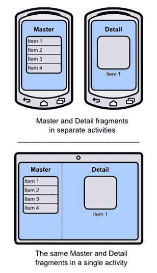

# 第 6 章碎片

**片段**是活性的包封部分。片段允许您将 UI 组件和行为配置为可重用实体，然后将该实体嵌入到多个不同的活动中。这为 Android 应用程序开辟了各种布局和导航机会。您可以将它们视为活动的“片段”，而不是以不同的方式组合以形成完整的活动。下图显示了在开发 Android 应用程序时可以使用的不同片段。



图 57：在智能手机和平板电脑布局中重复使用主片段和细节片段

片段最常见的用例之一是实现主从细节 UI 模式。例如，电子邮件应用程序包含一个消息列表（主界面）和一个单独的位置来查看消息正文（详细信息界面）。通过将一个片段用于消息列表而将另一个片段用于消息正文，您可以通过以不同方式组合片段来轻松支持多个屏幕维度。在平板电脑上，您可以在一个活动中显示两个片段以充分利用您的屏幕空间，而在智能手机上，您可能希望将它们显示在占据整个屏幕的专用活动中。由于主要和细节片段是可重用的，因此您所要做的就是根据屏幕尺寸对它们进行不同的组合 - 所有 UI 组件和行为都是可重用的。

还可以将片段无缝地交换进出活动。这使您可以在单个活动中显示不同类型的界面和行为，从而实现两种常见的导航模式：滑动视图和选项卡式导航。


图 58：在片段之间滑动和跳格

**滑动视图**旨在让用户在主 - 详细信息应用程序中的兄弟详细信息项之间导航。例如，在电子邮件应用程序中，用户可以滑动屏幕以在其消息中向前和向后移动，而不必被迫导航回主列表。也可以使用滑动手势在标签之间导航，我们将在本章稍后介绍。

**选项卡式导航**允许用户使用屏幕顶部带标签的选项卡在片段之间切换。选项卡用于在应用程序的顶级部分之间切换，因此在任何给定时间不应显示超过三个或四个选项卡。例如，电子邮件应用可能包含用于在收件箱，已加星标的邮件和电子邮件设置之间切换的标签。

本章提供了片段的基本介绍。我们将学习如何创建它们，将它们嵌入到活动中，并使用它们来实现滑动视图和选项卡式导航。您应该了解如何将功能封装到片段中并在各种活动中重用该功能。本书示例代码中包含的 _Fragments_ 项目演示了我们即将讨论的所有内容。

## 创建片段

片段由两部分组成：一个 XML 布局文件，用于定义片段的外观，以及一个用于加载该布局并定义其行为的类。请注意，这些是活动所需的完全相同的组件。

_Fragments_ 示例项目包括两个片段：`HomeFragment`和`ArticlesFragment`。它们都显示一个带有名称和彩色背景的文本字段，这样您就可以在将它们加载到活动中后查看它们的尺寸。每个片段的 XML 看起来与活动的 XML 完全相同。例如，`home_view.xml`定义如下：

```
<RelativeLayout xmlns:android="http://schemas.android.com/apk/res/android"
android:layout_width="match_parent"
android:layout_height="match_parent"
android:background="#FFDDFFDD">

<TextView
android:layout_width="wrap_content"
android:layout_height="wrap_content"
android:layout_centerInParent="true"
android:textSize="32sp"
android:textColor="#FF009900"
android:text="Home Fragment" />

</RelativeLayout>

```

接下来，我们需要定义 [Fragment](http://developer.android.com/reference/android/app/Fragment.html) 的子类来加载此布局。 `Fragment`类仅在 Android 3.0（API 11）中添加。如果你不需要支持 API 11 以下的任何东西，你可以从`android.app.Fragment`导入`Fragment`类，但是可以通过使用`android.support.v4.app.Fragment`从支持库导入 Fragment 来支持回到 Android 1.6。本章的示例代码使用后一种方法。

`HomeFragment.java`类定义主片段的行为。 `onCreateView()`是 _ 必须在`Fragment`子类中重写 _ 的唯一方法，因为它返回表示片段的根`View`。在这种情况下，我们需要做的就是扩充 XML 布局：

```
import android.os.Bundle;
import android.support.v4.app.Fragment;
import android.view.LayoutInflater;
import android.view.ViewGroup;
import android.view.View;

public class HomeFragment extends Fragment {
@Override
public View onCreateView(LayoutInflater inflater, ViewGroup container,
Bundle savedInstanceState) {
// Inflate the layout for this fragment
return inflater.inflate(R.layout.home_view, container, false);
}
}

```

碎片遵循与活动相同的生命周期模式。您可以定义自定义 `onCreate()` ， `onPause()` ， `onResume()` ，以及我们在本书前面讨论过的所有其他活动生命周期回调方法在 `Fragment` 子类中。当在主机活动上调用其中一个生命周期方法时，它会将其传递给它包含的任何片段。这是使片段如此模块化的一部分 - 它们就像活动一样，但完全是独立的。

## 在活动中嵌入碎片

片段 _ 必须由活动托管 _。尽管它可能是活动中唯一的元素，但它们不可能自己显示片段。如果将 `activity_main.xml` 更改为以下内容，您将看到如何在活动中嵌入片段：

```
<LinearLayout xmlns:android="http://schemas.android.com/apk/res/android"
xmlns:tools="http://schemas.android.com/tools"
android:layout_width="match_parent"
android:layout_height="match_parent"
android:orientation="vertical"
tools:context=".MainActivity" >

<fragment android:name="com.example.fragments.HomeFragment"
android:id="@+id/homeFragment"
android:layout_width="match_parent"
android:layout_height="0dp"
android:layout_weight="1" />

<fragment android:name="com.example.fragments.ArticlesFragment"
android:id="@+id/articlesFragment"
android:layout_width="match_parent"
android:layout_height="0dp"
android:layout_weight="1" />

</LinearLayout>

```

这包括主活动中的 `HomeFragment` 和 `ArticlesFragment` ，结果显示在下面的屏幕截图中。如您所见，片段嵌入了 `&lt;fragment&gt;` 标签。最重要的属性是 `android:name` ，它应该是定义片段（包括应用程序包）的类的绝对路径。

请记住，片段的目标是成为可重用的 UI。这意味着它应该能够拉伸或缩小以匹配主机活动定义的任何大小。这就是为什么片段的根元素使用 `match_parent` 作为 `android:layout_width` 和 `android:layout_height` 的原因。上面的代码使每个片段成为屏幕的一半：


图 59：在单个活动中显示两个片段

现在，片段可能看起来只是布局文件的抽象（它们是），但它们可以启用各种其他导航选项。由于它们是可重用的，我们可以在同一个活动中显示它们（就像我们在这里所做的那样），在不同的活动中显示它们，用滑动视图对它们进行分页，或让用户通过选项卡访问它们。

## 滑动视图

片段可以使用滑动视图进行分页，滑动视图使用 [ViewPager](http://developer.android.com/reference/android/support/v4/view/ViewPager.html) 类实现。建议仅在少量屏幕上使用滑动视图，并且每个屏幕都应该是独立的。如果您让用户滑过一组数据项，您还应该提供一个主列表作为替代导航方式，并且您不应该使用滑动视图来对长篇文章进行分页。

要向主要活动添加滑动视图，请使用以下内容替换 `activity_main.xml` 中的 `&lt;fragment&gt;` 元素：

```
<android.support.v4.view.ViewPager
android:id="@+id/fragmentPager"
android:layout_width="match_parent"
android:layout_height="match_parent" />

```

这增加了支持回 Android 1.6 的 [ViewPager](http://developer.android.com/reference/android/support/v4/view/ViewPager.html) 。 `ViewPager` 将使用适配器填充在 `MainActivity.java` 中，非常类似于 `ListView` 和 `GridView` 人口稠密。首先，它需要在以下代码中定义 [FragmentPagerAdapter](http://developer.android.com/reference/android/support/v4/app/FragmentPagerAdapter.html) 的子类，称为 `SimplePagerAdapter` 。其 `getItem()` 方法返回与页面关联的片段。在这种情况下，它返回第一页的 `HomeFragment` 和第二页的 `ArticlesFragment` 。当然，如果您尝试滑动集合，则可以从数据集动态生成这些页面。要填充 `ViewPager` ，我们需要做的就是将 `adapter` 属性设置为 `SimplePagerAdapter` 。

```
import android.os.Bundle;
import android.support.v4.app.Fragment;
import android.support.v4.app.FragmentActivity;
import android.support.v4.app.FragmentManager;
import android.support.v4.app.FragmentPagerAdapter;
import android.support.v4.view.ViewPager;
import android.view.Menu;

public class MainActivity extends FragmentActivity {

@Override
protected void onCreate(Bundle savedInstanceState) {
super.onCreate(savedInstanceState);
setContentView(R.layout.activity_main);

SimplePagerAdapter adapter = new SimplePagerAdapter(getSupportFragmentManager());
ViewPager pager = (ViewPager) findViewById(R.id.fragmentPager);
pager.setAdapter(adapter);
}

public static class SimplePagerAdapter extends FragmentPagerAdapter {
public SimplePagerAdapter(FragmentManager fragmentManager) {
super(fragmentManager);
}

@Override
public int getCount() {
return 2;
}

@Override
public Fragment getItem(int position) {
switch (position) {
case 0:
return new HomeFragment();
case 1:
return new ArticlesFragment();
default:
return null;
}
}
}

@Override
public boolean onCreateOptionsMenu(Menu menu) {
// Inflate the menu; this adds items to the action bar if it is present.
getMenuInflater().inflate(R.menu.main, menu);
return true;
}

}

```

每个片段现在应占据整个屏幕，您应该可以在它们之间滑动。注意， `MainActivity.java` 扩展 [FragmentActivity](http://developer.android.com/reference/android/support/v4/app/FragmentActivity.html) 而不是 `Activity` 。如果您想在 Android 3.0 之前支持任何内容，这是必要的。如果您不需要这样做，您只需要扩展 `Activity` 。

### 添加标签

选项卡与 [ActionBar](http://developer.android.com/guide/topics/ui/actionbar.html) 一起使用，这是我们迄今为止一直使用的所有示例顶部的栏。您可以通过 `ActionBar` 使用 `newTab()` 方法请求一个新标签，设置标题，给它一个响应事件的监听器，然后将其添加到 `ActionBar` 及其 `addTab()` 方法。这一点在以下片段中都有说明，该片段应该在 `MainActivity.java` 的 `onCreate()` 方法中进行说明：

```
final ActionBar actionBar = getActionBar();
actionBar.setNavigationMode(ActionBar.NAVIGATION_MODE_TABS);
TabListener tabListener = new TabListener() {
public void onTabSelected(Tab tab,
android.app.FragmentTransaction ft) {
pager.setCurrentItem(tab.getPosition());
}
public void onTabReselected(Tab arg0,
                                android.app.FragmentTransaction arg1) {
// TODO Auto-generated method stub
}
public void onTabUnselected(Tab arg0,
                                android.app.FragmentTransaction arg1) {
// TODO Auto-generated method stub
}
};
actionBar.addTab(actionBar.newTab().setText("Home").setTabListener(tabListener)); actionBar.addTab(actionBar.newTab().setText("Articles").setTabListener(tabListener));

```

只要选择了选项卡，就会调用`onTabSelected()`回调方法。要显示相关的片段，我们需要做的就是告诉`ViewPager`更改其`currentItem`属性。您现在应该可以选择标签来更改片段，但在它们之间滑动时不会更新标签。要解决此问题，我们需要监听页面更改并在用户滑动时更新选项卡，如下所示：

```
pager.setOnPageChangeListener(new ViewPager.SimpleOnPageChangeListener() {
public void onPageSelected(int position) {
actionBar.setSelectedNavigationItem(position);
}
});

```

标签和滑动现在应该正常工作。


图 60：使用选项卡在片段之间导航

## 摘要

在本章中，我们学习了如何使用`Fragment`子类封装用户界面的可重用部分，并使用滑动视图和选项卡显示它们。这是片段的常见用例，但它们还支持其他导航模式，如主 - 细节模式，灵活的用户界面和复杂的多面板布局。

下一章将脱离 Android 的用户界面框架，并解释如何保存和加载应用程序收集的数据。