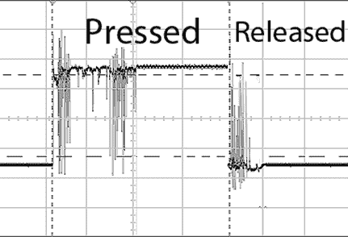
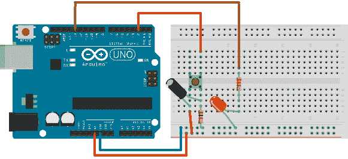

# 第 3 章使用按钮

你时不时地想要与用户互动。与用户交互的最常见元素是按钮。现在电子产品中最常用的按钮类型是按钮。此按钮不会持续关闭电路，但只能按下电路。使用按钮的最基本示例是按下按钮时打开 LED。我将在下一节中对此进行描述。

## 按钮

使用按钮时，此示例是 Hello World。基本上它的作用是在按下按钮时打开 LED，然后在释放按钮时将其关闭。这是零件清单和接线：

本节的零件清单：

*   Arduino Uno
*   按钮
*   USB 电缆
*   LED 的 1x 100 欧姆电阻（引脚 13）
*   按钮的 1x 10k 欧姆电阻
*   面包板
*   1x 5mm LED
*   5x 面包板跳线


图 27：按钮接线架构

该示例的代码非常简单。我们不断地从引脚 2 读取状态，如果它处于高状态，我们打开 LED。请注意，我们将 LED 连接到引脚 13，这样板载 LED 也会发光。这是代码：

```
// variable holding button state
int buttonState = 0;

// LED pin
int ledPin = 13;

// Button pin
int buttonPin = 2;

void setup() {
  // initialize pins
  pinMode(ledPin, OUTPUT);
  pinMode(buttonPin, INPUT);    
}

void loop(){
  // read the state of the button
  buttonState = digitalRead(buttonPin);

  // pressed button is in state high
  if (buttonState == HIGH) {    
    // LED on   
    digitalWrite(ledPin, HIGH); 
  }
  else {
    // LED off
    digitalWrite(ledPin, LOW);
  }
}

```

在本例中，我们将首次读取引脚输入。我们正在使用`digitalRead`功能。检查读数的循环比人眼注意到的要快很多，所以我们没有注意到按钮的有趣效果。我们看到 LED 立即打开，并且在最初按下按钮时无法感知任何振荡。此外，我们发布按钮后，我们看不到 LED 闪烁一段时间。让我们看看下一个例子，深入探讨这个有趣的效果。

## 古怪的按钮

本节的接线和部件与前一部分相同（请查看这些示意图）。不同之处在于编程和使用。例如，在使用按钮时，打开和关闭 LED 不是最有用的情况。当涉及微控制器时，通常会出现某种状态变化。因此，当我们按下按钮时，我们将改变 LED 状态。为此，我们将使用以下代码：

```
// variable holding button state
int buttonState;

// variable holding previous button state
int previousButtonState = LOW;

// variable holding the LED state
int ledState = HIGH;

// LED pin
int ledPin = 13;
// Button pin
int buttonPin = 2;

void setup() {
  // initialize pins
  pinMode(ledPin, OUTPUT);
  pinMode(buttonPin, INPUT);
}

void loop(){
  // read the state of the button
  int reading = digitalRead(buttonPin);

  // if the button is pressed, change the state
  if (reading != buttonState) {
    buttonState = reading;

      // toggle the LED state only when the button is pushed
      if (buttonState == HIGH) {
        ledState = !ledState;
      }
  }

  // turn the LED on or off depending on the state 
  digitalWrite(ledPin, ledState);

  // save current reading so that we can compare in the next loop
  previousButtonState = reading;
}

```

现在，尝试使用此按钮一段时间。如果你这样做，你会注意到它的表现并不像你期望的那样;它有时会错过按钮按下，表现得有点古怪。即使它不应该亮，你也会注意到它仍然亮着，反之亦然。虽然我们有`digitalRead`功能，但这里有一个有趣的模拟效果。

开关由金属部件组成，按钮按钮将它们组合在一起。有一个与此动作相关的运动，开关内的金属表面反弹，然后再次回到一起几次（在很短的时间内）。这是已知的效果，并且当例如打开和关闭灯泡时它不代表问题。在我们的第一个示例中，只要按下按钮，LED 就会亮起，这并不代表问题。但是，当归结为逻辑电路，我们可以在短时间内快速读取变化时，我们将无法确定按钮是否被按下。

让我们看看下面的图片。基本上，尖峰的每次变化都会导致 LED 状态发生变化。所以，使用这个没有某种噪音过滤的按钮几乎可以玩彩票。当您松开或按下按钮时，您无法确定 LED 是打开还是关闭。这是一个显示短按按钮期间电流发生情况的图。请记住，峰值的每次变化都是 LED 状态的变化：



图 28：短按按钮期间的电力读数，然后是释放

人眼不会察觉每一次变化，但我们会在按下按钮结束时注意到状态的错误变化。在下一节中，我们将实现一种过滤技术，以避免古怪的行为。电路和部件将与本节中的相同。

## 按钮和噪声滤波软件

零件清单和接线与前一个示例中的相同。不同之处在于过滤按钮噪音的软件：

```
// variable holding the button state
int buttonState;

// variable holding previous button state
int previousButtonState = LOW;

// variable holding the LED state
int ledState = HIGH;

int buttonPin = 2;
const int ledPin = 13;

// millis always stored in long
// becomes too big for int after 32,767 millis or around 32 seconds

// timestamp of a previous bounce
long previousDebounceTime = 0;

// debounce time in millis, if the LED is still quirky increase this value
long debounceDelay = 50;

void setup() {
  pinMode(buttonPin, INPUT);
  pinMode(ledPin, OUTPUT);
}

void loop() {
  // for now it's the same as in previous example
  int reading = digitalRead(buttonPin);

  // if the previous reading is different than the previous button state 
  if (reading != previousButtonState) {
    // we'lll reset the debounce timer
    previousDebounceTime = millis();
  }

  // if the reading is the same over a period of debounceDelay
  if ((millis() - previousDebounceTime) > debounceDelay) {
    // check if the button state is changed
    if (reading != buttonState) {
      buttonState = reading;

      // toggle the LED state only when the button is pushed
      if (buttonState == HIGH) {
        ledState = !ledState;
      }
    }
  }

  // set the LED:
  digitalWrite(ledPin, ledState);

  // save current reading so that we can compare in the next loop
  previousButtonState = reading;
}

```

现在，对某些人来说，代码清单看起来有点过于复杂，这完全可以理解。有一个巧妙的硬件技巧，我们可以用来过滤掉噪音。我们可以使用称为电容器的电子元件。

## 按钮和噪声滤波硬件

我们现在将使用几乎与我们对古怪和基本按钮示例相同的组件和布线。为了滤除噪声，我们将在电路中添加一个电容器。

本节的零件清单：

*   Arduino Uno
*   按钮
*   USB 电缆
*   LED 的 1x 100 欧姆电阻
*   用于按钮的 1x 10k 欧姆电阻器
*   面包板
*   1x 5mm LED
*   5x 面包板跳线
*   10uF 电容器



图 29：带电容的按钮滤除噪声

编程与古怪的按钮相同。噪声滤波分配留给电容器。电容器有一个有趣的功能，它可以让电流通过，只要它没有充满电。当它被填满时，电流不再流过它。但是，如果一些波动开始发生，它会立即开始释放累积的电流（并且基本上使信号平滑）。实际上，过滤电噪声是电容器的主要用途之一。有各种类型和尺寸的电容器。以下是一些基本的电容形式：


图 30：基本电容器形式

有各种类型的电容器，它们的接线方式并不重要。对于某些人来说，连接正极和负极引脚时必须小心。在电容器上，正极引脚标有加号，负极引脚标有“0”符号。因此，没有像 LED 一样找出引脚极性的技巧。还有一些类型的电容器具有较长的腿，并且该腿是加号引脚;它与 LED 的规则相同。但是电容器上的正极或负极引脚需要在其上有清晰的标记。

在本节中，我介绍了按钮组件以及它们与 Arduino 组合使用的方式。我还演示了一些鲜为人知的按钮怪癖，以及如何在软件和硬件层面上处理它。在下一节中，我将向您展示如何使用 Arduino 产生声音信号。