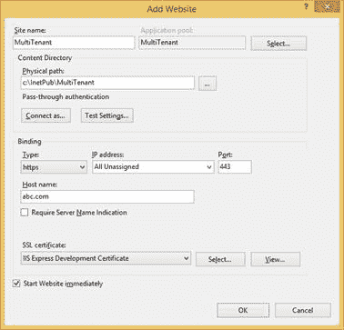
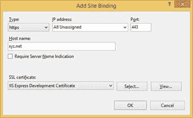

# 第 10 章安全性

## 简介

所有应用程序都需要执行安全性多租户应用程序有额外的要求，从某种意义上说，某些租户可能不应该为其他租户提供某些东西。本章讨论编写多租户应用程序时要考虑的一些安全机制。

## 验证

将使用的身份验证机制应该能够：

*   登录与当前租户关联的用户
*   拒绝登录来自与其无关联的租户的用户

让我们看看我们如何实现这些要求。

### ASP.NET 成员和角色提供者

古老的 [ASP.NET 成员资格和角色提供程序](https://msdn.microsoft.com/en-us/library/aa354509%28v=vs.110%29.aspx)是 ASP.NET 2.0 中引入的可扩展[提供程序模型的一部分。成员资格提供程序负责对用户进行身份验证和管理，角色提供程序将这些用户与组关联。这个框架多年来已经老化，但由于可能需要支持它（棕地开发），我认为值得一提。](https://msdn.microsoft.com/en-us/library/aa479020.aspx)

该框架包括这些提供程序的两个实现：一个用于使用 Windows 工具进行身份验证和组成员身份，另一个用于使用基于 SQL Server 的对象。

您可以想象 SQL Server 版本更灵活，因为它们不会强迫我们为我们的用户和组使用 Windows（或 Active Directory）帐户。他们使用的架构是这样的：


图 30：ASP.NET 成员身份和角色提供者架构

理解这个模式的关键是这些表：

表 7：ASP.NET 成员资格和角色提供程序表及其用途

| 表 | 目的 |
| aspnet_Applications | 存储成员资格和角色提供者知道的所有应用程序 |
| aspnet_Users | 存储与应用程序关联的所有注册用户 |
| aspnet_Roles | 存储所有角色 |
| aspnet_Membership | 关于注册用户的其他信息 |
| aspnet_UsersInRoles | 用户与角色的关联 |

用户表和角色表都依赖于应用程序表，这意味着不同的应用程序可以具有不同的用户和角色。单个数据库可以容纳多个注册用户和角色，可能用于不同的网站，每个网站都作为单独的应用程序运行;在这种情况下，每个网站将由不同的应用程序名称标识。配置通常在全局 ASP.NET 配置文件 **Machine.config** 中静态定义，其相关部分在此处显示，稍微简化：

代码示例 126

```
<membership defaultProvider="AspNetSqlMembershipProvider">
    <providers>
        <add name="AspNetSqlMembershipProvider" applicationName="/" 
            type="System.Web.Security.SqlMembershipProvider" 
            connectionStringName="LocalSqlServer" />
    </providers>
</membership>
<roleManager enabled="true" defaultProvider="AspNetSqlRoleProvider">
    <providers>
        <add name="AspNetSqlRoleProvider" connectionStringName="LocalSqlServer" 
            applicationName="/" type="System.Web.Security.SqlRoleProvider" />
        <add name="AspNetWindowsTokenRoleProvider" applicationName="/" 
            type="System.Web.Security.WindowsTokenRoleProvider" />
      </providers>
</roleManager>

```

很容易看出成员资格和角色提供者的“应用程序”概念与“租户”的概念非常匹配。问题是应用程序（ [applicationName](https://msdn.microsoft.com/en-us/library/vstudio/whae3t94%28v=vs.100%29.aspx) 属性）在 **Web.config 中是硬编码的。** 文件。但是，因为提供程序实现类中的关联属性（ [ApplicationName](https://msdn.microsoft.com/en-us/library/system.web.security.membershipprovider.applicationname(v=vs.110).aspx) ）是虚拟的，所以我们可以使用从包含的属性继承的类（ [SqlMembershipProvider](https://msdn.microsoft.com/en-us/library/system.web.security.sqlmembershipprovider(v=vs.110).aspx) 和 [SqlRoleProvider](https://msdn.microsoft.com/en-us/library/system.web.security.sqlroleprovider%28v=vs.110%29.aspx) ）并覆盖此属性，以便每次调用它时返回正确的值：

代码示例 127

```
//Membership provider
public class MultitenantSqlMembershipProvider : SqlMembershipProvider
{
      public override String ApplicationName
      {
            get { return TenantsConfiguration.GetCurrentTenant().Name; }
            set { /*nothing to do here*/ }
      }
}

//Role provider
public class MultitenantSqlRoleProvider : SqlRoleProvider
{
      public override String ApplicationName
      {
            get { return TenantsConfiguration.GetCurrentTenant().Name; }
            set { /*nothing to do here*/ }
      }
}

```

|  | 注意：有其他 RDBM 的提供程序实现，例如 Oracle 和 MySQL。因为实现完全相同，所以我只显示 SQL Server 版本。 |

现在，我们需要将新实现注册到 **Machine.config** （用于机器范围的可用性）或 **Web.config** 文件：

代码示例 128

```
<membership defaultProvider="MultitenantSqlMembershipProvider">
    <providers>
        <add name="MultitenantSqlMembershipProvider" 
            type="MyNamespace.MultitenantSqlMembershipProvider, MyAssembly" 
            connectionStringName="LocalSqlServer" />
    </providers>
</membership>
<roleManager enabled="true" defaultProvider="MultitenantSqlRoleProvider">
    <providers>
        <add name="MultitenantSqlRoleProvider" 
            connectionStringName="LocalSqlServer" 
            type="MyNamespace.MultitenantSqlRoleProvider, MyAssembly" />
      </providers>
</roleManager>

```

|  | 提示：即使我选择谈论会员提供商，我也不认为您应该在新的（绿地）开发中使用它。根据微软的未来是 [ASP.NET 身份](http://www.asp.net/identity)（至少目前），我强烈建议你进入它。关于如何从成员资格提供程序迁移到 ASP.NET 标识，这里有一篇很好的帖子。 |

### ASP.NET 身份

为 ASP.NET 应用程序提供身份验证的更好方法是 [ASP.NET 标识](http://www.asp.net/identity)框架。 Microsoft 设计此框架以补充旧提供程序模型的缺点和问题，并为新的身份验证标准提供支持，例如 [OAuth](http://oauth.net/) 。不幸的是，设计它的微软架构师遗漏了对多租户的内置支持。然而，一切都没有丢失，因为它已经由社区， [James Skimming](https://github.com/JSkimming) 和 AspNet.Identity.EntityFramework.Multitenant 包等人为我们实施。 ASP.NET Identity 与提供程序无关，这意味着它可以使用例如 Entity Framework 或 NHibernate 作为其持久性引擎，但 James 的实现依赖于 Entity Framework。

|  | 注意： [Antonio Bastos](https://github.com/milesibastos) 提供了一个名为 NHibernate.AspNet.Identity 的软件包，它提供了一个使用 NHibernate 实现 ASP.NET 标识的软件包。您可以在此处获取 NuGet 包 [](https://www.nuget.org/packages/NHibernate.AspNet.Identity/) ，在此处获取源代码 [](https://github.com/milesibastos/NHibernate.AspNet.Identity) 。 |

因此，在使用 NuGet 添加 ASP.NET Identity 包后，您需要添加 AspNet.Identity.EntityFramework.Multitenant 包：


图 31：具有多租户支持的 ASP.NET Identity EntityFramework

完成后，我们需要对项目中的 ASP.NET Identity 类进行一些更改。我们感兴趣的类是 ApplicationUser ，应该更改它以便从 MultitenantIdentityUser 而不是 IdentityUser 继承：

代码示例 129

```
public class ApplicationUser : MultitenantIdentityUser
{
      //rest goes here
}

```

类 MultitenantIdentityUser 类已经提供了一个名为 TenantId 的属性，用于区分不同的租户。此属性映射到 AspNetUserLogins 表的 TenantId 列。该模型如下所示：


图 32：ASP.NET Identity 模型

除此之外，我们需要更改 [DbContext](https://msdn.microsoft.com/en-us/library/system.data.entity.dbcontext%28v=vs.113%29.aspx) 派生类，使其继承自 MultitenantIdentityDbContext＆lt; ApplicationUser＆gt; 也是：

代码示例 130

```
public class ApplicationDbContext : MultitenantIdentityDbContext<ApplicationUser>
{
      //rest goes here
}

```

最后，我们需要教授 ASP.NET Identity 如何获得当前租户。为此，我们需要更改 ApplicationUserManager 类的 Create 方法，如下所示：

代码示例 131

```
public static ApplicationUserManager Create(
IdentityFactoryOptions<ApplicationUserManager> options, IOwinContext context)
{
      var tenant = TenantsConfiguration.GetCurrentTenant();                  var manager = new ApplicationUserManager(
            new MultitenantUserStore<ApplicationUser>(
                  context.Get<ApplicationDbContext>())
                        { TenantId = tenant.Name });
      //rest goes here
}

```

ApplicationUserManager.Create 方法被注册为我们用户存储的工厂方法。无论何时调用它，它都将使用当前的租户名称。这就是它的全部内容--ASP.NET Identity 的使用方式与没有多租户支持的方式完全相同。

|  | 注意：James Skimming 在 GitHub [](https://github.com/JSkimming/AspNet.Identity.EntityFramework.Multitenant)中提供了他的 AspNet.Identity.EntityFramework.Multitenant 包的源代码。这些变化概述的实际提交是 [](https://github.com/JSkimming/AspNet.Identity.EntityFramework.Multitenant/commit/2360ea55ac89195c645e130927835f4a4bea3e58) 。 |

## HTTPS

如果我们要遵循主机头方法，并且我们想使用 HTTPS，我们将需要为每个指定的租户提供证书。现在，我们有两个选择：

*   从根权限获取证书
*   如果我们不关心获取有关无效根权限的消息，请在 IIS 管理器中生成我们自己的（虚拟）证书

出于开发目的，我们可以使用虚拟证书。我们需要告诉 IIS 使用它：



图 33：创建新站点



图 34：向站点添加绑定

|  | 注意：在不太可能的情况下，我们的所有租户将至少共享部分域名，我们可以使用通配符证书;否则，我们将需要每个租户一个，这可能证明是昂贵的。 |

## 应用程序池

如第 2 章所述，每个租户拥有不同的应用程序池允许我们让应用程序在不同的帐户下运行。这可以证明是有帮助的，例如，如果每个用户在服务器上具有不同的默认数据库，并且您没有在连接字符串上指定初始数据库。根据数据库服务器配置，每个租户将登陆自己的数据库。但是，更明智的是不信任分配给用户的默认数据库，并使用数据库分区或选择策略，这将在下一章中概述。

## Cookies

Cookie 存储在客户端，浏览器自己的商店中。默认情况下，它们绑定到它们所源自的域，如果我们要使用主机标头策略，这很好，但如果我们想要使用其他租户标识策略则不是这样。例如，如果我们对此没有采取任何措施，如果用户决定浏览其他租户的网站，则在租户环境中发送的 cookie 也将可用。除了路径（URL 的相对部分），域和非 HTTPS 站点的可用性之外，Cookie 实际上并没有提供很多选项。我们唯一可以使用的是键的名称：例如，我们可以添加一个前缀来标识 cookie 适用的租户，例如：

代码示例 132

```
var tenantCookies = HttpContext.Current.Request.Cookies.OfType<HttpCookie>()
      .Where(x => x.Name.StartsWith(String.Concat(tenant, ":")));

var cookie = new HttpCookie();
cookie.Name = String.Concat(tenant, ":", key);
cookie.Value = value;
HttpContext.Current.Response.Cookies.Add(cookie);

```