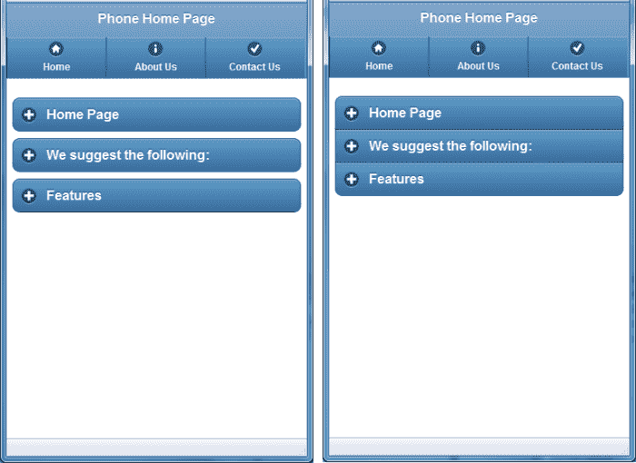

# 第 9 章更多 jQuery.Mobile 功能

“除了事实上你什么都不知道之外，你什么都不知道。”
John F. Kennedy

多年来我学到的一件事是，我学的越多，我就越能意识到要学习。在本章中，我们将介绍一些有关 jQuery.Mobile 的重要知识。还有其他书籍可以更深入地探索这些概念，如果这里讨论的概念引起你的兴趣，我建议你阅读它们。本章旨在为您提供 jQuery.Mobile 一些更重要主题的概述。

## jQuery.Mobile 容器对象

在[第 6 章](../Text/aspn-mobisite-7.html#heading_id_33)中，我们讨论了主要的 jQuery.Mobile 部分：`page`，`header`，`content`，`footer`和`navbar`。还有许多其他部分，我们将在这里简要讨论。

### 嵌套式可折叠容器

我们已经在[提示和技巧](../Text/aspn-mobisite-9.html#heading_id_51)部分讨论了可折叠容器对象，但我们没有谈到的一件事是嵌套容器。您可以将可折叠容器嵌套在其他可折叠容器中。但是，由于后续的复杂性，建议不要使用两个以上的级别。

除了嵌套之外，可以对可折叠容器执行的另一项操作是使用`data-role="collapsible-set"`属性创建一个折叠式效果。如果在此属性中包含一组可折叠容器，则会获得一个漂亮，节省空间的效果。集合中只有一个容器将同时打开，因此当您单击任何加号时，所有其他容器将自动关闭。

```
<div data-role="collapsible-set">
  <div data-role="collapsible" data-collapsed="false">
    <h2>Section 1 Title</h2>
    Section 1 Content
  </div>
  <div data-role="collapsible" data-collapsed="false">
    <h2>Section 2 Title</h2>
    Section 2 Content
  </div>
  <div data-role="collapsible" data-collapsed="false">
    <h2>Section 3 Title</h2>
    Section 3 Content
  </div>
</div>

```

下面是左侧是普通可折叠容器的示例，右侧是使用手风琴效果的容器。



普通可折叠容器（左）和带手风琴效果的容器（右）

### 字段容器

如果要创建表单，您可能希望将字段包装在字段容器中，如以下代码示例中所示：

```
<div data-role="fieldcontain">
  @Html.LabelFor(m => m.UserName)
  @Html.TextBoxFor(m => m.UserName)<br />
  <span style="Color: Red;">@Html.ValidationMessageFor(m =>
          m.UserName)</span>
</div>

```

当您使用更宽屏幕时，此标签主要有用。如果屏幕宽度大于 480 像素，框架将并排排列输入和标签，或者如果它小于 480 像素，它将垂直堆叠它们。此标记还将在每个字段下方添加一个薄底线，以帮助在视觉上分解屏幕。

### 列表视图

您可能已在项目中多次使用列表组件。 jQuery.Mobile 有许多可以增强列表的功能，我们可以只为该主题编写一整章。但是，我们将仅涵盖此处最常用的选项，并将创建一个简短的备忘单，您将经常回来。

简单的无序列表：全屏宽度

```
<ul data-role="listview">

```

此示例创建一个使用全屏宽度的简单无序列表。

插入列表

```
<ul data-role="listview" data-inset="true">

```

此示例创建一个简单的无序列表，该列表位于带有圆角的气泡中，并且稍微嵌入边框。

订购清单

```
<ol data-role="listview">

```

此示例创建一个简单的有序列表，其中包含每个列表项的编号。

列表与搜索标题

```
<ul data-role="listview" data-filter="true">

```

此示例创建一个无序列表，屏幕顶部有一个搜索栏，可让用户轻松过滤列表内容。

列表标题或分隔符

```
<li data-role="list-divider">@ViewBag.Title</li>

```

此示例在列表中创建标题项，以可视方式分隔内容。

简单列表项

```
<li>Home</li>

```

此示例创建一个简单的列表项。

粗体列表项目

```
<li><h1>Home</h1></li>

```

此示例创建一个在列表中显示得更大的项目。您可以使用不同的标题级别标记调整大小，甚至可以使用`<p>`标记来减小行的大小。

列出带链接的项目


```
<li>@Html.ActionLink(Movie.MovieName, "Details",
    new { id = Movie.MovieId })</li>

```

此示例创建交互式列表项。用户可以单击行中的任意位置以激活链接。

列出带有链接和图标的项目


```
<li>
  <a href="@Url.Action("Details",
    new { id = Movie.MovieId })" >
    @Movie.MovieName</a>
</li>

```

此示例在左侧创建一个带有图标的项目，该图标是此项目的可单击区域的一部分。您可以指定所需的任何图标或使其成为数据驱动的图标。

复杂分割按钮列表项


```
<li>
  <a href="@Url.Action("Details",
    new { id = Movie.MovieId })" >
    
    <h3>@Movie.MovieName</h3>
    <p>@Movie.MovieDscr</p>
  </a>
  <a href="@Url.Action("Purchase",
          new { id = Movie.MovieId })">Purchase Movie</a>
</li>

```

此示例创建一个中等复杂的拆分按钮视图。第一个链接控制项目的左侧部分，并包含图标，标题和说明。第二个链接会自动在右侧创建一个带有图标的小部分，并忽略您放在那里的任何文本。带边框的箭头图标用作默认设置，但您可以通过将`data-split-icon`标记放在定义列表的部分顶部的`<ul>`标记上来指定任何 jQuery.Mobile 图标。

列出具有计数气泡的项目


```
<li>
  <a href="@Url.Action("GenreDetails",
    new { id = Genre.GenreId })" >@Genre.GenreName
  <span class="ui-li-count">@Genre.MovieCount</span>
  </a>
</li>

```

此标记在右侧创建一个带有计数气泡数的列表项。通常，这将显示您单击此行时希望看到的项目数。在这个特定的例子中，我们展示了单一类型的电影数量。

### 列

jQuery.Mobile 提供了一种使用基于网格的两列，三列，四列或五列系统布局屏幕的便捷方式。但是，正如我们在前面的章节中所讨论的那样，尝试以更多的单列格式（或两列）来考虑移动设备，因此不要随意使用它并回到过去几年的表驱动的 HTML 设计心态！有一个桌子的地方，例如当试图并排放置一些物品时，特别是当它们在像容器一样的容器中时，但是要使用约束。以下是一个简单的两列网格示例：

```
<div class="ui-grid-a">
  <div class="ui-block-a"><strong>I'm Block A</strong>
    and text inside will wrap</div>
  <div class="ui-block-b"><strong>I'm Block B</strong>
    and text inside will wrap</div>
</div>

```

类名将确定创建的列数。在这种情况下，我们使用了`ui-grid-a`类，这表示我们需要两列，这些列标记为`ui-block-a`和`ui-block-b`。如果您想要三列，请使用`ui-grid-b`标签并添加`ui-block-c div`。对于四列，使用`ui-grid-c`标签并添加`ui-block-d div`。最后，对于五列，使用`ui-grid-d`标签并添加`ui-block-e div`;然而，对于大多数屏幕，你可能会更好地避免这个。

### 按钮

按钮看起来相对简单，但有几种方法可以在 jQuery.Mobile 中呈现它们。通常，`button`类型的任何元素都将呈现为 jQuery.Mobile 按钮，具有`type=button`，`type=submit`，`type=reset`或`type=image`属性的`input`元素也将呈现。要将任何`<a href>`链接转换为按钮，您只需将`data-role="button"`标记添加到该链接即可。请注意，无论您是否添加`data-role=button`标记，页眉或页脚中的任何链接都会获得该处理。默认情况下，按钮呈现为页面的整个宽度。要使按钮自动调整大小以适合其内容，请将标记`data-inline="true"`添加到按钮。正如我们在前面的章节中提到的，您还可以使用`data-icon`属性向按钮添加图标，并且可以使用`data-iconpos`属性设置该图标的位置。

如果要将多个按钮组合在一个紧凑的容器中，可以使用`controlgroup`容器。默认情况下，容器会垂直列出按钮，但您可以通过设置`data-type`属性来更改它。从 jQuery.Mobile 1.1 版开始，您还可以添加`data-mini`属性，以便以较小的格式呈现按钮。


控制组

```
<div data-role="controlgroup" data-type="horizontal"
  data-mini="true">
  <a href="index.html" data-role="button">Yes</a>
  <a href="index.html" data-role="button">No</a>
  <a href="index.html" data-role="button">Maybe</a>
</div>

```

### 对话框

jQuery.Mobile 支持弹出对话框项目，该项目以模态方式运行（即，您必须先关闭对话框，然后再继续其他操作）。当您要求用户确认时，您会想要使用这些（“您确定要删除吗？”），要求用户在几个选项（“黑色或蓝色？”）之间进行选择，或者提供用户信息（“您的订单已提交！”）。

创建对话框非常简单。只需像任何其他视图一样创建页面，然后在链接到该视图时，将`data-rel="dialog"`标记添加到链接，如以下代码示例所示：

```
<a href="@Url.Action("Delete", new { id = Movie.MovieId })" 
  data-rel="dialog">Delete @Movie.MovieName</a>

```

您也可以在页面中添加`data-role="dialog"`标签，而不是使用`data-role="page"`标签，然后您就不必在引用页面的每个链接上都包含它。在我们的例子中，由于我们使用共享布局页面，这意味着您将设置 **LayoutDialog.Phone.cshtml** 文件和 **LayoutDialog.Tablet.cshtml** 文件。

当用户单击对话框页面中的链接时，对话框页面将自动关闭并打开链接。如果要返回上一页，只需在链接中包含`data-rel="back"`属性即可。

### NoJS

jQuery.Mobile 将其浏览器支持评级从 A 到 C，A 表示完全支持，B 表示完全支持减去 AJAX，C 表示仅支持基本 HTML。如果要为不支持 A 级的浏览器提供内容，可以添加一个仅适用于它们的特殊部分，如以下代码示例所示：

```
<div data-role="nojs">
  Please upgrade your phone!
</div>

```

## 多页文件

到目前为止，我们在 MVC 项目中看到的所有示例都使用了单页模板。换句话说，页面上只有一个 **`<`** **`div`** **`data-role=“page”>`** 元素。 jQuery.Mobile 支持多页文档的概念，您可以在其中定义多个 **`<`** **`div`** **`data-role=“page”>`** 元素，每个元素都有不同的页面。每个页面元素必须具有唯一的 ID，例如 **`<`** **`div`** **`id=“divExample”>`** 。切换页面时，必须指定具有该 ID **`<`** **`a`** **`href=“#divExample”>`** 的链接，这将导致浏览器查找内部页面，然后将其转换为视图。

这个想法非常有吸引力，因为它使您的网站在页面之间切换时非常快。但是，一个缺点是，如果您将主页作为包含所有页面的多页文档，则在用户第一次点击页面时加载整个站点，包括所有子页面上的所有图像和内容页面。这可能会使您的网页加载速度变慢，而且还很难在页面级别上跟踪任何类型的网站分析。

此外，如果您从单页文档开始然后链接到多页文档，则必须使用链接上的`data-ajax="false"`属性。如果不这样做，框架将仅在执行 AJAX 请求时加载第一个页面节点。

如果您正在考虑使用多页文档，请确保在实际设备上进行彻底测试。在调试应用程序时，将它与`"apple-mobile-web-app-capable"`标签混合可能会导致很多挫败感。

* * *

我使用多页文档开发了完整的站点，但已将其中一些文档转换回单页站点。其中一些网站仍然采用多页设计，但下次我必须进行重大更改时，我可能会将这些网站切换回单页。

* * *

## 自定义图标

在上一节中，我们讨论了如何使用标准内置图标在按钮上添加图标。然而，选择是有限的，不久你会发现自己说“我希望他们有一个看起来像冰淇淋三明治的图标”，或者同样荒谬的东西。

jQuery.Mobile 可以轻松创建您可以在项目中使用的自定义图标。标准的 jQuery.Mobile 图标使用 CSS 精灵技术将所有图像组合成一个图像，然后使用 CSS 样式表标签显示该图像的一部分。查看 **/Conteimg/icons-36-white.png** 文件，查看包含所有标准图标的文件。

您可以在类似于该文件的文件中创建自己的图标，然后在代码中以相同的方式引用它。我们来看一个例子。以下是带有五个自定义图标的图像文件（在深色背景上显示）：


自定义图标精灵

注意这个精灵中的间距。它有 36 像素内容的交替部分，36 像素的透明背景，这使得它更清晰，更容易在 CSS 中使用。

要使用这些自定义图标，您需要创建以下 CSS 样式：

```
/* create multiple icons using a sprite with multiple images */
.ui-icon-custom-bell,
.ui-icon-custom-donot,
.ui-icon-custom-asterick,
.ui-icon-custom-thought,
.ui-icon-custom-bug {
  background-image: url(images/CustomIcons-36-white.png);
  -moz-background-size: 180px 18px;
  -o-background-size: 180px 18px;
  -webkit-background-size: 180px 18px;
  background-size: 180px 18px;
}

.ui-icon-custom-bell {
  background-position:   -0 50%;
}
.ui-icon-custom-donot {
  background-position:   -36px 50%;
}
.ui-icon-custom-asterick {
  background-position:   -72px 50%;
}
.ui-icon-custom-thought {
  background-position:   -108px 50%;
}
.ui-icon-custom-bug {
  background-position:   -144px 50%;
}
/* Create an icon using a single image without sprites. */
.ui-icon-custom-bugimage {
  background-image: url(images/Bug18.png);
}
/* Hi-res version. */
@media only screen and (-webkit-min-device-pixel-ratio: 2)
{
  .ui-icon-custom-bugimage {
    background-image: url(images/Bug36.png) !important;
    background-size: 18px 18px;
  }
}

```

我们将背景位置显示为负数可能看起来有点违反直觉。我们正在做的是告诉我们的页面将图像向左移动许多像素。换句话说，对于**自定义思想**图标，我们将页面从图像左侧切掉前 108 个像素，然后显示结果。

最后两种样式演示了如何在不使用精灵技术的情况下引用单个图像，以及如何在使用高分辨率 Apple 屏幕时将`pixel-ratio`属性设置为 2，从而如何使用高分辨率图像定位 Retina 显示。

应在布局页面中保存和引用此样式表。如果需要，您可以在页面中嵌入这些样式标记，但我建议您创建特定于站点的样式表。默认情况下，MVC 在**内容**文件夹中创建 **Site.css** 文件。最佳做法是在**内容**文件夹中创建 **Site.Mobile.css** 文件，并将自定义移动样式放在那里，然后在每个移动布局页面中包含该样式表（或者在您的自定义移动包中使用该技术）。

现在我们已经创建了我们的图像以及定义标签的样式表，现在我们可以在页面中引用这些新的图标标签，就像我们引用标准图标一样。以下代码示例中的第一项使用股票图标，第二项使用自定义精灵图标，第三项使用自定义图像。

```
<div data-role="navbar" data-theme="b" data-iconpos="top">
  <ul>
    <li>@Html.ActionLink("Home", "Index", "Home", null,
      new { data_icon = "home" })</li>
    <li>@Html.ActionLink("About Us", "About", "Home", null,
      new { data_icon = "custom-thought" })</li>
    <li>@Html.ActionLink("Bug Us", "Contact", "Home", null,
      new { data_icon = "custom-bugimage" })</li>
  </ul>
</div>

```


标题与股票和自定义图标

既然您知道如何创建自己的图标文件并使用它们，那么您的想象力就会受到限制。让您的平面设计师为您绘制一些自定义图像，让您的网站看起来独一无二！

* * *

用于创建精灵的示例图像和 Photoshop 文件包含在示例代码文件中。请享用！

* * *

## 迷你 UI 元素

jQuery.Mobile 1.1 中的一个漂亮的新功能是创建迷你元素的能力。所有表单元素都接受新的`data-mini="true"`标记。您也可以将此标记放在`controlgroup`上，以使一组按钮变小。除了使它们变小之外，此标记对元素没有影响，但如果您尝试将多个项目放入页眉或页脚，则此标记非常有用。

## jQuery.Mobile 启动选项

您可能希望在 jQuery.Mobile 的默认行为中更改一些内容。最简单的方法是更改​​启动选项。如果您之前使用 jQuery 创建了 JavaScript，那么您可能熟悉`ready`事件。在 jQuery.Mobile 中，有一个名为`mobileinit`的类似事件，在加载框架时以及在呈现 UI 之前触发，因此我们可以在此处进行更改，这将影响 UI 的创建方式。需要注意的一点是，在包含 **jQuery.Mobile.js** 文件之前，以及在包含 **jQuery.js** 文件之后，需要将其包含在标题中，以便进行布局文件应如下所示：

```
<script src="http://code.jquery.com/jquery-1.6.4.min.js" type="text/javascript"></script>
<script src="@Url.Content("~/Scripts/CustomJQMobileInit.js")"
  type="text/javascript"></script>
<script src="http://code.jquery.com/mobile/1.1.0/jquery.mobile-1.1.0.min.js" type="text/javascript"></script>

```

那么，你想在这里改变什么样的东西？假设我们想要将每个页面上的默认页面动画从默认`"fade"`更改为`"flip"`，因为我们希望看到事情翻转。为此，您需要在 **/Scripts/CustomJQMobileInit.js** 文件中插入以下代码：

```
$(document).bind('mobileinit', function() {
  $.mobile.defaultPageTransition = "flip";
});

```

如果我们必须创建一个具有本地化的多语言网站，我们也可以使用它。默认情况下，框架中会设置 **Back** 按钮中的文本等内容。我们可以通过设置此初始化脚本中的一个内部值来覆盖它。

您还应该调查许多其他事件，例如`pagebeforechange`，`pagebeforeload`，`pagebeforecreate`，`pagecreate`，`pageinit`，`pageload`，`pagebeforehide`，`pagebeforeshow`，`pagehide`， CODE9]和`pagechange`。 jQuery.Mobile 事件模型中的所有这些事件都可供您在页面上的 JavaScript 中访问。

这里有太多细节。有几个很好的 jQuery.Mobile 书籍更详细。这只是一个快速介绍，为您提供研究的起点，以便您知道可以使用 jQuery.Mobile 完成这些类型的事情。