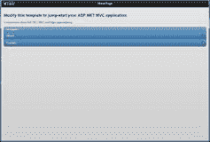
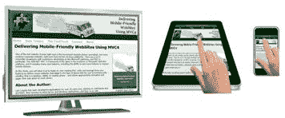
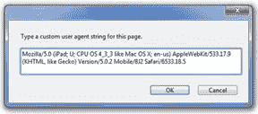
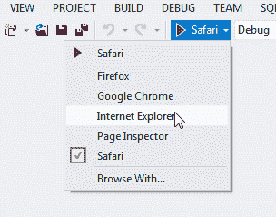
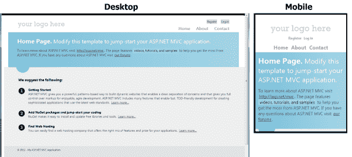

# 第 4 章建立 MVC 移动网站

佛罗多：“回去吧，山姆。我一个人去 Mordor。“
Sam：”你当然是。而且我要和你一同去。“
来自指环王：戒指的团契

MVC 3 能够创建适合移动设备的代码，但它不是内置功能。您必须编写自己的自定义代码并将其放入项目中，这并不简单。

* * *

我们将在[第 11 章](../Text/aspn-mobisite-12.html#heading_id_78)中讨论如何使用 MVC 3 创建一个适合移动设备的网站，但我们主要关注的是 MVC 4。

* * *

MVC 4 能够在应用程序启动时只需几行代码即可打开移动支持 - 这非常简单。让我们一起踏上 MVC 4 和移动世界。

## 移动应用模板

当您安装 MVC 4 [2](../Text/aspn-mobisite-14.html#heading_id_82) 并创建您的第一个项目时，您将立即倾向于**移动应用程序**模板。这似乎是你要去的第一件事，你可能是正确的。让我们看看它产生了什么，看看它是如何工作的。

当您选择此选项时，模板将为您生成一个移动网站，它将包含 jQuery 和 jQuery.Mobile 环境。 jQuery.Mobile 是轻松使您的网站适合移动设备的关键组件之一。 jQuery.Mobile 是一个构建在 jQuery 之上的框架，旨在帮助您创建移动用户界面。它不会取代 jQuery，它会在它上面构建并增强它。花一点时间浏览 jQuery.Mobile 网站 [3](../Text/aspn-mobisite-14.html#heading_id_82) ，你会发现他们花了很多时间让你很容易创建一个可以很好地运行的适合移动设备的网站各种设备。微软团队明智地采用这个开源项目。

* * *

本书中的示例是使用 2012 年 4 月发布的 jQuery.Mobile 1.1 版设计的。如果您有更新的版本（或者甚至比版本 1.0.1 更旧版本），本书中的概念仍应适用，因为大多数更改都是增强功能而不是更改。

* * *

如果您使用此默认项目模板并运行它，您将看到如下内容：



使用移动模板创建的网站

这对于第一次开始来说并不坏。但是，这种方法存在一个小问题：没有桌面版！这个版本为每个访问本网站的设备提供移动版本。它不适合移动设备;它只是移动设备。

如果您回想上一章，并考虑在构建适合移动设备的网站时想要实现的目标，您很快就会意识到需要注意三种不同的形状因素：小型，中型和大型。



移动友好网站需要考虑的因素

让我们不要忘记 2013 年将会发生什么！无论喜欢与否，您可能不得不比您想象的更快地考虑这种新格式......


Project Glass，任何人？

尝试创建一个适用于所有这些设计的设计通常是徒劳的，并且会产生一些在三分之二的情况下效果不佳的东西。我们需要一些方法来优化我们针对每个不同平台的设计。幸运的是，使用 MVC 平台并不难。

## 互联网应用模板

让我们重新开始，这次我们将选择 **Internet 应用程序**模板。我们现在将获得的是一个主要针对桌面平台进行优化的网站。我们将使用它，然后增强它，使其更适合移动设备。

当您构建并运行此网站时，它在移动设备上的外观与桌面上的内容几乎完全相同，如下图所示。请注意，在移动设备视图中，内容使用了一些响应式网页设计并稍微重新流动，使其在该格式中看起来更好一点。


使用 Internet 应用程序模板创建的网站

对于某些网站，您的手机只显示缩小的网站版本以适应您的移动设备的屏幕（就像我在第一章中提到的朋友的网站）。那么为什么我们基于**互联网应用**模板的网站缩小到自己的一个小版本呢？这个模板通过在其主布局页面中包含一小段魔术代码来避免这个问题（查看`\Views\Shared\_Layout.cshtml`）：

```
<meta name="viewport" content="width=device-width" />

```

而已！大多数手机（如 Android 和 iPhone）中使用的基于 WebKit 的浏览器都会尊重该标签，并会自动尝试调整内容的大小和重排以适应当前设备的宽度。这是您可以应用于您正在使用的任何网站的一点点花絮。（继续。现在就试试你当前的项目。这本书可以等。我知道你想。）

好的 - 你回来了？它有用吗？我们将在[第 7 章](../Text/aspn-mobisite-8.html#heading_id_44)中讨论其他几个`&lt;meta&gt;`标签，这些标签可以使您的网站更加适合移动设备 - 这是众多网站中的第一个。

我们的目标是将不同的内容返回给不同类型的设备。为此，我们必须知道发出请求的设备类型，为此我们将查看用户代理。您可能已经知道，每次浏览器向我们的服务器发送请求时，它还会发送一个`User-Agent`字符串以及该请求，该字符串向服务器标识请求该信息的应用程序。您可能会看到许多不同的字符串。这里有一些例子：

*   Mozilla / 5.0（iPhone; U; CPU iPhone OS 4_3_3，如 Mac OS X; en-us）AppleWebKit / 533.17.9（KHTML，与 Gecko 一样）Version / 5.0.2 Mobile / 8J2 Safari / 6533.18.5
*   Mozilla / 5.0（iPad; U; CPU OS 4_3_3，如 Mac OS X; en-us）AppleWebKit / 533.17.9（KHTML，类似 Gecko）版本/ 5.0.2 Mobile / 8J2 Safari / 6533.18.5
*   Mozilla / 5.0（Linux; U; Android 2.3.5; en-us; HTC Vision Build / GRI40）AppleWebKit / 533.1（KHTML，类似 Gecko）版本/ 4.0 Mobile Safari / 533.1
*   Mozilla / 5.0（BlackBerry; U; BlackBerry 9850; en-US）AppleWebKit / 534.11 +（KHTML，类似 Gecko）版本/ 7.0.0.115 Mobile Safari / 534.11 +
*   BlackBerry9700 / 5.0.0.862 配置文件/ MIDP-2.1 配置/ CLDC-1.1 VendorID / 167
*   Mozilla / 5.0（兼容; MSIE 9.0; Windows NT 7.1; Trident / 5.0）
*   Mozilla / 5.0（兼容; MSIE 9.0; Windows NT 6.1; WOW64; Trident / 5.0; SLCC2; Media Center PC 6.0; InfoPath.3; MS-RTC LM 8; Zune 4.7）

我们可以使用此信息使我们的网站以不同的方式响应不同的设备。在下一节中，我将介绍完成此工作所需的所有代码。

### 模拟移动设备进行测试

在我们开始之前，让我们绕道而行，看看如何在桌面上轻松模拟移动设备。我找到的最简单的方法是使用 Apple Safari 浏览器。安装完毕后，转到**首选项**设置并选择**高级**选项卡。


Safari 中首选项下的高级选项卡

确保选中了 **Show Develop 菜单**复选框，您几乎准备就绪。记得先前讨论过不同的用户代理字符这是您使用它们的地方。如果您打开了**开发菜单**设置，Safari 将允许您轻松更改它提供给网站的用户代理。只需转到新启用的**开发**菜单项并选择一个。


Safari 中可用的用户代理

如果您有兴趣查看其中一个用户代理字符串的详细信息，只需选择它并刷新页面，然后返回此菜单并选择 **Other ...** 选项。将显示您当前选择的用户代理，您可以对其进行编辑。



自定义用户代理字符串

如果您想模拟 Android 或 BlackBerry 设备，您将无法在 Apple 浏览器的菜单项中找到这些选项，但您可以直接找到所需的用户代理字符串并将其粘贴到此框中，您将进入商业。请记住，这不能替代在实际设备上测试您的网站。它确实提供了一种快速而肮脏的方式来测试您的网站，但是如果您没有在实际设备上进行最终测试，那么移动设备上的行为会有一些微妙的差异，这些差异会再次困扰您。

* * *

Visual Studio 2012 具有方便的工具栏选项，用于选择运行应用程序的浏览器。

* * *



在 Visual Studio 2012 中选择浏览器

### 识别移动设备

让我们回到我们的主题，并使我们的代码能够识别不同类型的移动设备。打开 **Global.asax.cs** 文件并转到`Application_Start`方法，然后在`BundleConfig.RegisterRoutes`行后面插入`DisplayModeProvider`代码：

```
using System.Web.WebPages;

protected void Application_Start()
{
  AreaRegistration.RegisterAllAreas();
  FilterConfig.RegisterGlobalFilters(GlobalFilters.Filters);
  RouteConfig.RegisterRoutes(RouteTable.Routes);
  BundleConfig.RegisterBundles(BundleTable.Bundles);

  DisplayModeProvider.Instance.Modes.Insert(0,
    new DefaultDisplayMode("Phone")
  {
    ContextCondition = (context => (
      (context.GetOverriddenUserAgent() != null) &&
      (
        (context.GetOverriddenUserAgent().IndexOf("iPhone",
            StringComparison.OrdinalIgnoreCase) >= 0) ||
        (context.GetOverriddenUserAgent().IndexOf("iPod",
            StringComparison.OrdinalIgnoreCase) >= 0) ||
        (context.GetOverriddenUserAgent().IndexOf("Droid",
            StringComparison.OrdinalIgnoreCase) >= 0) ||
        (context.GetOverriddenUserAgent().IndexOf("Blackberry",
            StringComparison.OrdinalIgnoreCase) >= 0) ||
        (context.GetOverriddenUserAgent()
          .StartsWith("Blackberry",
             StringComparison.OrdinalIgnoreCase))
      )
    ))
  });

  DisplayModeProvider.Instance.Modes.Insert(0,
    new DefaultDisplayMode("Tablet")
  {
    ContextCondition = (context => (
      (context.GetOverriddenUserAgent() != null) &&
      (
        (context.GetOverriddenUserAgent().IndexOf("iPad",
            StringComparison.OrdinalIgnoreCase) >= 0) ||
        (context.GetOverriddenUserAgent().IndexOf("Playbook",
            StringComparison.OrdinalIgnoreCase) >= 0) ||
        (context.GetOverriddenUserAgent()
          .IndexOf("Transformer",
            StringComparison.OrdinalIgnoreCase) >= 0) ||
        (context.GetOverriddenUserAgent().IndexOf("Xoom",
            StringComparison.OrdinalIgnoreCase) >= 0)
      )
    ))
  });

}

```

我插入了以`DisplayModeProvider`开头的两个代码块（加上文件顶部的`using System.Web.WebPages;`语句）。这些行在此应用程序的可用`DisplayModes`表中设置了一个新条目。每次应用程序收到请求时，都会对其进行评估，以确定在处理请求时应如何格式化该请求。在这种情况下，如果条件与这些自定义模式之一匹配，则将该模式的名称注入到文件名中。上一个代码示例中指定的条件查看用户代理字符串，并检查是否存在匹配项。

例如，如果客户端是 iPhone，它将发送类似于此的用户代理字符串：

```
Mozilla/5.0 (iPhone; U; CPU iPhone OS 4_3_3 like Mac OS X; en-us) AppleWebKit/533.17.9 (KHTML, like Gecko) Version/5.0.2 Mobile/8J2 Safari/6533.18.5

```

然后我们的应用程序将匹配它并确定它应该使用`Phone`显示模式。然后，MVC 引擎会查看它正在创建的视图，并稍微修改它正在寻找的文件：

客户要求的内容：/ YourApp / SomeController /

PC 将获得的视图基于：/Views/SomeController/Index.cshtml

iPhone 将获得的视图基于：/Views/SomeController/Index.Phone.cshtml

当控制器构建 HTML 以返回到手机时，它将基于 **Index.Phone.cshtml** 文件的请求。有了这些信息，我们可以轻松创建专门针对浏览我们网站的设备类型而设计的独特视图。制作 **Home / Index.cshtml** 文件的两个副本，并将它们重命名为 **Index.Phone.cshtml** 和 **Index.Tablet.cshtml** 。

* * *

一些纯粹主义者肯定会指出，像 WURFL 或 51Degrees 这样的库可以更好地确定哪个设备正在请求页面以及它具有哪些功能，而不是之前列出的用户代理嗅探代码，他们有一个好点。但是，这个代码在极小的开销和非常有限的维护保养中达到了所需要的大约 99% 。如果您担心其他 1% ，请继续调查其他选项。否则，这段代码可以很好地完成这项工作，并且可以减少麻烦。

* * *

### 包含 jQuery.Mobile

为每个移动设备创建真正不同的外观和感觉的第一步是在我们的项目中包含 **jQuery.Mobile** 包。您可以通过打开**工具**下的**包管理器控制台**来完成此操作。**库包管理器 &gt; 软件包管理器控制台**，并输入以下行：`Install-Package jQuery.Mobile`。

```
PM> Install-Package jQuery.Mobile
Attempting to resolve dependency 'jquery (≥ 1.6.4)'.
Successfully installed 'jQuery 1.6.4'.
Successfully installed 'jquery.mobile 1.1.0'.
Successfully removed 'jQuery 1.6.2' from Chapter4.
Successfully added 'jQuery 1.6.4' to Chapter4.
Successfully added 'jquery.mobile 1.1.0' to Chapter4.
Successfully uninstalled 'jQuery 1.6.2'.

```

* * *

如果你不是像我这样的命令行瘾君子，你可以使用工具&gt;下的 GUI。库包管理器&gt;管理解决方案的 NuGet 包并搜索 jQuery.Mobile。他们都做了完全相同的事情。

* * *

这是第一步，但它对你没有太大作用。如果你现在运行你的项目，它将看起来完全相同，只有一个小的区别：当你在页面之间切换时，你会看到一个滑动过渡动画。暂时忽略这一点，我们将在几分钟后回来解决这个问题。

### 创建移动布局页面

下一步是为这些移动设备设置唯一的**布局**页面。在你的 **\ Views \ Shared** 文件夹中，你应该找到一个 **_Layout.cshtml** 文件，这就是你的所有页面都是基于此的。 （这类似于所有 ASP.NET Web 窗体程序员的母版页。）将该文件复制到新的`\Views\Shared\_Layout.Phone.cshtml`文件这就是我们开始定制的地方。

当你打开它时，你会看到几行看起来像这样：

```
@Styles.Render("~/Content/themes/base/css", "~/Content/css")
@Scripts.Render("~/bundles/modernizr")

```

### MVC 4 捆绑

捆绑功能是您将非常欣赏的 MVC 4 的新功能之一。如果您曾尝试在以前版本的 MVC 3 和 ASP.NET 中优化网站性能，那么您必须关注的一件事是尽量减少 Web 请求的数量并减少请求的数据大小。为了做到这一点，有几个程序可以将任何 JavaScript 或样式表最小化并连接成一个较小的文件。例如，您可以使用以下脚本： **jquery-1.6.4.min.js** ， **jquery-ui.js** ， **jquery.validate.js** ，和 **jquery.validate.unobtrusive.js** 。您可以使用其中每个版本的最小化版本（ *** .min.js** ）并大大减少您下载到设备的数据量，但它仍会为这四个文件发出四个 HTTP 请求。通过将这些文件连接在一起，您可以将其减少为一个 HTTP 请求。如果您在本地网络上运行 PC，例如开发人员使用他或她的桌面或对本地服务器进行测试，您将永远不会注意到加载这四个文件所花费的时间。在 3G（或 1G）网络上运行的移动设备上，这可能会导致页面的加载时间大幅增加。

MVC 4 试图通过使用 **Bundle** 为您提供一种简单的内置组合和缩小文件的方法来缓解这个问题。通过使用`BundleUrl`选项，您可以简单地指向一个目录并告诉页面您希望该目录中的所有内容集中在一个文件中，MVC 将自动为您执行此操作。

这太棒了 - 我喜欢为我做的事情的新功能，我以前必须手动做！然而…

### 创建自定义捆绑包

有时，生产现场的那些有用的东西会使您更难以开发。在我们的项目中，我们刚刚包含了 jQuery.Mobile 包。我提到过，一旦我们在项目中包含 jQuery.Mobile，桌面视图就会有滑动过渡，我们可能不希望这样。我们希望这些脚本适用于我们的移动页面，但不能更改我们的桌面页面。所以问题是我们如何将这些文件分成桌面和移动版本，并仅加载我们想要的文件？

让我们看看如何通过在 **App_Start** 文件夹中的新 MVC 4 **BundleConfig.cs** 文件中添加一些自定义代码，在我们的应用程序中创建一些自定义包。我们将修改`RegisterBundles`函数来处理它。我们将为我们的移动版本创建几个自定义捆绑包，并仅指定我们感兴趣的文件。

这是代码：

```
public static void RegisterBundles(BundleCollection bundles)
{
  [… existing bundle code goes here… ]

  bundles.Add(new ScriptBundle("~/bundles/MobileJS").Include(
    "~/Scripts/jquery.mobile-1.*",
    "~/Scripts/jquery-1.*"));

  bundles.Add(new StyleBundle("~/Content/MobileCSS").Include(
    "~/Content/jquery.mobile.structure-1.1.0.min.css",
    "~/Content/jquery.mobile-1.1.0.css"));
#if DEBUG
  BundleTable.EnableOptimizations = false;
#else
  BundleTable.EnableOptimizations = true;
#endif
}

```

如果您正在编写和调试自己的 JavaScript 并在捆绑包中包含这些文件，则可能需要控制何时缩小代码以便更容易调试。如果 **Web.config** 中的`compilation`标签设置为`debug=true`，则不会发生缩小。或者，您可以在`RegisterBundles`中的代码中显式设置`BundleTable.EnableOptimizations` 标签，这也将控制它并覆盖 **Web.config** 设置。

Web.config 设置

```
<system.web>
          <compilation debug="true" /> </system.web>

```

现在我们已经创建了 bundle，让我们将它们放入我们的布局文件中。打开 **_Layout.Phone.cshtml** 文件，将`bundles/jquery`标签替换为新的`MobileJS`标签，并将`css`包替换为新的`MobileCSS`标签，如下所示：

之前

```
<!DOCTYPE html>
<html lang="en">
    <head>
        <meta charset="utf-8" />
       …
       …
        @Styles.Render("~/Content/css")
        @Scripts.Render("~/bundles/modernizr")
    </head>
    <body>
       …
       …
        @Scripts.Render("~/bundles/jquery")
        @RenderSection("scripts", required: false)
    </body>
</html>

```

后

```
<!DOCTYPE html>
<html lang="en">
    <head>
        <meta charset="utf-8" />
              …
       …

       @Styles.Render("~/Content/MobileCSS")
        @Scripts.Render("~/bundles/modernizr")
        @Scripts.Render("~/bundles/MobileJS")
    </head>
    <body>      
       …
       …
        @RenderSection("scripts", required: false)
    </body>
</html>

```

保存这些更改，然后复制 **_Layout.Phone.cshtml** 文件并重命名副本 **_Layout.Tablet.cshtml** 。稍后我们将使用更多功能对其进行更新，以区分两种类型的布局，但现在这将有效。让我们运行我们的应用程序，看看到目前为止我们有什么。



桌面和移动应用程序视图

### 使用我们的新布局文件

为什么我们的网站没有改变？它没有改变，因为虽然我们已经创建了新的布局文件，但我们还没有在任何页面中使用它们。要为任何视图使用自定义布局，您需要在视图顶部添加一行代码。在这种情况下，编辑 **Index.Phone.cshtml** 文件并在顶部添加以下行：

```
@{ Layout = "../Shared/_Layout.Phone.cshtml"; }

```

然后编辑 **Index.Tablet.cshtml** 文件并在顶部添加以下行：

```
@{ Layout = "../Shared/_Layout.Tablet.cshtml"; }

```

现在尝试在使用手机或平板电脑用户代理时再次运行它，您应该会看到如下所示的内容：


应用新布局文件

您仍然可以看到我们之前看过的文本，但格式化已经消失，而且我们仍然没有看起来像移动设备友好型网站的页面。那是因为我们仍在处理针对桌面的网站布局。

让我们用移动设备和 jQuery.Mobile 设计的一些更简单的代码替换移动布局页面（ **_Layout.Phone.cshtml** ）主体中的 HTML：

```
  <body>
    <div data-role="page" data-theme="b">
      <div data-role="header" data-theme="b">
        <h1>@ViewBag.Title</h1>
      </div>
      <div data-role="content" data-theme="d">
        <nav>
          <ul id="menu">
            <li>@Html.ActionLink("Home", "Index", "Home")</li>
            <li>@Html.ActionLink("About", "About", "Home")</li>
            <li>@Html.ActionLink("Contact", "Contact", "Home")</li>
          </ul>
        </nav>
@RenderSection("featured", false)
@RenderBody()
      </div>
    </div>
  </body>

```

此页面与 **_Layout.cshtml** 页面具有大部分相同的内容部分，但格式完全不同。请特别注意`page`，`header`和`content divs`上的`data`标签。这些是 jQuery.Mobile 的特殊标签。他们为 jQuery.Mobile 提供了有关如何处理这些部分的更多信息。您可以使用许多`data`标签来自定义页面，我们很快就会看到其中的一些标签。

有了这个新的布局，让我们再试一次，看看我们的网站是否已经开始形成：


具有改进的移动设备外观的应用

那好多了。它仍然不是 100% ，但它已经开始到达那里。我们可以从这个快速示例中看到，我们的页面开始与桌面版本不同。在下一节中，我们将继续自定义此页面以进一步增强外观。

总结一下，这是一份简短的清单，列出了我们迄今为止所做的所有工作：

1.  基于 **Internet 模板**创建了一个 MVC 4 项目。
2.  将`DisplayModeProvider`代码添加到 **Global.asax** 以检测手机或平板电脑用户代理。
3.  在项目中包含了 **jQuery.Mobile** 。
4.  创建了自定义捆绑包，因此移动脚本不会影响桌面页面。
5.  在**共享**文件夹中为手机和平板电脑创建了自定义**布局**页面。
6.  创建了每个页面的手机和平板电脑版本，并将其更改为使用新布局。
7.  使用 Safari 和自定义用户代理测试网站。

这是一个很清单，不是吗？我敢打赌，你认为这并不像我承诺的那样容易。在本章中，您一直在学习走路，以便以后可以跑步。如果您了解需要执行的步骤，以便在您开始运行时不会跳闸和跌落，则此过程会更好。

MVC 4 中引入的 Visual Studio 中的一个不错的新功能是添加了配方，可以帮助您自动执行其中的许多步骤。通过使用像 Lyle 的 MVC 4 FoodTruck 食谱（可在 [http://nuget.org/packages/LCI.FoodTruck.MVC4/](http://nuget.org/packages/LCI.FoodTruck.MVC4/) 获得）的食谱，您可以自动化大多数这些步骤并使整个过程无痛。我已经完成了这个配方的演示，我创建了一个 SQL Server 数据库，添加了一个表和数据（通过运行 SQL 脚本），然后在大约 10 分钟内创建了一个包含桌面和移动视图的完整网站。但是，在您可以这样做之前，您需要先了解所涉及的所有步骤。