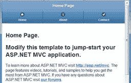
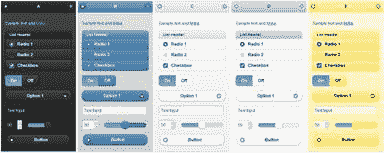

# 第 6 章让它看起来不错

马蒂：“等一下，医生。啊......你告诉我你用 DeLorean 建造了一台时间机器吗？“
Doc：”我看到它的方式，如果你要把时间机器装进车里，为什么不呢？以某种风格做到这一点？“
从 _ 回到未来 _

## jQuery.Mobile 部分

jQuery.Mobile 使用一个相当简单的结构来定义其页面元素。通过在`&lt;div&gt;`上使用`data-role`标签，它们定义了这些基本区域：`page`，`header`，`content`，`footer`和`navbar`。

还有其他领域已定义，我们将在[第 9 章](../Text/aspn-mobisite-10.html#heading_id_61)中讨论它们，但这些是您经常使用的基本区域。

### 页面部分

```
<div data-role="page" data-theme="b">

```

这是 jQuery.Mobile 用于包装以下所有部分的文档的主要部分。通常它包括`header`，`content`和`footer`部分，但只需要`content`部分。实际上并不需要`page`元素本身。但是，如果您不提供框架，则框架将添加一个，因此最佳做法是继续并定义它。

### 标题部分

```
<div data-role="header" data-position="fixed" data-theme="b">
  <h1>@ViewBag.Title</h1>
</div>

```

此部分包含应在页面标题中显示的信息。当用户滚动页面时，可选的`data-position`元素可以使该元素粘在顶部。你可以在这里看到我已经展示了典型的 MVC `Title`标签，因此它会自动在标题中显示页面标题。空间有限，因此如果标题不合适，标题将被裁剪。我们可以插入我们想要的任何 HTML，但最佳做法是使用`&lt;h1&gt;`作为标题（如果你想要更高级的东西，你也可以用图像替换它）。如果在`header div`中添加一个按钮，它将自动移动到左侧。如果添加第二个按钮，它将自动移动到右侧。您可能不需要两个以上的按钮，因为其他按钮将移动到第二行并使标题更大（使用`navbar`代替）。

### 内容部分

```
<div data-role="content" data-theme="d">
  @RenderBody()
</div>

```

这是您将放置大部分内容的部分。在代码示例中，我展示了将呈现视图内容的典型 MVC 标记。

### 页脚部分

```
<div data-role="footer" data-position="fixed" data-theme="b">

```

`footer`与`header`非常相似，除了可能更灵活一些。我们可以在这里添加两个以上的按钮，它们将一个接一个地添加内联（不是左对齐，右对齐，如标题）。默认情况下，页脚的格式不是很多，因此您可能需要添加一些其他标记以使其看起来不错。

### Navbar 部分

```
<div data-role="navbar">

```

这是放置导航项目的好地方。如果您考虑普通的桌面或 Windows 应用程序设计，我们倾向于使用大量的选项卡控件将相关的选项卡页面组合在一起。本节为您提供了一种将这些页面轻松链接在一起的类似方法。如果将其放入部分视图文件中，则可以轻松地将其包含在需要它的任何页面中。我们将在下一节中更详细地讨论这个问题。

## 将菜单放入标签栏

让我们将我们开始的菜单转换为固定标签栏，就像您在大多数移动应用程序的底部看到的那样，带有图标。目前，我们在菜单项的移动应用程序主页上有以下代码：

```
<ul data-role="listview" data-inset="true">
  <li data-role="list-divider">Menu Items</li>
  <li>@Html.ActionLink("Home", "Index", "Home")</li>
  <li>@Html.ActionLink("About", "About", "Home")</li>
  <li>@Html.ActionLink("Contact", "Contact", "Home")</li>
</ul>

```

将该代码复制到 **Shared** 文件夹中的新文件中，并将其命名为 **_NavBar.cshtml** 。删除花哨的`&lt;ul&gt;`标签属性和`list-divider`行，然后用[我们刚看过的`navbar`标签将其包装在`div`中。

```
<div data-role="navbar" data-theme="b">
  <ul>
    <li>@Html.ActionLink("Home", "Index", "Home")</li>
    <li>@Html.ActionLink("About", "About", "Home")</li>
    <li>@Html.ActionLink("Contact", "Contact", "Home")</li>
  </ul>
</div>

```

从 **_Layout.Phone.cshtml** 和 **_Layout.Tablet.cshtml** 中删除原始菜单代码并添加新的局部视图以插入我们刚刚在标题中创建的新`navbar` 。

```
<div data-role="header" data-position="fixed" data-theme="b">
  <h1>@ViewBag.Title</h1>
  @Html.Partial("_NavBar")
</div>

```

由于我们在标头标签上已经有`data-position=fixed`，因此此标题和导航栏将始终保留在页面顶部。

如果要在导航中添加图标，只需在每个链接中添加`data-icon`标记即可。 jQuery.Mobile 包含几个你可以使用的内置图标：`arrow-l` _，_ `arrow-r` _，_ `arrow-u` _，_ `arrow-d` _，_ `delete` _，_ `plus` _，_ `minus` _，_ `check` _，_ `gear` _，_ `refresh` _，_ `forward` _，_ `back` _，_ `grid` _，_ `star` _，_ `alert` _，_ `info` _，_ `home`或`search`。您可以在`navbar div`上添加`data-iconpos`标签，以确定显示图标的位置。 `iconpos`标签的有效值包括`top` _，_ `bottom` _，_ `left` _，_ 或`right`。

为了使这个例子在将这个额外标签放入我们的链接时更容易阅读，我们将使用`@URL.Action`标签将它们从`@Html.ActionLinks`更改为`hrefs`，如下所示：

```
<div data-role="navbar" data-theme="b" data-iconpos="top">
  <ul>
    <li><a href="@Url.Action("Index", "Home")"
      data-icon="home">Home</a></li>
    <li><a href="@Url.Action("About", "Home")"
      data-icon="info">About Us</a></li>
    <li><a href="@Url.Action("Contact", "Home")"
      data-icon="check">Contact Us</a></li>
  </ul>
</div>

```

就是这样 - 我们都准备运行应用程序，看看它是如何工作的。



标签栏中添加的菜单

如果您希望将标签栏放在页面底部，可以将其放在`footer`部分中，如下面的代码示例所示：

```
<div data-role=“footer" data-position="fixed" data-theme="b">
  @Html.Partial("_NavBar")
</div>

```

无论哪种方式都很好 - 它更像是对您网站的风格偏好。

### 其他标签栏注意事项

您需要了解的标签栏有一些限制。如果你指定最多五个按钮，你应该没问题（虽然你的文字可能会在手机上切断，所以保持文字简短）。如果您有六个以上的按钮，导航栏将切换到一个模式，其中有多行，每行有两个按钮。将标签栏保持在五个或更少的按钮通常是个好主意。

如果您想使用不属于标准 jQuery.Mobile 集的自定义图标，那实际上相当容易。我们将在[第 9 章](../Text/aspn-mobisite-10.html#heading_id_70)中讨论如何做到这一点。

如果您希望在该页面上点亮其中一个图标，则可以在该链接上使用标记`class="ui-btn-active"`。

* * *

如果您使用的是共享局部视图导航栏，则会变得更加困难，但可以通过查询`Model.GetType()`属性来完成。使用它，您可以确定传递给页面的模型类型，以及您所在的页面和应突出显示的按钮。

* * *

### Navbar 链接的备用语法

在前面的例子中，我们使用了`@Url.Action`动词而不是`@HTML.ActionLink`，因为它使得第一眼看到这个例子变得更简单一些。可以使用任一动词，但`ActionLink`最终会变得复杂一些。让我们看一下它的实例：

```
<div data-role="navbar" data-theme="b" data-iconpos="top">
  <ul>
    <li>@Html.ActionLink("Home", "Index", "Home", null,
      new Dictionary<string, object> {{ "data-icon", "home" }})</li>
    <li>@Html.ActionLink("About Us", "About", "Home", null,
      new Dictionary<string, object> {{ "data-icon", "info" }})</li>
    <li>@Html.ActionLink("Contact Us", "Contact", "Home", null,
      new Dictionary<string, object> {{ "data-icon", "check" }})</li>
  </ul>
</div>

```

如果您之前使用过 MVC，那么您可能想知道为什么我们不使用以下代码示例中显示的更简单的表示法：

```
<li>@Html.ActionLink("About", "Home", null,
          new { data-icon = "home" })</li>

```

这是 MVC 程序员经常用来将 ID 值传递给动作的符号。但是，如果您尝试使用`data-icon`之类的名称执行此操作，则会收到错误“无效的匿名类型成员声明符。”如果将其翻译为英语，则表示“您不能使用带连字符的名称”。在幕后，我们的快捷方式`"new {}"`代码实际上为`ActionLink`方法创建了一个字典。所以在这种情况下我们可以继续自己创建一本字典然后一切正常。这两种方法都可以创建相同的最终产品，因此这实际上是个人偏好的问题。

### 又一个备用 Navbar 语法

在关于如何格式化这些链接的讨论中还有另一种值得考虑的可能性。

```
<div data-role="navbar" data-theme="b" data-iconpos="top">
  <ul>
    <li>@Html.ActionLink("Home", "Index", "Home", null,
      new { data_icon = "home" })</li>
    <li>@Html.ActionLink("About Us", "About", "Home", null,
      new { data_icon = "info" })</li>
    <li>@Html.ActionLink("Contact Us", "Contact", "Home", null,
      new { data_icon = "check" })</li>
  </ul>
</div>

```

在 MVC 3 和 MVC 4 中，有一个功能会在 HTML 属性属性中指定时自动将下划线字符（`_`）转换为连字符（`-`），因为下划线在 HTML 属性中不合法。因此，在这个例子中，它会在最终的 HTML 中将我们的`data_icon`改为`data-icon`。与上一个示例一样，任何一种方法都会创建相同的最终产品，因此这取决于个人偏好。

* * *

我个人认为，下划线的技巧有效，但有点误导。在使用它时，你假设其他程序员知道这个小知识;否则他们会看到这段代码有点困惑。实际上它们都生成完全相同的 HTML，因此它归结为个人偏好。

* * *

## 创建自定义主题和颜色

jQuery.Mobile 中一个非常好的功能是对主题的支持。您可以在 A-E 中添加标签`data-theme="x"`，其中`x`是您要使用的样式，几乎可以对页面的任何部分进行主题化。默认主题如下图所示。



默认的 jQuery.Mobile 主题

这些主题使用级联系统。如果为容器指定主题，则该容器中的项目将使用指定的颜色方案，除非为它们选择了另一个主题。

即使您只使用默认主题集，您也可以选择一组漂亮的选项和几个选项。但是，如果您想使用自己的颜色来匹配图形或公司徽标，该怎么办？幸运的是，jQuery.Mobile 与 Adobe 合作创建了 jQuery.Mobile ThemeRoller 网站。如果你想看看你能做些什么的好例子，请查看 [http://jqmgallery.com](http://jqmgallery.com) 。

要开始使用 ThemeRoller，请将浏览器导航到 [http://jquerymobile.com/themeroller/](http://jquerymobile.com/themeroller/) ，您将看到主题编辑器，但是带有非常平淡的灰色调色板。但是，很容易解决这个问题。单击工具栏中的**导入**按钮，在弹出的弹出窗口中单击**导入默认主题**链接，然后单击**导入**按钮，并点击 - 现在您可以使用标准的 jQuery.Mobile 主题了。

现在，您可以开始自定义颜色调色板以匹配您的完美网站。确保在左侧面板中选择了相应的样本，然后使用颜色选择器进行调整和微调。如果您不确定在面板中选择了正确的样本，则最终可能会更改全局颜色并且必须重新开始。

这是我对古老的“Hot Dog Stand”主题的致敬（那些你已经足够记住 Windows 3.1 的人可能会理解这个参考，而你的年轻人可以 Google 吧！）：


重新创造“热狗摊”主题

* * *

如果你在 Kindle 电子墨水设备上阅读它，它不会很明显，但这是一个可怕的红色和黄色。

* * *

如果您对颜色选择感到满意，则可以将其下载到计算机上以供使用。单击顶部的**下载主题**链接并为其命名 - 在这种情况下，我们将使用 _HotDogStand_ 。下载将为您提供一个包含样式表和一些额外文件的 zip 文件，但我们真的只对两个文件感兴趣： **HotDogStand.css** 和 **HotDogStand.min.css** 。将这两个文件解压缩到**内容**文件夹，然后将它们包含在项目中。

如果您之前跟进，我们在 **BundleConfig.cs** 文件中为我们的移动页面创建了一个最小化的自定义捆绑包。返回到该代码并注释掉现有的 **jquery.mobile-1.1.0.css** 文件，并将其替换为刚刚下载的文件，同时保留 **jquery.mobile.structure** 文件在捆绑中：

```
public static void RegisterBundles(BundleCollection bundles)
{
  [… existing bundle code goes here… ]

  bundles.Add(new StyleBundle("~/Content/MobileCSS").Include(
    "~/Content/HotDogStand.css",
    "~/Content/jquery.mobile.structure-1.1.0.min.css",
    //"~/Content/jquery.mobile-1.1.0.css"
  ));

```

通过这些微小的改动，你应该准备好了。

* * *

如果您没有自定义捆绑包，则必须编辑移动布局文件并在其中添加引用到新文件中。

如果您仍在使用作为项目默认值的标准捆绑包，则必须从目录中删除 jquery.mobile-1.1.0.css 文件（或将其重命名为.css 以外的其他内容。）

* * *

与任何锋利的工具一样，ThemeRoller 在未经训练的手中可能会很危险，因此请务必咨询您的平面设计师。向您的图形设计师展示如何使用此工具，您只需导入他或她直接生成的样式表。