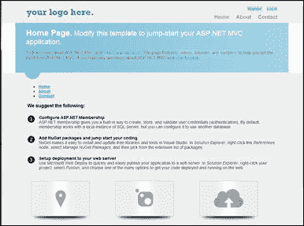
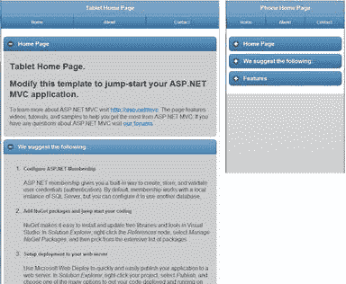
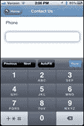
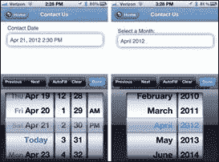
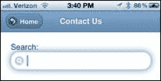

# 第 8 章提示与技巧

“不要试着弯曲勺子。这不可能。相反......只是试图实现真相。没有勺子。然后你会发现它不是弯曲的勺子，它只是你自己。“
_The Matrix_ 中的小男孩

## 使用部分视图最小化复制

到目前为止，我们创建的网站类型的一个主要问题是我们正在复制我们网站中的页面，随之而来的是重复内容的诅咒。避免复制内容的一种方法是创建在不同设备页面之间共享的部分视图。以下三个屏幕截图是具有完全相同内容的完全相同的 URL，但每个屏幕截图都针对其所针对的平台进行组织和优化，并且每个屏幕共享相同的内容文件。



桌面视图



平板电脑和手机视图

让我们从桌面视图开始查看每个页面的源代码：

```
@{ ViewBag.Title = "Home Page"; }
@section featured {
  @Html.Partial("_Index_SubPage1")
}
<ul >
  @Html.Partial("_Index_SubPage2")
</ul>
<h3>We suggest the following:</h3>
@Html.Partial("_Index_SubPage3")
<section class="features">
  @Html.Partial("_Index_SubPage4")
</section>

```

就是这样 - 这就是整个页面。对于页面上的每个主要区域，您可以看到内容已移动到部分视图文件，因此实际页面上只剩下很少的内容。

让我们从创建具有非常相似布局的移动视图开始。这是电话页面：

```
@{ Layout = "../Shared/_Layout.Phone.cshtml"; }
@{ ViewBag.Title = "Phone Home Page"; }

<h2>Home Page</h2>
@Html.Partial("_Index_SubPage1")

@* -- Moved to the Shared/_Layout.Phone.cshtml *@
@*    @Html.Partial("_Index_SubPage2")*@

<h2>We suggest the following:</h2>
@Html.Partial("_Index_SubPage3")

<h2>Features</h2>
@Html.Partial("_Index_SubPage4")

```

这是平板电脑页面：

```
@{ Layout = "../Shared/_Layout.Tablet.cshtml"; }
@{ ViewBag.Title = "Tablet Home Page"; }
<h2>Home Page</h2>
@Html.Partial("_Index_SubPage1")

@* -- Moved to the Shared/_Layout.Tablet.cshtml *@
@*    @Html.Partial("_Index_SubPage2")*@

<h2>We suggest the following:</h2>
@Html.Partial("_Index_SubPage3")

<h2>Features</h2>
@Html.Partial("_Index_SubPage4")

```

请注意，我们删除了`_Index_SubPage2`，因为这是我们在基本布局页面中已有的菜单。此代码还不会产生上一个屏幕截图中显示的流畅页面，但它将包含页面上的所有内容。我们将在一分钟内看到添加可折叠容器。

使用这种类型的编码模式可以极大地提高您获得成功的机会，因为您可以优化页面设计以匹配设备，但同时也可以避免必须同时在三个不同的位置维护内容。使用此模型，当您在一个位置更改内容时，它会在所有三个平台上同时更改！

## 可折叠容器和可重复使用的内容

让我们回到[第 3 章](../Text/aspn-mobisite-4.html#heading_id_15)中简要介绍的可折叠容器。 jQuery.Mobile 使得创建它们非常容易。让我们看看这个实例的一个例子。

让我们修改我们刚创建的移动视图，将部分视图内容放在`div`中，角色为`collapsible`。如果你使用那种类型的`div`容器，你必须在内容的顶部添加一个标题标签，你最终会得到一个漂亮的条形图，在容器的顶部有一个加号或减号。您可以看到我们已将手机容器设置为折叠，并且默认情况下平板电脑容器会展开，因为我们有不同的设备规格。

以下是电话页面的完成代码：

```
@{ Layout = "../Shared/_Layout.Phone.cshtml"; }
@{ ViewBag.Title = "Phone Home Page"; }

<div data-role="collapsible" data-theme="b" data-content-theme="b"
  data-collapsed="true">
  <h2>Home Page</h2>
  @Html.Partial("_Index_SubPage1")
</div>

@* -- Moved to the Shared/_Layout.Phone.cshtml *@
@*    @Html.Partial("_Index_SubPage2")*@

<div data-role="collapsible" data-theme="b"
  data-content-theme="b" data-collapsed="true">
  <h2>We suggest the following:</h2>
  @Html.Partial("_Index_SubPage3")
</div>

<div data-role="collapsible" data-theme="b"
  data-content-theme="b" data-collapsed="true">
  <h2>Features</h2>
  @Html.Partial("_Index_SubPage4")
</div>

```

以下是完成的平板电脑页面的代码：

```
@{ Layout = "../Shared/_Layout.Tablet.cshtml"; }
@{ ViewBag.Title = "Tablet Home Page"; }
<div data-role="collapsible" data-theme="b"
  data-content-theme="b" data-collapsed="false">
  <h2>Home Page</h2>
  @Html.Partial("_Index_SubPage1")
</div>

@* -- Moved to the Shared/_Layout.Tablet.cshtml *@
@*    @Html.Partial("_Index_SubPage2")*@

<div data-role="collapsible" data-theme="b"
  data-content-theme="b" data-collapsed="false">
  <h2>We suggest the following:</h2>
  @Html.Partial("_Index_SubPage3")
</div>

<div data-role="collapsible" data-theme="b"
  data-content-theme="b" data-collapsed="false">
  <h2>Features</h2>
  @Html.Partial("_Index_SubPage4")
</div>

```

此源代码现在将生成看起来像本章开头的屏幕截图的页面。使用此代码，您现在有三个看起来截然不同且行为不同的页面，但它们都共享完全相同的 URL 和内容。唯一的区别在于请求页面的设备。

## 桌面/移动 ViewSwitcher

MVC 4 有一个名为浏览器覆盖的新功能，它允许用户覆盖他们的普通用户代理字符串并查看您的页面，就像他们使用不同的浏览器一样。使用此功能，您可以允许用户通过手机访问您的网站并获取移动设备优化视图，然后他们可以请求查看桌面或平板电脑上的内容。

* * *

注意：此功能仅影响 MVC 中的视图和布局，并且不会影响查看 Request.Browser 对象的任何其他 ASP.NET 功能。

* * *

此功能有多种选择。实际上可以下载一个 NuGet 包来启用它，但是下面的代码已经过定制，可以使用我们在本书中开发的移动框架概念。

启用此功能需要两个组件：视图和相应的控制器。我们先来看看视图：

```
<span style="font-size: 0.7em;">
Switch To:
@Html.ActionLink("Desktop View", "SwitchView", "ViewSwitcher",
  new { mobile = false, mobileType = "Desktop",
  returnUrl = Request.Url.PathAndQuery },
  new { rel = "external" })
@Html.ActionLink("Tablet View", "SwitchView", "ViewSwitcher",
  new { mobile = true, mobileType = "Tablet",
  returnUrl = Request.Url.PathAndQuery },
  new { rel = "external" })
@Html.ActionLink("Phone View", "SwitchView", "ViewSwitcher",
  new { mobile = true, mobileType = "Phone",
  returnUrl = Request.Url.PathAndQuery },
  new { rel = "external" })
@Html.ActionLink("Default View", "SwitchView", "ViewSwitcher",
  new { mobile = false, mobileType = "Default",
  returnUrl = Request.Url.PathAndQuery },
  new { rel = "external" })
</span>

```


查看选项

到目前为止，我们一直致力于为我们的网站开发三种不同的视图：桌面，平板电脑和手机版本。上一屏幕截图中显示的链接允许用户选择三个显示选项中的任何一个，或重置为其设备通常请求的默认视图。

捕获此链接并处理它的控制器如下所示：

```
using System.Web.Mvc;
using System.Web.WebPages;

namespace Demo.Controllers
{
  public class ViewSwitcherController : Controller
  {
    public RedirectResult SwitchView(bool mobile, string mobileType,
      string returnUrl)
    {
      mobileType = (mobileType == null) ?
        string.Empty : mobileType.Trim().ToLower();
      if (mobileType == "default")
      {
        HttpContext.ClearOverriddenBrowser();
      }
      else
      {
        if (mobileType == string.Empty) mobileType = "mobile";
        switch (mobileType)
        {
          case "desktop":
            HttpContext.SetOverriddenBrowser("Mozilla/5.0 (Macintosh; U; Intel Mac OS X 10_6_8; en-us) AppleWebKit/534.55.3 (KHTML, like Gecko) Version/5.1.5 Safari/534.55.3");
            break;
          case "tablet":
          case "ipad":
            HttpContext.SetOverriddenBrowser("Mozilla/5.0 (iPad; U; CPU OS 4_3_3 like Mac OS X; en-us) AppleWebKit/533.17.9 (KHTML, like Gecko) Version/5.0.2 Mobile/8J2 Safari/6533.18.5");
            break;
          case "phone":
          case "iphone":
            HttpContext.SetOverriddenBrowser("Mozilla/5.0 (iPhone; U; CPU iPhone OS 4_3_3 like Mac OS X; en-us) AppleWebKit/533.17.9 (KHTML, like Gecko) Version/5.0.2 Mobile/8J2 Safari/6533.18.5");
            break;
          default:
            HttpContext.SetOverriddenBrowser(BrowserOverride.Mobile);
            break;
        }
      }
      return Redirect(returnUrl);
    }
  }
}

```

该控制器使用的 MVC 4 提供的新功能是`SetOverriddenBrowser`和`ClearOverriddenBrowser`。在这种情况下，如果用户请求桌面视图，则用户代理将设置为模拟 Macintosh 桌面，但您可以轻松地将其设置为所需的任何用户代理。在我们的框架中，您指定的桌面用户代理将返回默认桌面视图并没有多大区别。

使用此代码，您所要做的就是将以下行添加到布局页面中以包含`ViewSwitcher`代码：

```
@Html.Partial("_ViewSwitcher")

```

一些设计师认为这应该位于移动视图上方的页面顶部，而其他人则喜欢将其置于底部，但实际上这是个人偏好的问题，您可以在其中显示这些链接。

如果移动网页由于某种原因无法正常运行，通过此链接可以让用户获得他们之前没有的控制权，让他们使用桌面网站。

## HTML 5 标签

有许多新的 HTML 5 标签在移动设备上非常有用。您可以通过设置`&lt;input type=`参数在应用中指定 HTML 5 标记。这些标签包括（但不限于）：`email`，`tel`，`url`，`number`，`search`，`time`，`date`，`month`，`datetime`和`datetime-local` ]。其中许多对移动浏览器（特别是在 Android 浏览器上）的支持非常有限，并且有一些，如`week`和`color`，在某些移动平台（如 iOS）和其他工作平台上根本不起作用。在当前版本的 iOS（5.x）上，但不是早期版本（4.x）。我们将在这里讨论其中的一些，看看如何在 MVC 项目中轻松使用它们。

### 编辑器模板

以下是创建 **Phone** 字段的 HTML 示例：

```
<input class="text-box single-line" name="Phone" type="tel" value="" />

```

此代码将在 iOS 手机上生成一个如下所示的屏幕：



手机屏幕

请注意，标准键盘已被替换为仅包含数字的键盘，这些键盘为用户提供了更大的按钮，并且更有可能输入正确的信息。以类似的方式，`email`和`url`属性将显示一个键盘，其中包含字母和常用的网址，如@符号，它不会出现在普通文本字段的默认键盘上。

* * *

还记得我在[第 4 章](../Text/aspn-mobisite-5.html#heading_id_19)中说过当你使用 Safari 作为移动模拟器时，有些事情不起作用吗？电子邮件和网址标签（以及其他一些标签）就是其中之一。这些特殊键盘不会在桌面版 Safari 中弹出。

此外，此部分中的大多数数字和日期选择器标记目前在 Android 设备上不起作用。

* * *

您可以手动创建 HTML 以放入特殊的`input type`属性，但在 MVC 中有更好的方法来执行此操作：数据注释。让我们从修改模型定义开始：

```
public class SampleModel
{
  // -- Other fields omitted here for brevity.
  [DataType(DataType.PhoneNumber)]
  [Display(Name = "Phone", Prompt = "Phone:")]
  public string Phone { get; set; }
}

```

当我们添加`DataType`注释时，这将告诉 MVC 这是一种特殊类型的字符串，在编写视图时它将被区别对待。但是，如果您只是添加此数据注释，您将看不到任何不同的内容;你还需要一个这个难题：编辑模板。

这些模板不随标准 MVC 项目模板提供，因此您必须自己获取它们并将它们添加到项目中。这些模板必须位于 **Shared** 文件夹下名为 **EditorTemplates** 的文件夹中。可以通过获取 NuGet 包（`Install-Package MvcHtml5Templates`）找到模板。

在我们的模型定义中，我们已经指定我们的 **Phone** 字段具有`PhoneNumber`的`DataType`，因此 MVC 将在创建 HTML 时查找并使用 **PhoneNumber** 模板编辑此字段。 **PhoneNumber.cshtml** 文件非常简单，只包含以下代码：

```
@Html.TextBox("", ViewData.TemplateInfo.FormattedModelValue,
  new { @class = "text-box single-line", type = "tel" })

```

在您的视图文件中，您需要做的就是使用字段上的`EditorFor`帮助程序，它将立即自动生成更新的 HTML。 （请注意，如果您使用`TextBoxFor`帮助程序而没有任何特殊参数，它将无法自动运行。）

```
@Html.EditorFor(m => m.Phone)

```

这种模型数据注释，编辑器模板和`EditorFor`助手的组合将生成我们之前开始的代码。 MVC 为我们做了所有艰难的事情 - 非常可爱，是吧？

```
<input class="text-box single-line" name="Phone" type="tel" value="" />

```

让我们看另一个例子：`DateTime`助手。让我们再次编辑我们的模型并添加一个`DateTime`字段：

```
public class SampleModel
{
  // -- Other fields omitted here.
  [DataType(DataType.DateTime)]
  public DateTime ContactDateTime { get; set; }
}

```

接下来，我们将在 **Shared** 文件夹中添加 **DateTime.cshtml** 编辑器模板：

```
@Html.TextBox("", ViewData.TemplateInfo.FormattedModelValue,
  new { @class = "text-box single-line", type = "datetime" })

```

当我们在这里时，让我们创建一个 **Month.cshtml** 编辑器模板：

```
@Html.TextBox("", ViewData.TemplateInfo.FormattedModelValue,
        new { @class = "text-box single-line", type = "month" })

```

将此字段添加到视图后，我们可以使用以下任何`EditorFor`语句：

```
@Html.EditorFor(m => m.ContactDateTime)
@Html.EditorFor(m => m.ContactDateTime, "DateTime")
@Html.EditorFor(m => m.ContactDateTime, "Month")

```

当您在 iOS 手机上运行此代码时，您将获得以下编辑器之一：



iOS 中的日期选择器

它看起来像一个原生应用程序，表现得像一个原生应用程序，但它都是 HTML！

* * *

如果你想立即在所有移动平台上使用它，你将不得不尝试使用像 Mobiscroll 这样的第三方工具，可以在 [http://mobiscroll.com/](http://mobiscroll.com/) 找到。

* * *

在桌面上，您不会发现任何差异。如果您希望桌面上有一个不错的日期选择器，则需要安装 jQuery.UI 组件（如果它们尚未存在于您的项目中）。如果您已在模型中添加了`DateType.Date`数据注释，并且已包含 **Date.cshtml** 编辑器模板，则只需进行一些小的更改。在 **_Layout.cshtml** 页面中（如果使用缩小，则在 **Global.asax** 的桌面包中），您需要包含 **jquery-ui.min .js** 和 **jquery-ui.min.css** 文件，您需要在 **_Layout** 文件的标题中添加以下脚本以启用字段：

```
<script type="text/javascript">
  $(document).ready(function () {
    $('.date').datepicker({ dateFormat: "mm/dd/yy" });
  });
</script>

```

就是这样 - 现在你的应用程序中会有一个漂亮的花哨日期选择器弹出窗口看起来像这样（你几乎没有任何工作！）：


日期选择器

在您承诺使用这些功能之前，应确保它们在您要定位的设备上受支持。要检查的几个好资源是：

*   [http://mobilehtml5.org/](http://mobilehtml5.org/) ：该网站列出了许多 HTML 5 功能以及哪些浏览器和操作系统支持它们。
*   [http://www.quirksmode.org/html5/inputs_mobile.html](http://www.quirksmode.org/html5/inputs_mobile.html) ：此站点列出了一些特定的 HTML 标记和属性（如本章所示），以及移动操作系统支持的详细信息那些标签。

### 搜索字段

另一个有用的字段类型是`search`类型。如果您想要一个看起来像搜索字段的字段，只需在字符串字段上添加**搜索**模板类型。在下面的代码示例中，我们没有可以添加到模型中的`Search`数据注释，因此我们将告诉`EditorFor`帮助器使用特定模板：

```
@Html.EditorFor(m => m.SearchTxt, "Search")

```

搜索编辑器模板中的代码如下所示：

```
@Html.TextBox("", ViewData.TemplateInfo.FormattedModelValue,
  new { @class = "text-box single-line", type = "search" })

```



搜索字段

请注意字段边角比普通文本框更圆，以及文本字段内部如何放置放大镜？这些只是对用户的微妙提示，这是一个特殊的领域。

我们不会在这里进入所有的编辑器模板，因为每个模板都有很多选项。有些人使用`EditorFor`和数据注释，有些人需要更多的手动调整。

### 特殊 HTML 5 属性

您还会欣赏一些其他特殊属性。 `Required`属性是一个很好的 HTML 5 属性，但是应该由模型中的`Required`数据注释来处理，所以我们不会在这里解决它。

一个非常有用的属性是`placeholder`属性。这将在文本框字段中放置浅灰色文本，以便为用户提供键入内容的提示，然后文本在单击框中​​时消失。让我们回过头来使用`TextBoxFor`帮助器增强我们的**搜索**框，这样我们就可以轻松添加一个额外的属性。请记住，我提到默认的`TextBoxFor`帮助器不会使用数据注释中的模板？您可以通过编辑`HtmlAttributes`来指定一个。由于这是我们需要指定`placeholder`标签的方式，我们将使用`TextBoxFor`命令指定编辑器模板和`placeholder`属性。

```
@Html.TextBoxFor(m => m.SearchTxt,
  new { type= "search", placeholder = "enter search terms" })

```


占位符在搜索字段中

现在，您已在搜索字段中输入 _ 输入搜索字词 _ 占位符文本。当您在字段内单击并开始键入时，占位符将消失。此外，用户在文本框右侧获得一个漂亮的小清除按钮。对于一个简单的小属性来说还不错！

您可能想要调查添加到文本框的其他属性是`autocorrect="off"`，`autocomplete="off"`和`autocapitalize="off"`。

## MVC 4 Tilde 技巧

这是我们迄今为止通过所有示例使用的 MVC 4 的一个非常棒的功能，但您可能没有注意到。看看这段代码：

```


```

如果你在 MVC 3 中编码，你会期望看到这样的标签：

```


```

这是 MVC 4 的一个小的，被忽视的功能之一，非常有用。如果查看生成的 HTML，这两个语句将生成完全相同的 HTML，但第一个更清晰。它看起来并不多，但是使我的代码更具可读性的任何东西都是我书中的一个很好的功能。