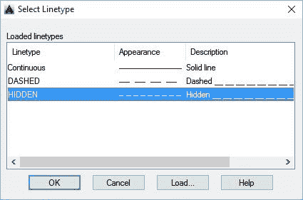

在 AutoCAD 中创建的每个对象都有一组属性。某些属性对所有对象都是通用的;其他是对象类型所独有的。例如，圆圈具有中心点坐标和半径，而线条具有起点和终点坐标（参见图 31）。

常用属性称为“常规属性”，如下所示：

#### 颜色

对象颜色是一个非常重要的属性，因为它很容易用于标识图形中的对象。 AutoCAD 调色板中有 255 种不同的颜色，但您也可以使用 True Color 或 Color Books。如果将图形设置为与颜色相关的打印样式，则 AutoCAD 调色板允许您在打印时控制对象的外观，这是 acad.dwt 模板的设置方式。本书仅涉及与颜色相关的绘图样式。

当您调用命令选择颜色时，AutoCAD 将显示“颜色”对话框，如图 30 所示。

AutoCAD 颜色索引（ACI）的前两个大调色板编号从 10 到 249.顶部调色板包含偶数，而下调色板包含奇数​​。

中间色调的调色板显示 1 到 9 的颜色，其中颜色 1 到 7 也称为红色，黄色，绿色，青色，蓝色，品红色和白色。根据绘图区域的背景颜色，白色可能显示为黑色。

最下面的调色板显示从 250 到 255 的灰色阴影。

按钮 **ByLayer** 和 **ByBlock** 设置对象颜色以继承与其关联的图层或块的颜色。选择图层颜色时，这些按钮不可用。

颜色文本框允许您输入颜色索引号或名称。

颜色样本（对话框左侧的两个方块）显示所选颜色和前一颜色，其中当前选定的颜色与先前选择的颜色重叠。

图 30：颜色对话框

**Layer** ：设置对象的图层。您将很快了解有关图层的更多信息。

**线型**：线条的外观，如连续，虚线，中心等。

**线型比例**：此乘数改变线型的密度。

**线宽**：控制对象在屏幕上显示的粗体。除非您指定，否则这不会影响它的打印方式。

**透明度**：设置图形中元素的可见性。模拟阴影等阴影区域非常有用。

**厚度**：定义对象的高度，如拉伸或墙壁。当图形位于顶视图中时，这不起作用。

图 31：显示线属性和圆属性的属性选项板

|  | 请注意，在图 31 中，一些常规属性设置为 ByLayer。这意味着该对象将继承在其设置的层中定义的属性。 |

可以从“主页”选项卡中的“属性”面板快速编辑对象属性（图 33）。您应该将对象设置为尽可能继承图层属性，以使图形在视觉上易于管理。

在“属性”选项卡中，您可以更改对象的颜色，线宽，线条样式和透明度。您还可以将所选对象的属性与其他对象进行匹配。最后，列表命令显示所有选定对象及其几何属性的列表。

下图显示了三个选定对象的详细信息：圆形，折线（列为 LWPOLYLINE）和一条线。

图 32：列表命令

 33：对象属性面板

图层是组织图形中对象的最重要方法。通过简单地隐藏您不需要查看的所有对象，图层使您的绘图更容易查看并且可以提高性能。

例如，想象每个图层都是一个透明的图纸，您可以在其中绘制一些墙壁。然后在绘制窗口的顶部添加另一个透明工作表，另一个用于注释的透明工作表，另一个用于尺寸，等等。您可以随时删除一张或多张纸，并在需要时将其放回原处。

如果尚未执行此操作，请打开 AutoCAD 并基于 **acad.dwt** 模板启动新绘图。

要创建图层，请单击图层面板中的**图层属性**工具（图 32）。这将打开“图层特性管理器”调板。

图 34：Ribbon Layer 面板

单击图 35 中所示的 **New Layer** 按钮。创建一个名为 **Layer1** 的新图层，可以重命名。键入 **Walls** 并按**确定**。

单击图层颜色以打开**选择颜色**对话框，然后单击第二个调色板中的**品红色**颜色。

图 35：属性管理器

重复上一步，使用颜色**红色**创建名为 **Walls Above** 以上的图层。单击 **Linetype** ，当前设置为 **Continuous** ，打开 **Select Linetype** 对话框（参见图 36）。单击**加载...** 以显示**加载或重新加载线型**对话框。滚动**可用线型**以选择 **DASHED** 和 **HIDDEN** 。使用 **Ctrl +单击**选择多个选项。单击**确定**以加载选定的线型并关闭对话框。将选中两个选定的线型，并在“选择线型”对话框中列出。选择 **HIDDEN** 并单击 **OK** 关闭对话框。

图 36：选择线型对话框

创建其他图层如下：

| 图层名称 | 颜色 | 线型 |
| 天花板 | 9 | 虚线 |
| 门 | 青色 | 连续 |
| 炉隐藏 | 红色 | 隐 |
| 家具 | 黄色 | 连续 |
| 墙壁 | 品红 | 连续 |
| 墙壁上面 | 红色 | 隐 |
| 视窗 | 绿色 | 连续 |

双击 **Wall** 图层使其成为当前图层。

|  | 提示：图层是组织绘图和实施绘图标准的最有效和最有效的方法。我建议您避免更改对象级属性，例如颜色和线型，因为随着绘图变大，您可能会失去对设计的控制。 |