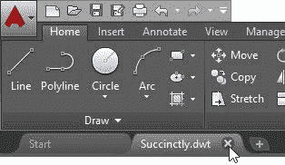

当您开始新绘图时，它是从绘图模板创建的，该绘图模板可以是默认绘图模板文件，例如您在第 1 章中用于创建绘图的文件，也可以是使用设置和数据创建的模板文件你的选择

将此信息另存为图形模板文件时，无需重新创建或重新配置任何设置即可开始创建图形。您可以在绘图模板中定义的一些设置是：

*   绘图单位
*   设置
*   图层和图层属性
*   线型
*   尺寸样式
*   文字样式
*   注释量表
*   布局
*   绘图和发布设置

要保存图形模板，请继续执行以下步骤：

1.  单击 AutoCAD 窗口左上角的**菜单浏览器**。
2.  将鼠标移到**另存为**菜单项并按住，直到面板**保存图纸**的副本扩展，或单击“另存为”菜单右侧的箭头。
3.  单击**绘图模板**，如图 37 所示。
4.  **将图形另存为**对话框将在所选的默认模板文件夹中打开。
5.  在**文件名**字段中输入 **ACAD Succinctly** 。
6.  单击**保存**。
7.  将打开一个对话框，以便您输入有关模板的可选附加信息。在描述框中，为 AutoCAD 简明书输入**基本模板，然后单击**确定**。**

图 37：保存图纸模板

现在可以通过单击图形选项卡中的 **X** 按钮关闭模板文件，如图 38 所示。

图 38：关闭图纸