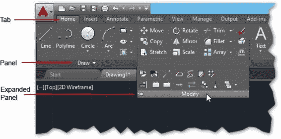
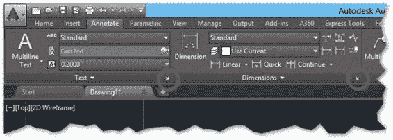
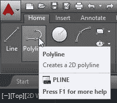
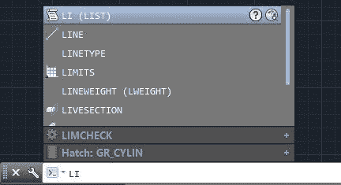
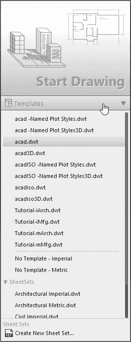
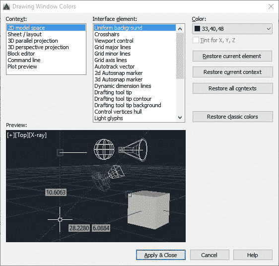

# 第 1 章：开箱

## 开始页面

启动 AutoCAD 后，它将显示启动窗口（图 1），您可以使用模板从中启动新图形，打开最后一个图形，获取通知或连接到 Autodesk A360（基于项目的个人协作服务，团队和组织），或发送有关产品的反馈。

图 1：AutoCAD 启动屏幕

## AutoCAD 界面

AutoCAD 标准界面由许多项组成。下图显示了启动 AutoCAD 并首次启动绘图后的标准 AutoCAD 界面。大多数界面组件在绘图区域周围浮动或停靠，AutoCAD 关闭后最新的界面布局将保持不变。

图 2：AutoCAD 界面

标准接口项如下：

1.  **菜单浏览器**：从“开始”菜单中，您可以找到文件管理，发布和实用程序的命令。
2.  **绘图标签**：显示所有打开的绘图，只需单击一下即可快速切换绘图。
3.  **快速访问工具栏**：包括有用的命令，如新建，打开，保存，打印，撤消等。
4.  **功能区**：AutoCAD 在绘图区域的顶部包含一个功能区，包括多个选项卡。您可以从“主页”选项卡访问本书中涵盖的几乎所有命令。
5.  **标题栏**：显示产品名称和活动绘图名称。
6.  **View Cube** ：广泛用于 3D 建模。
7.  **工具选项板**：AutoCAD 包含几个不同的工具选项板。图 2 中显示的浮动调色板是“Design Feed”。要关闭工具调色板，请单击位于调色板左上角的 **X** 图标（它也可以位于顶部 - 右上角，取决于它最后定位的位置。）如果您当前打开了一个工具调色板，您可以关闭它，因为我们暂时不会使用它。
8.  **绘图区**：大面积，默认为深灰色，是您的设计发生的地方。最初，绘图区域显示可以隐藏的网格，如您所愿。
9.  **十字光标**：创建并选择在整个设计过程中创建的实体。
10.  **用户坐标系（UCS）图标**：显示坐标系的 x 和 y 向量的当前方向。您输入的每个距离点都与之一致。
11.  **布局选项卡**：由模型空间和绘图空间布局组成。模型空间是您创建设计的地方，而纸空间是您的打印/绘图空间。虽然您可以创建许多 Paper Space 布局，但只能有一个 Model Space 布局。
12.  **命令窗口**：这是您与 AutoCAD 通信的位置，以及 AutoCAD 响应您的请求的位置。接下来，您将了解有关命令窗口的更多信息。
13.  **状态栏**：包含许多快速访问读数，切换和选择工具，可帮助您处理绘图。

### 键盘

熟悉 AutoCAD 命令后，您可以通过键入命令和命令别名而不是在功能区或工具栏上进行选择来完成更多工作。键盘也有几个快捷命令，可以帮助您处理绘图。

最常见的键盘用途是：

*   **输入**：执行或结束命令以确认输入。在空白命令窗口按 Enter 键将调用您运行的最后一个命令。
*   **空格键**：功能与 Enter 键相同，但在尝试完成命令时可能会有不同的结果，具体取决于您运行的命令。
*   **Escape（Esc）键**：完成或取消命令。
*   **F1 键**：打开“帮助”窗口
*   **F2 键**：如果命令窗口是浮动的，则显示扩展命令历史记录;否则会打开 AutoCAD 文本历史记录窗口。要在命令窗口浮动时显示 AutoCAD 文本历史记录窗口，请按 **Ctrl** + **F2** 。
*   **F3 键**：打开/关闭对象捕捉（osnap）
*   **F7 键**：切换网格
*   **F8 键**：切换正交（正交）模式
*   **F9 键**：切换捕捉到网格
*   **F10 键**：切换极坐标模式
*   **F11 键**：切换对象跟踪
*   **F12 键**：切换动态输入

### 快速访问工具栏

默认情况下，快速访问工具栏位于应用程序的左上角。它是完全可定制的，默认工具是：

 **新**：从绘图模板开始新绘图

 **打开**：打开现有绘图

 **保存**：保存当前图形

 **另存为**：使用新名称保存当前图形

 **绘图**：绘制（打印）当前图形

 **撤消**：撤消上一个命令。 AutoCAD 可以在创建图形之前撤消所有操作。关闭图形时，将删除撤消历史记录，并在重新打开图形时开始新的历史记录。

 **重做**：重做上次撤消的命令，但仅在使用撤消命令后立即执行。

### 功能区

默认情况下，功能区位于绘图区域的顶部。它由几个标签组成，由几个面板组成，如图 3 所示。色带也可以停靠在侧面，以便在绘图区域内或另一个显示器上浮动（未对接）。

具有指向下方的小三角形的面板是可展开面板，您可以通过单击面板标题来展开这些面板。

图 3：功能区

某些功能区面板允许访问与该面板相关的对话框。要显示该对话框，请单击位于面板右下角的小箭头图标（参见图 4）。

图 4：对话框启动器

将鼠标悬停在面板工具上时会显示工具提示，如果再按住它几秒钟，会弹出一个快速帮助窗口，其中包含有关相应命令的信息。

图 5：工具提示

图 6：快速帮助

#### 上下文功能区选项卡

上下文功能区选项卡是一种相关的功能区选项卡，当您选择某些对象或执行某些命令时，它会显示为工具栏或对话框的替换，并在您结束命令时自动关闭或取消选择该对象。

图 7：Hatches 的 Contextual Ribbon 选项卡

### 命令窗口

命令窗口是 AutoCAD 的核心，默认情况下，它位于图形底部的浮动位置。您可以通过单击窗口左侧的栏并拖动将其放置在您选择的任何位置（图 8）。当您靠近绘图区域的顶部或底部时，命令窗口将尝试停靠在该位置。这种特性对于工具调色板来说是类似的，工具调色板可以浮动或对接到侧面。

图 8：命令窗口

当您开始键入命令时，有多种选择可供选择，如图 9 所示。您可以通过单击它或使用键盘箭头选择正确的命令来选择您的选择，然后按 **Enter** 或**空格键**。

图 9：命令自动完成

### 鼠标

使用带有左右按钮和滚轮的鼠标是个好主意。一个好的鼠标可以在项目结束时为您节省大量时间。

以下列表描述了如何使用鼠标键：

*   **左按钮**：用于实体选择以及标记坐标点。
*   **右键**：打开与当前所选实体匹配的上下文菜单（如果有）。
*   **轮**：
*   *   卷起：放大
    *   下拉：缩小
    *   双击：缩放到图形的扩展名
    *   按住，然后拖动：平移绘图

图 10：鼠标

## 创建新绘图

有几种方法可以开始新的绘图。如果刚刚启动了 AutoCAD，则可以从“开始”页面开始新的绘图，如图 1 所示。单击**开始绘图**（图 2）开始新绘图。这将基于 AutoCAD 标准模板启动一个新的空白图形。

图 11：在起始页面开始绘图

另一种开始绘图的方法是单击快速访问工具栏中的 **New** ，如下图所示。

图 12：快速访问工具栏

单击 **New** 打开 New Drawing 对话框窗口（图 12），您可以从中选择要用于开始绘图的模板。

图 13：新绘图对话框

如果您使用英制绘图，假设您以英寸为单位工作，则应使用 **acad.dwt** （或 **acadlt.dwt** ，如果您使用的是 AutoCAD LT）。

对于公制单位，假设单位为毫米;您可以在 AutoCAD LT 中使用 **acadiso.dwt** （或 **acadltiso.dwt** ）。

|  | 注意：为简化和概括，本书中的所有绘图均基于 acad.dwt 模板。 |

您也可以通过从“开始”页面选择模板来启动新图形，如图 14 所示。

图 14：使用自定义模板创建新图形

在**模型空间**中创建的所有对象都应以全尺寸，实际单位（1：1 比例）创建。输入 10 个单位作为距离意味着它可以是 10 英寸，10 毫米或您指定的任何其他单位，例如米或英尺。重要的是要记住，一旦开始绘图，就无法混合单位。如果您假设 1 个单位= 1 毫米开始绘图，则不能输入 5 厘米。作为距离;相反，您必须输入 50.除非您使用建筑测量类型，否则不要输入实际单位;然后您可以输入 6'-6“等值，AutoCAD 会将其解释为 78 个绘图单位。

## 绘图单位

您可以通过运行 UNITS 命令选择要使用的长度单位。从**菜单浏览器**中选择**绘图实用程序**，然后选择**单位**选项。或者，在命令窗口中输入 UNITS 并按**输入**或**空格键**。将打开“绘图单位”对话框窗口，如图 15 所示：

图 15：绘图单位对话框

“绘图单位”对话框组件是：

*   **长度类型（或格式）**：确定显示长度的方式。例如，可以将小数点长度设置为 6.5，以显示为 6-1 / 2 的小数长度。
*   **Precision** ：确定长度的小数精度。例如，可以将小数点长度 6.5 设置为 6.50,6.500 或 6.5000。
*   **角度类型**：确定角度的单位。您可以选择度数分和秒（度/分/秒），Grads，Radians 或 Surveyor 的单位（例如 N 10d25'10“E）。十进制度是默认值。
*   **顺时针**：默认情况下，逆时针测量角度;如果您需要还原，请选中此框。
*   **插入比例单位**：自动将插入的材料与其他单位一起缩放到正确的单位。例如，如果您正在绘图中将单位设置为毫米并将绘图集插入英寸，则生成的插入对象将自动调整大小，比例因子为 25.4（1 英寸= 25.4 毫米）。
*   **样本输出**：显示单位和角度的当前设置示例。
*   **Lighting** ：在照片级真实感渲染中，它控制当前图形中光度学灯光强度的测量单位。

如果您计划以英尺和英寸为单位工作，请将**长度**类型设置为 **Architectural** ，然后在创建对象时，以英尺和英寸为单位指定长度（例如 3'5-3 / 4” ）。如果您打算使用公制单位，请将**长度**类型设置为**十进制**。更改单位格式和精度不会影响图形的内部精度。它仅影响用户界面中长度，角度和坐标的显示方式。

## 显示设置

图 16：显示选项卡处于活动状态的选项对话框

默认的 AutoCAD 显示设置是深色用户界面，模型空间中的深色绘图区域和白纸空间。 AutoCAD 可完全自定义，因此您可以根据自己的喜好更改颜色。

要更改显示设置，请通过单击菜单浏览器底部的**选项**按钮或在命令窗口中键入 **OP** 并按下来运行 OPTION 命令。 **输入**或**空格键**。

这将打开包含标准 AutoCAD 上几个选项卡的“选项”对话框窗口（参见图 16）。单击 **Display** 选项卡查看显示设置选项。我没有涵盖“选项”对话框和“显示”选项卡中的所有可用项目，因为它们不会影响本书的内容。此时，我们只是改变如何调整颜色和十字光标设置。

在**窗口元素**区域下，您可以找到具有两个选项的颜色方案：Dark 和 Light。这将更改用户界面的元素，例如功能区，调色板和菜单颜色。黑暗是 AutoCAD 默认设置，如果您更喜欢浅灰色界面，请在下拉列表中选择 **Light** 。

要更改绘图环境颜色，请单击位于**窗口元素**区域底部的**颜色...** 按钮，打开**绘图窗口颜色**菜单，如图所示图 17.要更改空间颜色，请在**上下文**列表中选择 **2D 模型空间**，**接口元素**列表中的**均匀背景**，并在**颜色**列表中选择您选择的颜色。您可以通过单击以下按钮安全地更改颜色并轻松重置它们：

*   **恢复当前元素**：重置**接口元素**列表中所选项目的默认颜色。
*   **恢复当前上下文**：恢复**上下文**列表中所选项目的默认颜色。这将重置**接口元素**列表中的所有项目。
*   **恢复所有上下文**：恢复所有**上下文**和**元素**的默认颜色。
*   **恢复经典颜色**：此按钮将所有颜色设置为传统 **AutoCAD** 颜色。

图 17：绘制 Windows 颜色

点击**应用&amp;关闭**应用更改并关闭对话框，或**取消**关闭对话框而不应用任何更改，然后返回选项对话框。

|  | 注意：将均匀背景颜色更改为白色会自动将白色对象的显示颜色更改为黑色，反之亦然。实际上，白色物体默认打印并用黑色绘图。十字光标自动调整其颜色。 |

**十字线大小**滑块可更改绘图区域中十字光标的大小。它从 1 到 100，其中 100 使十字准线轴覆盖绘图区域的 100% 。默认值为 5。

单击**确定**关闭对话框并应用更改，或单击**取消**关闭而不进行更改。