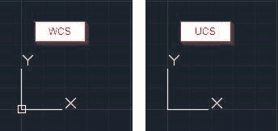
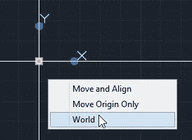
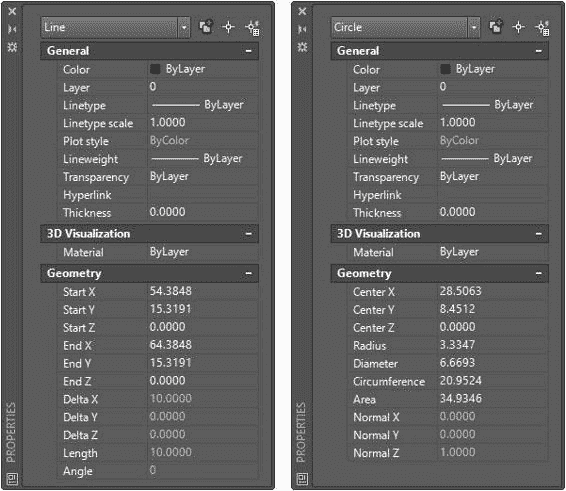
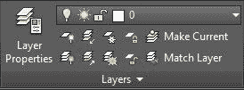
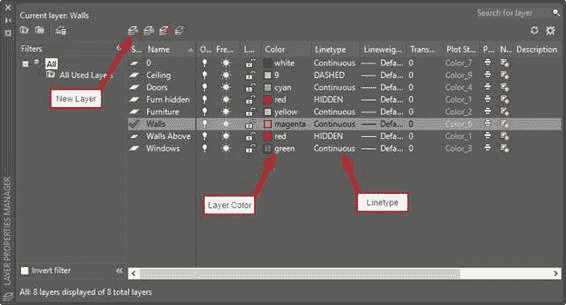

# 第 2 章：说到 AutoCAD

AutoCAD 几何图形由用于创建图形的图形实体组成，但在我们开始创建图形之前，首先需要了解如何在 AutoCAD 中输入坐标。

## AutoCAD 坐标系

所有 AutoCAD 产品都包含基于 x，y 和 z 坐标的三维（3D）坐标系。当您基于标准模板而不是 3D 模板（acad3D.dwt 和 acadiso3D.dwt）开始空白绘图时，您将从顶视图开始，并且您只能看到用户坐标系的 x 和 y 轴（ UCS）。

本书仅涉及创建和编辑二维（2D）几何，假设坐标系的 z 值为零。

|  | 注意：AutoCAD LT 可以打开在其他版本的 AutoCAD 上创建的 3D 模型，但它无法创建或编辑 3D 几何图形，也不允许进行高级自定义。 |

当您开始新绘图时，坐标系实际上是世界坐标系（WCS），只有在方向，x，y 或 z 轴或原点位置发生任何变化后才应调用 UCS。

WCS 在原点包含一个小方块，而 UCS 没有（见图 18）。

图 18：WCS 和 UCS

出于简化目的，我们将 AutoCAD 坐标系简称为 UCS。

如果选择其中一个轴末端，则可以通过单击它并将所需节点拖动到正确的位置或角度来更改 UCS 位置。

图 19：移动 UCS Origin

如果将鼠标悬停在称为夹点的蓝色方块上，则会弹出一个菜单，显示所指对象节点的可能编辑选项。图 20 显示了 UCS 原点的快捷菜单。单击 **World** 返回 UCS 到世界坐标系。

图 20：原点的 UCS 快捷菜单

## 图纸限制

绘图限制由绘图区域中的不可见矩形边界表示。除非您打开绘图限制，否则它不会定义允许绘制的区域。通常，绘图限制应该是纸张大小的扩展乘以标度。例如，如果您的图纸打算以 1:10 比例绘制，纸张尺寸为 420mm x 297mm，则绘图限制可以是（0,0）到（4200,2970）。这不是必需的，许多用户从不设置或更改绘图限制。

要设置绘图限制，请在命令窗口中输入 **LIMITS** ，然后按 **Enter** 。将显示以下选项：

*   **左下角**：单击或输入左下角的绘图限制。
*   **右上角**：单击或输入左上角的绘图限制。
*   **开**：打开限制以避免输入点或创建超出绘图限制的元素。
*   **熄灭**：关闭限制，但保存当前设置，但未强制执行。

## 坐标输入

现在，让我们了解您将如何告诉 AutoCAD 您希望在哪里找到您需要输入的点。在 AutoCAD 中有三种输入坐标的方法：

*   绝对
*   相对的
*   相对极地

要在创建几何对象时简化显示，请按 **F12** 关闭动态输入，或单击状态栏上的**动态输入**图标，如图 21 所示。灰色按钮在状态栏上指示变量设置为关闭。

图 21：动态输入切换

|  | 提示：如果仅使用 2D 对象，则在输入坐标时可能会省略 z 坐标值，并且它将设置为当前高程设置（默认为 0）。 |

### 绝对坐标：（x，y）

绝对坐标是从当前 UCS 的原点开始测量的。如果在坐标（50,25）处创建点，则该点将位于 UCS 原点的右侧（x 方向）50 个单位，UCS 原点位于（y 方向）25 个单位。您可以为坐标和负值输入任何数值;您可以找到原点左侧或下方的点。

### 相对坐标：@ x，y

相对坐标是从您输入的最后一个点开始测量的。 @符号表示“最后一点”或“从最后一点开始”。

### 相对极坐标：@距离＆lt;角度

在相对极坐标上，输入距离（或长度）和下一个点的方向（角度），从输入的最后一个点开始。请记住，默认情况下，角度是以度为单位逆时针测量的。您输入的负角度将顺时针旋转。

### 其他输入法

您也可以通过单击绘图区域中的位置快速输入点。您还可以通过将十字光标放置在您愿意创建线段的方向并输入距离值来创建线段。这与 ORTHO 和 POLAR TRACKING 结合使用非常有用，它可以帮助您限制角度方向。

为了说明使用 ORTHO，首先我们需要确保正确地限制光标。

为此，请按 **F8** 键，或单击状态栏上的按钮，如下图所示（记住蓝色亮起，灰色亮起）。

图 22：切换 ORTHO

现在只需按以下步骤操作：

1.  键入 **L** 并按**输入**或**空格键**以启动 LINE 命令。
2.  单击屏幕上的一个点。
3.  将鼠标移动到绘图区域上方，确保您有一条垂直线。键入 **10** 并按**输入**或**空格键**。
4.  将鼠标向右移动，确保您有一条水平线。键入 **10** 并按**输入**或**空格键**。
5.  将鼠标移到下方，确保您有垂直线。键入 **10** 并按**输入**或**空格键**。
6.  键入 **C** 并按**输入**或**空格键**关闭矩形并结束命令。

与限制 UCS 的 x 和 y 方向的正交限制类似，您可以使用 Polar Tracking。要打开 Polar Tracking，请按 **F10** 键或单击 **Polar Tracking** 切换按钮，如图 23 所示（记住蓝色亮起，灰色亮起）。

图 23：极坐标跟踪切换

使用 Polar Tracking，您可以选择其他角度增量进行限制，甚至可以添加自定义角度。只需单击按钮旁边的小向下箭头即可显示默认增量跟踪角度列表，如图 24 所示，并进行选择。

图 24：极坐标跟踪设置

当您开始创建具有 Polar Tracking 的线条时，带有距离和角度的框以及绿色虚线显示您选择的增量的方向。您现在可以像使用正交限制一样输入距离。

图 25：极地跟踪在行动中

## 图纸导航

随着绘图的增长，您需要导航绘图以放大绘图区域或平移到其他位置。除了第 1 章中讨论的鼠标导航功能外，AutoCAD 默认在绘图区域的右上方显示导航栏，您可以在其中找到几乎所有的绘图导航工具（参见图 26）。

图 26：导航栏

### 缩放命令

鼠标滚轮仅限于放大和缩小图形，而缩放命令则提供更高级的方法。您可以通过键入 **ZOOM，**或简单地 **Z，**并按 **Enter** 从命令窗口执行 Zoom 命令，如图所示 27，或者从导航栏，如图 28 所示。

图 27：缩放命令提示符

图 28：导航栏中的缩放命令

*   **全部缩放**：缩放到绘图或绘图限制的扩展名，以较大者为准。
*   **变焦中心**：通过将选定的点设置到屏幕中央并以放大倍率放大。放大倍数越大，图形在屏幕上显示的越小。

图 29：变焦中心前后

*   **Zoom Dynamic** ：使用矩形视图框缩放和平移绘图，该视图框可以缩小或放大并在绘图上移动。
*   *   要更改视图框的大小，请单击，移动鼠标以调整其大小，然后再单击一次以设置视图框的新大小。
    *   要使用视图框平移，将其悬停在所需区域上，然后按**确定**。
*   **Zoom Extents** ：缩放到图形中所有对象的扩展名，与限制无关。
*   **缩放上一个**：将之前的视图恢复为最多 10 个以前的视图。
*   **缩放比例**：通过比例因子更改缩放倍率。比例因子是一个正的非零数字，其中 **1** 是当前的放大级别，后跟 **X** ，相对于当前视图缩放，或 **XP** ，相对于纸空间单位进行缩放。例如，输入 **.5x** 会使对象看起来相对于屏幕当前大小的一半大小。
*   **缩放窗口**：缩放到指定的矩形区域。这是从命令窗口运行时的默认方法。单击任意两个角以定义新的显示窗口。
*   **缩放对象**：缩放到一个或多个所选对象以填充屏幕。
*   **Zoom Real Time** ：与鼠标滚轮按钮类似，但使用鼠标左键。左键单击并向上拖动可提高缩放级别，而向下拖动则会减小。按**输入**或 **Esc** 退出命令。

## 绘图机构

### 属性

在 AutoCAD 中创建的每个对象都有一组属性。某些属性对所有对象都是通用的;其他是对象类型所独有的。例如，圆圈具有中心点坐标和半径，而线条具有起点和终点坐标（参见图 31）。

常用属性称为“常规属性”，如下所示：

#### 颜色

对象颜色是一个非常重要的属性，因为它很容易用于标识图形中的对象。 AutoCAD 调色板中有 255 种不同的颜色，但您也可以使用 True Color 或 Color Books。如果将图形设置为与颜色相关的打印样式，则 AutoCAD 调色板允许您在打印时控制对象的外观，这是 acad.dwt 模板的设置方式。本书仅涉及与颜色相关的绘图样式。

当您调用命令选择颜色时，AutoCAD 将显示“颜色”对话框，如图 30 所示。

AutoCAD 颜色索引（ACI）的前两个大调色板编号从 10 到 249.顶部调色板包含偶数，而下调色板包含奇数​​。

中间色调的调色板显示 1 到 9 的颜色，其中颜色 1 到 7 也称为红色，黄色，绿色，青色，蓝色，品红色和白色。根据绘图区域的背景颜色，白色可能显示为黑色。

最下面的调色板显示从 250 到 255 的灰色阴影。

按钮 **ByLayer** 和 **ByBlock** 设置对象颜色以继承与其关联的图层或块的颜色。选择图层颜色时，这些按钮不可用。

颜色文本框允许您输入颜色索引号或名称。

颜色样本（对话框左侧的两个方块）显示所选颜色和前一颜色，其中当前选定的颜色与先前选择的颜色重叠。

图 30：颜色对话框

**Layer** ：设置对象的图层。您将很快了解有关图层的更多信息。

**线型**：线条的外观，如连续，虚线，中心等。

**线型比例**：此乘数改变线型的密度。

**线宽**：控制对象在屏幕上显示的粗体。除非您指定，否则这不会影响它的打印方式。

**透明度**：设置图形中元素的可见性。模拟阴影等阴影区域非常有用。

**厚度**：定义对象的高度，如拉伸或墙壁。当图形位于顶视图中时，这不起作用。

图 31：显示线属性和圆属性的属性选项板

|  | 请注意，在图 31 中，一些常规属性设置为 ByLayer。这意味着该对象将继承在其设置的层中定义的属性。 |

可以从“主页”选项卡中的“属性”面板快速编辑对象属性（图 33）。您应该将对象设置为尽可能继承图层属性，以使图形在视觉上易于管理。

在“属性”选项卡中，您可以更改对象的颜色，线宽，线条样式和透明度。您还可以将所选对象的属性与其他对象进行匹配。最后，列表命令显示所有选定对象及其几何属性的列表。

下图显示了三个选定对象的详细信息：圆形，折线（列为 LWPOLYLINE）和一条线。

图 32：列表命令

图 33：对象属性面板

### 图层

图层是组织图形中对象的最重要方法。通过简单地隐藏您不需要查看的所有对象，图层使您的绘图更容易查看并且可以提高性能。

例如，想象每个图层都是一个透明的图纸，您可以在其中绘制一些墙壁。然后在绘制窗口的顶部添加另一个透明工作表，另一个用于注释的透明工作表，另一个用于尺寸，等等。您可以随时删除一张或多张纸，并在需要时将其放回原处。

#### 创建图层

如果尚未执行此操作，请打开 AutoCAD 并基于 **acad.dwt** 模板启动新绘图。

要创建图层，请单击图层面板中的**图层属性**工具（图 32）。这将打开“图层特性管理器”调板。

图 34：Ribbon Layer 面板

单击图 35 中所示的 **New Layer** 按钮。创建一个名为 **Layer1** 的新图层，可以重命名。键入 **Walls** 并按**确定**。

单击图层颜色以打开**选择颜色**对话框，然后单击第二个调色板中的**品红色**颜色。

图 35：属性管理器

重复上一步，使用颜色**红色**创建名为 **Walls Above** 以上的图层。单击 **Linetype** ，当前设置为 **Continuous** ，打开 **Select Linetype** 对话框（参见图 36）。单击**加载...** 以显示**加载或重新加载线型**对话框。滚动**可用线型**以选择 **DASHED** 和 **HIDDEN** 。使用 **Ctrl +单击**选择多个选项。单击**确定**以加载选定的线型并关闭对话框。将选中两个选定的线型，并在“选择线型”对话框中列出。选择 **HIDDEN** 并单击 **OK** 关闭对话框。

图 36：选择线型对话框

创建其他图层如下：

| 图层名称 | 颜色 | 线型 |
| 天花板 | 9 | 虚线 |
| 门 | 青色 | 连续 |
| 炉隐藏 | 红色 | 隐 |
| 家具 | 黄色 | 连续 |
| 墙壁 | 品红 | 连续 |
| 墙壁上面 | 红色 | 隐 |
| 视窗 | 绿色 | 连续 |

双击 **Wall** 图层使其成为当前图层。

|  | 提示：图层是组织绘图和实施绘图标准的最有效和最有效的方法。我建议您避免更改对象级属性，例如颜色和线型，因为随着绘图变大，您可能会失去对设计的控制。 |

## 图纸模板

当您开始新绘图时，它是从绘图模板创建的，该绘图模板可以是默认绘图模板文件，例如您在第 1 章中用于创建绘图的文件，也可以是使用设置和数据创建的模板文件你的选择

将此信息另存为图形模板文件时，无需重新创建或重新配置任何设置即可开始创建图形。您可以在绘图模板中定义的一些设置是：

*   绘图单位
*   设置
*   图层和图层属性
*   线型
*   尺寸样式
*   文字样式
*   注释量表
*   布局
*   绘图和发布设置

### 创建模板文件

要保存图形模板，请继续执行以下步骤：

1.  单击 AutoCAD 窗口左上角的**菜单浏览器**。
2.  将鼠标移到**另存为**菜单项并按住，直到面板**保存图纸**的副本扩展，或单击“另存为”菜单右侧的箭头。
3.  单击**绘图模板**，如图 37 所示。
4.  **将图形另存为**对话框将在所选的默认模板文件夹中打开。
5.  在**文件名**字段中输入 **ACAD Succinctly** 。
6.  单击**保存**。
7.  将打开一个对话框，以便您输入有关模板的可选附加信息。在描述框中，为 AutoCAD 简明书输入**基本模板，然后单击**确定**。**

图 37：保存图纸模板

现在可以通过单击图形选项卡中的 **X** 按钮关闭模板文件，如图 38 所示。

图 38：关闭图纸