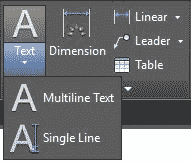

在开始添加注释之前，设置至少两种文本样式很重要。文本样式是一个库，其中 AutoCAD 存储文本格式（如文本高度和字体信息），以满足您可能需要的许多注释目的。理想情况下，您应该在模板文件中创建文本样式。

要创建文本样式：

1.  开始新的绘图。
2.  在 Home 选项卡中，展开 Annotation Panel 并单击 **Text Style** 工具（参见图 105）以打开 Text Style 对话框。
3.  样式列表中当前有一种样式（标准。）我们将创建一些其他样式。
4.  单击 **New ...** 按钮添加新样式，为名称输入 Normal，然后单击 OK 添加样式。
5.  在“字体”区域中，选择：
6.  字体名称： **Arial**
7.  字体样式：**常规**
8.  在大小区域：
9.  确保选中了 **Annotative** （样式名称旁边会出现一个符号，表示该样式是注释性的）。
10.  高度： **0.1** （这是以 1：1 比例绘制时的字体大小）。
11.  在效果区域中：
12.  1.  确保未选中**颠倒**。
    2.  确保未选中 **Backwards** 。
    3.  设置**宽度系数** = **1** 和**倾斜角度** = **0** 。
    4.  单击**应用**。
13.  单击 **New ...** 并为**样式名称**输入 **DimTxt** ，然后单击 **OK** 。
14.  在“字体”区域中，选择：
15.  字体名称： **Arial**
16.  字体样式：**常规**
17.  在大小区域：
18.  确保未选中**注释**。
19.  高度： **0** （当高度设置为零时，高度在创建文本时定义）。
20.  在效果区域中：
21.  确保未选中**颠倒**。
22.  确保未选中 **Backwards** 。
23.  设置**宽度系数** = **0.8** 和**倾斜角度** = **0** 。
24.  单击**应用**。
25.  创建其他文本样式，如下所示：

| 名称 | 字体名称 | 字体样式 | 注释 | 高度 | 宽度系数 | 斜角 |
| 调整 | 宋体 | 斜体 | 是 | 0.1 | 1 | 0 |
| 标题 1 | 英语字体格式一种 | 胆大 | 没有 | 0.25 | 1 | 0 |
| 标题 2 | 英语字体格式一种 | 加粗斜体 | 没有 | 0.16 | 1 | 0 |
| TITLE3 | 英语字体格式一种 | 斜体 | 没有 | 0.125 | 1 | 0 |

在**样式**列表中，选择 **Normal** 并单击 **Set Current** 使 **Normal** 成为当前文本样式。单击**关闭**关闭对话框。

现在您已经定义了一些文本样式，您就可以开始为绘图添加注释了。两种最常见的文本类型是单行文本和多行文本。

图 106：文本工具

创建不需要高级格式的基本文本（如标签）时，请使用单行文本。

每按一次 **Enter** 键，单行文本就会创建一个新的文本行。每行文本都是一个独立的对象，您可以根据需要进行编辑，而不会影响其他行。

命令：DTEXT

别名：DT

使用多行文本创建段落文本对象。所有行和段落都是可以使用 AutoCAD 文本编辑器编辑的单个对象的一部分。

命令：MTEXT

别名：T 或 MT

创建多行文本时，文本编辑器上下文选项卡将显示在功能区中，您可以从中将文本格式设置为与 Microsoft Word 或其他桌面文本编辑器中的方式类似。

图 107：文本编辑器上下文选项卡

如果您爆炸多行文本，它将转换为单行文本，其中每行文本都是一个独立的对象，并且所有格式都被取消。

图 108：文本对齐基点

| **TL** =左上角
**ML** =中左
**L** =左
**BL** =左下 | **TC** =顶部中心
**MC** =中间中心
**M** =中
**C** =中心
**BC** =底部中心 | **TR** =右上角
**MR** =中右
**R** =右
**BR** =右下角 |

1.  在“主页”选项卡中，展开**注释**面板，确保活动的文本样式有注释性（注释性文本样式显示小的蓝色三角形）。在本练习中，选择 **Normal** 文本样式。
2.  在状态栏中，选择适当的注释比例（稍后可以向对象添加其他注释比例）。本练习选择 **1/8“= 1'-0”**。

创建注释性单行文本：

1.  继续上一个绘图，创建一个名为 **A-Anno-Note** ，颜色 231，连续线型，可绘制的新图层（请参阅第 2 章中的“创建图层”主题以查看如何创建图层）。将 **A-Anno-Note** 设置为当前图层。
2.  进行缩放，使建筑物适合绘图区域。
3.  从 **Home** 选项卡， **Annotation** 面板，展开 **Text** 并选择**单行文本**。
4.  按 **F3** 关闭对象捕捉。命令窗口显示一条消息，通知您 **Osnap** 状态。如果它读取＆lt; Osnap on＆gt;。再次按 **F3** 将其关闭。
5.  点击建筑物中心大房间区域的中心附近。
6.  输入 0 并按**输入**作为文本的旋转角度。
7.  输入 **Great Room** ，按**输入**， **FFL + 7'-0“**，然后按**确认**。
8.  按**确定**完成命令。
9.  选择文字。请注意，它们是两个独立的对象。

创建注释性多行文字：

单行文本没有宽度限制，直到您按 **Enter** 创建新的文本行为止。

对于多行文本，您可以指定宽度限制，并且当行达到指定宽度时，该行会自动断开。

1.  从 **Home** 选项卡， **Annotation** 面板，展开 **Text** 并选择 **Multiline Text** 。
2.  指定第一个拐角：单击车库区域中心附近
3.  指定对角：单击一个点，使文本框接近 125 个单位宽。
4.  键入 **Garage** 并按**输入**，然后输入 **FFL + 6'-6“。** 不要按**确定**;相反，单击文本框外部以完成命令。
5.  选择多行文字;文本是一个有两行的单个对象。

将现有文本导入多行文本

1.  双击鼠标的中间按钮以缩放扩展。
2.  从 **Home** 选项卡， **Annotation** 面板，展开 **Text** 并选择 **Multiline Text** 。
3.  单击站点左侧的空白区域。
4.  在命令窗口中，输入 **W** 并按**输入**指定文本框宽度。
5.  输入 **550** 并按**输入**作为宽度。
6.  从**文本编辑器**上下文选项卡中，展开**工具**面板，然后选择**导入文本**。
7.  浏览到本书练习的**第 06 章**文件夹，然后选择 **MText.txt** 文件。
8.  单击**打开**。
9.  文本已导入文本框。
10.  单击文本框外部以完成命令。

创建非注释性文本的步骤与创建注释性文本相同，但您需要确保选择未设置为注释性的文本样式，并且可能需要在屏幕上指定文本高度。

**编辑文本**

命令：TEXTEDIT

别名：ED

要编辑文本，只需双击文本对象或选择要编辑的注释对象，在命令窗口中键入 **ED** ，然后按 **Enter** 或**空格键**。

|  | 注意：如果在未选择注释对象的情况下执行 TEXTEDIT，AutoCAD 将提示选择要编辑的注释对象。 |

有时，如果文本与其他对象重叠，则难以阅读。可以轻松屏蔽多行文本，以便隐藏背景元素并使文本可读。

为了说明这一点，将车库中添加的多行文本复制到右侧的车道区域。双击以编辑文本，并将 **Garage** 替换为**车道**。单击文本区域外部以进行提交。

该文本很难通过填充图案阅读。请按照以下步骤进行掩码：

1.  选择多行文字。
2.  右键单击并从上下文菜单中选择**属性**以打开“特性”选项板。
3.  在**属性**选项板的**文本组**下，找到背景蒙版。
4.  单击 **No** 文本，然后单击该字段右侧的小图标，如图 109 所示。
5.  在**背景蒙版**对话框中，选择**使用背景蒙版**和**使用绘图背景颜色**。
6.  在**边框偏移系数**文本框中输入 **1.25** 。这是相对于文本大小的文本到蒙版边界的间隙距离。
7.  单击**确定**应用设置并关闭对话框。
8.  在命令窗口中，键入 **REGEN** 并按**输入**重新生成图形。
9.  使用 Grip 模式调整文本框宽度。
10.  保存并关闭绘图。

 109：Mtext 背景蒙版