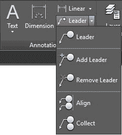

Multileader 是一个注释对象，用于创建带有引线的文本。

图 113：多重引线

要从“主页”选项卡创建或编辑多重引线样式，请展开**注释**面板，然后单击**多重引线样式**图标（参见图 103）以打开“尺寸样式管理器”对话框。

样式列表（左侧的框）显示当前图形中可用的所有多重引线样式。在列表中选择尺寸样式时，预览将显示在预览框中。

要创建新的多重引线样式，请单击对话框右侧的 **New ...** 按钮，打开 **Create New Multileader Style** 对话框：

**新样式名称**：输入新样式的名称。

**以**开始：允许您选择要用作模板的样式。

**Annotative** ：允许您定义新的维度样式是否具有注释性。

在 **Column Base Notes** 图纸中，创建一个多重引线样式，如下所示：

1.  新样式名称： **MyMultileader**
2.  开头：**标准**
3.  注释：**是**（已选中）
4.  用于：**所有尺寸**

6.  单击**继续**。

多重引线样式编辑器已加载，它包含三个选项卡：

*   **Leader Format** ：用于控制引导线和箭头外观的设置。
*   **领导者结构**：处理领导者格式的设置。
*   **内容**：用于控制多重引线内容的设置。您可以选择 Mtext，Block 或 none（仅限 leader）。

继续我们新的 Multileader Style 配置：

1.  在 Leader Format 选项卡中：
2.  一般：
3.  1.  类型：**直**
    2.  颜色，线型和线宽： **ByBlock**
4.  箭头：
5.  1.  符号：**已填充**
    2.  尺寸： **0.1** （由于绘图单位设置，该值将自动转换为英寸）
6.  在 Leader Structure 选项卡中：
7.  约束
8.  1.  最高领导点：已选中， **2** （这会将领导线限制为两个点）
    2.  第一和第二段角度：未选中
9.  着陆设置：
10.  1.  自动包含着陆：已检查
    2.  设置着陆距离：已检查
    3.  着陆距离： **0.25** （您可以在创建领导者后使用夹点调整着陆距离）
11.  规模：
12.  1.  注释：检查
13.  在“内容”选项卡中：
14.  多重引线类型： **Mtext**
15.  文字选项：
16.  1.  文字样式：**正常**
    2.  文字角度：**保持水平**
    3.  文字颜色：**蓝色**
    4.  总是左对齐：检查
    5.  框架文字：未选中
17.  领导者联系：
18.  1.  水平附件：已检查
    2.  左附件：顶线中间
    3.  正确的依恋：顶线中间
    4.  着陆间隙： **0.5** （此值也会影响文本框架偏移）
19.  单击**确定**保存更改并关闭对话框。
20.  选择 **MyMultileader** 样式，然后单击 **Set Current** 。
21.  单击**关闭**。

您可以从“主页”选项卡中的“注释”面板或“注释”选项卡中的“引线”面板中使用引线。

图 114：注释面板中的多重引线工具

1.  如果未打开，请打开 **Column Base Notes** 图纸。
2.  单击“注释”面板中的 **Leader** 工具。
3.  右键单击鼠标，然后从**对象捕捉覆盖**菜单中选择**几何中心**。
4.  将十字准线移动到柱底周边附近。确保它正在卡入柱底的中心并单击。
5.  将光标移动到图形右侧，然后单击以放置多重引线。
6.  类型：**铸石饰面** **8 颜色待定**
7.  按 **Ctrl + Enter** 或单击文本框外的任何位置。
8.  选择**添加引线**工具。
9.  选择多重引线对象。
10.  在现有领导者的上方和下方再添加两名领导者。
11.  按**输入**，**空格键**或 **Esc** 完成命令。
12.  单击 **Annotation** 面板中的 **Leader** 工具。
13.  单击列底部最右侧垂直线的中点附近。
14.  将鼠标向右移动，然后单击以放置引线。
15.  类型：**其他结构**
16.  按 **Ctrl + Enter** 完成。
17.  保存你的绘图。