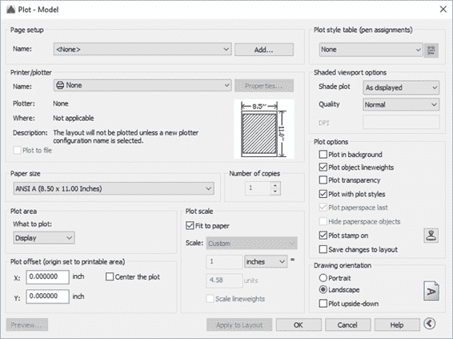
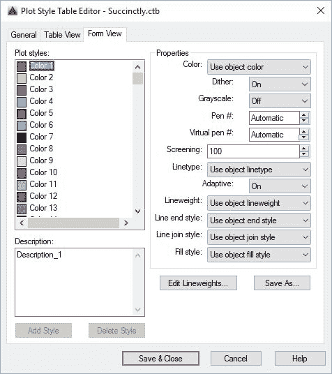

模型空间和纸空间中的绘图过程是相同的。单击位于**快速访问**栏中的 **Plot** 工具，或按 **Ctrl + P** 显示 Plot 对话框：

 115：绘图对话框

您可以使用操作系统中配置的打印机或 AutoCAD 打印机配置（PC3）文件进行绘图。

在**打印机/绘图仪**列表中，您可以通过以下方式区分系统打印机和 PC3 文件：

表示系统打印机

表示 PC3 打印机

PC3 文件允许您自定义配置绘图仪或打印机并保存设置（到 pc3 文件）以便以后使用，即使在其他图纸中也是如此。根据您的需要，相同的绘图仪或打印机可以有许多不同的配置。例如，您可以创建一个 PC3 文件，其唯一目的是绘制矢量图形，另一个用于绘制图形图像。

要绘制从纸空间绘图，请按照下列步骤操作：

1.  在打印机/绘图仪区域中，选择 ** DWG 到 PDF.pc3。**
2.  在纸张尺寸中，选择 **ANSI B（17.00 X 11.00 英寸）**
3.  在 Plot 区域中，选择 **Extents**
4.  在 Plot offset 区域中，选中**中心图**
5.  在 Plot 规模中：
6.  取消选中**适合纸张**
7.  在比例列表中选择 **6“= 1'-0”**。请注意，这与注释比例的比例相同。

|  | 注意：不需要匹配绘图比例和注释比例，但如果它们不相同，则生成的绘制注释可能比您计划的更小或更大。 |

在“缩放”列表下方的两个字段中，您可以输入自定义比例。对于所选的比例（6“= 1'-0”），它显示 6 英寸= 12 个单位（12“等于 1'-0”）。将 **1** 和 **2** 输入相应的字段将产生相同的比例，但表示为自定义。

在内部，AutoCAD 是无单元的;绘图比例表示 6 英寸（纸张单位）等于 12 个绘图单位，这意味着在纸质文档中测量的每六英寸相当于现实世界中的 12 英寸。

1.  如果“绘图”对话框未显示所有选项，请单击对话框右下角的**“更多选项**按钮。
2.  在绘图样式表（笔分配）区域中，选择 **monochrome.ctb** 。
3.  有关将此打印样式指定给所有布局的问题，请选择**否**。
4.  在绘图选项中：
5.  1.  在背景中绘制：未选中
    2.  绘制对象线宽：选中
    3.  绘图透明度：未选中
    4.  绘图样式：已检查
    5.  图章：未选中
    6.  保存对布局的更改：未选中
    7.  绘图方向：**横向**
6.  单击**应用于布局**以允许在任何模型空间图上重复使用此设置。
7.  单击**确定**进行绘图。
8.  浏览到要保存 PDF 的位置。默认情况下，AutoCAD 将 PDF 命名为后缀为布局名称的图形名称。输入 **Column Base-Model_1.pdf** 作为文件名。
9.  单击**保存**。
10.  假设您的计算机中有 PDF 阅读器，绘图的 PDF 将在绘图完成后打开。

|  | 提示：在绘制 PDF 时，AutoCAD 会保存图层信息。您可以在 PDF 阅读器中关闭图层。 |

情节出来没问题，但由于 monochrome.ctb 文件中的设置，所有线条虽然是黑色，但线条相同。为了纠正这个问题，我们将创建一个新的 Plot Style Table。

绘图样式表是颜色映射配置，您可以在其中定义每个 AutoCAD 颜色索引的绘制方式。您可以根据需要设置任意数量的打印样式，用于许多不同的用途和设置。我们将创建一个情节风格，以更好地满足我们的需求：

1.  单击绘图或按 **Ctrl + P** 显示“绘图”对话框。
2.  确保绘图参数与上一个绘图相同。如果不是，请选择**＆lt; Previous plot＆gt; **页面设置名称**中的**。
3.  在 Plot 样式（笔分配）列表中，选择 **New** 。
4.  在添加颜色相关的绘图样式表中选择**从头开始**，然后单击**下一步**。
5.  在**文件 nam** e 字段中输入**简洁**，然后单击**下一步**。
6.  选中**将此打印样式表用于当前图形**并取消选中**将此打印样式用于新建和 AutoCAD 之前的图形。**
7.  **Click Plot Style Table Editor**.

    

    图 116：绘图样式表编辑器

8.  如果未激活，请激活**表格视图**选项卡。
9.  在 **Plot 样式**列表中，选择 **Color 1** ，按住 **Shift** ，然后选择 **Color 9** 选择范围。
10.  在**属性**面板中，在颜色列表中选择**黑色**。
11.  在 **Plot 样式**列表中，选择 **Color 1** 。
12.  在**属性**面板中，在**线宽**列表中选择 **0.1000 mm** 。
13.  继续使用剩余的颜色：
14.  1.  颜色 2： **0.2000 mm**
    2.  颜色 3： **0.3000 mm**
    3.  颜色 4： **0.4000 mm**
    4.  颜色 5： **0.5000 mm**
    5.  颜色 6： **0.8000 mm**
    6.  颜色 7： **1.000 mm**
15.  选择颜色 8：
16.  1.  筛选： **70** （70％灰色）
    2.  线宽： **0.1500 mm**
17.  选择颜色 9：
18.  1.  筛选： **50**
    2.  线宽： **0.1500 mm**
19.  点击 **Save＆amp;关闭**。
20.  单击**完成**。
21.  单击**应用于布局**，然后单击**确定**进行绘图。
22.  将文件另存为 **Column Base-Model_2.pdf** 。
23.  该图现在具有不同的线宽。
24.  保存你的绘图。

绘图样式保存为单独的文件，可在创建后用于任何绘图。