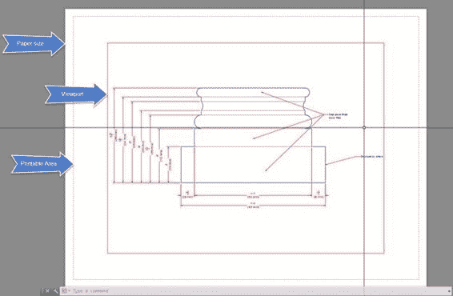

# 第 7 章：发布绘图

在本章中，您将学习如何准备绘图以供客户审阅或制作。

到目前为止，您创建的所有内容都是在模型空间中完成的。在考虑绘图和打印时，您应该在 Paper Space 中工作。虽然您可以从模型空间打印绘图，但纸张空间布局是创建打印纸张的正确空间。

## 绘图

模型空间和纸空间中的绘图过程是相同的。单击位于**快速访问**栏中的 **Plot** 工具，或按 **Ctrl + P** 显示 Plot 对话框：

图 115：绘图对话框

您可以使用操作系统中配置的打印机或 AutoCAD 打印机配置（PC3）文件进行绘图。

在**打印机/绘图仪**列表中，您可以通过以下方式区分系统打印机和 PC3 文件：

表示系统打印机

表示 PC3 打印机

PC3 文件允许您自定义配置绘图仪或打印机并保存设置（到 pc3 文件）以便以后使用，即使在其他绘图中也是如此。根据您的需要，相同的绘图仪或打印机可以有许多不同的配置。例如，您可以创建一个 PC3 文件，其唯一目的是绘制矢量图形，另一个用于绘制图形图像。

要绘制从纸空间绘图，请按照下列步骤操作：

1.  在打印机/绘图仪区域中，选择 ** DWG 到 PDF.pc3。**
2.  在纸张尺寸中，选择 **ANSI B（17.00 X 11.00 英寸）**
3.  在 Plot 区域中，选择 **Extents**
4.  在 Plot offset 区域中，选中**中心图**
5.  在 Plot 规模中：
6.  取消选中**适合纸张**
7.  在比例列表中选择 **6“= 1'-0”**。请注意，这与注释比例的比例相同。

|  | 注意：不需要匹配绘图比例和注释比例，但如果它们不相同，则生成的绘制注释可能比您计划的更小或更大。 |

在“缩放”列表下方的两个字段中，您可以输入自定义比例。对于所选的比例（6“= 1'-0”），它显示 6 英寸= 12 个单位（12“等于 1'-0”）。将 **1** 和 **2** 输入相应的字段将产生相同的比例，但表示为自定义。

在内部，AutoCAD 是无单元的;绘图比例表示 6 英寸（纸张单位）等于 12 个绘图单位，这意味着在纸质文档中测量的每六英寸相当于现实世界中的 12 英寸。

1.  如果“绘图”对话框未显示所有选项，请单击对话框右下角的**“更多选项**按钮。
2.  在绘图样式表（笔分配）区域中，选择 **monochrome.ctb** 。
3.  有关将此打印样式指定给所有布局的问题，请选择**否**。
4.  在绘图选项中：
5.  1.  在背景中绘制：未选中
    2.  绘制对象线宽：选中
    3.  绘图透明度：未选中
    4.  绘图样式：已检查
    5.  图章：未选中
    6.  保存对布局的更改：未选中
    7.  绘图方向：**横向**
6.  单击**应用于布局**以允许在任何模型空间图上重复使用此设置。
7.  单击**确定**进行绘图。
8.  浏览到要保存 PDF 的位置。默认情况下，AutoCAD 将 PDF 命名为后缀为布局名称的图形名称。输入 **Column Base-Model_1.pdf** 作为文件名。
9.  单击**保存**。
10.  假设您的计算机中有 PDF 阅读器，绘图的 PDF 将在绘图完成后打开。

|  | 提示：在绘制 PDF 时，AutoCAD 会保存图层信息。您可以在 PDF 阅读器中关闭图层。 |

绘图出来没问题，但由于 monochrome.ctb 文件中的设置，所有线条虽然是黑色，但线条相同。为了纠正这个问题，我们将创建一个新的 Plot Style Table。

### 绘图样式

绘图样式表是颜色映射配置，您可以在其中定义每个 AutoCAD 颜色索引的绘制方式。您可以根据需要设置任意数量的打印样式，用于许多不同的用途和设置。我们将创建一个绘图风格，以更好地满足我们的需求：

1.  单击绘图或按 **Ctrl + P** 显示“绘图”对话框。
2.  确保绘图参数与上一个绘图相同。如果不是，请选择**&lt; Previous plot&gt; **页面设置名称**中的**。
3.  在 Plot 样式（笔分配）列表中，选择 **New** 。
4.  在添加颜色相关的绘图样式表中选择**从头开始**，然后单击**下一步**。
5.  在**文件 nam** e 字段中输入**简洁**，然后单击**下一步**。
6.  选中**将此打印样式表用于当前图形**并取消选中**将此打印样式用于新建和 AutoCAD 之前的图形。**
7.  **Click Plot Style Table Editor**.

    

    图 116：绘图样式表编辑器

8.  如果未激活，请激活**表格视图**选项卡。
9.  在 **Plot 样式**列表中，选择 **Color 1** ，按住 **Shift** ，然后选择 **Color 9** 选择范围。
10.  在**属性**面板中，在颜色列表中选择**黑色**。
11.  在 **Plot 样式**列表中，选择 **Color 1** 。
12.  在**属性**面板中，在**线宽**列表中选择 **0.1000 mm** 。
13.  继续使用剩余的颜色：
14.  1.  颜色 2： **0.2000 mm**
    2.  颜色 3： **0.3000 mm**
    3.  颜色 4： **0.4000 mm**
    4.  颜色 5： **0.5000 mm**
    5.  颜色 6： **0.8000 mm**
    6.  颜色 7： **1.000 mm**
15.  选择颜色 8：
16.  1.  筛选： **70** （70％灰色）
    2.  线宽： **0.1500 mm**
17.  选择颜色 9：
18.  1.  筛选： **50**
    2.  线宽： **0.1500 mm**
19.  点击 **Save&amp;关闭**。
20.  单击**完成**。
21.  单击**应用于布局**，然后单击**确定**进行绘图。
22.  将文件另存为 **Column Base-Model_2.pdf** 。
23.  该图现在具有不同的线宽。
24.  保存你的绘图。

绘图样式保存为单独的文件，可在创建后用于任何绘图。

## 布局

布局是 2D 绘图布局环境 ，您可以在其中定义绘图尺寸，创建绘图的多个视图（视口），以及添加标题栏和其他注释。每个绘图视口可以具有不同的比例，视图方向和视觉样式，您可以定义要隐藏的图层，甚至可以指定不同的图层颜色。

要激活布局，请将鼠标移到“绘图”选项卡上并暂停，直到显示布局大拇指，如下图所示：

图 117：从绘图选项卡激活布局

或者，您可以通过位于绘图区域底部的“布局”选项卡中选择布局来激活布局：

图 118：布局选项卡

|  | 提示：您可以从“选项”对话框的“显示”选项卡控制“图形文件”选项卡和“布局”选项卡的可见性。要打开“选项”对话框，请在命令窗口中键入 OP，然后按 Enter 键。 |

让我们配置一个绘图布局：

1.  让我们继续您在本章的 Plot Styles 部分中使用的 Column Base 图。
2.  激活 **Layout1** 布局。

激活布局时，“布局”面板将添加到功能区，您可以从中创建新布局和视口：

图 119：布局选项卡

1.  右键单击 **Layout1 选项卡**，然后从上下文菜单中选择**重命名**。
2.  键入 **D-101** 并按**确定**。
3.  单击布局选项卡的**布局**面板中的**页面设置**工具。
4.  在**页面设置**列表中，选择 *** D-101 *** 并单击**修改**以显示**页面设置**对话框，类似到“绘图”对话框。
5.  在“页面设置”对话框中：
6.  将**打印机/绘图仪名称**设置为 **DWG 至 PDF.pc3** 。
7.  将**纸张尺寸**设置为 **ANSI B** **（17.00 X 11.00 英寸）**。
8.  设置**将**设置为**布局**的内容。
9.  1.  将 **Scale** 设置为 **1：1** （这是绘制布局时的默认比例）
    2.  将**绘图样式**表（笔分配）设置为 **Succinctly.ctb** 。
10.  单击**确定**以应用更改并关闭对话框。
11.  单击**应用于布局**，然后单击**取消**关闭对话框而不绘图。
12.  单击**关闭**关闭**页面设置管理器**对话框。

## 视口

视口的工作方式类似于模型的窗口。每个布局中可能有多个视口，每个视口具有不同的比例和图层可见性。使用 3D 对象时，可以将视口设置为显示阴影或更逼真的视觉样式以及其他选项。

无论何时创建新布局，视口都会包含在缩放到绘图范围的布局中（图 120）。要调整比例或编辑图形，请在视口中双击。

在进行视口调整之前，让我们在工作表中添加一个标题栏：

1.  创建一个名为 **A-Anno-Title** 的新图层，颜色**绿色**，并将其设为活动图层。
2.  在“块”面板中，单击**插入**，然后单击**更多选项**。
3.  在 **Insert** 对话框中，单击**浏览...**
4.  导航至**第 07 章**文件夹，选择**标题栏 11x17** 绘图，然后单击**打开**。
5.  确保取消选中**指定**插入点**，**标度**和**旋转**的屏幕**。
6.  单击 **OK** 以插入标题栏。

图 120：纸张空间布局

有了 Title Block，我们现在可以调整视口。我喜欢做的一件事是将视口分配给非绘图层，以便视口边框不会显示在输出中：

1.  通过单击其中一个边来选择视口。
2.  从 **Home** 选项卡的 **Layers** 面板中，从**图层列表**中选择 **Defpoints** 。定义尺寸标注时自动创建的非绘图图层。
3.  拖动夹点以调整视口以最适合标题栏。
4.  在视口中双击以激活它;或者，您可以在命令窗口中键入 **MS** ，然后按**输入**或**空格键**。
5.  现在，您可以在视口中平移和缩放，也可以像平常一样编辑对象。
6.  缩放到**范围**以适合视口中的绘图。
7.  从**注释比例**（状态栏中），选择 **3“= 1'-0”**设置视口比例。请注意，尺寸从视口中消失。这是因为尺寸与 6“= 1'-0”比例相关联。
8.  从注释比例列表中选择 **6“= 1'-0”**比例。显示尺寸，但会裁剪一些注释和尺寸。
9.  从**导航栏**浮动到视口右侧，单击 **Pan** （手形图标）。
10.  按住 **Shift** 键的同时，单击并向左拖动鼠标，直到可以看到所有尺寸。按**输入**，**空格键**或 **Esc** 完成命令。
11.  In the **Status Bar**, click the **Maximize Viewport** button shown in the following figure:

    

    图 121：锁定并最大化状态栏中的按钮

12.  选择需要拉伸的多重引线，然后在中间选择手柄并靠近绘图。
13.  双击要编辑的文本，将光标移动到“结构”字的末尾，然后按**确定**。按**删除**删除字母“b”前的空格，然后单击文本框外部以应用更改，或按 **Ctrl + Enter** 。
14.  单击**最大化视口**返回布局。
15.  通过单击任何边框选择视口，然后单击 **Lock Viewport** 按钮（参见图 121）。这将锁定视口比例，并且在解锁视口之前无法更改注释比例。
16.  在视口中双击以激活它。随机缩放和平移。现在整个布局都会受到影响，因为视口比例已被锁定。
17.  像以前一样绘制布局。
18.  保存并关闭绘图。

|  | 提示：如果由于边框与标题栏重叠而无法选择视口，请将十字箭头置于重叠边缘的顶部，按 Ctrl + Space 在对象之间循环，并在所需对象突出显示时单击。 |

### 冻结视口中的图层

您可以为每个视口选择要冻结的图层，而不会相互影响或模型：

1.  打开位于 **Chapter 07** 文件夹中的 **Residence** 绘图。
2.  图形打开，A-101 布局处于活动状态。在视口中双击以激活视口。
3.  从 **Home** 选项卡， **Layers** 面板，单击**图层属性**。
4.  在左侧面板（过滤器）中，通过单击组名称左侧的微小 **+** 符号展开外部参考组。
5.  选择 **Electrical** 以过滤图层列表。
6.  Freeze all layers for the current layout by clicking on the **VP Freeze** (see the following figure) icon. You can widen the column by dragging the separator line in the column header.

    

7.  对结构外部参考重复步骤 6。如果需要，您可以关闭或最小化图层管理器​​。
8.  从**图层**面板，单击**冻结** 。
9.  单击圆形（绿色）符号，门窗标签以及您发现对此视图有阻碍的其他图层。您可以根据需要使用鼠标滚轮进行平移和缩放，完成命令后按，**空格键**或 **Esc** 。
10.  绘制视口。
11.  保存你的绘图。

## 章节总结

在本章中，您学习了如何准备绘图以进行分发。您可以通过生成硬拷贝或便携式数字格式（PDF）文件来分发绘图。 AutoCAD 允许用户生成其他数字格式，如 DWF（绘图交换格式）和图像文件（jpg，png，tiff 等）。独立于您选择的输出格式，有必要使用标准绘图样式来有效地管理输出外观，并确保输出可读并且不显示不适合该学科的元素。

AutoCAD 提供了出色的工具来管理绘图输出，可以提高生产率并防止误导信息的分发。