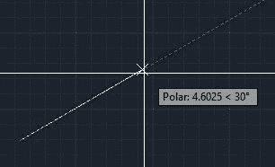

## 坐标输入

现在，让我们了解您将如何告诉 AutoCAD 您希望在哪里找到您需要输入的点。在 AutoCAD 中有三种输入坐标的方法：

*   绝对
*   相对的
*   相对极地

要在创建几何对象时简化显示，请按 **F12** 关闭动态输入，或单击状态栏上的**动态输入**图标，如图 21 所示。灰色按钮在状态栏上指示变量设置为关闭。

图 21：动态输入切换

|  | 提示：如果仅使用 2D 对象，则在输入坐标时可能会省略 z 坐标值，并且它将设置为当前高程设置（默认为 0）。 |

### 绝对坐标：（x，y）

绝对坐标是从当前 UCS 的原点开始测量的。如果在坐标（50,25）处创建点，则该点将位于 UCS 原点的右侧（x 方向）50 个单位，UCS 原点位于（y 方向）25 个单位。您可以为坐标和负值输入任何数值;您可以找到原点左侧或下方的点。

### 相对坐标：@ x，y

相对坐标是从您输入的最后一个点开始测量的。 @符号表示“最后一点”或“从最后一点开始”。

### 相对极坐标：@距离＆lt;角度

在相对极坐标上，输入距离（或长度）和下一个点的方向（角度），从输入的最后一个点开始。请记住，默认情况下，角度是以度为单位逆时针测量的。您输入的负角度将顺时针旋转。

### 其他输入法

您也可以通过单击绘图区域中的位置快速输入点。您还可以通过将十字光标放置在您愿意创建线段的方向并输入距离值来创建线段。这与 ORTHO 和 POLAR TRACKING 结合使用非常有用，它可以帮助您限制角度方向。

为了说明使用 ORTHO，首先我们需要确保正确地限制光标。

为此，请按 **F8** 键，或单击状态栏上的按钮，如下图所示（记住蓝色亮起，灰色亮起）。

图 22：切换 ORTHO

现在只需按以下步骤操作：

1.  键入 **L** 并按**输入**或**空格键**以启动 LINE 命令。
2.  单击屏幕上的一个点。
3.  将鼠标移动到绘图区域上方，确保您有一条垂直线。键入 **10** 并按**输入**或**空格键**。
4.  将鼠标向右移动，确保您有一条水平线。键入 **10** 并按**输入**或**空格键**。
5.  将鼠标移到下方，确保您有垂直线。键入 **10** 并按**输入**或**空格键**。
6.  键入 **C** 并按**输入**或**空格键**关闭矩形并结束命令。

与限制 UCS 的 x 和 y 方向的正交限制类似，您可以使用 Polar Tracking。要打开 Polar Tracking，请按 **F10** 键或单击 **Polar Tracking** 切换按钮，如图 23 所示（记住蓝色亮起，灰色亮起）。

图 23：极坐标跟踪切换

使用 Polar Tracking，您可以选择其他角度增量进行限制，甚至可以添加自定义角度。只需单击按钮旁边的小向下箭头即可显示默认增量跟踪角度列表，如图 24 所示，并进行选择。

图 24：极坐标跟踪设置

当您开始创建具有 Polar Tracking 的线条时，带有距离和角度的框以及绿色虚线显示您选择的增量的方向。您现在可以像使用正交限制一样输入距离。

图 25：极地跟踪在行动中