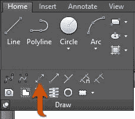
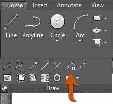

## 几何建筑助手

### 点

图 76：功能区中的点工具

命令：POINT

别名：PO

点是可以作为助手使用的对象，您可以使用 OSNAP 节点选项进行捕捉。命令分割和测量（本节稍后介绍）沿选定对象创建点。

在屏幕上可能会很难看到积分。要更改点的显示方式，请单击 Home 选项卡 **Utilities** 面板中的 **Point Style** 工具（图 77）或输入 PTYPE 并按 TAG6]在命令窗口中输入以显示“点样式”对话框，并选择您希望如何显示该点。

图 77：功能区中的点样式工具

|  | 注意：点如图所示绘制在屏幕上;确保将外观更改为所需的样式，以避免不必要的图纸重新绘制。另一种选择是在非绘图层上创建点，例如 Defpoints 图层（在标注尺寸时自动创建）或自定义非绘图图层（您将在第 4 章中了解有关图层的更多信息）。 |

### XLINE（施工线）

图 78：功能区中的构造线工具

命令：XLINE

别名：XL

**XLINE** 是一个无限长的线性物体;它没有起点或终点。 **在 Zoom Extend 操作中忽略 XLINES** 。

**XLINE** 提示如下：

指定一个点或[Hor / Ver / Ang / Bisect / Offset]：

**Point** ：指定 XLINE 通过的点。

**Hor 或 H** ：创建与当前 UCS X 轴平行的 XLINE（垂直于 Y 轴）。

**Ver 或 V** ：创建垂直于当前 UCS X 轴（平行于 Y 轴）的 XLINE。

**Ang** ：允许用户指定从 X 轴逆时针测量的 XLINE 角度（默认情况下）。

**Bisect** ：创建一个 XLINE，将由三个点选择的角度平分：假想弧的顶点，起点和终点。

**偏移**：创建与给定距离或选定点的现有线性对象平行的 XLINE。

### Ray

图 79：功能区中的 Ray 工具

命令：RAY

光线类似于 XLINES，不同之处在于光线只在一个方向上无限延伸。如果你在一个点上修剪一个 XLINE，它将变成一条光线。

### 除以

图 80：功能区中的分割工具

命令：DIVIDE

别名：DIV

在给定数量的等长段中划分几何对象（线，折线，圆弧，圆，椭圆或样条曲线）。默认情况下，段划分用 Point 对象标记。

除命令提示如下：

选择要分割的对象：

输入段数或[Block]：

如果在上一个提示中选择了 Block，则会显示以下提示：

输入要插入的块名称：

将块与对象对齐？ [是/否]＆lt; Y＆gt;：

图 81：块与对象对齐（左）而未对齐（右）

您将在第 5 章中了解块。

### 测量

图 82：功能区中的测量工具

命令：MEASURE

别名：ME

在给定给定长度的数字段中划分几何对象（线，折线，圆弧，圆，椭圆或样条曲线）。默认情况下，段划分用 Point 对象标记。

测量和分割命令的工作方式相同。唯一的区别是在 Divide 命令中，用户输入所需段的数量，并计算段长度。在 Measure 命令中，用户输入所需的段长度，并计算分割数。