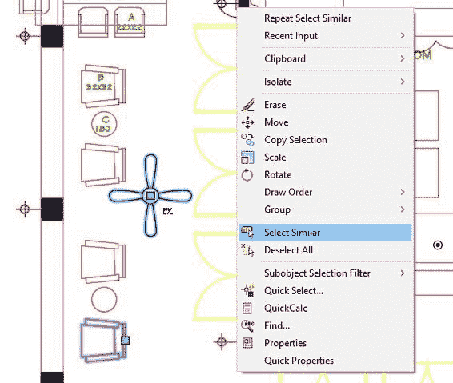

# 第 4 章：管理图纸

## 选择对象

无论何时需要修改绘图，都需要选择愿意更改的对象。 AutoCAD 包含许多帮助选择对象的方法。您可以选择不在冻结或锁定图层中的任何对象。

您可以在运行命令之前或之后选择对象。如果在未选择任何对象的情况下运行命令，AutoCAD 将在命令窗口中显示以下提示：

选择对象：

您可以通过单击它或使用窗口，窗口交叉或套索来选择对象，而无需其他提示。

### 窗口

从由左到右选择的两个点定义的矩形区域内完全选择所有对象。

要开始选择，请单击要选择的一个或多个对象（上方或下方）的绘图区域（不要按住鼠标按钮）并向右移动鼠标以在对象周围创建一个矩形区域或对象。选择窗口填充蓝色，边框实线。

图 83：窗口选择

### 窗口交叉

选择由从右到左选择的两个点定义的矩形区域内部或交叉的所有对象。

选择窗口以绿色填充，带有虚线边框。

图 84：交叉选择

### 套索

您可以通过按住鼠标左键并绘制您想要选择的对象来选择对象。与窗口和窗口交叉选择类似，开始从左向右拖动鼠标以选择完全位于套索边界内的所有对象。从右到左（Crossing Lasso）将选择套索内的所有物体以及套索边界穿过的物体。

图 85：套索选择

|  | 提示：您可以从“选项”对话框的“选择”选项卡中取消激活“套索选择”模式。取消选中“允许按下并拖动 Lasso”复选框。 |

### 命令提示符选项

**全部**：选择图形中的所有对象，包括其他空间上的对象（冻结或锁定图层上的对象除外）。

选择对象：全部 8

6110 发现（204 重复），共 5217

893 不在当前空间。

Last 或 L ：选择活动绘图空间中最后创建的对象，假设对象的图层既未冻结也未锁定。

选择对象：L

1 发现

**交叉**：与窗口交叉相同，但允许交叉选择到任何方向。

**WPolygon 或 WP（窗口多边形）**：选择完全位于由点定义的多边形边界内的所有元素。

选择对象：WP

图 86：WPoligon 选择

**CPolygon 或 CP（交叉多边形）**：选择由点定义的多边形边界内部和交叉的所有对象。

选择对象：CP

图 87：CPolygon 选择

**F 的栅栏：**与 **CPolygon** 类似，只是选择了只有边界穿过的物体。

选择对象：F

图 88：围栏选择

### 选择相似

选择相似允许用户选择与先前选择的对象类似的所有对象。如果要选择（例如）图形中的一组匹配块，则选择“类似”非常有用。

图 89：选择类似

要选择相似的对象，首先选择要用作参考的对象，然后右键单击鼠标以显示上下文菜单，然后单击**选择类似**，如图 89 所示。