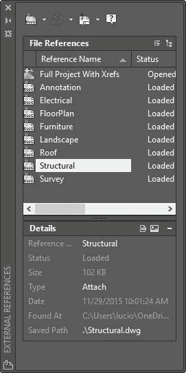

## 外部参考

外部引用（Xref）类似于块，但它不是将块保存在当前图形的块表中，而是链接到可能位于文件系统中任何文件夹中的外部文件。外部参照定义保存在外部参照表中，与块一样，从图形中删除外部参照实例不会从外部参照表中删除该文件。

在处理来自不同学科的大文件时，Xref 被广泛使用，并促进设计管理。例如，在建筑设计中，您可以将主要平面图设计为室内设计，结构，景观，机械或其他平面图。

外部参照可以嵌套。您可以附加已包含其他附加外部参照的外部参照，此文件可以是另一个图形的外部参照，依此类推。

因为您可以按需卸载和重新加载外部参照，所以正确使用它可以显着提高绘图性能和设计效率，并且还有助于项目管理。

更新外部参照时，所有主图纸在关闭时会自动更新，如果打开主图纸，气球会通知用户外部参照已保存并需要更新。

您可以在外部参照中冻结或关闭图层。

除非绑定（将外部参照转换为块），否则不能展开外部参照。

外部参照类型

*   **附件**：附件外部参照在所有插入附件主文件的图纸上加载，与级别数无关。
*   **叠加**：当附加的图形作为外部参照附加到另一个图形时，忽略叠加。

### 插入外部参考

命令：ATTACH

1.  打开位于**第 05 章**文件夹中的文件 **FloorPlan.dwg** 。
2.  确保当前图层为 **0** （在图层 **0** 上插入 Xrefs 是一个好习惯）。
3.  从 **Insert** 选项卡，**参考**面板，单击 **Attach** 。
4.  导航至**第 05 章**文件夹。
5.  从**文件类型**列表（在对话框中）下，选择**绘图（* .dwg）**。
6.  从文件列表中选择 **Survey.dwg** 并单击**打开**以显示 Attach Attach Reference 对话框。
7.  确保在**参考类型**区域中选择了**附件**。
8.  在 **Scale** 区域中，确保未选中**指定屏幕上的**，并确保 **X** ， **Y** 和 **Z** 值为 **1.00** 。
9.  在**插入点**区域中，确保未选中**指定屏幕上的**，并确保 **X** ， **Y** 和 **Z** 值为 0.00（Xref 基点位置）。
10.  在**旋转**区域中，确保未选中**指定屏幕上**并且**角度**为 **0.00** 。
11.  单击**确定**以插入外部参照。
12.  从 **Insert** 选项卡，**参考**面板，单击 **Attach** 。
13.  从文件列表中，选择 **Electrical.dwg** 并单击**打开**以显示 Attach Attach Reference 对话框。
14.  确保在**参考类型**区域中选择了 **Overlay** 。
15.  单击**确定**以附加电气计划。
16.  保存图纸。
17.  打开 **Landscape.dwg** 文件。
18.  重复步骤 4 到 11 以附加 **FloorPlan.dwg** 图纸。
19.  现在已附上平面图和测量图，但未附加电气计划，因为它是平面图中的叠加图。
20.  保存图纸。

### 编辑外部参考

要编辑外部参照，只需打开文件，进行更改并保存即可。每次保存附件时，主图纸都会收到通知。

要快速打开外部参照：

1.  单击外部参照进行选择。
2.  右键单击鼠标以显示上下文菜单。
3.  选择**打开外部参照**打开文件。
4.  将显示“打开参考文件”对话框，其中显示了所有附加和嵌套的外部参照。
5.  从**参考名称**列表中选择**测量**，然后单击**打开**。
6.  **测量**图纸将加载到新的图纸选项卡中。
7.  缩放并平移绘图，然后保存并关闭它（我不是真的愿意进行更改，但 AutoCAD 会将任何命令识别为绘图更改）。
8.  通知气球出现在主图纸中。单击**重新加载测量**以更新外部参照。
9.  保存并关闭所有图纸。

### 管理外部参考

您可以附加几乎任意数量的外部参照，并且您可以完全控制它们的显示方式和时间，或者您需要分离任何外部参照。

附加外部参照时，AutoCAD 会显示前缀为外部参照名称的每个外部参照的图层，例如 **Landscape | L-Pool** 。您可以在不影响源的情况下更改图层属性和可见性，并且即使重新加载外部参照，或者默认情况下跨 AutoCAD 部分，任何图层属性更改都会保留。

|  | 提示：图层可见性状态由名为 VISRETAIN 的系统变量控制，并且是绘图持久的。当 VISRETAIN = 1 时，主图形会保留图层的属性更改。当 VISRETAIN = 0 时，每次重新加载外部参照时都会恢复图层的属性。 |

AutoCAD 提供了一种支持管理外部参照的工具，称为 XRef Manager。按照以下步骤打开外部参照管理器并管理外部参照：

1.  如果 AutoCAD 未运行，请打开 AutoCAD。
2.  使用位于**第 05 章**文件夹中的外部参照图纸打开**完整项目。**
3.  In the command window, type **XREF** and press **Enter** to open the Xref Manager palette, as shown in Figure 102.

    

    图 102：外部参照管理器

4.  在**文件参考**列表中，选择 **Annotation** 。请注意，外部参照在绘图区域中突出显示。
5.  右键单击 **Annotation** 。将出现一个菜单，其中包含可用于外部参照的命令。
6.  选择 **Unload** 。外部参照已卸载，在绘图区域中不再可见。
7.  右键单击 **Annotation** 并选择 **Reload** 。外部参照重新加载并在绘图区域中可见。
8.  右键单击 **Electrical** 并选择 **Detach** 。外部参照与图纸分离;它不再可见，无法重新加载。
9.  右键单击 **Annotation** 并选择 **Bind** 。
10.  在 **Binding Xrefs / DGN underlays** 对话框中，选择 **Insert** 并单击 **OK** 以绑定外部参照。
11.  注释计划在绘图区域中可见，转换为块引用（您可以根据需要展开块），并从列表中删除外部参照名称。
12.  单击**附加位于调色板左上角的 DWG** 。
13.  找到 **Electrical** 图纸并将其作为图纸的附件。

|  | 注意：绑定外部参照时，“绑定”模式会保留图层，块和其他绘图元素的前缀（外部参照名称），而“插入”会删除所有前缀。 |