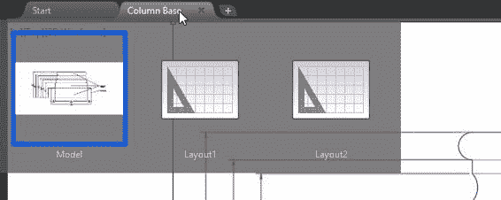

## 布局

布局是 2D 图纸布局环境 ，您可以在其中定义图纸尺寸，创建图纸的多个视图（视口），以及添加标题栏和其他注释。每个图纸视口可以具有不同的比例，视图方向和视觉样式，您可以定义要隐藏的图层，甚至可以指定不同的图层颜色。

要激活布局，请将鼠标移到“绘图”选项卡上并暂停，直到显示布局大拇指，如下图所示：

图 117：从绘图选项卡激活布局

或者，您可以通过位于绘图区域底部的“布局”选项卡中选择布局来激活布局：

图 118：布局选项卡

|  | 提示：您可以从“选项”对话框的“显示”选项卡控制“图形文件”选项卡和“布局”选项卡的可见性。要打开“选项”对话框，请在命令窗口中键入 OP，然后按 Enter 键。 |

让我们配置一个情节布局：

1.  让我们继续您在本章的 Plot Styles 部分中使用的 Column Base 图。
2.  激活 **Layout1** 布局。

激活布局时，“布局”面板将添加到功能区，您可以从中创建新布局和视口：

图 119：布局选项卡

1.  右键单击 **Layout1 选项卡**，然后从上下文菜单中选择**重命名**。
2.  键入 **D-101** 并按**确定**。
3.  单击布局选项卡的**布局**面板中的**页面设置**工具。
4.  在**页面设置**列表中，选择 *** D-101 *** 并单击**修改**以显示**页面设置**对话框，类似到“绘图”对话框。
5.  在“页面设置”对话框中：
6.  将**打印机/绘图仪名称**设置为 **DWG 至 PDF.pc3** 。
7.  将**纸张尺寸**设置为 **ANSI B** **（17.00 X 11.00 英寸）**。
8.  设置**将**设置为**布局**的内容。
9.  1.  将 **Scale** 设置为 **1：1** （这是绘制布局时的默认比例）
    2.  将**绘图样式**表（笔分配）设置为 **Succinctly.ctb** 。
10.  单击**确定**以应用更改并关闭对话框。
11.  单击**应用于布局**，然后单击**取消**关闭对话框而不绘图。
12.  单击**关闭**关闭**页面设置管理器**对话框。