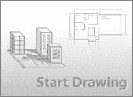
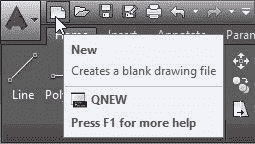
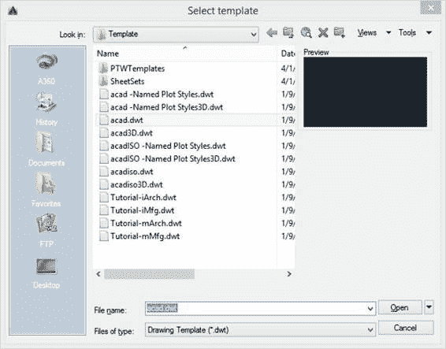

## 创建新图纸

有几种方法可以开始新的绘图。如果刚刚启动了 AutoCAD，则可以从“开始”页面开始新的绘图，如图 1 所示。单击**开始绘图**（图 2）开始新绘图。这将基于 AutoCAD 标准模板启动一个新的空白图形。

图 11：在起始页面开始绘图

另一种开始绘图的方法是单击快速访问工具栏中的 **New** ，如下图所示。

图 12：快速访问工具栏

单击 **New** 打开 New Drawing 对话框窗口（图 12），您可以从中选择要用于开始绘图的模板。

图 13：新绘图对话框

如果您使用英制图纸，假设您以英寸为单位工作，则应使用 **acad.dwt** （或 **acadlt.dwt** ，如果您使用的是 AutoCAD LT）。

对于公制单位，假设单位为毫米;您可以在 AutoCAD LT 中使用 **acadiso.dwt** （或 **acadltiso.dwt** ）。

|  | 注意：为简化和概括，本书中的所有图纸均基于 acad.dwt 模板。 |

您也可以通过从“开始”页面选择模板来启动新图形，如图 14 所示。

图 14：使用自定义模板创建新图形

在**模型空间**中创建的所有对象都应以全尺寸，实际单位（1：1 比例）创建。输入 10 个单位作为距离意味着它可以是 10 英寸，10 毫米或您指定的任何其他单位，例如米或英尺。重要的是要记住，一旦开始绘图，就无法混合单位。如果您假设 1 个单位= 1 毫米开始绘图，则不能输入 5 厘米。作为距离;相反，您必须输入 50.除非您使用建筑测量类型，否则不要输入实际单位;然后您可以输入 6'-6“等值，AutoCAD 会将其解释为 78 个绘图单位。