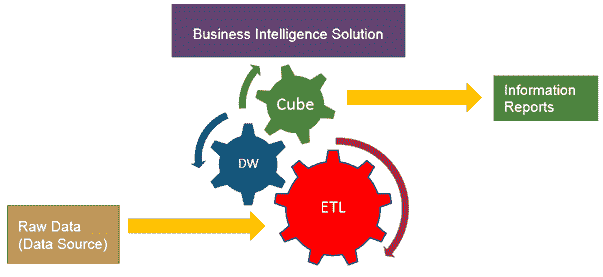
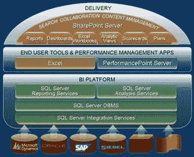
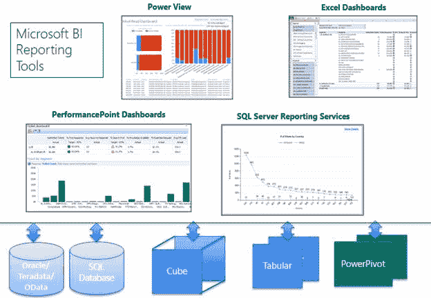
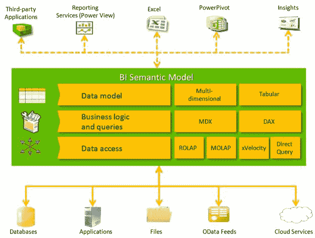
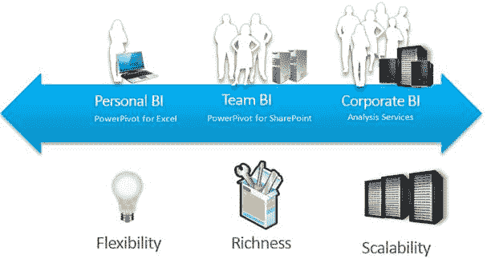
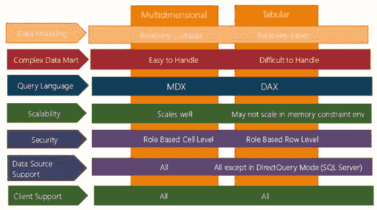
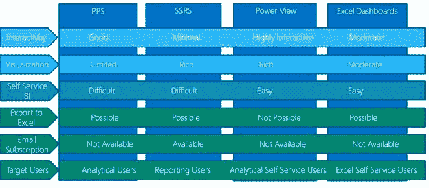

# 第 1 章 Microsoft BI 堆栈简介

在开发任何商业智能（BI）解决方案之前，了解解决方案的意图或用例，最终用户或分析师希望使用解决方案获得的内容，解决方案是否将用于动态临时分析非常重要或企业报告，最终用户是否更喜欢向他们发送报告（推送），或者他们是否喜欢按需浏览报告（拉动）并根据他们的要求（临时）更改度量或维度。

BI 解决方案中的分析和报告工具的选择取决于这组问题和其他标准。为确保我们选择最适合最终用户要求的最佳工具，我们作为 BI 开发人员了解我们可用的所有工具的优缺点非常重要。有时单个工具可能无法满足所有要求，在这种情况下，我们需要使用工具组合。

在本章中，我想向您介绍 Microsoft BI 堆栈，以便在为最终用户开发 BI 解决方案时，我们选择最合适的工具来满足用户的要求。

本书的其余部分深入探讨了用于分析的 SQL Server 2012 Analysis Services 表格数据模型以及使用 Power View 进行数据探索和报告，这些是 SQL Server 2012 Microsoft BI（MSBI）堆栈中引入的新分析和报告工具。

## 什么是商业智能？

商业智能是将数据转换为信息的过程，以便业务决策者或分析师能够更好，更快地做出明智的决策。

虽然商业智能这个术语在大数据和分析的现代时代被更多地使用，但这个概念并不是全世界的新概念。同样的概念以前称为执行信息系统（EIS），后来称为决策支持系统（DSS）。

数据源可以是从平面文件到规范化在线事务处理（OLTP）数据库系统的任何数据，而最终产品是允许最终用户通过切片和切割事实来获取有意义信息的报告。

图 1 ：商业智能解决方案

图 1 描述了典型的商业智能解决方案如何看待它执行的操作。让我们简要地检查每个组件。

提取 - 转换 - 加载（ETL）

BI 解决方案的原始数据可以从各种数据源获得，并且可能无法以关系格式提供。例如，某些位置数据可能来自 Excel 工作表，而来自应用程序的某些度量可能是 CSV 或 XML 格式，不能按原样使用。

ETL 层的工作是从各种数据源中提取数据并将其转换为规范化的结构化数据，这些数据可以在维度模型（数据仓库）中进一步加载。

如果数据源是结构化 OLTP 系统，则所需的转换是最小的，并且基本上是提取和加载操作。

通过引入 PowerPivot，Power Query 和 SSAS 表格模型等新工具，可以直接将数据源中的原始数据加载到多维数据集中，而无需 ETL 甚至数据仓库层。

数据仓库（DW）

BI 解决方案的数据仓库层通常是 RDBMS 数据库（随着大数据和 NoSQL 的引入而发生了变化），这是使用维度建模技术（Ralph Kimball 方法或 Bill Inmon 方法）设计的。

在 DW 层中，数据根据其特征被分类为维度或事实。维度给出了切片数据的上下文，而事实是感兴趣的度量。

维度建模技术和关于维度和事实的详细讨论超出了本书的范围。

在具有多维立方体的传统数据仓库方法中，使用维度建模技术设计精心设计的数据仓库非常重要。随着 PowerPivot 和表格立方体的引入，数据不再需要被分类为维度和事实，这使得与传统立方体相比，表格立方体中的数据建模更加容易。

尽管如此，仍建议使用数据仓库数据库，以便以适合报告，聚合和多维数据集处理的形式存储数据。

立方体

BI 解决方案提供的信息应该允许最终用户在不同维度以及维度层次结构的不同级别上动态地切片和切块度量（或事实）。

DW 存储维度和事实数据，这使我们可以直接从 DW 本身获取静态报告。但是，DW 可能无法通过维度层次结构的不同维度或不同级别来处理动态切片和切块的灵活性。

因此，我们有多维数据集，它实际存储每个度量的聚合数据，维度层次结构和维度。

多维数据集是数据模型，它实际上似乎在维度层次结构的不同级别存储预先聚合的度量数据，从而使最终用户能够灵活地在不同级别动态地对度量进行切片和切块。

如果解决方案仅需要最终用户直接使用的静态预制报告而不需要动态临时报告，则 BI 解决方案中可能不需要该多维数据集。

报告

BI 解决方案的最后一层是报告层，用户从报告的数据中获取有意义的信息。

报告可以采用仪表板报告的形式，为执行用户显示高度汇总的数据，以及关键绩效指标（KPI）和可视指标，或显示信息工作人员要求发生的每笔交易的详细报告。

报告也可以归类为静态报告，由开发人员从数据仓库设计和开发，并由最终用户按原样使用。另一方面，动态即席报告通过多维数据集向最终用户公开，允许他们动态地对数据进行切片和切块。

报告可能必须通过电子邮件（推送）传递给最终用户，或者用户可以按需浏览报告（拉动）。

报告解决方案应该能够满足所需的所有类型的报告。

## 了解 Microsoft 商业智能堆栈

现在我们了解了商业智能的基础知识，接下来我们将深入了解 Microsoft BI 堆栈，以了解哪些产品可用于各个层。

图 2 ：Microsoft BI 堆栈

如上图所示，Microsoft BI 堆栈包括以下产品：

SQL Server 集成服务（SSIS）

SSIS 在 MSBI 堆栈中形成 ETL 层。 SSIS 包接受来自各种数据源（如 Excel，Oracle，SAP 和平面文件）的数据，并将数据注入到数据流中，在数据流中进行各种可用的转换（联合，合并，查找，数据流和执行 SQL 任务，例如）。转换后的数据将加载到 SQL 数据库引擎中托管的数据仓库中。

SQL Server DBMS

SQL Server 数据库引擎实例构成了在 MSBI 堆栈中托管数据仓库的平台。

SQL Server Analysis Services

SSAS 构成了在 MSBI 堆栈中托管多维数据集的平台。在 SQL Server 2008 R2 之前，只有一种类型的 SSAS 实例：多维 SSAS 多维数据集。但是，随着新的 SQL Server 2012 xVelocity 引擎的引入，我们有了新类型的 SSAS 实例：表格数据模型。表格模型是本书的主要焦点。

我们将传统的多维 SSAS 与表格模型进行比较，并研究如何在本章后面选择正确的 SSAS 实例。

Microsoft BI 报告平台

使用 Microsoft BI 堆栈，我们有以下报告工具：

图 3 ：Microsoft BI 堆栈中的报告工具

SQL Server Reporting Services（SSRS）

SSRS 是 BI 开发人员为最终用户构建固定静态报告的绝佳工具。 SSRS 是最灵活的报告平台，具有大量可视化，例如仪表，指示器和地图。 SSRS 允许将报告导出为各种格式，包括 PDF，Excel，Word 和 HTML。此外，可以通过订阅文件共享，SharePoint 列表或电子邮件来传递报告。

PerformancePoint Services（PPS）

PPS 是一个伟大的临时仪表板和记分卡报告工具，供 BI 开发人员在 SSAS 多维数据集上构建动态报告。 PPS 报告使用 SSAS 多维数据集作为数据源，并允许最终用户在多维数据集中定义的各个维度上动态切片和切块。 PPS 报告公开了多维数据集中定义的操作，透视图等。

高强

传统上，Excel 为大多数业务用户提供了首选的报告工具。 Excel 数据透视表和数据透视表可用于浏览多维数据集并执行即席报告。

Power View

Power View 是 SQL Server 2012 中引入的基于 Silverlight 的新的即席报告工具。该工具从 PowerPivot，表格模型和多维立方体公开数据模型，从而允许用户动态处理数据。 Power View 提供了丰富的可视化工具集，可增强业务用户的交互性和体验。

SharePoint BI 仪表板

SharePoint 2010 和 2013 提供了一个平台，可以在一个站点上托管所有前面提到的报告工具，从而允许开发人员构建丰富的仪表板。 SharePoint 对于团队 BI 和企业 BI 解决方案非常有用，可以连接所有报表以为最终用户构建单个视图仪表板。

在本章后面，我们将比较所有 Microsoft BI 报告工具，以根据我们的解决方案要求选择正确的报告工具。

## SQL Server 2012 商业智能堆栈有哪些新功能？

微软通过其 SQL Server 2012 版本在 BI 领域进行了大量投资，并且一些投资，如 BI 语义模型（BISM）和 Power View，使微软成为 Gartner 评估的 BI 和分析平台的领导者象限。 。

BI 语义模型

随着 SQL Server 2012 的推出，Microsoft 创建了 BI 语义模型或​​BISM 的概念。许多人将此术语与 SSAS 2012 表格模型互换使用，这是不准确的。让我们试着理解这个新术语的含义。

图 4 ：BI 语义模型

如前所述，使用 SQL Server 2012，我们现在可以拥有两个 SSAS 实例：传统的多维模型和表格模型。从开发人员的角度来看，在多维实例中设计和开发多维数据集与表格模型完全不同，后者相对容易。没有可用于将多维立方体迁移到表格多维数据集的迁移路径，反之亦然。此外，为多维立方体设计的查询语言是多维表达式（MDX），而表格模型立方体的语言是数据分析表达式（DAX）。每种模型的设计和开发策略都完全不同。但是，多维数据集模型可以使用相同的数据源集并处理数据。

这些多维数据集中引入的关键功能是多维立方体可以支持 DAX 查询（这是在 SQL Server 2012 SP1 CU4 中引入的很晚），并且表格模型多维数据集可以支持 MDX 查询。

这种灵活性允许先前讨论的所有报告工具（Excel，SSRS，PPS，Power View）使用类似的报告功能透明地查询任一类型的多维数据集。例如，使用仅生成 MDX 查询的 Excel 数据透视表和图表，我们可以查询多维数据集模型（多维或表格）以构建具有相同功能的相同报表。

从最终用户的角度来看，两种模型都透明地提供相同的功能。因此，BI 语义模型的这一新概念代表了 SQL Server 2012 中用于所有报告工具的透明数据模型层。

## 选择正确的 Microsoft 分析工具

在 SQL Server 2012 版本中，我们现在有三个分析工具可用于设计数据模型，以便在 PowerPivot for Excel，PowerPivot for SharePoint 和 SSAS 中进行报告。

Microsoft 产品团队发布的下图最好地解释了每个分析工具的用例。

图 5 ：Microsoft 分析工具的使用和优点

基于目标受众，BI 解决方案可以分为个人 BI，团队 BI 或企业 BI。

个人 BI

个人 BI 适用于个人业务用户或高级用户，他们喜欢为自己的消费和分析创建数据模型，KPI 和度量。 PowerPivot 现在与 Excel 2013 本地集成，可作为 Excel 2010 的插件使用，满足个人 BI 用户的需求。

用户可以从各种数据源（SQL Server，Oracle，平面文件，OData 源等）中获取数据，并将其加载到 Excel 中的 PowerPivot 数据模型中。此外，他们可以使用 PowerPivot 数据模型中的 DAX 公式定义其度量，KPI 和派生列，并在 Excel 中的数据透视表或数据透视图报表中使用它们。

BI 团队

BI 团队适用于喜欢创建，查看和共享数据模型和报告的个人组。多年来，SharePoint 已经发展成为组织最受欢迎的文档库，随着 Office 365（SharePoint Online）的引入，即使是中小型企业也已将 SharePoint 作为文档库。 Microsoft 产品团队设计并集成了 PowerPivot 和 SharePoint，以便可以使用 Excel Services 在线查看在 SharePoint 库中上载的 PowerPivot 工作簿。使用 SharePoint 2013，Excel Services 应用程序本机加载嵌入在 Excel 中的 PowerPivot 工作簿。

PowerPivot for SharePoint 可以很好地为团队 BI 用户提供服务，因为它能够自动提供计划的数据刷新，这很难通过个人 BI 实现。

企业 BI

企业 BI 也称为企业 BI 或组织 BI。它适用于拥有大量数据和不同数据，安全性，KPI 和度量要求的大型用户组。 SQL Server Analysis Services 中定义的数据模型专门满足企业 BI 的需求。

SSAS 提供诸如计算度量，KPI，透视图，基于角色的安全性，Kerberos 集成安全性等功能，并且能够处理大量数据。一个实际案例研究是雅虎用于分析和报告的数据集市。它的大小约为 24 TB，托管在 SSAS 多维立方体上。

通过在 SQL Server 2012 中引入 SSAS 表格模型，BI 开发人员可以在传统的多维方法和新的表格模型方法之间进行选择。在下一节中，我们将比较这些方法，以帮助您为 BI 解决方案选择正确的模型。

## 多维方法与表格方法

多维方法

图 6 ：多维立方体方法的过程

设计多维立方体需要使用星型或雪花式架构设计数据集市，其中数据被分类为维度属性或事实。维度表中的数据形成多维数据集中的属性和属性层次结构，而事实表格形成度量组，其中各个度量列形成事实。

由于数据集市中的数据需要采用星型或雪花型，因此需要 SSIS 包从各种数据源中提取数据，对其进行转换并将其加载到数据集市中。多维方法需要 ETL 解决方案将数据转换为数据集市中的星型模式。

多维立方体可以处理角色扮演维度，多对多维度以及开箱即用的父/子维度，这为我们设计复杂数据模型提供了极大的灵活性。

多维方法需要 MDX 知识用于脚本和查询，对于初学者来说可能很难，但对于有经验的开发人员来说，它是最灵活的查询语言之一。

多维方法支持三种不同的存储选项：MOLAP，HOLAP 和 ROLAP。 MOLAP 是首选选项，因为它以牺牲数据冗余为代价提供最佳性能。

从资源（CPU，内存或 IO）和可伸缩性的角度来看，多维立方体比表格模型消耗更少的内存，并且可以通过分区和分区处理很好地扩展。

表格方法

图 7 ：表格方法的过程

表格方法使用关系建模构造（例如用于建模数据的表和关系）以及用于存储和计算数据的 xVelocity 内存分析引擎。与多维方法不同，表格方法不需要在星形或雪花模式中组织数据，因为它依赖于压缩的数据柱状存储。这使得使用表格方法可以更轻松地进行数据建模。

表格模型可能无法处理开箱即用的复杂关系（角色扮演维度，多对多维度，父/子维度），这可能使其对复杂数据模型不太有用。

表格模型使用 DAX 进行查询和定义计算，与 MDX 相比，这相对更容易学习和掌握。

表格模型支持内存中的 xVelocity 模式和 DirectQuery 模式（相当于多维方法中的 ROLAP）。但是，DirectQuery 模式仅支持 SQL Server 上托管的数据集市。它目前不支持任何其他数据源。

从资源消耗的角度来看，表格模型的内存模式是内存密集型的，所需的内存量与数据的基数成正比，因此在内存受限的环境中可能无法很好地扩展。在某些情况下，表格模型可以比多维模型执行得更好，具体取决于数据。

决策矩阵

下图概述了开发人员在多维方法和表格方法之间进行选择的决策矩阵。

图 8 ：选择多维或表格模型

## 选择正确的 Microsoft BI 报告工具

图 9 ：Microsoft BI 堆栈中的报告工具

PerformancePoint Services 记分卡和仪表板

*   交互性：记分卡和仪表板允许深入挖掘和钻取功能，允许用户执行临时报告和分析。
*   可视化：与其他工具相比，可以使用有限的可视化和图表。
*   自助 BI：用户可能无法自行开发仪表板。
*   导出为 Excel 或其他格式：可以导出到 Excel，但其他格式是不可能的。
*   电子邮件订阅：用户可能无法通过电子邮件订阅立即收到报告。

总的来说，PPS 是仪表板和分析的绝佳工具，但它不支持自助 BI。

SQL Server Reporting Services

*   交互性：SSRS 仪表板允许向下钻取和钻取，但不支持动态切片和切割。 SSRS 主要用于具有有限交互性和临时功能的静态报告。
*   可视化：提供丰富的可视化集，包括地图，仪表，迷你图等。
*   自助 BI：用户可能无法自行开发仪表板。
*   导出为 Excel 和其他格式：可以导出为 Excel 和其他格式，如 PDF，Word 和 HTML。
*   电子邮件订阅：用户可以创建电子邮件订阅以将报告传递到其邮箱。

总体而言，SSRS 是静态报告的良好报告工具，但对于临时分析和自助 BI 可能没有用。

Power View

*   交互性：Power View 仪表板允许动态切片，这使其成为分析和仪表板的高度交互式工具。它是临时报告的首选工具。
*   可视化：包括丰富的可视化集，例如地图，散点图，卡片，瓷砖等。
*   自助 BI：用户应该能够自己开发仪表板。
*   导出为 Excel 和其他格式：可以导出到 PowerPoint，但不支持其他格式。
*   电子邮件订阅：用户可能无法创建电子邮件订阅以将报告传送到其收件箱。

总体而言，Power View 是自助 BI 和临时分析的一个很好的工具，其中用户可以动态切片和切块信息，但它不支持将数据导出为 PowerPoint 以外的格式。

Excel 仪表板

*   交互性：SharePoint 中的 Excel 仪表板通过 Excel Services 提供有限的交互性，无需钻取操作支持。但是，从 SharePoint 支持下载的 Excel 工作簿可以深入查看。
*   可视化：提供一组有限的可视化，包括表格和图表。
*   自助 BI：用户应该能够自己开发仪表板。
*   导出到 Excel 和其他格式：可以导出到 Excel。
*   电子邮件订阅：用户可能无法创建电子邮件订阅，以便将报告直接发送到其收件箱。

总体而言，Excel 仪表板是 Excel 用户自助 BI 和分析的良好工具，但与其他工具相比，交互性有限。

决策矩阵

下图概述了开发人员为其 BI 解决方案选择报告工具的决策矩阵。

图 10 ：选择正确的报告工具

## 开发 MSBI 解决方案

下图概述了开发 MSBI 解决方案所涉及的步骤：

图 11 ：开发 MSBI 解决方案的步骤

与任何软件开发生命周期（SDLC）一样，开发的第一步是需求收集阶段。在这里，我们从客户或最终用户中挑选出他们想要分析哪些维度或属性的度量，以及他们是否需要临时报告功能或需要开发人员创建的静态报告。

一旦我们有了相应的要求，下一步就是根据所需的交互性，可视化，自助 BI，导出到 Excel 或其他格式以及电子邮件传递，选择最适合最终用户需求的 Microsoft 报告工具。对于不同的用户要求，我们可能希望选择报告工具的组合。

下一步是选择正确的 Microsoft 分析工具（PowerPivot，PowerPivot on SharePoint，SSAS 多维或 SSAS 表格）。根据个人 BI，团队 BI 或企业 BI 要求，我们可以选择最适合最终用户需求的最佳分析工具。对于企业 BI 解决方案，我们可以根据数据模型的复杂性，可扩展性，技能集知识，客户端工具等在 SSAS 多维或表格模型之间进行选择。

团队 BI 或企业 BI 方案需要数据仓库。如果需要数据仓库（这是首选），下一步是使用 Ralph Kimball 给出的维度建模技术设计数据仓库模式。数据仓库可能包含多个数据集市，每个数据集市都为给定的业务流程定义。数据集市包含一个星型模式，其中心事实表由具有主外键关系的维表包围。事实表由要分析的关键列和度量组成，而维度表由需要分析度量的相关属性集组成。

一旦数据仓库模式准备就绪，接下来我们需要识别数据仓库的数据源，因为数据仓库将从组织中的各种数据源填充。某些数据可能驻留在 OLTP 中，有些可能在平面文件中可用，而其他数据可能在云中可用。

一旦确定了仓库的数据源，下一步就是设计一个 ETL 解决方案，从各种数据源中提取数据，根据需要进行转换，然后将它们加载到数据仓库中。在此步骤中，我们可能必须设计一个临时登台数据库，我们首先在将数据加载到数据仓库之前提取，加载和转换数据。

在 ETL 开始流动之后，数据仓库将以适合报告的格式填充数据。对于某些报告工具，如 SSRS，我们可以直接设计报告以从数据仓库中获取数据;但是，如果用户正在寻找自助 BI 和临时报告，则需要使用多维数据集数据模型设计。我们可以根据之前选择的分析工具设计数据模型。

开发 BI 解决方案的最后一步是根据最终用户的需求通过之前确定的报告工具设计报告，这将使用户能够获得有意义的信息并做出明智的决策。

## 摘要

在本章中，我们介绍了商业智能的基础知识，Microsoft BI 堆栈中提供的各种工具，以及如何为 BI 解决方案选择合适的工具。

在下一章中，我们将使用 SQL Server 2012 中引入的 SSAS 表格模型开始数据建模，这将是本书其余部分的重点。