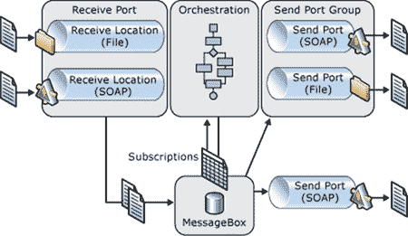

# 第 1 章什么是 BizTalk Server？

以非常简单的方式，BizTalk Server 可以被视为消息路由器或代理。例如，当外部系统发送 EDI（电子数据交换）消息时，BizTalk 将能够轻松读取消息并将其转换为目标系统所期望的消息类型。

为了与现实世界场景进行类比，您可以将 BizTalk 视为交换商品的物流平台。原材料进入公司并进行存储，处理，转换并发送给客户。同样，电子消息被接收，验证，存储，处理并发送到其他系统。

BizTalk 包括消息传递基础设施，脱水和补液功能，超过 25 个多平台适配器，规则引擎（BRE），获取关键业务流程性能信息的能力，调试，持久性以及处理和错误恢复事务。 BizTalk Server 是主要的 Microsoft 集成平台，非常适合与企业应用程序集成（EAI），企业对企业（B2B）集成和业务流程管理（BPM）解决方案一起使用。

BizTalk 是一种集成解决方案，需要大量投资，而中小型企业可能无法负担得起。但是，当贵公司开始存钱时，这是值得的。微软有一个很好的案例研究：通过使用这个集成平台，AMC 娱乐公司现在每年节省 260 多万美元，并且它在大约六个月内收回了对该解决方案的投资，获得了 200% 的年度投资回报。本案例研究向您展示了这种面向过程的技术如何帮助您节省资金。 AMC 通过减少对供应商的付款来证明其成本是合理的，因为它使用该解决方案通过批发和折扣价格的 153,000 项在线目录购买其供应品，而不是继续独立于当地供应商购买供应品。我建议您阅读[整个案例研究](http://www.microsoft.com/casestudies/Microsoft-Biztalk-Server-Enterprise-2010/AMC-Entertainment/Movie-Theatre-Chain-Projects-17-Million-Revenue-Gain-from-Information-Integration/710000001643)。

## BizTalk Server 体系结构

BizTalk Server 运行时构建在发布 - 订阅体系结构上，其中消息发布到系统中，然后由一个或多个活动订阅者接收。 BizTalk 通过称为接收端口的物理端口接收所有消息。接收端口是一个或多个接收位置的逻辑容器。您可以在接收位置指定有关要使用的传输的详细信息，要接收消息的确切地址以及该传输类型的任何其他特定属性，如图 1 所示：

图 1：BizTalk Server 消息传递体系结构

您应该了解 BizTalk Server 体系结构背后的两个核心概念：

1.  MessageBox 数据库
2.  单点登录（SSO）机制

MessageBox 是 BizTalk Server 中发布 - 订阅引擎的核心。它由两个组件组成：SQL 数据库和消息代理。 SQL 数据库用于保存应用程序周围的所有元数据和数据，例如消息，消息属性，订阅，编排状态，跟踪数据和主机队列以进行路由。消息代理在消息框数据库上提供了一个抽象层。它使用.NET COM 互操作来公开一组 API，BizTalk Core 引擎可以使用这些 API 与消息框数据库进行通信（发布消息，订阅消息，检索消息等）。

单点登录是一种提供将 Windows 用户 ID 映射到非 Windows 用户凭据的方法的机制;这简化了 BizTalk 可以访问连接到它的各种系统以及这些不同系统如何连接到 BizTalk Server 的方式。

## 这本书给谁？

本书主要面向 BizTalk 开发人员，.NET 开发人员以及所有对系统集成充满热情的人。虽然集成和 BPM 顾问主要使用 BizTalk，但我想向.NET 开发人员展示他们如何使用这个平台作为他们职业生涯的另一种选择。