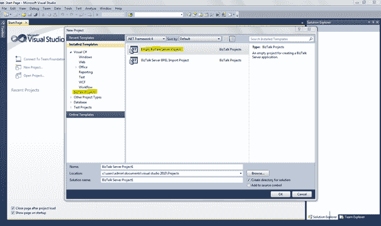
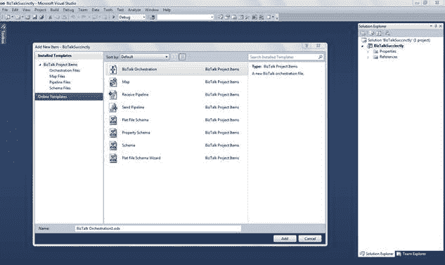

# 第 3 章开发人员环境

### 简介

如您所见，Visual Studio 是您的主要开发人员工具，允许您创建要在 BizTalk Server 平台中进一步部署和安装的应用程序。第一次启动一个新的空 BizTalk Server 项目时，您可能会有点迷失，因为您将看到一个空白页面，工具箱中没有选项。这是因为 Visual Studio 将根据您要创建的 BizTalk 工件向您显示不同的工具和选项。

完成所有配置项后，即可开始在 BizTalk Server 2010 中进行开发。打开 Visual Studio 并启动新的 BizTalk Server 项目（空 BizTalk Server 项目）。

图 6：创建一个新项目

要检查工件的完整列表，请在解决方案资源管理器中右键单击该项目，然后单击**添加**＆gt; **新项目**。这将使用以下选项提示新屏幕：

*   BizTalk Orchestration
*   地图
*   接收管道
*   发送管道
*   平面文件架构
*   物业架构
*   架构
*   平面文件架构向导

图 7：开发工件

### 解释开发人员工件

在开发过程中，您将经常看到“添加新项”屏幕，因为您需要多个项目才能完成最终解决方案。我将在以下章节中进一步详细讨论这些项目，但这里有一个简要的概述：

表 1：BizTalk Server 项目工件

| 项目 | 描述 |
| 地图 | Maps 是可扩展样式表语言转换（XSLT）文档的图形表示，允许我们以简单直观的方式执行 XML 消息之间的转换 |
| 接收管道 | 在适配器接收到消息并在将消息发布到 MessageBox 数据库之前对消息执行的管道。 |
| 发送管道 | 在将消息发送出 BizTalk Server 之前对消息执行的管道;他们负责发出消息“End System-ready”。 |
| 平面文件架构 | 在 XML Schema 中以注释的形式定义包含所有必要信息的平面文件模式的结构。 |
| 财产架构 | 属性模式是 BizTalk 特定的模式，它定义要向 BizTalk 消息传递引擎公开的字段元素。属性架构与消息架构相关联，从该消息架构将值提升到消息上下文中。消息传递引擎可以访问这些属性，以用于路由，关联和跟踪 |
| 架构 | 这是 XML 文件的抽象，指定其节点，数据类型和命名空间。定义 XML 文件的框架，例如面向对象编程中对象框架的类。模式也可以被视为对涉及交换文档的特定应用程序的共同词汇表的协议。 Microsoft BizTalk Server 使用 XML 架构定义（XSD）语言来定义它处理的所有消息的结构，并将这些消息结构定义称为架构。除了少数例外，结构化消息是任何应用程序的核心。 |
| 编排 | 业务流程是业务流程的可视化可执行实现，即为实现目标而进行的逻辑和时间顺序的一组活动。 |

我们现在将探讨这些开发项目中的每一项，以便在您完成本书时，您可以开始使用 Microsoft BizTalk Server 2010 开发自己的应用程序集成解决方案。