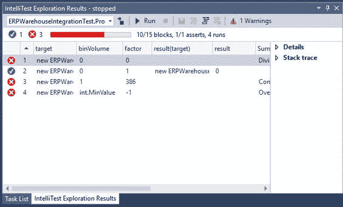

在我们创建了第一个 IntelliTest 之后，我们需要对它做一些事情。逻辑选项是运行测试并查看该方法的测试结果。要执行此操作，请右键单击该方法，然后单击上下文菜单中的 **Run IntelliTest** 。


图 49：运行 IntelliTest

Visual Studio 将继续构建项目，然后启动 **IntelliTest Exploration Results** 窗口。此窗口显示所有可能的方法参数，这些参数将导致所测试方法的代码的最大覆盖范围。您现在可以了解该方法在测试中的表现。



图 50：IntelliTest 探索结果

我们马上可以看到三个测试失败，一个测试通过。在 **IntelliTest Exploration Results** 窗口的右侧，**详细信息**和**堆栈跟踪**显示在可折叠节点中。让我们仔细看看测试结果。

### 测试 2：通过

ProductionVolumePerBin（）方法必须始终导致切割体积等于料桶体积。根据测试 2 中使用的变量，我们可以看到它通过，因为 bin 体积是 0 ，并且该方法的结果也是 0 。

```
[TestMethod]
[PexGeneratedBy(typeof(ERPWarehouseIntegrationTest))]
public void ProductionVolumePerBinTest33()
{
    ERPWarehouseIntegration eRPWarehouseIntegration;
    int i;
    eRPWarehouseIntegration = new ERPWarehouseIntegration();
    i = this.ProductionVolumePerBinTest(eRPWarehouseIntegration, 0, 1);
    Assert.AreEqual<int>(0, i);
    Assert.IsNotNull((object)eRPWarehouseIntegration);
    Assert.AreEqual<int>(0, eRPWarehouseIntegration.MaxBinQuantity);
    Assert.AreEqual<int>(0, eRPWarehouseIntegration.CurrentBinQuantity);
}

```

代码 63：详细信息中生成的代码

查看 **Details** 节点，我们可以看到生成的单元测试代码。

### 测试 1：失败，DivideByZeroException

看看测试 1，我们可以看到它失败了，因为它试图除以零。


图 51：除以零异常

这意味着我们忘记了处理零因子值。如果你看一下 CutSteel（）方法，你会看到我们正在处理模数而不是除数。那么我们如何才能实现除零例外呢？那么经验法则是，如果 / 或％的第二个操作数为零，我们将有一个除零异常。

### 测试 3：失败，ContractException

测试 3 失败，因为代码合同确保了该方法不遵守的结果。请记住， ProductionVolumePerBin（）方法可确保将 bin 卷返回到调用代码，这表示我们已经生成了一个零废料的完美切割。测试失败，在生产环境中会出现这种情况。我们的代码合同确保方法返回的结果始终等于 bin 卷。这意味着我们需要处理不完美切割的可能性。

### 测试 4：失败，溢出异常

最后一次失败的测试非常有趣。我们可以看到测试通过了 binVolume 的 int.MinValue 。根据 MSDN 文档， int.MinValue 表示 Int32 的最小可能值。它也是一个常数，其值为 -2,147,483,648 。该因子的值为 -1 ，模数导致**溢出异常**。这意味着我们在 CutSteel（）方法中的代码实际上将是 int.MinValue％-1; 这不符合我们的测试。

发生这种情况的原因是因为 C＃语言规范实现了它。在 **7.8.3 **C＃语言规范**的剩余运算符**中，它指出：“如果左操作数是 或长值的最小值并且右操作数是 -1 ，抛出 System.OverflowException 。“

|  | 注意：如果您想深入挖掘一下，可以在 StackOverflow 上查看[这个线程](https://stackoverflow.com/questions/31775042/why-does-the-c-sharp-specification-leave-int-minvalue-1-implementation-defi)，以便很好地解释为什么在 C＃中以这种方式实现它。 |