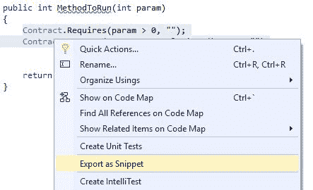
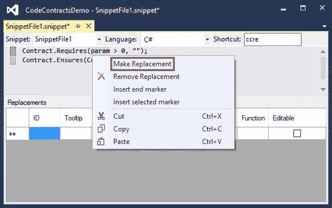
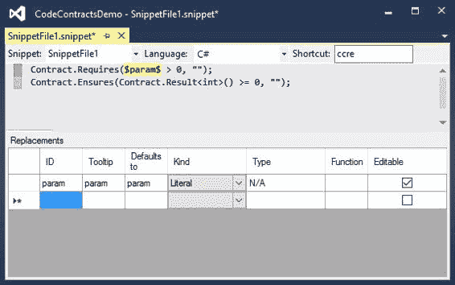
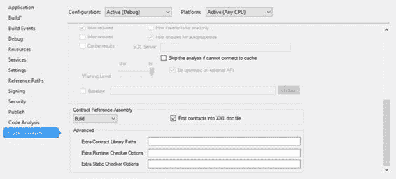
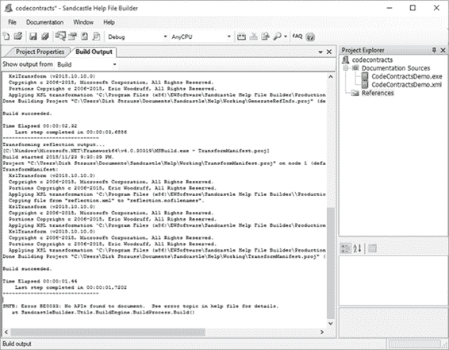
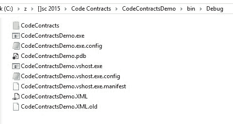
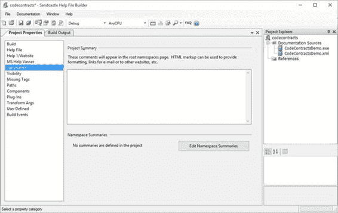
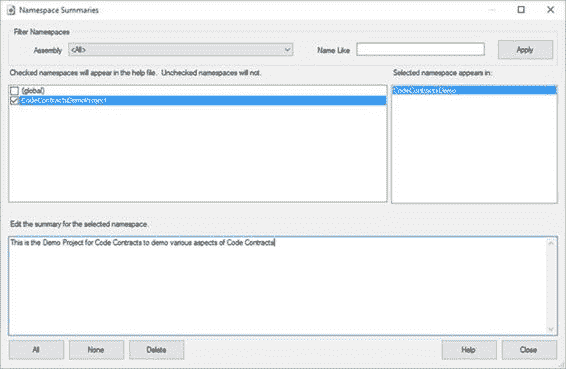
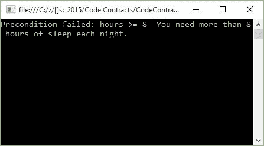

# 第 3 章一些有用的提示

## 使用代码段

您可能已经熟悉 Visual Studio 中的代码片段;代码合同也提供此功能。安装代码合同时，会添加代码段。如果您使用的是 C# ，只需键入快捷方式并按两次 Tab 键即可。

在 Visual Basic 中，代码片段的使用略有不同。键入快捷方式，然后按 Tab 键。 C# 和 Visual Basic 中的快捷键之间存在细微差别。 Contract.Requires 快捷方式，例如，通过键入 cr 在 C# 中调用，但在 Visual Basic 中，通过键入 creq 调用它。

### C# 代码片段

以下代码清单说明了 C# 代码段快捷方式。使用的快捷方式是注释掉的第一行，后跟代码段生成的代码。

```
//cr
Contract.Requires(false);

```

代码 27：Contract.Requires Snippet

```
//ce
Contract.Ensures();

```

代码 28：Contract.Ensures 片段

```
//ci
Contract.Invariant(false);

```

代码 29：Contract.Invariant Snippet

```
//crr
Contract.Result<int>()

```

代码清单 30：Contract.Result 片段

```
//co
Contract.OldValue(x)

```

代码 31：Contract.OldValue Snippet

```
//cim
[ContractInvariantMethod]
[System.Diagnostics.CodeAnalysis.SuppressMessage(
    "Microsoft.Performance", "CA1822:MarkMembersAsStatic",
    Justification = "Required for code contracts.")]
private void ObjectInvariant()
{
    Contract.Invariant(false);
}

```

代码 32：ContractInvariantMethod 代码片段

```
//crn
Contract.Requires(arg != null);

```

代码 33：Contract.Requires Not Null Snippet

```
//cen
Contract.Ensures(Contract.Result<string>() != null);

```

代码清单 34：Contract.Ensures Contract.Result Snippet

```
//crsn
Contract.Requires(!String.IsNullOrEmpty(arg));

```

代码 35：Contract.Requires String with Value Snippet

```
//cesn
Contract.Ensures(!String.IsNullOrEmpty(Contract.Result<string>()));

```

代码 36：Contract.Ensures Contract.Result with String Value Snippet

```
//cca
Contract.Assert(false);

```

代码 37：Contract.Assert 片段

```
//cam
Contract.Assume(false);

```

代码 38：Contract.Assume Snippet

```
//cre
Contract.Requires<ArgumentException>(false);

```

代码 39：Contract.Requires with ArgumentException Snippet

```
//cren
Contract.Requires<ArgumentNullException>(arg != null, "arg");

```

代码 40：契约需要参数不是空代码片段

```
//cresn
Contract.Requires<ArgumentException>(!String.IsNullOrEmpty(arg));

```

代码 41：Contract.Requires 带有 Value 的字符串参数

```
//cintf
#region IFoo contract binding
[ContractClass(typeof(IFooContract))]
public partial interface IFoo
{

}

[ContractClassFor(typeof(IFoo))]
abstract class IFooContract : IFoo
{
}
#endregion

```

代码清单 42：接口模板和关联的 Contract Class Snippet

## 扩展代码段

严格来说，下一部分并不是代码合同所独有的，但如果我没有提及扩展代码片段的能力，那将是我的疏忽。我一直发现扩展代码片段有点麻烦。幸运的是，对于开发人员来说，有一些非常慷慨的社区成员可以为 Visual Studio 创建出色的扩展。 Snippet Designer 就是这样一个扩展。

在使用它之前，您需要从**工具**菜单下的**扩展和更新**安装 Snippet Designer。


图 27：Visual Studio 扩展和更新菜单项

安装了 Snippet Designer 后，它将显示在已安装的扩展程序下。


图 28：Snippet Designer 扩展

最基本的 Snippet Designer 使您能够动态生成代码片段。关于代码合同，我总是希望在我的方法中包含一些代码。我希望能够在一个代码片段下将它们链接在一起，为此，Snippet Designer 非常适合。

突出显示要创建代码段的代码合约，打开上下文菜单，然后单击**导出为代码段**。



图 29：导出为片段

Snippet Designer 窗口现在显示在 Visual Studio 2015 IDE 中的新选项卡中。


图 30：Snippet Designer 编辑器

请注意，粉红色突出显示不是 Snippet Designer 的功能;这是另一个名为 Heat Margin 的伟大扩展。但是，这超出了本书的范围。

在 Snippet Designer 窗口中，您可以在编辑器窗口中看到突出显示的代码。

选择要在生成时替换的代码部分。然后，右键单击并从上下文菜单中选择 **Make Replacement** 。



图 31：更换



图 32：已完成的新代码段

您将看到参数被占位符替换，并且该替换项网格中定义了该占位符的属性。剩下要做的就是给快捷方式一个名字（我称之为“TAG0] ccre 为”代码合同需要保证“）并保存你的代码片段。

在 Visual Studio 的代码编辑器中，键入 ccre 快捷键并按两次 Tab 键。我为我插入了我的代码片段，并将标识为替换的参数突出显示，以便我可以立即对其进行编辑。


图 33：插入的代码片段

这是一个非常容易使用的工具，我甚至还没有开始探索它为开发人员提供的可能性。我的重点仅仅是说明代码片段对开发人员非常有用，并且可以在开发过程中进行扩展以满足您的特定需求。

## 代码合同文件生成

我确信大多数（如果不是全部）开发人员不喜欢创建文档的一件事。在许多项目会议中，它已成为房间里的大象。每个人都知道文档是必不可少的，我相信有很多开发人员可以创建简洁而丰富的文档。这显然导致了许多工具和扩展，旨在使这个过程更容易。

因此，Code Contracts 也可以整合所包含合同的文档。要启用文档生成，您需要打开项目属性的 **Build** 选项卡。


图 34：启用 XML 文档文件

在这里，您需要选择 **XML 文档文件**选项。如果未启用此选项，则不会创建文档 XML 文件。您还可以在此处指定文档文件的输出路径和名称。

您需要修改的下一个选项是**代码合同**选项卡。如果滚动到“代码合同”选项卡的底部，您将看到未指定**合约引用程序集**值。将其更改为 **Build** 。

最后，您必须确保选择 **Emit 合同到 XML doc 文件**选项。这将使代码合同注释成为生成的文档文件的一部分。



图 35：启用代码合同文档

然后，您需要确保为代码添加了良好的注释。一旦你创建了一个逻辑不明显的新方法或代码行，你就需要进入这个习惯。另一方面，在代码中包含太多注释也不是一个好主意。所以你什么时候评论，什么时候不评论？一个好的经验法则是只在代码背后的逻辑不明显时才注释代码。

在下面的代码清单中，逻辑在第一个（代码清单 43）中很明显，因此实际上不需要进行注释。但是，在代码清单 44 中，应该在注释中解释模数运算符的使用，因为这样做的原因并不明显。

```
//Bad comment: Calculate the available quantity
int QtyAvailable = MaxBinQuantity - CurrentBinQuantity;

```

代码 43：不必要的代码注释

```
//Good comment: Use modulus to determine if the factor produces any scrap
return volumeToCut % factor;

```

代码清单 44：注释清楚地解释逻辑

评论很好的方法可能如下所示。

```
/// <summary>
/// Calculate any remainder after the modulus operation between volume and factor
/// </summary>
/// <param name="volumeToCut"></param>
/// <param name="factor"></param>
/// <returns>Remainder after cutting</returns>
private int CutSteel(int volumeToCut, int factor)
{
    // Use modulus to determine if the factor produces any scrap
    return volumeToCut % factor;
}

```

代码清单 45：评论良好的方法

添加相关注释后，您需要构建解决方案。在生成文档文件时，您需要了解在构建期间可能收到的任何警告。这些通常与源代码中缺少 XML 注释有关。通过向您的方法和属性添加清晰且相关的代码注释来继续解决这些问题是个好主意。

构建完成后，将在配置构建设置时指定的路径中找到 XML 文档。在此示例中，生成的 XML 文档包括代码合同描述。

```
<?xml version="1.0"?>
<doc>
<assembly>
    <name>CodeContractsDemo</name>
</assembly>
<members>
    <member name="T:ERPWarehouseIntegration">
    <summary>
            ERP Warehouse Integration class to manage the cutting of steel volume and available bin quantities
            </summary>
    </member>
    <member name="P:ERPWarehouseIntegration.MaxBinQuantity">
    <summary>
            The maximum bin quantity for bins
            </summary>
    </member>
    <member name="P:ERPWarehouseIntegration.CurrentBinQuantity">
    <summary>
            The current bin quantity available
            </summary>
    </member>
    <member name="M:ERPWarehouseIntegration.ProductionVolumePerBin(System.Int32,System.Int32)">
    <summary>
            Calculate the production volume of steel per bin
            </summary>
    <param name="binVolume" />
    <param name="factor" />
    <returns>Bin Volume less Remainder</returns>
    <ensures description="The factor used will result in scrap. Please modify the cutting factor." csharp="result == binVolume" vb="result = binVolume">result == binVolume</ensures>
    </member>
    <member name="M:ERPWarehouseIntegration.CutSteel(System.Int32,System.Int32)">
    <summary>
            Calculate any remainder after the modulus operation between volume and factor
            </summary>
    <param name="volumeToCut" />
    <param name="factor" />
    <returns>Remainder after cutting</returns>
    </member>
    <member name="M:ERPWarehouseIntegration.BinQtyAvailable">
    <summary>
            Ensure that a non-negative value is returned for available bin quantity
            </summary>
    <returns>Available bin quantity</returns>
    <ensures csharp="result &gt;= 0" vb="result &gt;= 0">result &gt;= 0</ensures>
    </member>
    <member name="M:ERPWarehouseIntegration.EnsureAllBinsFilled(System.Int32@,System.Int32,System.Int32)">
    <summary>
            Ensure that all bins are filled and that the steel volume does not exceed the maximum bin volume
            </summary>
    <param name="binOverCount" />
    <param name="binVol" />
    <param name="steelVol" />
    <ensures description="The steel volume exceeds the bin volume" csharp="binOverCount == 0" vb="binOverCount = 0">binOverCount == 0</ensures>
    </member>
</members>
</doc>

```

代码清单 46：生成的 XML 文档文件

我们可以轻松地为我们的代码生成简洁的 XML 文档，而无需繁重的工作。如果您定期评论您的代码，您生成的文档将是最新的，并真实反映您的代码状态。

### 创建用户友好的文档

生成的 XML 文件很棒，但是需要另一个步骤来创建格式良好，人类可读的 HTML 类型文档。对于此任务，我将使用 Sandcastle 帮助文件生成器，您可以从 [github.com/EWSoftware/SHFB](https://github.com/EWSoftware/SHFB) 从 GitHub 下载。在引导式安装过程中，请仔细阅读每个屏幕的说明和注释，因为这些内容包含您需要注意的重要信息。

我建议阅读有关使用 Sandcastle 帮助文件生成器的更多教程。该工具有很多东西需要真正深入了解这个优秀的工具。但是，出于本书的目的，除了向您展示如何创建基本的.chm 帮助文件之外，我不会详细介绍任何其他细节。

在使用 Sandcastle 帮助文件生成器之前，必须确保项目具有命名空间。否则，您将在帮助文件构建中看到以下错误。



图 36：构建输出错误

```
SHFB: Error BE0033: No APIs found to document. See error topic in help file for details.
at SandcastleBuilder.Utils.BuildEngine.BuildProcess.Build()

```

代码 47：Sandcastle 帮助文件生成器错误

我只是在我的类中添加了一个命名空间，如代码清单 48 所示。

```
namespace CodeContractsDemoProject
{
    /// <summary>
    /// ERP Warehouse Integration class to manage the cutting of steel volume and available bin quantities
    /// </summary>
    public class ERPWarehouseIntegration
    {

```

代码清单 48：添加到类的命名空间

完成后，打开 **Sandcastle 帮助文件生成器**，如果它尚未打开。在**项目浏览器**中，右键单击**文档源**节点，并将项目所在的.dll 或.exe 添加到（通常是 bin 文件夹）。我选择将我的 XML 文档输出到我的 bin 文件夹。



图 37：项目箱文件夹

一旦我选择了.exe 文件，XML 文档文件也会被 Sandcastle 帮助文件生成器自动选取并添加为文档源。添加的文件将显示在**文档源**节点下的**项目浏览器**中。



图 38：文档来源和摘要

**项目属性**选项卡中有各种其他部分可供您修改和设置。记住配置的重要一点是 **Summaries** 部分。您需要确保在**项目属性**选项卡的**摘要**页面中添加了命名空间摘要注释。单击**编辑命名空间摘要**按钮以打开**命名空间摘要**窗口。



图 39：命名空间摘要窗口

选择要为其添加摘要的名称空间，然后在**编辑所选名称空间的摘要**文本框中输入摘要说明。完成后，单击**关闭**按钮并保存项目。

您现在可以构建 Sandcastle 帮助文件构建器项目，该项目将生成您指定的帮助文件。

支持的帮助文件格式类型：

*   HTML 帮助 1（chm）
*   MS Help Viewer（mshc）
*   Open XML（docx）
*   降价（md）
*   网站（HTML / ASP.NET）


图 40：Sandcastle 帮助文件生成器成功构建

构建完成后，导航到生成的帮助文件的输出目录。我的默认路径 **Documents \ Sandcastle \ Help** 。


图 41：帮助文件输出路径

打开生成的帮助文件，您将看到编译采用了之前 **Summaries** 部分中添加的命名空间摘要，并将其添加为生成的帮助文件的摘要文本。


图 42：生成的帮助文件

一旦知道如何操作，就可以很容易地从代码合同注释中创建文档。借助 **Sandcastle 帮助文件生成器**等精湛的工具以及紧密集成的代码契约，可以将注释输出提供给生成的 XML 文件，开发人员可以获得为项目创建丰富文档所需的一切。

## 抽象类和接口

正如您所料，创建抽象类和接口的代码契约需要稍微有所不同。这是因为抽象类和接口不能包含方法体。许多开发人员仍然想知道抽象类和接口之间的区别。我听说过区分何时使用抽象类以及何时使用接口的最佳解释之一如下。

### 抽象类

如果您有许多可以组合在一起并由单个名词描述的类，那么您最有可能处理抽象类。然后将抽象类命名为此名词。另一个需要考虑的重要事项是，这些继承的类共享某种功能，并且您永远不会创建名词的实例（抽象类）。

想想下面的例子，你有一个 Human 类型的抽象类。你永远不会只实例化一个人类，而是一种人类，例如女性或男性。因此，男性和女性都继承自抽象类人类。然后抽象类将实现一个方法 void Sleep（），所有人都必须这样做（共享功能）。

要在抽象类上实现代码约定，您需要创建一个单独的 ContractClass 类，并通过使用属性将契约类与抽象类相关联。

```
using System.Diagnostics.Contracts;

/// <summary>
/// Human Abstract Class
/// </summary>
[ContractClass(typeof(HumanContract))]
public abstract class Human
{
    public abstract void Run(int distance);
    public abstract void Sleep(int hours);
}

/// <summary>
/// Human Contract Class
/// </summary>
[ContractClassFor(typeof(Human))]
public abstract class HumanContract : Human
{
    public override void Sleep(int hours)
    {
        Contract.Requires(hours >= 8,
            "You need more than 8 hours of sleep each night.");
    }
}

```

代码 49：抽象类和合同类

抽象类 Human 使用属性 [ContractClass（typeof（HumanContract））] ，契约类 HumanContract 使用属性 [ContractClassFor（typeof（人类））。

抽象类 Human 基本上指定所有人都会睡觉和奔跑。在睡眠（）方法（在 HumanContract 中定义）的合同中，我们定义所有人每晚必须至少睡 8 小时。

让我们创建一个继承自 Human 抽象类的 Male 类。

```
public class Male : Human
{
    public override void Run(int distance)
    {
        Console.Write("The distance run was " + distance);
        Console.ReadLine();
    }

    public override void Sleep(int hours)
    {
        Console.Write("The hours slept were " + hours);
        Console.ReadLine();
    }
}

```

代码 50：男性类继承人类

从 Male 类中我们可以看到它根本不包含代码合约。它所做的只是继承自 Human 抽象类。

```
namespace CodeContractsDemo
{
    class Program
    {
        static void Main(string[] args)
        {
            try
            {
                Male oMan = new Male();
                oMan.Sleep(5);
            }
            catch (Exception ex)
            {
                Console.Write(ex.Message);
                Console.ReadLine();
            }
        }
    }
}

```

代码 51：五小时睡眠男性类的实例化

如果我们必须实例化男性类并用 5 小时调用睡眠方法，我们的代码合同将启动并告诉我们人类每晚需要 8 小时的睡眠时间。



图 43：违反男性类睡眠方法的合同

修改我们的呼叫代码以指定一个不错的星期六早上小时 9 小时，描绘了不同的画面。

```
namespace CodeContractsDemo
{
    class Program
    {
        static void Main(string[] args)
        {
            try
            {
                Male oMan = new Male();
                oMan.Sleep(9);
            }
            catch (Exception ex)
            {
                Console.Write(ex.Message);
                Console.ReadLine();
            }
        }
    }
}

```

代码 52：9 小时睡眠男性类的实例化

验证代码合同， Sleep（）方法通过验证。


图 44：通过男性类睡眠方法合同

代码契约和抽象类协同工作，为开发人员团队创建真正稳定且强大的代码库。

### 接口

让我们使用前面的 Male 和 Female 类的例子。从现在开始快 20 年，我们在火星上发现了外星人。它们与我们惊人地相似，使它们成为人类，但它们既不是男性也不是女性。我们现在有一个新类型， Alien ，它继承自抽象类 Human 。

现在将接口视为动词。哪个动词一般可以应用于我的课程？所有人都需要学习新东西并且可以学习，所以现在我们可以创建一个名为 ITeachable 的界面。我们将在 Human 抽象类上实现 ITeachable 接口，因为所有人都是可教的。然而，外星人比男性或女性稍微先进，并且可以将他们的分子重新排列成不同的结构，使外星人能够变形。因此，我们可以创建一个名为 IShapeShiftable 的接口，该接口仅适用于 Alien 。

创建界面很像抽象类。它还需要包含一个契约类，接口和契约类都需要通过它们的属性相互指向。

```
using System.Diagnostics.Contracts;

[ContractClass(typeof(IShapeShiftableContract))]
public interface IShapeShiftable
{
    void Man(int shapeDuration);
    void Woman(int shapeDuration);
    void InanimateObject(int shapeDuration);
}

[ContractClassFor(typeof(IShapeShiftable))]
abstract class IShapeShiftableContract : IShapeShiftable
{
    void IShapeShiftable.InanimateObject(int shapeDuration)
    {
        Contract.Requires(shapeDuration <= 12);
    }

    void IShapeShiftable.Man(int shapeDuration)
    {
        Contract.Requires(shapeDuration <= 4);
    }

    void IShapeShiftable.Woman(int shapeDuration)
    {
        Contract.Requires(shapeDuration <= 4);
    }
}

```

代码 53：接口实现代码合同类

我们现在可以通过契约类 IShapeShiftableContract 为接口创建合同，就像我们之前为抽象类所做的那样。

### 抽象类与接口

总结抽象类和接口的示例，这一切都归结为您希望实现的位置。如果要在所有派生类之间共享实现，则将创建一个抽象类。如果您需要特定于单个类或多个类的实现，而不是所有类，请使用接口。

代码合同很容易满足两者。

## 方法纯度

如果没有提到纯度，关于守则合同的书就不完整。在提及代码合同时，方法纯度到底意味着什么？那么，Code Contracts 有一个名为 [Pure] 的属性，你可以用它来装饰方法。这基本上是方法质量的表达，并且该方法不能改变调用者看到的任何对象的状态。换句话说，纯方法只允许更改输入方法后创建的对象。

代码合同要求合同内部调用的所有方法都是纯粹的。原因很简单：

*   避免在前提条件和后置条件中使用的方法中的副作用。
*   使静态检查器的任务更容易，因为它可以假定在调用方法后对象状态将是相同的。
*   通过明确说明方法调用结束后方法不会改变对象状态的意图来改进设计。

为了说明非纯方法对静态检查器的影响，请考虑以下代码清单。

```
public class DemoPurity
{
    /// <summary>
    /// Property for cutting factor
    /// </summary>
    public int CutFactor { get; private set; }

    /// <summary>
    /// Public Constructor
    /// </summary>
    /// <param name="cutFactor"></param>
    public DemoPurity(int cutFactor)
    {
        CutFactor = cutFactor;
    }

    /// <summary>
    /// Calculate the volume cut
    /// </summary>
    /// <param name="volumeSteel"></param>
    /// <param name="factorModifier"></param>
    /// <returns></returns>
    public int VolumeCut(int volumeSteel, int factorModifier)
    {
        Contract.Requires(CalculatedCutFactor(factorModifier) >= 0);

        return volumeSteel / (CutFactor * factorModifier);
    }

    /// <summary>
    /// This is not a pure method
    /// </summary>
    /// <param name="factorModifier"></param>
    /// <returns></returns>
    public int CalculatedCutFactor(int factorModifier)
    {
        CutFactor = CutFactor * factorModifier;
        return CutFactor;
    }    
}

```

代码 54：方法失败纯度

属性 CutFactor 在 DemoPurity 的构造函数中指定。方法 VolumeCut 包括 CalculatedCutFactor 方法的必需合同。如您所见， CalculatedCutFactor 方法绝对不纯，因为它修改了 CutFactor 属性。这也是草率的代码。静态检查器将在构建时失败，因为该方法不纯。

```
1>------ Rebuild All started: Project: CodeContractsDemo, Configuration: Debug Any CPU ------
1>C:\z\[]sc 2015\Code Contracts\CodeContractsDemo\ERPIntegration.cs(197,9): warning CC1036: Detected call to method 'DemoPurity.CalculatedCutFactor(System.Int32)' without [Pure] in contracts of method 'DemoPurity.VolumeCut(System.Int32,System.Int32)'.
CodeContracts: CodeContractsDemo: Run static contract analysis.
C:\z\[]sc 2015\Code Contracts\CodeContractsDemo\ERPIntegration.cs(197,9): warning CC1036: CodeContracts: Detected call to method 'DemoPurity.CalculatedCutFactor(System.Int32)' without [Pure] in contracts of method 'DemoPurity.VolumeCut(System.Int32,System.Int32)'.
14.0\Common7\IDE\CodeContractsDemo.exe(1,1): message : CodeContracts: Checked 15 assertions: 13 correct (2 masked)
CodeContracts: CodeContractsDemo:
CodeContracts: CodeContractsDemo: Static contract analysis done.
========== Rebuild All: 0 succeeded, 1 failed, 0 skipped ==========

```

代码 55：缩短输出结果

我从输出文本中删除了与纯度讨论无关的所有额外行。您可以看到静态检查器不满意 CalculatedCutFactor 不纯。我们显然可以继续将 [Pure] 属性添加到 CalculatedCutFactor 方法中，但这不是一个好的编程习惯。如果我们这样做，它将导致成功构建，因为我们基本上告诉静态检查器我们的方法 CalculatedCutFacor 是纯粹的。如果我们因此修改了代码，如代码清单 56 所示，静态检查器将假定该方法是纯粹的。

```
public class DemoPurity
{
    /// <summary>
    /// Property for cutting factor
    /// </summary>
    public int CutFactor { get; private set; }

    /// <summary>
    /// Public Constructor
    /// </summary>
    /// <param name="cutFactor"></param>
    public DemoPurity(int cutFactor)
    {
        CutFactor = cutFactor;
    }

    /// <summary>
    /// Calculate the volume cut
    /// </summary>
    /// <param name="volumeSteel"></param>
    /// <param name="factorModifier"></param>
    /// <returns></returns>
    public int VolumeCut(int volumeSteel, int factorModifier)
    {
        Contract.Requires(CalculatedCutFactor(factorModifier) >= 0);

        return volumeSteel / (CutFactor * factorModifier);
    }

    /// <summary>
    /// This is still not a pure method
    /// </summary>
    /// <param name="factorModifier"></param>
    /// <returns></returns>
    [Pure]
    public int CalculatedCutFactor(int factorModifier)
    {
        CutFactor = CutFactor * factorModifier;
        return CutFactor;
    }    
}

```

代码 56：向方法添加纯属性

如果我们必须构建我们的项目，结果输出将指示成功构建。

```
1>------ Rebuild All started: Project: CodeContractsDemo, Configuration: Debug Any CPU ------
1> elapsed time: 886,9984ms
1> elapsed time: 177,9426ms
1> elapsed time: 1120,0034ms
CodeContracts: CodeContractsDemo: Run static contract analysis.
1> CodeContractsDemo -> C:\z\[]sc 2015\Code Contracts\CodeContractsDemo\bin\Debug\CodeContractsDemo.exe
CodeContracts: CodeContractsDemo: Validated: 100,0%
CodeContracts: CodeContractsDemo: Checked 15 assertions: 13 correct (2 masked)
CodeContracts: CodeContractsDemo: Contract density: 0,98
CodeContracts: CodeContractsDemo: Total methods analyzed 6
CodeContracts: CodeContractsDemo: Methods analyzed with a faster abstract domain 0
CodeContracts: CodeContractsDemo: Methods with 0 warnings 5
CodeContracts: CodeContractsDemo: Time spent in internal, potentially costly, operations
CodeContracts: CodeContractsDemo: Overall time spent performing action #KarrPutIntoRowEchelonForm: 00:00:00.0140007 (invoked 784 times)
Overall time spent performing action #KarrIsBottom: 00:00:00.0120029 (invoked 1515 times)
Overall time spent performing action #WP: 00:00:00.2000032 (invoked 5 times)
Overall time spent performing action #CheckIfEqual: 00:00:00.0080005 (invoked 29 times)
Overall time spent performing action #ArraysAssignInParallel: 00:00:00.1430061 (invoked 1 times)
Overall time spent performing action #Simplex: 00:00:00.0810009 (invoked 19 times)
CodeContracts: CodeContractsDemo: Total time 7,821sec. 1303ms/method
CodeContracts: CodeContractsDemo: Generated 2 callee assume(s)
CodeContracts: CodeContractsDemo: Retained 0 preconditions after filtering
CodeContracts: CodeContractsDemo: Inferred 0 object invariants
CodeContracts: CodeContractsDemo: Retained 0 object invariants after filtering
CodeContracts: CodeContractsDemo: Discovered 3 postconditions to suggest
CodeContracts: CodeContractsDemo: Retained 1 postconditions after filtering
CodeContracts: CodeContractsDemo: Detected 1 code fixes
CodeContracts: CodeContractsDemo: Proof obligations with a code fix: 3
C:\Program Files (x86)\Microsoft Visual Studio 14.0\Common7\IDE\CodeContractsDemo.exe(1,1): message : CodeContracts: Checked 15 assertions: 13 correct (2 masked)
CodeContracts: CodeContractsDemo:
CodeContracts: CodeContractsDemo: Static contract analysis done.
========== Rebuild All: 1 succeeded, 0 failed, 0 skipped ==========

```

代码 57：成功构建

这里的问题是简单地将 [Pure] 属性添加到 CalculatedCutFactor 方法并不会使其纯粹。这是我试图用方法纯度这一部分做的一点。我们需要确保合同中调用的方法是纯粹的，因为它们是设计的，而不是因为我们用 [Pure] 属性装饰它们。让我们再看一下我们的 CalculatedCutFactor 方法并稍微修改它，这样我们就不会违反为方法纯度指定的规则。

```
public class DemoPurity
{
    /// <summary>
    /// Property for cutting factor
    /// </summary>
    public int CutFactor { get; private set; }

    /// <summary>
    /// Public Constructor
    /// </summary>
    /// <param name="cutFactor"></param>
    public DemoPurity(int cutFactor)
    {
        CutFactor = cutFactor;
    }

    /// <summary>
    /// Calculate the volume cut
    /// </summary>
    /// <param name="volumeSteel"></param>
    /// <param name="factorModifier"></param>
    /// <returns></returns>
    public int VolumeCut(int volumeSteel, int factorModifier)
    {
        Contract.Requires(CalculatedCutFactor(factorModifier) >= 0);

        return volumeSteel / (CutFactor * factorModifier);
    }

    /// <summary>
    /// This is a pure method
    /// </summary>
    /// <param name="factorModifier"></param>
    /// <returns></returns>
    [Pure]
    public int CalculatedCutFactor(int factorModifier)
    {
        return CutFactor * factorModifier;        
    }    
}

```

代码 58：标记为 Pure 的纯方法

CalculatedCutFactor 方法现在是纯方法，因为它不会更改 CutFactor 或 factorModifier 的值。它现在可以适当地用 [Pure] 属性进行修饰。我们在 VolumeCut 方法中的 Contract.Requires 现在可以使用这个纯方法检查 CalculatedCutFactor 的结果是否不为零，因为这会导致返回时除以零例外。

方法纯度是一个非常好的做法，不仅在使用代码契约时，而且在您编写的每种方法中。

## 合同缩写方法

我确信那些经常使用代码合同的人遇到了跨多种方法重复类似代码集合的问题。代码契约有一个解决方案，它们被称为**缩写方法**。这个概念非常简单。您可以看到代码清单 59 中的代码包含重复的代码约定集。

```
public class AbbreviatorDemo
{
    /// <summary>
    /// The factor for the cutting volume
    /// </summary>
    public int Factor { get; private set; }
    /// <summary>
    /// The maximum volume a bin can contain
    /// </summary>
    public int MaxVolume { get; private set; }

    /// <summary>
    /// Fill the bin with the volume of steel
    /// </summary>
    /// <param name="steelVolume"></param>
    public void FillBin(int steelVolume)
    {
        Contract.Requires(steelVolume > 0);
        Contract.Ensures(steelVolume <= this.MaxVolume);
    }

    /// <summary>
    /// Empty the bin of all steel contained
    /// </summary>
    /// <param name="steelVolume"></param>
    /// <returns></returns>
    public bool PurgeBin(int steelVolume)
    {
        Contract.Requires(steelVolume > 0);
        Contract.Ensures(steelVolume <= this.MaxVolume);
        Contract.Ensures(Contract.Result<bool>() == true);

        // Purge bin and return successful result
        return true;
    }

    /// <summary>
    /// Perform a partial bin fill
    /// </summary>
    /// <param name="steelVolume"></param>
    /// <returns></returns>
    public bool FillBinPartially(int steelVolume)
    {
        Contract.Requires(steelVolume > 0);
        Contract.Ensures(steelVolume < this.MaxVolume);
        Contract.Ensures(Contract.Result<bool>() == true);

        return true;
    }    
}

```

代码 59：重复的合同

我们现在可以使用 Abbreviator 方法来简化代码并在多种方法中引用它们。使用缩写器方法，可以如下重构代码。

```
public class AbbreviatorDemo
{
    /// <summary>
    /// The factor for the cutting volume
    /// </summary>
    public int Factor { get; private set; }
    /// <summary>
    /// The maximum volume a bin can contain
    /// </summary>
    public int MaxVolume { get; private set; }

    /// <summary>
    /// Fill the bin with the volume of steel
    /// </summary>
    /// <param name="steelVolume"></param>
    public void FillBin(int steelVolume)
    {
        ValidSteelAndMaxVolume(steelVolume);
    }

    /// <summary>
    /// Empty the bin of all steel contained
    /// </summary>
    /// <param name="steelVolume"></param>
    /// <returns></returns>
    public bool PurgeBin(int steelVolume)
    {
        ValidSteelAndMaxVolume(steelVolume);
        EnsurePositiveResult();

        // Purge bin and return successful result
        return true;
    }

    /// <summary>
    /// Perform a partial bin fill
    /// </summary>
    /// <param name="steelVolume"></param>
    /// <returns></returns>
    public bool FillBinPartially(int steelVolume)
    {
        ValidSteelAndMaxVolume(steelVolume);
        EnsurePositiveResult();

        return true;
    }    

    /// <summary>
    /// Abbreviator method for steel and max volume
    /// </summary>
    /// <param name="steelVolume"></param>
    [ContractAbbreviator]
    private void ValidSteelAndMaxVolume(int steelVolume)
    {
        Contract.Requires(steelVolume > 0);
        Contract.Ensures(steelVolume <= this.MaxVolume);
    }

    /// <summary>
    /// Abbreviator method for successful result
    /// </summary>
    [ContractAbbreviator]
    private void EnsurePositiveResult()
    {
        Contract.Ensures(Contract.Result<bool>() == true);
    }
}

```

代码 60：使用缩写方法

我添加了两个新方法， ValidSteelAndMaxVolume 和 EnsurePositiveResult ，并为它们添加了 [ContractAbbreviator] 属性。这使我能够在我的方法中减少重复的代码契约集。在查看合同下的方法时，它使阅读更容易，功能更清晰。要记住的另一点是，如果需要，缩写器方法可以包含对其他缩写器方法的调用。