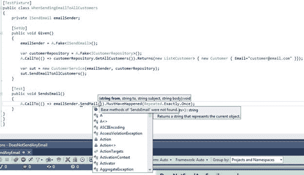
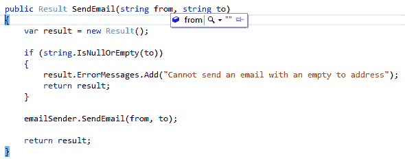
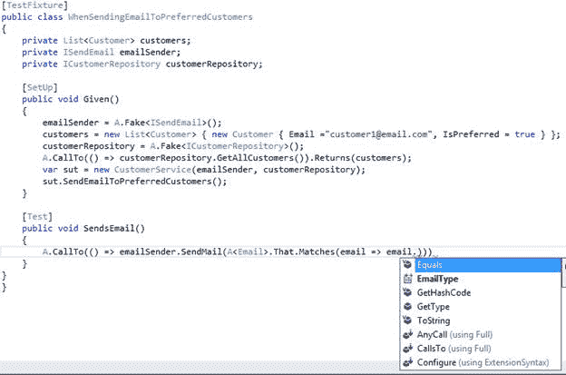

# 第 8 章参数

到目前为止，我们已经看到了如何创建虚假，如何配置它，如何指定行为以及如何使用 FakeItEasy 进行断言。到目前为止，通过所有样本，我们一直在使用 ISendEmail 接口来公开没有参数的成员。

```
public interface ISendEmail
{
    void SendMail();
}

```

代码 79：ISendEmail 接口

在现实世界中，调用不带参数的 SendMail 方法实际上并没有那么有用。我们知道我们想发送电子邮件，但是要发送电子邮件，您至少需要“来自”地址，“到”地址，主题和正文等信息。

在本章中，我们将探讨如何将参数传递和约束到伪造成员，以及查看这些约束如何在我们的伪造的断言中使用。

## 将参数传递给方法

让我们首先在我们的 ISendEmail 接口上为我们的 SendMail 成员添加一些参数：

```
public interface ISendEmail
{
    void SendMail(string from, string to, string subject, string body);
}

```

代码 80：带有参数的新 ISendEmail 接口

我们还将电子邮件成员添加到我们的客户类：

```
public class Customer
{
    public string Email { get; set; }
}

```

代码 81：具有 Email 属性的 Customer 类

回到我们之前的 CustomerService 类的例子，让我们看一下在代码中使用时改变的 ISendEmail 接口和 Customer 类的外观：

```
public class CustomerService
{
    private readonly ISendEmail emailSender;
    private readonly ICustomerRepository customerRepository;

    public CustomerService(ISendEmail emailSender,
        ICustomerRepository customerRepository)
    {
        this.emailSender = emailSender;
        this.customerRepository = customerRepository;
    }

    public void SendEmailToAllCustomers()
    {
        var customers = customerRepository.GetAllCustomers();
        foreach (var customer in customers)
        {
            emailSender.SendMail("acompany@somewhere.com", customer.Email,
                 "subject", "body");
        }
    }
}

```

代码 82：CustomerService 类

当我们开始循环通过我们的返回客户时，对于每个客户，我们将参数传递给 SendMail 。三个参数是硬编码的，一个是在 Customer 类上使用 Email 成员。

让我们编写一个单元测试，声明为 ICustomerRepository 返回的每个客户调用 SendMail 。



图 27：使用带参数的 SendMail 时，会发出对 SendMail 的调用

从图 27 中可以看出，当我们针对 SendMail 编写断言时，我们会被提示输入 SendMail 所需的参数。我们在这放什么？现在，因为我们只是试图断言调用发生了指定的次数，所以让我们为每个参数输入 string.Empty 。

```
[TestFixture]
public class WhenSendingEmailToAllCustomers
{
    private ISendEmail emailSender;

    [SetUp]
    public void Given()
    {
        emailSender = A.Fake<ISendEmail>();

        var customerRepository = A.Fake<ICustomerRepository>();
        A.CallTo(() => customerRepository.GetAllCustomers()).Returns(
            new List<Customer> { new Customer { Email="customer@email.com" }});

        var sut = new CustomerService(emailSender, customerRepository);
        sut.SendEmailToAllCustomers();
    }

    [Test]
    public void SendsEmail()
    {
        A.CallTo(() => emailSender
            .SendMail(string.Empty, string.Empty, string.Empty, string.Empty))
                .MustHaveHappened(Repeated.Exactly.Once);
    }
}

```

代码 83：将每个参数的 string.Empty 传递给 SendMail

现在我们有一个编译测试。但是当我们去运行这个测试时，它失败了：


图 28：SendsEmail 失败

为什么？ FakeItEasy 现在期待每次调用 SendMail 时的某些值。在我们的断言中，我们传递了所有 string.Empty 值，它允许测试编译，但是当我们运行它时失败，因为 SendMail 被调用的参数不相等对所有 string.Empty 值。

知道了这些信息后，让我们重新编写测试方法来传递正确的参数：

```
[TestFixture]
public class WhenSendingEmailToAllCustomers
{
    private ISendEmail emailSender;
    private Customer customer;

    [SetUp]
    public void Given()
    {
        emailSender = A.Fake<ISendEmail>();
        customer = new Customer { Email = "customer@email.com" };

        var customerRepository = A.Fake<ICustomerRepository>();
        A.CallTo(() => customerRepository.GetAllCustomers())
            .Returns(new List<Customer> { customer });

        var sut = new CustomerService(emailSender, customerRepository);
        sut.SendEmailToAllCustomers();
    }

    [Test]
    public void SendsEmail()
    {
        A.CallTo(() => emailSender
            .SendMail("acompany@somewhere.com", customer.Email, "subject", "body"))
                .MustHaveHappened(Repeated.Exactly.Once);
    }
}

```

代码 84：更正 SendMail 调用的参数

当我们运行此测试时，它会通过。请注意我们如何将 CustomerService 类中的三个硬编码值与客户的电子邮件地址结合使用，并在 SendsEmail 测试方法的断言中使用这些值。现在我们断言正确的参数值以及对 SendMail 方法的调用次数。

### A＆lt; T＆gt; .Ignored

在代码清单 83 中，我们最初尝试在我们的断言代码中将四个 string.Empty 值传递给我们的 SendMail 方法，并且很快就知道我们无法做到这一点。我们需要传递正确的值才能通过测试。

但有时候，你并不关心传递给假的参数的值。一个很好的例子就是我们在第 7 章关于断言的书中已经介绍过的情况，我们断言使用 MustNotHaveHappened 不会发生对 SendMail 的调用。这是 A＆lt; T＆gt; .Ignored 派上用场的地方。

让我们回到那个例子，断言 SendMail 没有被调用以演示如何使用 A＆lt; T＆gt; .Ignored 。在这种情况下，我们的 CustomerService 类不会从代码清单 78 中更改，但我们的单元测试将会更改。

这是用于测试使用 A＆lt; T＆gt;未发生对 SendEmail 的调用的单元测试.Ignored ：

```
[TestFixture]
    public class WhenSendingEmailToCustomersAndNoCustomersExist
{
    private ISendEmail emailSender;

    [SetUp]
    public void Given()
    {
        emailSender = A.Fake<ISendEmail>();
        var sut = new CustomerService(emailSender, A.Fake<ICustomerRepository>());
        sut.SendEmailToAllCustomers();
    }

    [Test]
    public void DoesNotSendEmail()
    {
        A.CallTo(() => emailSender.SendMail(A<string>.Ignored, A<string>.Ignored,
            A<string>.Ignored, A<string>.Ignored)).MustNotHaveHappened();
    }
}

```

代码 85：使用 A＆lt; T＆gt; .Ignored 断言对 SendMail 的调用没有发生

由于编译器强制我们为 SendMail 提供值，但由于 SendMail 未在此单元测试中调用，因此我们并不关心测试值，我们使用 A＆lt; T＆gt;。通过为每个参数传递 T 的字符串类型来识别。 A＆lt; T＆gt; .Ignored 适用于所有类型，而不仅仅是原始类型。

|  | 注意：虽然我们仍然可以在这个测试用例中为每个参数传递给 SendMail 的 string.Empty，并且我们的测试仍然会通过，使用 A＆lt; T＆gt; .Ignored，你明确表达了它的意图单元测试。我们的目的是向谁展示正在阅读代码的人，我们真正不关心传递给 SendMail 进行此测试的值。如果我们使用 string.Empty 代替 A＆lt; T＆gt; .Ignored，我们是否期望单元测试的空字符串通过，或者我们不关心参数的值？这是一个重要的区别。 A＆lt; T＆gt; .Ignored 为我们解决了这个问题。 |

|  | 提示：您可以使用 A＆lt; T＆gt; ._ 作为 A＆lt; T＆gt;的缩写.Ignored |

### A.Dummy＆lt; T＆gt;

A.Dummy＆lt; T＆gt; 与 A T 非常相似.Ignored 。那有什么区别？ A＆lt; T＆gt; .Ignored 应该用于伪造方法的配置和断言。 A.Dummy＆LT; T＆GT; 可用于将 T 的默认值传递给已使用 new 关键字实例化的类上的方法。 A.Dummy＆lt; T＆gt; 不能用于配置呼叫。让我们看一个简单的例子。

我们将再次使用发送电子邮件作为示例。这是此示例的 ISendEmail 接口：

```
public interface ISendEmail
{
    Result SendEmail(string from, string to);
}

```

代码 86：ISendEmail 接口

您可以看到我们从 SendEmail 方法调用返回 Result 对象。此结果对象将包含潜在错误消息的列表。这就是结果类的样子：

```
public class Result
{
    public Result()
    {
        this.ErrorMessages = new List<string>();
    }

    public List<string> ErrorMessages;
}

```

代码清单 87：Result 类

在构造函数中，我们正在新建列表，因此消耗代码在没有错误时不必处理空引用异常。

接下来，我们的 SUT， CustomerService 类：

```
public class CustomerService
{
    private readonly ISendEmail emailSender;

    public CustomerService(ISendEmail emailSender)
    {
        this.emailSender = emailSender;
    }

    public Result SendEmail(string from, string to)
    {
        var result = new Result();

        if (string.IsNullOrEmpty(to))
        {
            result.ErrorMessages.Add("Cannot send an email with an empty to address");
            return result;
        }

        emailSender.SendEmail(from, to);

        return result;
    }
}

```

代码 88：CustomerService 类

在 SendEmail 方法中，您可以看到我们正在执行 string.IsNullOrEmpty 检查传入方法的到参数。如果它为空或空，我们在结果上的 ErrorMessages 列表中添加一条消息，并返回结果而不调用 emailSender.SendMail 。如果到参数通过 string.IsNullOrEmpty 检查，那么我们调用 emailSender 的 SendMail 方法并返回带有空列表的结果。

我们将编写一个单元测试来测试到参数为 NullOrEmpty 时的情况。这是 CustomerServiceTests 使用的 A.Dummy＆lt; T＆gt; 。

```
[TestFixture]
public class  WhenSendingAnEmailWithAnEmptyToAddress
{
    private Result result;

    [SetUp]
    public void Given()
    {
        var sut = new CustomerService(A.Fake<ISendEmail>());
        result = sut.SendEmail(A.Dummy<string>(), "");
    }

    [Test]
    public void ReturnsErrorMessage()
    {
        Assert.That(result.ErrorMessages.Single(),
            Is.EqualTo("Cannot send an email with an empty to address"));
    }
}

```

代码 89：使用 A.Dummy＆lt; T＆gt;的 CustomerServiceTests

在这个测试中，你会看到我们正在传入 A.Dummy＆lt; string＆gt;来自参数的的。因为我们的测试执行路径完全不依赖于参数值的，所以我们使用 A.Dummy＆lt; string＆gt; 代表来自参数的。

如果在 result = sut.SendEmail（A.Dummy＆lt; string＆gt;（），“”）上设置断点; ，调试此单元测试并进入 SendEmail ，你会看到 A.Dummy＆lt; T＆gt; 从参数将的 SendEmail 的字符串默认值传递给：



图 29：使用 A.Dummy＆lt; T＆gt;导致 T 传递给方法的默认值。在这种情况下，它是一个空字符串

决定使用 A.Dummy＆lt; T＆gt; 这里代替传入 string.Empty 值在此单元测试中类似于在代码清单 85 中断言中使用 A＆lt; string＆gt; .Ignored 的决定;使用 A.Dummy＆lt; T＆gt; 更好地传达意图。

当你看到 A.Dummy＆lt; T＆gt;正在使用，这表明给定参数的值对于您正在编写的特定测试并不重要。这很可能意味着该值不会在 SUT 方法的执行路径中使用，正如我们在 CustomerService 上的 SendEmail 方法中看到的那样。

再一次，你 _ 可以 _ 传递 string.Empty 来自参数的并且测试仍然会通过。但这是否意味着测试需要一个 string。的值来自参数，以便测试通过？这是否意味着来自参数值的将用于测试的执行路径？在不查看 SUT 代码的情况下，使用 FakeItEasy 的测试设置并不能轻易回答这个问题。使用 A.Dummy＆lt; T＆gt; 明确地告诉那些看你的代码的人，“这个值没有在执行路径中使用，所以我们不关心它。”

不要让其他程序员猜测你的意图。用 A.Dummy＆lt; T＆gt;清楚地说明。

## 约束参数

我们已经在上一节“将参数传递给方法”中限制了参数。这本身就是一种约束参数的方法，然后断言伪造的成员是用正确的值调用的。

我们将通过检查非常强大的 That.Matches 运算符来采取下一步约束参数。

### That.Matches

在断言必须发生某些事情时测试一个接受原始类型的方法是相当简单的 - 但是当我们使用伪造方法时，我们并不总是如此幸运地处理原始类型。

FakeItEasy 提供了一种约束传递给伪造方法的参数的方法。为了演示此功能，是时候再次更改 ISendEmail 。 SendMail 现在将采用电子邮件对象而不是四个字符串。

```
public interface ISendEmail
{
    void SendMail(Email email);
}

```

代码清单 90：新的 ISendMail 方法签名，电子邮件类的介绍

```
public class Email
{
    public string From { get; set; }
    public string To { get; set; }
    public string Subject { get; set; }
    public string Body { get; set; }
}

```

代码 91：电子邮件类

我们在这里所做的全部是将以前传递给 SendMail 的四个字符串值封装到 Email 类中。

以下是更改如何影响我们的 CustomerService 类：

```
public class CustomerService
{
    private readonly ISendEmail emailSender;
    private readonly ICustomerRepository customerRepository;

    public CustomerService(ISendEmail emailSender,
        ICustomerRepository customerRepository)
    {
        this.emailSender = emailSender;
        this.customerRepository = customerRepository;
    }

    public void SendEmailToAllCustomers()
    {
        var customers = customerRepository.GetAllCustomers();
        foreach (var customer in customers)
        {
            emailSender.SendMail(
                new Email { From = "acompany@somewhere.com", To = customer.Email,
                    Subject = "subject", Body = "body" });
        }
    }
}

```

代码 92：创建一个新的 Email 对象并将这四个值作为参数传递

请注意我们如何“新建”电子邮件对象，并使用与用于传递给 SendMail 方法时相同的值来填充值，当它占用四个字符串时。

我们想断言用正确客户的电子邮件地址调用 SendMail 。这就是我们使用 That.Matches 为该场景编写单元测试的方法：

```
[TestFixture]
public class WhenSendingEmailToAllCustomers
{
    private ISendEmail emailSender;
    private const string customersEmail = "somecustomer@somewhere.com";

    [SetUp]
    public void Given()
    {
        emailSender = A.Fake<ISendEmail>();

        var customerRepository = A.Fake<ICustomerRepository>();
        A.CallTo(() => customerRepository.GetAllCustomers())
            .Returns(new List<Customer> { new Customer { Email = customersEmail }});

        var sut = new CustomerService(emailSender, customerRepository);
        sut.SendEmailToAllCustomers();
    }

    [Test]
    public void SendsEmail()
    {
        A.CallTo(() => emailSender.SendMail(
            A<Email>.That.Matches(email => email.To == customersEmail)))
                .MustHaveHappened(Repeated.Exactly.Once);
    }
}

```

代码 93：使用.That.Matches 来测试 CustomerService 类

在我们之前的例子中，我们使用真实字符串来测试 SendMail 的快乐路径，并使用 A＆lt; string＆gt; .Ignored 来测试非快乐路径。现在 SendMail 采用电子邮件对象，您可以看到我们如何使用 That.Matches 来测试电子邮件[上使用的正确值 HTG11]在进行 SendMail 通话时。

A＆lt; Email＆gt; .That.Matches（email =＆gt; email.To == customersEmail）

That.Matches 采用 Func＆lt; T，bool＆gt; 谓词，其中 T 是 A＆lt; T＆gt;中指定的类型。 **。** 在这个例子中， T 是电子邮件。

|  | 注意：我没有声明电子邮件的其他属性在前面的单元测试中是正确的，就像我之前为单元测试所做的那样。我把它们留下来让代码示例更容易阅读，而不是因为它们并不重要。 |

在 FakeItEasy 调用中使用 That.Matches 称为 _ 自定义匹配 _。这意味着我们需要编写自己的匹配器。让我们探讨一些其他预先编写的匹配器，它们可以提供一些常见的匹配方案，而不必使用 That.Matches 。

### That.IsInstanceOf（T）

That.IsInstanceOf 可用于测试特定类型正在传递给 SUT 的方法。当您使用 SUT 的方法（将对象或接口作为其类型）时，这非常方便。在 SUT 方法的单个测试的上下文中，可以为该方法提供多个对象类型。

让我们探讨两个例子中较简单的一个：一个 SUT 的方法，它将一个对象作为一个参数。由于我每天都使用名为 NServiceBus 的消息总线，因此在本例中，我们将引入一个名为 IBus 的新抽象：

```
public interface IBus
{
    void Send(object message);
}

```

代码 94：IBus 接口

可以将 IBus 接口视为服务总线的抽象，该服务总线负责在系统内发送“消息”。这个 IBus 接口允许我们发送任何类型的对象。

现在我们已经设置了抽象，这是我们将要发送的“消息”：

```
public class CreateCustomer
{
    public string FirstName { get; set; }
    public string LastName { get; set; }
    public string Email { get; set; }
}

```

代码 95：CreateCustomer 消息

将消息视为一个简单的 [DTO](http://martinfowler.com/eaaCatalog/dataTransferObject.html) ，其中包含有关我们要创建的客户的数据。

以下是在名为 CustomerService 的类中使用 IBus 和 CreateCustomer 的实现：

```
public class CustomerService
{
    private readonly IBus bus;

    public CustomerService(IBus bus)
    {
        this.bus = bus;
    }

    public void CreateCustomer(string firstName, string lastName, string email)
    {
        bus.Send(new CreateCustomer { FirstName = firstName, LastName = lastName,
            Email = email });
    }
}

```

代码 96：CustomerService 类

CreateCustomer 方法接受我们想要创建的客户的三个字符串，并使用该信息填充 CreateCustomer 消息。然后将该消息传递给 IBus 上的发送方法。在基于服务总线的体系结构中，此“消息”将在某处处理 CreateCustomer 消息并对其执行某些操作（例如，将新客户写入数据库）。

这是单元测试：

```
[TestFixture]
public class WhenCreatingACustomer
{
    private IBus bus;

    [SetUp]
    public void Given()
    {
        bus = A.Fake<IBus>();
        var sut = new CustomerService(bus);
        sut.CreateCustomer("FirstName", "LastName", "Email");
    }

    [Test]
    public void SendsCreateCustomer()
    {
        A.CallTo(() => bus.Send(
            A<object>.That.IsInstanceOf(typeof(CreateCustomer))))
                .MustHaveHappened(Repeated.Exactly.Once);
    }
}

```

代码 97：CreateCustomer 类的单元测试

我们需要在这里测试的是传递给 bus.Send 的类型是 CreateCustomer 的类型并且调用发生了。我们在断言中使用 IsInstanceOf 来做到这一点。

虽然我们已成功测试了单元测试的正确消息类型，但此测试尚未完成。我们仍然需要测试我们传递给 SUT 的 CreateCustomer 方法的值最终会出现在 CreateCustomer 消息上。

有关如何断言对象实例的每个单独属性与测试设置中提供的输入相等的更多信息，请参阅本章中的“处理对象”部分。

### That.IsSameSequenceAs＆lt; T＆gt;

有时我们想要在将集合传递给伪方法时声明序列是相同的。这在使用.NET 中的常见集合类型时特别有用，如 IEnumerable＆lt; T＆gt; 和列表＆lt; T＆gt; 。这是 IsSameSequenceAs＆lt; T＆gt;的地方。 派上用场。

我将重新介绍第 6 章中使用 IBuildCsv 接口展示 Invokes 的示例代码。

提醒一下，这是我们之前处理的类和接口：

```
public interface IBuildCsv
{
    void SetHeader(IEnumerable<string> fields);
    void AddRow(IEnumerable<string> fields);
    string Build();
}

```

代码 98：IBuildCsv 抽象

```
public class Customer
{
    public string LastName { get; set; }
    public string FirstName { get; set; }
}

```

代码 99：Customer 类

```
public class CustomerService
{
    private readonly IBuildCsv buildCsv;

    public CustomerService(IBuildCsv buildCsv)
    {
        this.buildCsv = buildCsv;
    }

    public string GetLastAndFirstNamesAsCsv(List<Customer> customers)
    {
        buildCsv.SetHeader(new[] { "Last Name", "First Name" });
        customers.ForEach(customer => buildCsv.AddRow(new [] { customer.LastName,
            customer.FirstName }));
        return buildCsv.Build();
    }
}

```

代码 100：CustomerService 类

我们的目标与我们使用 Invokes 时的目标相同。我们希望确保构建正确的标头，然后根据传递给 SUT 方法的客户列表将正确的值添加到 CSV 中的每个“行”。

让我们首先看一下客户服务的测试设置：

```
[TestFixture]
public class WhenGettingCustomersLastAndFirstNamesAsCsv
{
    private IBuildCsv buildCsv;
    private List<Customer> customers;

    [SetUp]
    public void Given()
    {
        buildCsv = A.Fake<IBuildCsv>();
        var sut = new CustomerService(buildCsv);
        customers = new List<Customer>
        {
            new Customer { LastName = "Doe", FirstName = "Jon"},
            new Customer { LastName = "McCarthy", FirstName = "Michael" }
        };

        sut.GetLastAndFirstNamesAsCsv(customers);
    }
    }

```

代码 101：用于测试 CustomerService 类的单元测试设置

在这里，我们创建我们的假，创建我们的 SUT，然后设置要使用的客户列表。然后我们将客户列表传递给 SUT 上的 GetLastAndFirstNamesAsCsv 。请注意，我们没有在测试设置中定义假的行为。我们只是创建它并将其传递给 SUT 的构造函数。对于这个例子，我们将仅使用伪造的断言。

接下来，让我们根据我们迄今为止所做的设置，在测试类中探索四个测试。

```
[Test]
public void SetsCorrectHeader()
{
    A.CallTo(() => buildCsv.SetHeader(A<IEnumerable<string>>
        .That.IsSameSequenceAs(new[] { "Last Name", "First Name"})))
            .MustHaveHappened(Repeated.Exactly.Once);
}

[Test]
public void AddsCorrectRows()
{
    A.CallTo(() => buildCsv.AddRow(A<IEnumerable<string>>.That.IsSameSequenceAs
        (new[] { customers[0].LastName, customers[0].FirstName })))
            .MustHaveHappened(Repeated.Exactly.Once);
    A.CallTo(() => buildCsv.AddRow(A<IEnumerable<string>>.That.IsSameSequenceAs(
        new[] { customers[1].LastName, customers[1].FirstName})))
            .MustHaveHappened(Repeated.Exactly.Once);  
}

[Test]
public void AddRowsIsCalledForEachCustomer()
{
    A.CallTo(() => buildCsv.AddRow(A<IEnumerable<string>>.Ignored))
        .MustHaveHappened(Repeated.Exactly.Times(customers.Count));
}

[Test]
public void CsvIsBuilt()
{
    A.CallTo(() => buildCsv.Build()).MustHaveHappened(Repeated.Exactly.Once);
}

```

代码 102：客户服务的测试方法

*   SetsCorrectHeader ：在这个测试中，我们使用 That.IsSameSequenceAs 将断言建立在硬编码 IEnumerable＆lt; string＆gt;的基础上。 也存在于 SUT 的 GetLastAndFirstNamesAsCsv 方法中。在这种情况下，在我们的单元测试中使用硬编码值是可以接受的，因为我们在 SUT 上测试的方法也使用硬编码的 IEnumerable＆lt; string＆gt; 。
*   AddsCorrectRows ：我们使用与 SetsCorrectHeader 相同的方法，除非在这种情况下，我们必须声明已使用适当的客户调用 AddRow 方法使用 That.IsSameSequenceAs 列表中每个客户的姓氏和名字值。为此，我们使用我们在客户变量中设置的数据，然后通过测试中的索引访问该数据。有一种更好的方法来编写这个特定的单元测试，我们将在其余的测试方法概述之后查看。
*   AddRowsIsCalledForEachCustomer ：这个测试方法不使用 That.IsSameSequenceAs ，但是我想要包含它，因为我们无法断言我们假货上的 AddRow 方法正在要求我们传递给 GetLastAndFirstNamesAsCsv 的客户数量。该测试负责覆盖该断言。
*   CsvIsBuilt ：为了获取 CSV 字符串，我们需要断言调用此方法。如果没有，我们将从 GetLastAndFirstNamesAsCsv 返回的是一个空字符串。

正如之前所承诺的那样，让我们​​重温一下 AddsCorrectRows 单元测试。我提到过，有一种更好的方式来写这个。根据测试设置和需要进行的断言，有一种方法可以让测试设置（输入）到 SUT 驱动断言。花一点时间来查看测试设置和单元测试，看看你是否能搞清楚。

由于我们目前正在使用 customers.Count 作为我们在 AddRowsIsCalledForEachCustomer 测试方法中断言的一部分，我们可以使用相同的客户列表断言 AddRow 在该列表中为每个客户打电话。这是更新的 AddsCorrectRows 单元测试：

```
[Test]
public void AddsCorrectRows()
{
    foreach (var customer in customers)
    {
        A.CallTo(() => buildCsv.AddRow(A<IEnumerable<string>>.That.IsSameSequenceAs
            (new[] { customer.LastName, customer.FirstName })))
                .MustHaveHappened(Repeated.Exactly.Once);
    }
}

```

代码 103：改进的 AddsCorrectRows 单元测试

在这里，我们让客户列表驱动每个 AddRow 调用的断言。这消除了我们之前的多行调用，其中我们对客户列表使用了硬编码索引。通过进行此更改，我们允许我们的测试输入 100％驱动断言，并提高测试的准确性和可维护性。

### 处理对象

到目前为止，我们一直在限制所有被定义为自定义类型或基元的参数。我们通过 关键词检查了我们可用的不同方法。但是当我们处理类上的参数和类的一个成员的类型是 对象 时会发生什么？

继续我们的客户示例，我们将改变一些事情并介绍为“首选”客户而不是所有客户发送电子邮件的概念。我们将添加一个代表首选客户电子邮件的类，我们将其分配给电子邮件类中对象类型的属性。

|  | 注意：我要呈现的代码仅仅是为了这个例子。有更好的方法来实现我即将编写的内容，但是如果你像大多数程序员一样，那么你在代码库中工作，在这种代码库中，更改可能非常困难，或者在某些情况下是不可能的，这意味着你可能有针对您几乎无法控制的现有代码库编写单元测试。因此，请记住，接下来出现的代码不是推荐的实现此特定功能的方法。 |

PreferredCustomerEmail 类：

```
public class PreferredCustomerEmail
{
    public string Email { get; set; }
}

```

代码 104：PreferredCustomerEmail 类

电子邮件类：

```
public class Email
{
    public object EmailType { get; set; }
}

```

代码 105：电子邮件类

注意电子邮件类上的 EmailType 属性。

Email 类的意图是将 PreferredCustomerEmail 类实例分配给 EmailType 属性。例如，可能有一个常规 CustomerEmail 类也可以分配给此属性。显然，通过使用继承可以更好地完成所有这些，但是为了示例，让我们继续使用此代码。

让我们将它与 CustomerService 类联系在一起：

```
public class CustomerService
{
    private readonly ISendEmail emailSender;
    private readonly ICustomerRepository customerRepository;

    public CustomerService(ISendEmail emailSender,
        ICustomerRepository customerRepository)
    {
        this.emailSender = emailSender;
        this.customerRepository = customerRepository;
    }

    public void SendEmailToPreferredCustomers()
    {
        var customers = customerRepository.GetAllCustomers();
        foreach (var customer in customers)
            if (customer.IsPreferred)
                emailSender.SendMail(new Email {
                    EmailType = new PreferredCustomerEmail { Email = customer.Email }});
    }
}

```

代码 106：CustomerService 类

首先，您可以看到我们通过此条件语句过滤客户： if（customer.IsPreferred）。我们只为这些客户调用 SendMail 。

接下来，您可以看到我们正在 SendEmailToPreferredCustomers 方法中新建 PreferredCustomerEmail ，然后将该实例分配到新建的 EmailType 属性中电子邮件实例。

到目前为止，这可能与我们在本书中编写的其他测试看起来没有什么不同，但让我们为这个方法编写一个单元测试。我想断言的是电子邮件被发送到正确的电子邮件地址。

以下是我的 IDE 中的 IntelliSense 屏幕抓取：



图 30：尝试在单元测试中获取断言的电子邮件地址

在前面的示例中，当我们试图断言电子邮件被发送到正确的电子邮件地址时，我们的电子邮件类包含一个名为电子邮件的字符串属性，我们可以断言该值容易。但是现在我们的 Email 类采用了一个名为 EmailType 的对象属性，我们如何得到我们想要断言的实际电子邮件地址？

让我们选择 EmailType ，看看 IntelliSense 给我们的是什么：


图 31：我们仍然无法获得我们想要断言的电子邮件值

在这里，您将看到我们仍然无法获得我们想要断言的电子邮件值。我们唯一要选择的是通过对象类型提供给我们的 IntelliSense 项目。

我们怎么去测试这个课程？我们需要一种方法将 EmailType 转换为正确的类，以便访问该类电子邮件属性。

以下是可以实现的单元测试：

```
[TestFixture]
public class WhenSendingEmailToPreferredCustomers
{
    private List<Customer> customers;
    private ISendEmail emailSender;
    private ICustomerRepository customerRepository;

    [SetUp]
    public void Given()
    {
        emailSender = A.Fake<ISendEmail>();
        customers = new List<Customer> { new Customer { Email ="customer1@email.com",
            IsPreferred = true } };

        customerRepository = A.Fake<ICustomerRepository>();
        A.CallTo(() => customerRepository.GetAllCustomers()).Returns(customers);

        var sut = new CustomerService(emailSender, customerRepository);
        sut.SendEmailToPreferredCustomers();
    }

    [Test]
    public void SendsEmail()
    {
        A.CallTo(() => emailSender.SendMail(A<Email>.That.Matches(
            x => (x.EmailType as PreferredCustomerEmail).Email == customers[0].Email)))
                .MustHaveHappened(Repeated.Exactly.Once);
    }
}

```

代码 107：将对象属性类型转换为正确的类以获取电子邮件值

在这里你可以看到我们仍在使用 A＆lt; Email＆gt; .That.Matches ，但在我们的 lambda 中，而不是 x =＆gt; x.Email ，我们正在使用 x =＆gt; （x.EmailType as PreferredCustomerEmail）。

通过将对象转换为匹配中所需的类型，我们可以最终访问包含我们希望断言的电子邮件地址的电子邮件属性。

**额外信用**：编写一个单元测试，测试当前在 CustomerService 类中的实现的非快乐路径。您可以在那里看到条件检查，这几乎总是表明应该编写多个测试。

### 其他可用的匹配器

FakeItEasy 为我们提供了其他内置匹配器，除了我们在本章中一直在探索的内容，通过那。在我们的 IDE 中，如果我们点击 **F12** ，并通过 Matches 函数存档，我们将被带到 ArgumentConstraintManagerExtensions 静态类：


图 32：ArgumentConstraintManagerExtensions 类

我们鼓励您探索和试验此静态类提供的所有匹配器。可以在 [](https://github.com/FakeItEasy/FakeItEasy/wiki/Argument-Constraints) 找到可用匹配器的完整列表。

## 摘要

无论是使用 FakeItEasy 提供的还是编写自己的自定义匹配器，参数匹配器都非常强大。我建议您花一些时间与所有 FakeItEasy 提供的匹配器一起工作，并尝试构建自己的匹配器。在本章中，我们学习了如何将参数传递给方法，如何使用 FakeItEasy 提供的匹配器，如何编写自定义匹配器以及如何处理对象。

在这一点上，我们已经介绍了在单元测试中使用 FakeItEasy 启动和运行所需的所有基础知识。这应该能够覆盖 75％或更多的假装和单元测试需求。到目前为止，我们一直在使用和探索的所有示例都集中在假注入类（我们的 SUT）的接口，然后指定那些伪接口的设置和行为。

我们还没有看到的是我们是否需要伪造 SUT 本身。在下一章中，我们将完成一个完整的示例，说明为什么我们要伪造 SUT，如何伪造 SUT，以及探索它与使用 FakeItEasy 配置注入的依赖项的不同之处。