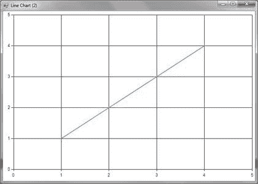
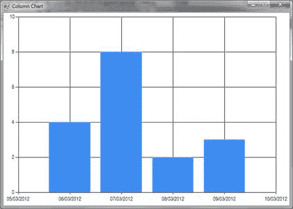

# 第 2 章 F# 的第一步

本章将重点介绍有关 F# 语言及其编程环境的一些一般性介绍细节。接下来的三章将重点介绍充实语言的细节，而本章将介绍可以做些什么。因此，如果您不了解本章中所示示例的所有细节，请不要担心，本书的其余部分将填写它们。

## 获取和安装 F# 

使用 F# 最简单快捷的方法是使用 Microsoft 的 Visual Studio。 F# 包含在 Visual Studio 2012 和 2010 中。如果您没有 Visual Studio 的副本，可以从 [http://www.microsoft.com/visualstudio/try 下载免费的 90 天试用版](http://www.microsoft.com/visualstudio/try)。

默认情况下，Visual Studio 2012 和 2010 都安装了 F# ，因此只使用默认选项安装 Visual Studio 就足够了。如果安装了 Visual Studio 且 F# 不可用，则在安装 Visual Studio 时可能已停用 F# 。要激活 F# ，请打开**控制面板**并转到**程序**菜单。

如果您不想在 Visual Studio 中使用 F# ，可以从[下载 Microsoft 的命令行编译器 http://www.microsoft.com/download/en/details.aspx?id=11100](http://www.microsoft.com/download/en/details.aspx?id=11100) 并使用您喜欢的文本编辑器编辑 F# 源文件。由于我认为 Visual Studio 是初学者体验 F# 的最佳方式，本章的其余部分将假设您使用的是 Visual Studio，尽管所有示例都适用于编译器的命令行版本。

## Hello World

与传统一样，让我们​​从 F# 中的“hello world”程序开始。首先，我们需要创建一个 Visual Studio 项目来托管我们的程序。为此，请导航至**文件 &gt; 新建 &gt; Project...** 并选择 **F# Application** 。

|  | 注意：F# 只附带四个预安装的应用程序或库模板。但是，还有更多在线可用的模板。这些在线模板由 Microsoft 的 F# 团队和 F# 社区提供。可以通过 Visual Studio 的“新建项目”对话框搜索和安装它们。 |

删除 **program.fs** 文件中的内容并输入以下行：

```
System.Console.WriteLine "Hello World"

```

现在按 F5 编译并执行程序，您将看到控制台短暂弹出“Hello World”问候语。注意程序只有一行 - 这是 F# 哲学的一部分，代码应尽可能免于语法杂乱，你会发现这是许多函数式编程语言共有的哲学。我们只是希望能够调用`System.Console.WriteLine`方法并将其传递给字符串文字，因此这些是我们需要的程序中唯一的两个元素。

由于程序在问候语写入控制台后直接退出，因此问候文本可能在屏幕上显示得太短暂，无法让我们看到它。让我们通过从控制台读取一行来解决这个问题，这样在按下 Enter 键之前程序不会退出：

```
open System
Console.WriteLine "Hello World"

Console.ReadLine()

```

现在再次按 F5 键。当这次执行程序时，问候语将一直保持到您按 Enter 键并退出程序。请注意我们如何使用`open`关键字打开`System`命名空间。这允许我们从`Console`类的名称的开头删除`System`，编译器仍然能够找到该类，因为它现在将在`System`命名空间中查找它。 `open`关键字与 C# 中的`using`关键字非常相似，用于导入命名空间。

## 使用 F# Interactive

Visual Studio 附带了一个名为 F# Interactive 的 F# 交互式版本。这有时称为 read-eval-print 循环，简称 REPL。它赋予 F# 动态语言的感觉，因为程序员能够交互式地评估他或她的程序的部分并立即看到结果，尽管应该注意 F# Interactive 动态编译你传递给它的代码部分，所以你应该看到与编译的 F# 代码相似的性能水平。要使用 F# Interactive，只需突出显示要评估的代码部分，然后按 Alt + Enter。然后，您将在 F# Interactive 窗口中看到此代码的结果，通常位于屏幕底部。因此，如果我们突出显示我们最初的“hello world”程序并按 Alt + Enter，我们将看到以下结果：

你好，世界

val it：unit =（）

第一行是我们的问候语输出到控制台。第二个是有关该程序类型的一些细节 - 暂时不要过于担心。类型将在后面的章节中解释。

能够以交互方式执行这样的代码是我最喜欢的 F# 功能之一。我认为能够快速尝试这样的想法是一种真正的生产力提升。所以让我们继续看看你可以用 F# Interactive 做的其他一些事情，比如创建交互式图表。

F# 团队为`System.Windows.​Forms.DataVisua​lization.Charti​ng.dll`创建了一个 F# 友好的包装器。此包装器的主要目的是允许您快速显示程序中可用的数据，或 F# Interactive 会话，作为图表。它可以从 [http://code.msdn.microsoft.com/windowsdesktop/FSharpChart-b59073f5](http://code.msdn.microsoft.com/windowsdesktop/FSharpChart-b59073f5) 下载。

解压缩下载的 **FSharpChart** 文件夹后，您会在 **F# &gt; Scripts** 文件夹中找到 **FSharpChart.fsx** 文件。。您需要确保此脚本与您正在使用的 F# 脚本位于同一目录中，或者相应地修改脚本的路径。

现在让我们来看看我们如何使用 F# 图表。以下示例显示如何创建显示简单线性线的图表：

```
#load "FSharpChart.fsx"

open MSDN.FSharp.Charting

let data = [ 1; 2; 3; 4 ]
FSharpChart.Line data

```

在将此程序输入 F# Interactive 时，再次通过 Alt + Enter，您将看到一个弹出如下图表的窗口：



图 1：F# Interactive 中的折线图

我们来看看这个程序是如何工作的。第一行将图表脚本（名为`FSharpChart.fsx`的文件）加载到 F# Interactive 会话中。此行可能需要几秒钟，因为图表脚本非常大，但您只需加载一次，并且这些功能将继续在交互式会话中可用。下一行导入我们将使用的图表功能的命名空间。以下行创建一个整数列表，并将它们绑定到`data`标识符。最后，我们将列表传递给图表函数`FSharpChart.Line`，它绘制了一个折线图。这不是世界上最令人兴奋的图表，所以让我们来看看另一个。

以下代码示例将创建一个柱形图，显示每个日期的日期和值：

```
#load "FSharpChart.fsx"

open System
open MSDN.FSharp.Charting

let dateInApril day = new DateTime(2012, 03, day)

let data = [ dateInApril 6, 4; dateInApril 7, 8;
             dateInApril 8, 2; dateInApril 9, 3 ]
FSharpChart.Column data

```

再次，在将此程序输入 F# Interactive 时，您将看到一个弹出如下图表的窗口：



图 2：F# Interactive 中的柱形图

程序的顶部，加载 **FSharpChart.fsx** 脚本和`open`语句的部分与以前几乎相同。第一个主要区别是我们定义了一个函数`dateInApril`，以提供在 2012 年 4 月创建`DateTime`对象的简写方法。接下来你会注意到我们的数据列表不是单个值，而是值对，称为元组。每对包含一个日期对象和一个整数。最后，我们将元组列表传递给绘制函数`FSharpChart.` `Column`，绘制柱形图。虽然这个图表可能比前一个图表更有趣，但这个例子并不是很现实，因为我们更有可能从外部数据源（如文本文件）中绘制数据。

那么让我们看一下如何从.csv 文件加载一些数据并用 F# 绘制它：

```
#load "FSharpChart.fsx"

open System
open System.IO
open MSDN.FSharp.Charting

let treatLine (line: string) =
    let stringParts = line.Split(';')
    DateTime.Parse stringParts.[0], int stringParts.[1]

let data =
    File.ReadAllLines (__SOURCE_DIRECTORY__ + "\\mydata.txt") 
    |> Array.map treatLine

FSharpChart.Column data

```

然而，该计划的最重要部分变化不大。在`open`语句之后，我们定义了一个名为`treatLine`的函数，它将一行拆分为两行，将第一部分解析为日期，将第二部分解析为整数。接下来，我们使用.NET 的`File.ReadAllLines`函数从名为`mydata.txt`的文本文件中读取所有数据。之后我们使用`Array.map`函数将文本文件中的每一行传递给我们的`treatLine`函数并创建一个新数组 - 这与在 C# 中使用 LINQ 扩展方法`Select`非常相似。最后，我们将结果传递给`FSharpChart.Column`以绘制图形。

## 摘要

本章简要介绍了如何使用 F# 创建编译程序和使用 F# Interactive 快速测试想法。本书的其余部分将详细介绍语言的语法和功能，以指导如何使用 F# 进行编程。