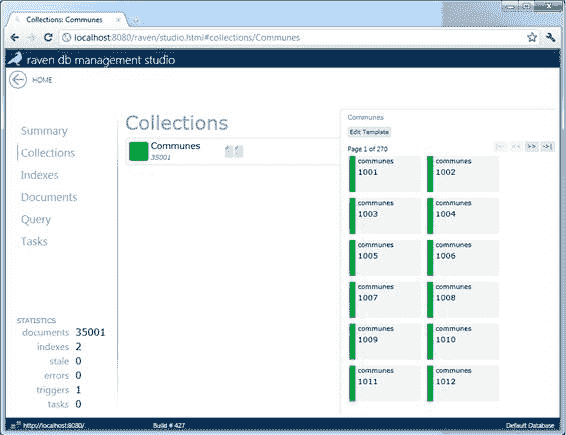

# 第 8 章创建应用程序

在本章中，我想展示在 F＃中编写应用程序所涉及的内容。对于我们将要实现的内容，“应用程序”可能过于夸张，但关键是要显示 F＃与其他技术和框架交互，就像您创建实际应用程序时一样。

我们将在 HTML 网页中创建自动完成下拉列表。想法是输入您感兴趣的村庄，城镇或城市，自动完成功能将帮助您在系统中找到正确的。我们将使用 RavenDB 作为我们的数据存储，并将 PicoMvc 作为 MVC Web 框架来处理应用程序层。 PicoMvc 是我专门为 F＃创建的 MVC 框架。它主要受 OpenRasta，FubuMvc 和一些 ASP.NET MVC 的启发，所以如果您不想使用 PicoMvc，这里给出的示例可能很容易移植到任何这些框架。 RavenDB 是一个用 C＃实现的 NoSQL 数据库。我喜欢这个数据库不是因为它很快并且通过分片提供了对可扩展性的良好支持，这无疑是有效的，但是因为它的实现者真正专注于让开发人员使用它非常容易。

现在，在 HTML 表单中创建自动完成下拉列表是相当普遍的，并且有一个很好的 jQuery 插件可以处理 UI 方面的事情。将数据加载到 RavenDB 中，然后公开将返回与用户搜索相对应的 JSON 记录的服务将成为本章的重点。

这个例子的完整代码可以从 [https://github.com/robertpi/PicoMvc/tree/master/examples/AutoComplete](https://github.com/robertpi/PicoMvc/tree/master/examples/AutoComplete) 的 PicoMvc 本身的 examples 目录中获得。

## 项目设置

我们的 Visual Studio 解决方案将有四个项目： **Common.fsproj** ， **LoadCommunes.fsproj** （公社是我们村/镇/城市的通用术语）， **Web.fsproj** 和 **WebHost.csproj** 。


图 8：自动完成项目设置

**Common** 项目包含将存储在 RavenDB 中的类型的定义。该共同项目将参考 **LoadCommunes** 和 **Web** 项目。 **LoadCommunes** 项目将包含用于将数据加载到 RavenDB 中的 ETL 逻辑。 **Web** 项目将包含驱动网页的逻辑。 **WebHost** 项目是一个 C＃“web 项目” - 它只是用于保存项目的 HTML 部分并启动 Web 服务器以便于调试。

现在项目设置得令我们满意，现在是时候查看应用程序的 ETL（提取，转换和加载）部分中的一些实际代码了。

## ETL（提取/转换/加载）

由于我住在法国，我们将使用基于法国村庄，城镇和城市的数据，但这里描述的技术将很容易适应您居住的任何地方。首先，我们需要下载数据。我从 [http://www.galichon.com/codesgeo/](http://www.galichon.com/codesgeo/) 获得了数据。您可以点击**CoordonnéesgéographiquesdesvillesFrançaises**下的**Téléchargerlabase** 链接，或直接从[下载文件 http://www.galichon.com/codesgeo/data/ ville.zip](http://www.galichon.com/codesgeo/data/ville.zip) 。它不是世界上最好的数据源，但它是我发现的最好的免费数据源。解压缩 Excel 文件并将文件转换为 CSV 后，将其加载到 RavenDB 非常简单。

首先，我们需要设计一个类型来保存 **Common** 项目中的数据：

```
type Commune = 
        { mutable Id: string 
          Name: string 
          Postcode: string } 

```

我们只会存储公社的名称及其邮政编码，因为这是我们要搜索或显示的所有内容 - 因此字段`Name`和`Postcode`。在添加或删除字段时，RavenDB 非常强大，所以最好先从最小的数据集开始，然后再添加内容。 `Id`字段是记录的唯一标识符。它是可变的，因为这似乎与 RavenDB 更好地协作。我们可以让 RavenDB 为我们生成这个，但是由于 INSEE，法国政府的静力学和经济研究局，为每个村庄分配了自己的唯一标识符，包含在文件中，我们将使用它。在法国，几个公社可以共享相同的邮政编码，因此这不是标识符的良好候选者。

一旦我们设计了存储 commune 数据的类型，从文件加载它并将其存储在 RavenDB 中的代码就相当简单：

```
let loadCommuneData() = 
        use store = DocumentStore.OpenInitializedStore() 
        let lines = File.ReadLines(Path.Combine(__SOURCE_DIRECTORY__, @"ville.csv"), System.Text.Encoding.Default) 

        use session = store.OpenSession() 
        session.Advanced.MaxNumberOfRequestsPerSession <- 30000 
        lines 
        |> Seq.skip 1 
        |> Seq.iteri(fun i line -> 
            let line = line.Split(';') 
            match line with 
            | [|  name; nameCaps; postcode; inseeCode; region; latitude; longitude; eloignementf|] -> 
                let id = sprintf "communes/%s" (inseeCode.Trim()) 
                printfn "Doing %i %s (%s)" i name id 
                let place: Commune = 
                    { Id = id 
                      Name = name.Trim() 
                      Postcode = postcode.Trim() } 
                session.Store(place) 
                if i % 1000 = 0 then session.SaveChanges() 
            | line -> printfn "Error in line: %A" line) 
        session.SaveChanges()

```

有几点值得强调：

*   我们使用`File.ReadLines`为我们提供文件中所有行的 IEnumerable。这为我们提供了一种非常方便的方法，可以逐行读取文件，而无需将其全部加载到内存中。
*   请注意，我们将`System.Text.Encoding.Default`传递给`File.ReadLines`。法语社区的名字中经常有重音字符，因此我们需要确保使用正确的编码。
*   设置`session.Advanced.MaxNumberOfRequestsPerSession`是必要的，因为默认情况下它被限制为 10，这意味着在 10 个请求或存储之后，会话将抛出异常。通常会话是短暂的，因此这个例外意味着对开发人员的早期警告。由于这是非典型的会话使用，因此可以设置此数字。但是，我认为会话缓存它们存储的数据，因此您可能希望在每次写入 RavenDB 后清除会话。在这种情况下似乎没有太大的区别。
*   我们使用`Seq.iteri`枚举文件中的每一行。这给了我们行加行号。我们可以通过调用`.SaveChanges()`使用行号来每 1000 个项目执行一次保存。这似乎比在每行之后保存或尝试一次性保存整个批次更有效。我没有对这个数字做过多少实验;可能有一个比 1000 更优的数字。
*   解析文件非常简单，我们只需在每一行上调用`.Split(';')`，然后在结果数组上进行模式匹配即可解压缩相关项目。然后将它们加载到`Commune`类型并使用会话的`Store()`方法存储在 RavenDB 中。如前一篇文章所述，在调用`.SaveChanges()`之前，这些内容不会刷新到 DB。

那就是把它包起来。数据位于数据库中，您可以使用 RavenDB 的管理控制台对其进行验证，如下图所示。



图 9：数据库的管理控制台

## 支持网站的代码

现在我们在 RavenDB 中有数据，我们希望能够向用户显示数据。为此，我们需要创建一个将 JSON 文档返回给客户端的服务。使用 PicoMvc 和 RavenDB 实现服务很简单，但要做到这一点，我们需要配置 PicoMvc 并在 RavenDB 中创建一个索引，以便我们可以查询它。

PicoMvc 旨在将 F＃函数映射到 URL 和 HTTP 谓词。我们的想法是基本框架独立于 Web 服务器和主机平台，但我们提供了钩子，允许您将 PicoMvc 插入现有平台。目前，唯一存在的钩子是将 PicoMvc 插入 ASP.NET 平台的钩子，这是通过一个名为`PicoMvcRouteHandler`的类来完成的，它是一个 ASP.NET 路由处理程序。我们的想法是您使用 ASP.NET 运行时注册此路由处理程序，它提供了映射 ASP.NET HTTP 处理程序将接收的调用以及通过 PicoMvc 定义的处理函数的请求的所有管道。

因为`PicoMvcRouteHandler`只是一个普通的 HTTP 处理程序。它要求您在`global.asax`中将其注册到 ASP.NET 运行时：

```
        routes.Add(new Route("{*url}", new PicoMvcRouteHandler("url", routingTables, actions)))

```

`PicoMvcRouteHandler`也需要一点配置。路由处理程序的第一个参数是一个字符串，它告诉它在添加路由处理程序时匹配的 URL 的名称。然后它将使用它作为 URL 来解析将调用哪个函数。下一个参数是路由表，其中包含有关应为哪些 URL 调用哪些函数的信息。您可以通过调用静态方法`LoadFromCurrentAssemblies`使 PicoMvc 自动搜索所有已加载的程序集，以查找标有`[&lt;Controller&gt;]`属性的 F＃模块。

```
        let routingTables = RoutingTable.LoadFromCurrentAssemblies()

```

路由处理程序的第三个也是最后一个参数告诉路由处理程序如何处理动态调用的函数的参数和返回结果。 PicoMvc 中有许多预定义的操作。例如，有一个操作将在查询字符串中查找值或根据参数的名称发布变量。这称为`ParameterActions.defaultParameterAction`。定义新动作也相当容易。例如，如果我们看到某种类型的`IDocumentStore`，我们将需要一个返回对 RavenDB 文档存储的引用的操作。这就是我们如何做到的：

```
        let ravenParameterAction =
            { CanTreatParameter = fun _ _ t -> t = typeof<IDocumentStore>
              ParameterAction = fun _ _ _ -> !store :> obj }

```

还有必要为我们的数据定义一个 RavenDB 将在其查询中使用的索引。由于它使用 C＃“monadic”语法，因此它与 C＃语言紧密相关。我发现在 C＃中实现它更容易：

```
    public class Communes_Search : AbstractIndexCreationTask
    {
        public override IndexDefinition CreateIndexDefinition()
        {
            return new IndexDefinitionBuilder<Commune>
            {
                Map = communes => from commune in communes select new { commune.Name, commune.Postcode }
            }.ToIndexDefinition(this.Conventions);
        }
    }

```

然后从我们的`global.asax`加载它很简单：

```
        let assem = Assembly.Load("WebHost")
        IndexCreation.CreateIndexes(assem, !store)

```

现在我们已经解决了 PicoMvc 和 RavenDB 的配置问题，我们已经准备好攻击实现服务本身了。

## JSON 服务

要创建自动完成下拉列表，我们需要查询 RavenDB，然后将结果作为 JSON 文档发送到用户的网页。实现 JSON 服务非常简单：

```
type AutoCompleteResult =
    { id: string;
      label: string;
      value: string }

[<Controller>]
module Commune =
    let get (term: string) (store: IDocumentStore) =
        use session = store.OpenSession()
        let postcodeRegex = new Regex(@"^\d+$")

        let comQuery = session.Advanced.LuceneQuery<Commune>("Communes/Search")
        let comQuery =
            if postcodeRegex.IsMatch term then
                comQuery.WhereStartsWith("Postcode", term)
            else
                comQuery.WhereStartsWith("Name", term)
        let query = comQuery.Take(20)
        let res = query |> Seq.map (fun x -> { id = x.Id; label = sprintf "%s (%s)" x.Name x.Postcode; value = sprintf "%s (%s)" x.Name x.Postcode})
        Result res

```

首先，我们定义一个类型`AutoCompleteResult`，以保存我们想要发送回客户端的结果。这将直接翻译成 JSON。

接下来我们定义一个 PicoMvc 控制器。这只是一个标有`[&lt;Controller&gt;]`属性的 F＃模块。因为模块的名称是`Commune`，它将在 URL **〜/ commune.xxx** 中公开，其中 xxx 用于确定将使用哪个视图来呈现结果（我们如何选择视图到处理结果将在后面讨论）。在这种情况下，我们的 URL 将是**〜/ commune.json** ，视图将结果呈现为 JSON。

我们的控制器定义了处理它可能接收的不同 HTTP 动词的函数。在这种情况下，我们只想处理 GET 动词请求，因此我们定义了`get`函数。函数的参数项将由查询字符串中的项`term`填充，`store`将填充对 RavenDB 文档存储的引用。

一旦我们有`term`参数和`store`参数给我们一个 RavenDB 存储的引用，实现该服务很简单。我们使用高级 Lucene 查询来查询`Communes/Search`索引。然后我们测试我们的输入术语是邮政编码还是公社。在法国，邮政编码是完全数字的，因此我们可以使用简单的正则表达式执行此测试。一旦我们知道该术语是邮政编码或城镇名称，我们就可以使用 Lucene 查询的`WhereStartsWith`方法来查询`Name`或`Postcode`字段。然后，我们将查询限制为 20 个结果，并将其转换为客户端期望的格式。

为此创建 UI 非常简单。我的 UI 基于以前在 jQuery 开发人员包中提供的 **remote.html** 示例（该示例包含在本书的可下载代码示例中）。只需更改 URL 和一些标签即可使其正常工作。

可以进行一些改进：

*   大量公社以“圣”字开头。用户可能合理地期望缩写“圣”。映射到“圣”。
*   公社名称中的单词用短划线分隔。允许用户使用空格可能是个好主意。
*   我不确定 RavenDB 处理重音的程度。将“e”映射到“é”和“è”会很好。如果 RavenDB 支持它，那么自己编写这个功能相当容易;你只需要存储一个无重音版的名称并根据它进行搜索。

## 摘要

而已。它需要一些解释，但我们在此过程中学到了很多关于 PicoMvc 的知识，而最终的解决方案根本就不是代码。事实上，整个解决方案来自大约 150 行 F＃和 C＃。您可以在 [https://github.com/robertpi/PicoMvc/tree/master/examples/AutoComplete](https://github.com/robertpi/PicoMvc/tree/master/examples/AutoComplete) 的 github 上的 PicoMvc 的**示例**目录中查看最终解决方案。