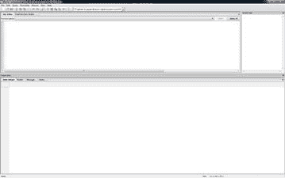
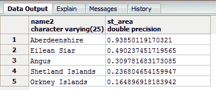
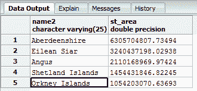
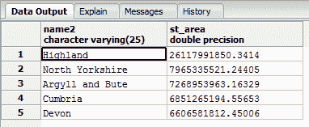
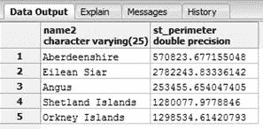
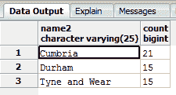
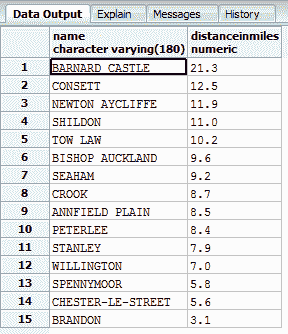

# 第 4 章空间 SQL

我在本书中多次提到过这种 SQL，在某种程度上我也以简短的方式描述了它。

Spatial SQL 并不特别;如果你从名称中取出“Spatial”，它只是常规的 SQL。无论哪种方式，你都在处理二进制大对象或 blob。

就像使用嵌入在数据库中的图像一样，这些 blob 在通过理解它们包含的内容的代码处理时具有特殊含义。这是添加此代码以及使用它创建空间启用数据库所需的额外 SQL 函数。

在下一节中，我不打算涵盖所有可能的排列和函数调用。在最后统计中，OGC 规范中有 300 多个独立函数，涵盖了从空间距离关系到复杂几何的构造，以及用于预定义矢量路径的剪切栅格的所有可能场景。

相反，使用我们放在数据库中的数据，我将引导您完成一些简单但常见的操作 - 任何编写支持 GIS 的应用程序的人都可能使用的类型。

在我们讨论这些操作之前，让我们快速浏览第一章中描述的输入和输出阶段。

## 创建和检索几何

即使我们已经将一些数据导入我们的数据库，编写 GIS 应用程序的任何人也需要能够在数据库中创建几何体，尤其是在应用程序允许编辑的情况下。

大多数几何体创建都以三种格式之一执行：

*   知名文字（WKT）
*   扩展的知名文本（EWKT）
*   众所周知的二进制文件（WKB）

我们将在后面的示例中使用 WKT，并且我们将仅在 SQL 中执行操作而不将任何数据插入到我们的数据库中。 EWKT 略有不同，主要是因为在几何的文本表示中，SRID 通过分号与其余数据分开。

我更喜欢使用 WKT 标准和空间函数`ST_SetSrid`来设置几何的 SRID。

如果您使用的是 MS SQL，则可能必须使用 EWKT，因为它没有`ST_SetSrid`功能。但是，`Geometry` SQL 类型上有一个可写的`SRID`属性。

那么我们如何使用 WKT 创建几何体？尝试以下 SQL：

```
SELECT ST_GeomFromText('LINESTRING(1 1,2 2,3 3,4 4)')

```

这将创建一个四段线串，从 1,1 开始，到 4,4 结束，并通过 2,2 和 3,3。以下是使用 SQL 创建几何的另一个示例：

```
SELECT ST_GeomFromText('POINT(5 6)')

```

这将在当前坐标系中的 5,6 处创建一个点。

您可以包含一个可选的第二个参数，用于指定几何的 SRID。因此，如果我们想在 OSGB36（SRID 27700）坐标中创建我们的点，我们将使用以下内容：

```
SELECT ST_GeomFromText('POINT(5 6)',27700)

```

如果您使用 pgAdmin 中的 SQL 编辑器尝试此操作，您会发现数据库不会抱怨对正在使用的坐标系无效的坐标。那是因为第二个参数只设置几何体 blob 中的字段来说明几何体的坐标系是什么;它不会在元数据表或系统中的任何其他位置设置任何内容来标记该 SRID。

另请注意，如果您尝试将这些几何图形插入到已创建的表中，则表创建函数将设置这些表的触发器和约束，以仅允许插入某些几何类型和 SRID。这可能会破坏许多新的 GIS 开发人员。如果未指定第二个参数，则数据库会将其设置为表默认值。如果未指定 SRID，则插入无效坐标非常容易。

如果确实指定了 SRID，但它与要插入几何的表的 SRID 不匹配，则插入将被拒绝，并且不会提交到表。确保在手动创建新几何图形时，确保您拥有正确的数据 SRID，并且它与您可能创建的任何表格的约束相匹配，这一点非常重要。

我们在[第 1 章](../Text/gis-2.html#_Database_Geometry_Types)中讨论的任何几何类型都可以在`GeomFromText`函数中使用，但请注意，有时事情并不像您预期​​的那么简单，特别是在 MULT 几何中。

以下是简单的点类型。

```
SELECT ST_GeomFromText('POINT(5 6)')

```

另一方面，多点看起来像这样：

```
SELECT ST_GeomFromText('POINT((5 6)(6 7))')

```

如您所见，简单的括号嵌套很快就会成为一场噩梦。我必须在 GIS 中追踪的一些最奇怪的错误是缺少括号的直接结果。

所有其他几何类型也使用相同的格式。

```
SELECT ST_GeomFromText('MULTILINE((1 1,2 2)(1 2,2 1))')
SELECT ST_GeomFromText('MULTILINESTRING((1 1,2 2,3 3,4 4)(5 5,6 6,7 7,8 8))')

```

规则的例外是多边形。因为多边形可以包括内环，所以标准多边形实际上从一开始就看起来像一个多边形。这意味着多边形有三组围绕它们的圆括号。

```
SELECT ST_GeomFromText('POLYGON((x y,x y,x y,x y..)(x y,x y,x y,x y..))
SELECT ST_GeomFromText('MULTIPOLYGON(((x y,x y,x y,x y..) (x y,x y,x y,x y..))((x y,x y,x y,x y..) (x y,x y,x y,x y..)))')

```

调试不是很好。使用像 DotSpatial 或 SharpMap 这样的库有很大帮助，因为它具有内置的功能，允许您使用熟悉的 C# 或 VB 对象，并为您实时生成此文本，甚至是直接的 WKB 表示，这样您就不会有手工构造这些几何形状。

除`GeomFromText`外还有其他输入功能。它们中的大多数都反映了下一节中列出的等效输出函数。作为参考，我列出了最新版 Postgres 中可用的一些输入函数：

```
ST_GeomFromEWKB()
ST_GeomFromEWKT()
ST_GeomFromGML()
ST_GeomFromKML()

```

最新版 Postgres 中提供的其他几何功能包括：

```
ST_Point()
ST_LineFromMultiPoint()
ST_Polygon()

```

所有这些都在 [http://postgis.refractions.net/docs/reference.html#Geometry_Constructors](http://postgis.refractions.net/docs/reference.html#Geometry_Constructors) 的在线 PostGIS 手册的 Geometry Constructors 部分详细介绍。大多数几何构造函数也在 OGC 规范中定义。

### 输出功能

既然我们已经看到了如何生成几何对象，那么能够将数据从数据库中取出来会很棒。

如果您只想要二进制 blob 表示，那么简单的`Select`就能完成这项工作。在上一节的创建示例中，因为我们没有插入数据，所以输出是表示几何的实际二进制 blob。

有一件事你必须小心：当直接转储 blob 时，它可能 _ 而不是 _ 是一个 WKB 格式的对象。某些数据库服务以内部格式存储数据，这使得它们比 WKB 更快更容易地管理数据。如果要确保始终收到 WKB 输出，请确保使用正确的输出函数，如以下代码所示：

```
SELECT ST_AsBinary(geometry)

```

还有很多文本输出功能，例如：

```
SELECT ST_AsText(geometry)

```

这将以 WKT 格式输出几何体。

如果希望以 EWKT 格式输出几何体，请使用以下命令：

```
SELECT ST_AsEWKT(geometry)

```

如果您使用 SVG 在 HTML 5 页面中显示几何图形，那么您将使用以下内容：

```
SELECT ST_AsSVG(geometry)

```

这将返回一个 SVG 标记，可以直接插入到输出或 SVG 文件中。

如果您要创建输出以在 Google 地球或任何其他支持 Keyhole 标记语言的应用中使用，请使用以下功能：

```
SELECT ST_AsKML(geometry)

```

如果您正在输出行业标准的地理标记语言（GML）或 GeoJSON（特别为地理数据设计的特殊 JSON 格式），

```
SELECT ST_AsGML(geometry)

```

和

```
SELECT ST_AsGeoJSON(geometry)

```

将是你的功能。

有些服务器还提供其他输出功能，例如以下 Postgres 功能：

```
SELECT ST_AsLatLonText(geometry)

```

这以 NMEA 秒，分和度格式输出坐标，但使用它被认为是非标准的，并且可能使您难以在数据库平台之间移植应用程序。

让我们使用我们添加到数据库中的城市点数据快速查看其中一个或两个函数。为此，我们将在 pgAdmin 中使用 SQL 编辑器。要打开 SQL 编辑器，请选择您希望使用的数据库 - 例如，如果您一直关注着 **GISBook** ，请单击工具栏上的 SQL 放大镜图标。


图 47：SQL 编辑器图标

这将打开 **SQL 编辑器**窗格。



图 48：SQL 编辑器

在顶部窗格中键入您的 SQL 语句，然后按 **F5** 或单击绿色箭头以运行 SQL。结果和消息将显示在下部窗格中。

#### 关于在 Postgres 中使用 SQL 的附注

在 Postgres 中使用 SQL 可能会导致一些用户出现问题：默认情况下，Postgres 区分大小写。如果您创建一个具有特定外壳名称的表或其他对象，它将创建该名称。但是，在尝试访问该对象时，Postgres 将使用全部小写字母查找对象名称，除非该名称用引号括起来。

例如，如果我`CREATE TABLE Shawty`，则表格将以大写字母 S 命名为`Shawty`。但是如果我然后运行`SELECT * FROM Shawty`，Postgres 将无法找到该表。相反，我需要输入`SELECT * FROM "Shawty"`以使 Postgres 注意名称的大小写。

这也扩展到.NET 的 Postgres 数据适配器。如果您无法访问 Postgres 数据适配器中的表，请尝试将表名放在引号中，您很可能会发现它解决了问题。

请注意，常规字符串用单引号括起来，而不是双引号。如果将文字字符串括在双引号中，Postgres 会将您的文本解释为对象名称而不是数据。

在 Postgres 中创建对象的最佳做法是为它们提供所有小写名称。我已经完成了我将用于演示 SQL 函数的数据库，并且在导入数据之后我已将表和列的所有名称更改为小写，如前所示。我还删除了数据集中未在示例中使用的列，或者一般情况下。

如果您在尝试样本时收到错误，请确保您正在进行相同的更改，正确使用单引号和双引号，并根据需要正确地设置名称。

### 测试输出功能

我们试试以下内容：

```
SELECT * FROM ukcitys LIMIT 5

```

您应该收到类似以下输出的内容：


图 49：二进制几何数据输出

如您所见，**几何**列以二进制形式显示，可能是也可能不是 WKB 格式。

现在让我们试试这个：

```
SELECT gid,number,name,admin_name,AsText(geometry) FROM ukcitys LIMIT 5

```

您应该收到以下信息：


图 50：文本几何数据输出

如上图所示，输出采用 WKT 格式，坐标以米为单位，因为我们使用的是 OSGB36 作为 SRID。

我们将`AsText`交换为`AsEWKT`。我们应该得到以下内容：


图 51：EWKT 几何数据输出

您可能已经注意到，在这些示例中，我一直在调用没有`ST_`的函数。 `ST_`是系统被称为空间和时间系统时的遗留标签。在大多数现代 GIS 数据库中，您可以在使用前缀之间自由切换并将其保留，因为大多数系统都定义了带有和不带“ **ST_** ”前缀的功能。一个或两个函数仅使用`ST_`前缀定义，因此如果数据中似乎缺少某些内容，请在放弃之前尝试两种拼写。

如您所见，`AsText`和`AsEWKT`之间的主要区别是在输出中添加了 SRID。

让我们再尝试一次，这次使用 GeoJSON 格式的数据输出：

```
SELECT gid,number,name,admin_name,ST_AsGeoJSON(geometry) FROM ukcitys LIMIT 5

```


图 52：使用 GeoJSON 几何的数据输出

### 我们还可以使用 Spatial SQL 做什么？

我们可以使用空间 SQL 做很多事情。一个更好的问题是我们不能做什么？但是，作为开发人员，您最有可能只对简单任务感兴趣，因此我们将继续查看一些真实场景以及我们的数据库可以帮助我们做些什么。

#### 情景 1：最大的土地面积

假设您有许多待售土地，并且您拥有一个漂亮的地图系统，潜在买家可以通过启用地图的网站进行浏览。您可能想知道的一件事是哪个地块面积最大，因此您可以对它们进行适当的定价。

通过使用数据库提供的区域功能可以非常简单地实现这一点。

```
SELECT name2,ST_Area(the_geom) FROM ukcountys LIMIT 5

```



图 53：计算土地面积

您会注意到我们所有的结果都是平方度或分数。这是因为我们的几何图形已添加到 WGS84（SRID 4326）坐标中的数据库中。大多数计算函数将以源几何使用的相同单位返回其答案。将我们的区域结果转换为米并不困难。

如果你还记得，SRID 27700 以米为单位进行测量，所以我们需要做的就是将几何体从 SRID 4326 转换为 SRID 27700.我们可以使用`ST_Transform`来完成。

transform 函数将几何体转换为第一个参数，SRID 将其转换为第二个参数。在我们的数据上使用该函数为我们提供了以下 SQL：

```
SELECT name2,ST_Area(ST_Transform(the_geom,27700)) FROM ukcountys LIMIT 5

```



图 54：从平方度转换为米的几何

将数据从平方度转换为米后，可以使用普通的 SQL `order by`子句和其他聚合函数来排列从最大到最小的区域，或者添加价格列。例如，以下代码输出英国五大县及其面积（平方米）。

```
SELECT name2,ST_Area(ST_Transform(the_geom,27700)) FROM ukcountys order by ST_Area(ST_Transform(the_geom,27700)) desc LIMIT 5

```



图 55：英国五大县的降序

另一件可能有用的事情是土地周长有多长。找到这一点同样容易，如下面的代码示例和数据输出所示：

```
SELECT name2,ST_Perimeter(ST_Transform(the_geom,27700)) FROM ukcountys LIMIT 5

```



图 56：英国各州的周长

#### 场景 2：有多少是在哪里？

GIS 的另一个典型用途是收集有关一个对象的位置如何与另一个对象的位置相关的信息。例如，考虑到英国的三个郡 - 达勒姆，泰恩和威尔，以及坎布里亚郡 - 我们可以很容易地找出每个都有多少个主要城镇。

```
SELECT ukcountys.name2,count(uktowns.*)
FROM ukcountys,uktowns
WHERE ST_Within(uktowns.geometry,ST_Transform(ukcountys.the_geom,27700)) AND ukcountys.name2 IN ('Durham','Tyne and Wear','Cumbria')
GROUP BY ukcountys.name2

```

此代码为我们提供了以下内容：



图 57：坎布里亚郡，达勒姆郡和泰恩威尔郡的城镇数量

SQL for this 引入了空间函数`ST_Within`，它测试一个几何是否完全在另一个几何中。

从这个例子中要记住两个重要的概念：

*   对于一个对象在另一个对象内，内部对象必须完全位于外部对象的边界线内。在县示例中，如果几何体小于任何县边界线的厚度并且直接位于一个边界线上，则`ST_Within`将不会拾取它。相反，它将被识别为与相交的 _ 与几何形状而不是在其中。_
*   某些空间 SQL 函数的参数顺序很重要。在县示例中，如果切换县和城镇参数的顺序，则会发现没有结果，因为点不能完全包含比自身大得多的多边形。

由于空间 SQL 在执行基于关系的测量时会考虑边界多边形，因此有许多不同的函数执行非常相似的任务，但略有不同。

在`ST_Within`的情况下，我们具有以下类似的功能：

*   `ST_Contains`
*   `ST_Covers`
*   `ST_CoveredBy`
*   `ST_Intersects`

Postgres 和 OGC 规范详细记录了细节方式的差异，比我在这里描述的更好，但基本上只有一个在多边形的内部工作，其他的工作在内部封闭环和各种交叉层的组合。

作为开发人员，您很可能永远不会使用除`ST_Within`之外的任何内容，在极少数情况下`ST_Contains`，您将完成大部分 GIS 工作。

在我们的县示例中，您还可以看到我们必须使用`ST_Transform`将我们的县再次转换为正确的 SRID。如果在加载数据库时将所有几何图形保留在相同的 SRID 中，则会开始看到 SQL 的简化程度。

#### 场景 3：这与此有多接近？

知道有多远的东西总是在 GIS 中占有一席之地。无论您是需要知道最近麦当劳的距离，还是朋友家的距离，这都是 GIS 中最常用的操作之一，因为移动电话开始从内置 GPS 单元中抽取位置。

我们不仅可以测量用户的距离，而且 GIS 数据库还可以根据用户在边界框和半径内的距离来选择对象。

我们来试试吧。首先找到达勒姆郡所有城镇与达勒姆主要城市的距离。

```
SELECT t.name,round((ST_Distance(c.geometry,t.geometry) / 1609.344)::numeric,1) as distanceinmiles FROM ukcitys as c
JOIN uktowns t ON c.admin_name = t.admin_name
WHERE c.name = 'DURHAM'
ORDER BY ST_Distance(c.geometry,t.geometry) desc

```

此代码为我们提供了以下内容：



图 58：达勒姆郡达勒姆镇的距离

一旦你分解它，我们使用的 SQL 非常简单。我们在城镇和城市进行了自然联接 - 两者在管理员名称上具有完全相同的列 - 使用主要城市中的管理员名称作为主要城市。我们过滤了城市，只选择 **Durham** ，然后我们用`ST_Distance(a,b)`得到几何`a`到几何`b`的直线距离。

然后我们将这个距离除以 1609.344（一英里的米数），将结果转换回数字（`ST`函数的输出是距离特定的，例如米，度等），并将其四舍五入为一小数位，在从最远到最近的城镇订购之前。

布兰登离杜伦最近;巴纳德城堡距离酒店最远。

现在让我们看一下捕获给定半径内的项目。再次，我们将使用达勒姆城作为我们的中心点，并在此点周围投射 10 英里的半径。然后我们将列出该半径范围内的任何城镇，不论其所在的县。

```
SELECT t.name,t.admin_name,round((ST_Distance(c.geometry,t.geometry) / 1609.344)::numeric, 1) as distanceinmiles
FROM ukcitys AS c, uktowns as t
WHERE c.name = 'DURHAM' AND ST_Distance(c.geometry,t.geometry) <= 16093.44

```


图 59：达勒姆 10 英里范围内的城镇

达勒姆市 10 英里范围内有 14 个城镇，您可以看到并非所有城镇都位于达勒姆郡。

您还可以使用`ST_Dwithin(a,b,distance)`函数重写 SQL，如下所示：

```
SELECT t.name,t.admin_name,round((ST_Distance(c.geometry,t.geometry) / 1609.344)::numeric, 1) as distanceinmiles
FROM ukcitys AS c, uktowns as t
WHERE c.name = 'DURHAM' AND ST_Dwithin(c.geometry,t.geometry, 16093.44)

```

唯一不同的是`WHERE`语句最后一部分的`<=`子句，那么会有什么变化呢？真的不多。但是，如果您使用的是边界框和缓冲区，那么使用`ST_Distance`和`<=`运算符通常会获得更好的结果。

同样，我们使用强制转换操作符来确保我们的数据输出一个普通的数字类型，并将其四舍五入到一个小数位，除以 1609.344 将其转换为里程，最后过滤掉东西，以便只包括达勒姆周围的城镇。

例如，可以很容易地将达勒姆城市几何图形从 GPS 设备交换为 GPS 点，并列出该点周围的城镇。

```
SELECT t.name,t.admin_name,round((ST_Distance(ST_Point(428110 542709),t.geometry) / 1609.344)::numeric, 1) as distanceinmiles
FROM ukcitys AS c, uktowns as t
WHERE c.name = 'DURHAM' AND ST_Dwithin(ST_Point(428110 542709),t.geometry, 16093.44)

```

或者，如果您的 GPS 是 WGS84（SRID 4326），则需要将其转换为米和 OSGB36（SRID 27700）。

```
SELECT t.name,t.admin_name,round((ST_Distance(ST_Transform(ST_Point(-1.56450 54.77851),27700),t.geometry) / 1609.344)::numeric, 1) as distanceinmiles
FROM ukcitys AS c, uktowns as t
WHERE c.name = 'DURHAM' AND ST_Dwithin(ST_Transform(ST_Point(-1.56450 54.77851),27700),t.geometry, 16093.44)

```

#### 场景 4：我的几何构造是什么？

在某些情况下，您可能需要将几何体分开并以不同的方式重新组装，或者根据原始几何体制作新的几何体。

首先，让我们看看在达勒姆郡周围的边界有多少分。

```
SELECT name2,ST_NPoints(the_geom) FROM ukcountys WHERE name2 = 'Durham'

```


图 60：边界点数

或者我们可以在与实际几何相同的坐标中找到县的地理中心点。

```
SELECT name2,AsText(ST_Centroid(the_geom)) FROM ukcountys WHERE name2 = 'Durham'

```


图 61：达勒姆郡地理中心

或者我们可以输出对象的摘要。

```
SELECT name2,ST_Summary(the_geom) FROM ukcountys WHERE name2 = 'Durham'

```


图 62：达勒姆郡对象摘要

我们还可以分解底层几何体。有一些函数可以转储构成边界的整组点。

```
SELECT name2,ST_DumpPoints(the_geom) FROM ukcountys WHERE name2 = 'Durham' LIMIT 5

```


图 63：达勒姆郡的边界点

或者，如果输入是`LINESTRING`或`MULTILINESTRING`，我们可以获得特定点。

```
SELECT AsText(ST_PointN(GeomFromText('LINESTRING(1 1,2 2,3 3,4 4)'),2))

```


图 64：寻找特定点

上图中显示的点输出是我们的线串中的第二个点。

如果您需要知道对象的边界框，可以使用以下代码轻松获取最大和最小范围的 _x_ ，_ 和 _ 对：

```
SELECT name2,ST_Xmax(the_geom),ST_Ymax(the_geom),ST_Xmin(the_geom),ST_Ymin(the_geom) FROM ukcountys WHERE name2 = 'Durham'

```


图 65：最大和最小范围

或者如果我们需要在我们的范围内执行测量和其他功能，我们可以将它们作为实际的几何矩形。

```
SELECT name2,AsText(GeomFromText(box2d(the_geom)::geometry)) FROM ukcountys WHERE name2 = 'Durham'

```


图 66：作为几何矩形的区域输出

最后，让我们假设我们有一段路径，由以下行表示：

```
LINE(1 1,10 10)

```

现在让我们尝试根据 5 个单位之外的那条线的边框创建一个新的多边形。

```
SELECT AsText(ST_Buffer(GeomFromText('LINESTRING(1 1,10 10)'),5))

```

此代码为我们提供了以下结果：


图 67：基于线段边界的新多边形

输出是一个多边形，其中心线紧跟在我们的线上，但在所有边上都有 5 个单位。

不可能给出可以使用这些空间函数的每种可能场景和组合的示例。 PostGIS 的主要参考资料可以在 [http://postgis.org/docs/reference.html](http://postgis.org/docs/reference.html) 找到。我鼓励您花时间探索它们并尝试文档中给出的许多示例，所有这些都应该只使用 pgAdmin 的 SQL 编辑器。