# 第 5 章分支

分支通过允许用户分叉其历史记录来增加提交提供的基本功能。创建新分支类似于请求新的开发环境，包括隔离的工作目录，暂存区域和项目历史记录。

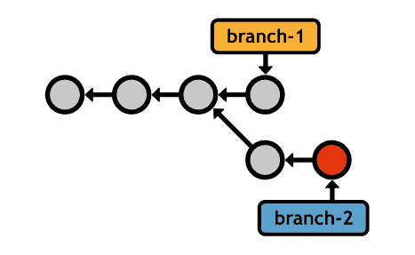

图 18：基本分支开发

这使您可以像提交项目的“安全”副本一样安心，但您现在可以同时处理多个版本。分支启用**非线性工作流程** - 能够并行开发不相关的功能。正如我们将在[远程存储库](../Text/git-12.html#heading_id_54)中发现的那样，非线性工作流程是 Git 协作模型分布式特性的重要前提。

与 SVN 或 CVS 不同，Git 的分支实现非常高效。 SVN 通过将整个项目复制到一个新文件夹来启用分支，就像没有任何修订控制软件一样。这使得合并笨拙，容易出错和缓慢。相比之下，Git 分支只是一个指向提交的指针。由于它们在提交级别上工作而不是直接在文件级别上工作，因此 Git 分支可以更容易地合并不同的历史记录。这对分支工作流程产生了巨大影响。

## 操纵分支机构

Git 将分支功能分成几个不同的命令。 git branch 命令用于列出，创建或删除分支。

### 列出分支

首先，您需要能够查看现有分支：

git branch

这将输出您当前所有分支，以及当前“已签出”的分支旁边的星号（稍后会详细介绍）：

*主人

一些特征

快速漏洞修复

master 分支是 Git 的默认分支，它是在任何存储库中的第一个提交创建的。许多开发人员使用此分支作为项目的“主要”历史记录 - 一个包含其经历的每个主要更改的永久分支。

### 创建分支

您可以通过将分支名称传递给相同的 git branch 命令来创建新分支：

git branch&lt; name&gt;

这会创建一个指向当前 HEAD 的指针，但不会切换到新分支（你需要 git checkout ）。请求新分支后，您的存储库将立即显示如下内容。

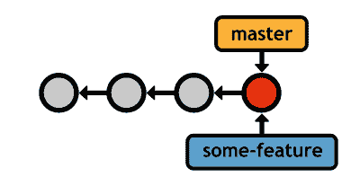

图 19：创建一个新分支

您当前的分支（ master ）和新分支（ some-feature ）都引用相同的提交，但您记录的任何新提交都将独占当前分支。同样，这使您可以并行处理不相关的功能，同时仍然保持合理的历史记录。例如，如果您当前的分支是某个功能，则在提交快照后，您的历史记录将如下所示。

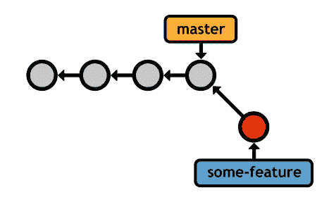

图 20：在某个功能分支上进行提交

新的 HEAD （由突出显示的提交表示）仅存在于 some-feature 分支中。它不会显示在 master 的日志输出中，在您查看 master 后，它的更改也不会显示在工作目录中。

您可以通过打开文件 .git / refs / heads /&lt; name&gt;来实际看到内部数据库中的新分支。 。该文件包含引用的提交的 ID，它是 Git 分支的唯一定义。这就是分支机构如此轻量级且易于管理的原因。

### 删除分支

最后，您可以通过 -d 标志删除分支：

git branch -d&lt; name&gt;

但是，Git 致力于永不丢失你的工作，这使得它无法通过未合并的提交删除分支。要强制删除，请改为使用 -D 标志：

git branch -D&lt; name&gt;

未合并的更改将会丢失，因此**使用此命令时要非常小心**。

## 签出分支机构

当然，创建分支是没有用的，没有在它们之间切换的能力。 Git 称之为“签出”分支：

git checkout&lt; branch&gt;

签出指定分支后，将更新工作目录以匹配指定分支的提交。此外， HEAD 更新为指向新分支，所有新提交将存储在新分支上。您可以考虑将分支签出为切换到新的项目文件夹 - 除了将更改提取回项目更容易。

图 21：检出不同的分支

考虑到这一点，在签出分支之前有一个**干净**工作目录通常是个好主意。没有未提交的更改时，存在一个干净的目录。如果不是这种情况， git checkout 有可能覆盖您的修改。

与进行“安全”修订一样，您可以自由地在新分支上进行试验，而不必担心破坏现有功能。但是，您现在可以使用专用历史记录，因此您可以使用本书前面的完全相同的 git add 和 git commit 命令记录实验的进度。

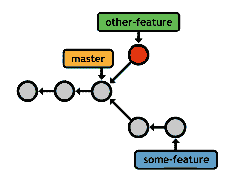

图 22：并行开发多个功能

一旦我们学会了如何将不同的历史合并回“主”分支（例如， master ），这个功能将变得更加强大。我们马上就会谈到这一点，但首先，有一个重要的用例 git checkout 必须考虑......

### 分离 HEAD s

Git 还允许你使用带有标签和提交 ID 的 git checkout ，但这样做会使你进入**分离的 HEAD 状态**。这意味着您不再在分支机构 - 您直接查看提交。

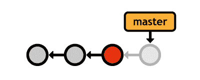

图 23：签出旧提交

您可以像往常一样环顾四周并添加新的提交，但由于没有指向添加的分支，因此只要切换回真正的分支，就会丢失所有工作。幸运的是，在分离的 HEAD 状态下创建一个新分支很容易：

git checkout -b&lt; new-branch-name&gt;

这是 git branch&lt; new-branch-name&gt;的快捷方式。 后跟 git checkout&lt; new-branch-name&gt; 。在此之后，你将对以前分离的 HEAD 有一个闪亮的新分支参考。这是一个非常方便的程序，用于从旧版本中分离实验。

## 合并分支机构

合并是将提交从一个分支拉到另一个分支的过程。组合分支的方法有很多种，但目标始终是在分支之间共享信息。这使得合并 Git 最重要的功能之一。两种最常见的合并方法是：

*   “快进”合并
*   “三方”合并

它们都使用相同的命令， git merge ，但该方法是根据历史结构自动确定的。在每种情况下，必须检出要合并的分支，目标分支将保持不变。接下来的两节介绍了以下命令的两种可能的合并方案：

git checkout master

git merge some-feature

同样，这将某些功能分支合并到主分支中，使前者保持不变。一旦完成功能并希望将其集成到稳定项目中，通常就会运行这些命令。

### 快进合并

第一个场景如下：

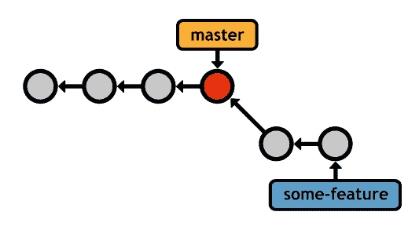

图 24：快进合并之前

我们创建了一个分支来开发一些新功能，添加了两个提交，现在它已经准备好集成到主代码库中。而不是重写主中丢失的两个提交，Git 可以“快进”主分支的指针以匹配某个功能的位置。

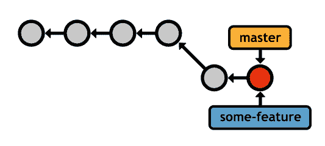

图 25：快进合并之后

合并后，主分支包含所有所需的历史记录，并且可以删除功能分支（除非您要继续开发它）。这是最简单的合并类型。

当然，我们可以直接在 master 分支上进行两次提交;但是，使用专用功能分支为我们提供了一个安全的环境来试验新代码。如果结果不对，我们可以简单地删除分支（与重置/恢复相反）。或者，如果我们添加了一堆包含损坏代码的中间提交，我们可以在将它合并到 master 之前清理它（参见 [_Rebasing_](../Text/Git_Succinctly.htm#heading_id_51) ）。随着项目变得越来越复杂并获得更多合作者，这种分支式开发使得 Git 成为一个出色的组织工具。

### 3 路合并

但是，并非所有情况都足够快速进行快速提交。请记住，分支机构的主要优势是能够同时探索许多独立的开发线。因此，您经常会遇到如下情况：

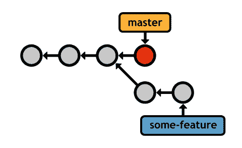

图 26：在三向合并之前

这开始就像一个快进合并，但我们在主分支中添加了一个提交，而我们仍在开发某个功能。例如，我们可能已停止使用该功能来修复时间敏感的错误。当然，应该尽快将错误修复添加到主存储库中，因此我们最终会出现在上面显示的场景中。

在此上下文中将特征分支合并到主会导致“3 路”合并。这是使用与上一节中的快进合并完全相同的命令来完成的。

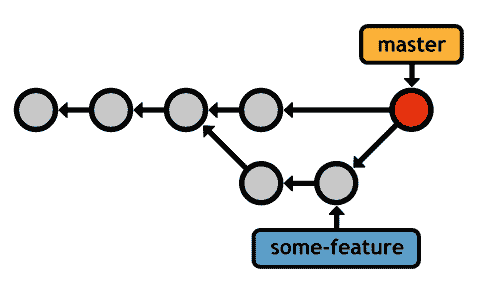

图 27：三向合并之后

Git 无法快速将主指针快进到某些功能而无需回溯。相反，它会生成一个新的**合并提交**，它代表两个分支的组合快照。请注意，这个新提交有两个父提交，使它可以访问这两个历史记录（实际上，在 3 向合并显示来自两个分支的提交后运行 git log ）。

此合并算法的名称源自用于创建合并提交的内部方法。 Git 查看三个提交以生成合并的最终状态。

### 合并冲突

如果您尝试组合两个对同一部分代码进行不同更改的分支，Git 将不知道要使用哪个版本。这称为**合并冲突**。显然，在快进合并期间永远不会发生这种情况。当 Git 遇到合并冲突时，您将看到以下消息：

自动合并 index.html

CONFLICT（内容）：合并&lt; file&gt;中的冲突

自动合并失败;修复冲突，然后提交结果。

Git 停止并询问您该怎么做，而不是自动添加合并提交。在这种情况下运行 git status 将返回如下内容：

#On 分支主人

# 未合并的路径：

# 

# both modified：&lt; file&gt;

每个有冲突的文件都存储在“未合并路径”部分下。 Git 注释这些文件以显示两个版本的内容：

&LT;&LT;&LT;&LT;&LT;&LT;&LT;头

此内容来自当前分支。

=======

这是另一个分支的冲突变化。

&GT;&GT;&GT;&GT;&GT;&GT;&GT;一些特征

======= 之前的部分来自主分支，其余部分来自您尝试集成的分支。

要解决冲突，请删除&lt;&lt;&lt;&lt;&lt;&lt;&lt; ， ======= ，&gt;&gt;&gt;&gt;&gt;&gt;&gt; 表示法，并将代码更改为您想要保留的内容。然后，告诉 Git 你已经用 git add 命令解决了冲突：

git add&lt; file&gt;

那就对了;您所要做的就是将冲突的文件暂存以将其标记为已解决。最后，通过生成合并提交来完成 3 向合并：

git commit

日志消息带有合并通知以及“冲突”列表，这在尝试找出项目中出错的位置时特别有用。

这就是在 Git 中合并的全部内容。现在我们已经了解了 Git 分支机构背后的机制，我们可以深入了解 Git 用户如何在日常工作流程中利用分支机构。

## 分支工作流程

本节介绍的工作流程是基于 Git 的修订控制的标志。 Git 分支实现的轻量级，易于合并的特性使它们成为软件开发工具中最高效的工具之一。

所有分支工作流都围绕本章前面提到的 git branch ， git checkout 和 git merge 命令。

### 分支类型

为了组织项目，为不同的分支分配特殊含义通常很有用。本节介绍了最常见的分支类型，但请记住，这些区别对于 Git 来说纯粹是肤浅的，分支是一个分支。

所有分支可以分类为**永久** **分支**或**主题分支**。前者包含项目的主要历史（例如， master ），而后者是用于实现特定主题的临时分支，然后被丢弃（例如，某些 - 功能）。

### 永久分支机构

永久分支是任何存储库的命脉。它们包含软件项目的每个主要航路点。大多数开发人员专门使用 master 来获得稳定的代码。在这些工作流程中，永远不会直接在 master 上提交 - 它只是用于在专用主题分支中构建的已完成功能的集成分支。

此外，许多用户在另一个集成分支中添加第二层抽象（通常称为 develop ，尽管任何名称都足够）。这为真正稳定代码（例如，公共提交）释放主分支，并使用开发作为内部集成分支来准备公开发布。例如，下图显示了 develop 中集成的几个功能，然后是 master 的单个最终合并，它代表了公开发布。

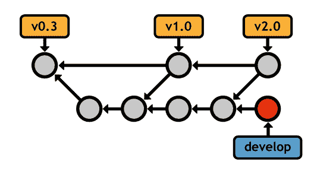

图 28：将主分支专门用于公开发布

### 主题分支

主题分支通常分为两类：**特征分支**和**修补程序分支**。功能分支是临时分支，它封装了一个新功能或重构，保护主项目免受未经测试的代码的影响。它们通常来自另一个功能分支或集成分支，但不是“超稳定”分支。

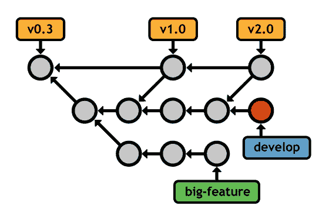

图 29：在隔离分支中开发功能

修补程序分支在性质上类似，但它们源自公共发布分支（例如， master ）。它们不是开发新功能，而是用于快速修补主要开发线。通常，这意味着错误修复和其他重要更新，不能等到下一个主要版本。

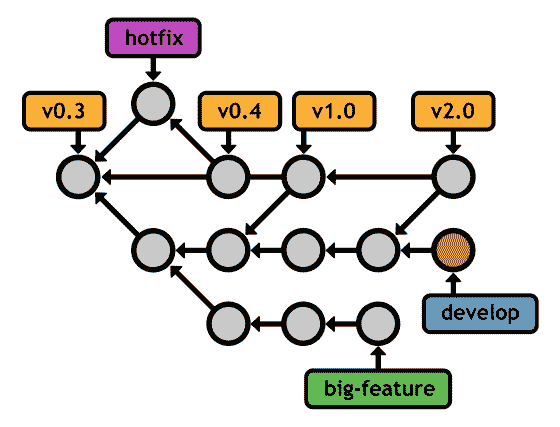

图 30：使用修补程序分支修补 master

同样，分配给每个分支的含义纯粹是传统的 - Git 认为 master ， develop ，功能和修补程序之间没有区别。考虑到这一点，不要害怕让它们适应你自己的目的。 Git 的魅力在于它的灵活性。当您了解 Git 分支机构背后的机制时，可以轻松设计出适合您项目和个性的新工作流程。

## 重新定位

重新定位是将分支移动到新的基础的过程。通过允许用户手动组织分支机构，Git 的重新定位功能使分支机构更加灵活。与合并一样， git rebase 需要检出分支并将新基数作为参数：

git checkout some-feature

git rebase master

这会将整个某些特征分支移动到 master 的尖端：

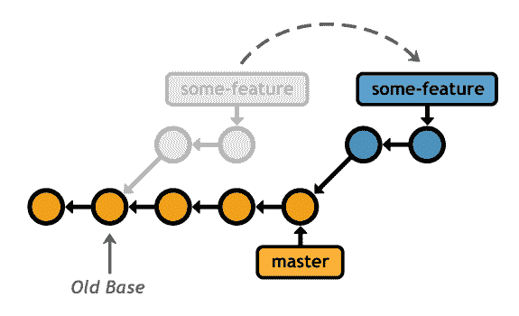

图 31：将某些功能重新定位到主分支上

在 rebase 之后，功能分支是 master 的线性扩展，这是将更改从一个分支集成到另一个分支的更清晰的方式。将此线性历史与 master 合并到 some-feature 中进行比较，从而在最终快照中生成完全相同的代码库：

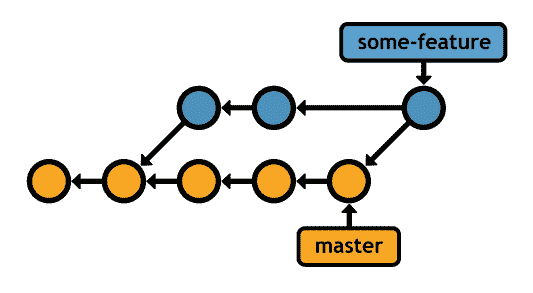

图 32：将 master 集成到 some-feature 中，并进行 3 向合并

由于历史已经分歧，Git 必须使用额外的合并提交来组合分支。在开发长期运行的功能的过程中多次执行此操作可能会导致非常混乱的历史记录。

这些额外的合并提交是多余的 - 它们的存在只是为了将 master 的变化拉到 some-feature 。通常，你会希望你的合并提交意味着一些东西，比如新功能的完成。这就是为什么许多开发人员选择使用 git rebase 进行更改，因为它会在功能分支中产生完全线性的历史记录。

### 互动重新定位

交互式变基更进一步，允许您更改提交，因为您将它们移动到新基础。您可以使用 -i 标志指定交互式 rebase：

git rebase -i master

这将填充文本编辑器，其中包含功能分支中每个提交的摘要，以及确定应如何将传输到新基础的命令。例如，如果在功能分支上有两个提交，则可以指定交互式 rebase，如下所示：

选择 58dec2a 首次提交新功能

squash 6ac8a9f 第二次提交新功能

默认的 pick 命令将第一次提交移动到新的基地，就像普通 git rebase 一样，但是 squash 命令告诉 Git 将第二次提交与前一个，所以你得到一个包含所有更改的提交：

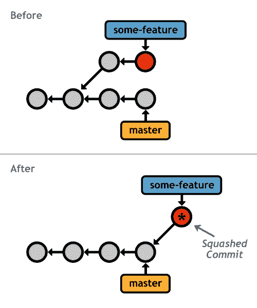

图 33：交互式重新定位某个功能分支

Git 提供了几个交互式的 rebasing 命令，每个命令都在配置列表的注释部分中进行了总结。重点是交互式变基让你完全重写分支的历史记录到你的确切规格。这意味着您可以根据需要向功能分支添加任意数量的中间提交，然后返回并将其修复为事后有意义的进展。

其他开发人员会认为你是一个出色的程序员，并且知道如何一举实现整个功能。这种组织对于确保大型项目具有可导航历史非常重要。

### 重写历史

重新定位是一个强大的工具，但你必须明智地重写历史。这两种变形实际上并没有移动现有的提交 - 他们创建全新的（HTG3）分支（在上图中用星号表示）。如果您检查受到 rebase 的提交，您会注意到它们具有不同的 ID，即使它们代表相同的内容。这意味着重新定位会在“移动”它们的过程中破坏现有的提交。

正如您可能想象的那样，这对协作工作流程产生了巨大影响。销毁公共提交（例如，主分支上的任何内容）就像剥夺其他人的工作基础一样。 Git 不会知道如何结合每个人的变化，你会有很多道歉要做。在我们学习如何与远程存储库进行通信之后，我们将更深入地了解这种情况。

就目前而言，只要遵守变基的黄金法则：**永远不要重新推动已被推到公共存储库**的分支。