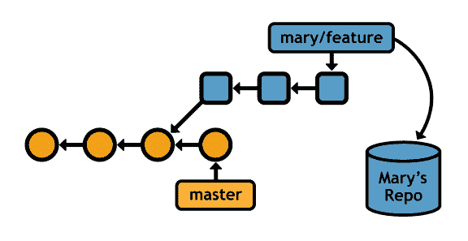
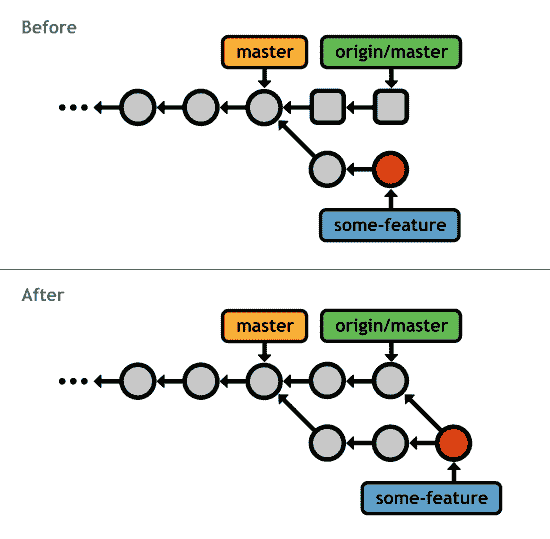
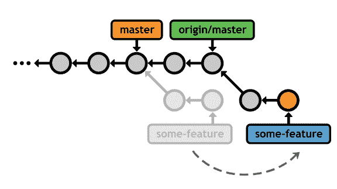
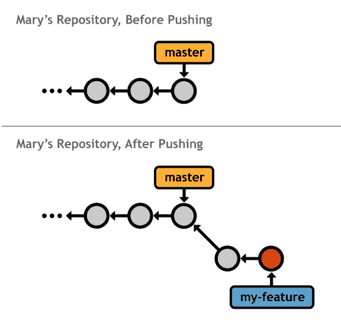
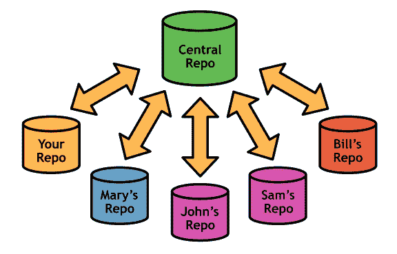
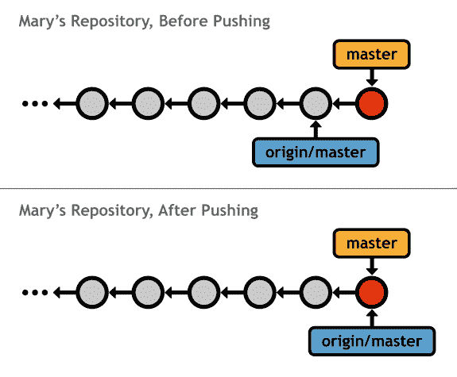
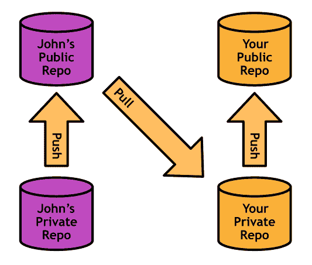
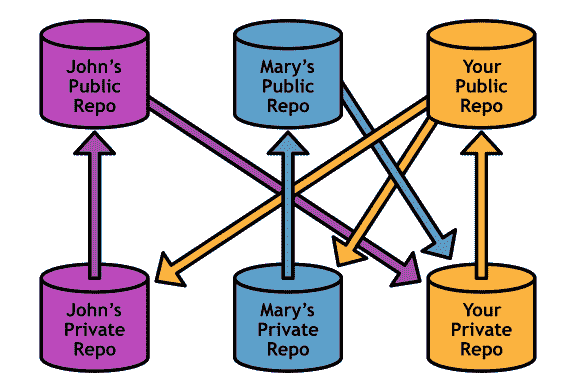

# 第 6 章远程存储库

简而言之，远程存储库不是您自己的存储库。它可能位于中央服务器，另一台开发人员的个人计算机，甚至是您的文件系统上。只要您可以从某种网络协议访问它，Git 就可以非常轻松地与其他存储库共享贡献。

远程存储库的主要作用是代表您自己的存储库中的其他开发人员。另一方面，分支机构应该只处理项目开发。也就是说，不要试图给每个开发人员自己的分支工作 - 为每个开发人员提供一个完整的存储库并保留用于开发功能的分支。

本章首先介绍了遥控器的机制，然后介绍了基于 Git 的协作的两个最常见的工作流程：集中式工作流程和集成工作流程。

## 操纵遥控器

与 git branch 类似， git remote 命令用于管理与其他存储库的连接。遥控器只不过是对其他存储库的书签 - 而不是键入完整路径，它们允许您使用用户友好的名称来引用它。我们将在[远程工作流程](../Text/Git_Succinctly.htm#heading_id_65)中学习如何在 Git 中使用这些书签。

### 列出遥控器

您可以通过调用不带参数的 git remote 命令来查看现有的遥控器：

git remote

如果您没有遥控器，则此命令不会输出任何信息。如果您使用 git clone 获取存储库，您将看到原点遥控器。 Git 会自动添加此连接，假设您可能希望与其进行交互。

您可以使用 -v 标志请求有关遥控器的更多信息：

git remote -v

这将显示存储库的完整路径。下一节将讨论指定远程路径。

### 创建遥控器

git remote add 命令创建与远程存储库的新连接。

git remote add&lt; name&gt; &LT;路径到回购&GT;

运行此命令后，您可以在&lt; path-to-repo&gt;处访问 Git 存储库。 使用&lt; name&gt; 。同样，这只是一个方便的长路径名称书签 - 它不创建直接链接到其他人的存储库。

Git 接受许多网络协议来指定远程存储库的位置，包括 file：// ， ssh：// ， http：// ，以及自定义 git：// 协议。例如：

git remote 添加 some-user ssh：//git@github.com/some-user/some-repo.git

运行此命令后，您只能使用 some-user 访问 github.com/some-user/some-repo.git 中的存储库。由于我们使用 ssh：// 作为协议，因此在您允许对帐户执行任何操作之前，可能会提示您输入 SSH 密码。这使得 SSH 成为授予开发人员写入权限的良好选择，而 HTTP 路径通常用于提供只读访问权限。我们很快就会发现，它被设计为分布式环境的安全功能。

### 删除遥控器

最后，您可以使用以下命令删除远程连接：

git remote rm&lt; remote-name&gt;

## 远程分支机构

提交可能是基于 Git 的版本控制的原子单元，但分支是远程存储库通信的媒介。 **远程分支**就像我们到目前为止所覆盖的本地分支一样，除了它们代表其他人的存储库中的分支。

图 34：从远程存储库访问功能分支

下载远程分支后，您可以像任何其他分支一样检查，合并和扩展它。如果您了解如何在本地使用分支，这将使学习曲线变得非常短。

### 获取远程分支

从另一个存储库下载分支的行为称为**获取**。要获取远程分支，您可以指定要查找的存储库和分支：

git fetch&lt; remote&gt; &LT;分支&GT;

或者，如果你想下载&lt; remote&gt;中的每个分支，只是省略分支名称。获取后，您可以通过将 -r 选项传递给 git branch 来查看下载的分支：

git branch -r

这为您提供了一个类似于以下内容的分支列表：

产地/主

产地/一些特征

产地/另一特征

远程分支始终以远程名称（ origin / ）为前缀，以区别于本地分支。

请记住，Git 使用远程存储库作为书签 - 而不是与其他存储库的实时连接。远程分支是另一个存储库的本地分支的副本。在实际获取之外，存储库是完全隔离的开发环境。这也意味着 Git 永远不会自动获取分支以访问更新的信息 - 您必须手动执行此操作。

但是，这是一件好事，因为这意味着你不必经常担心其他人在做你的工作时所做的贡献。这是唯一可能的，因为 Git 分支启用了非线性工作流程。

### 检查远程分支

出于所有意图和目的，远程分支的行为类似于只读分支。您可以通过 git checkout 安全地检查其历史记录并查看其提交，但在将它们集成到本地存储库之前，您无法继续开发它们。当您考虑到远程分支是副本的其他用户提交这一事实时，这是有道理的。

.. 语法对于过滤日志历史非常有用。例如，以下命令显示 origin / master 中不在本地主站分支中的任何新更新。在合并更改之前运行此通常是个好主意，这样您就可以确切地知道要集成的内容：

git log master..origin / master

如果这输出任何提交，则意味着您支持官方项目，您应该更新您的存储库。这将在下一节中介绍。

可以检出远程分支，但它会使您处于分离的 HEAD 状态。在集成之前查看其他用户的更改是安全的，但是除非您创建新的本地分支提示以引用它们，否则您添加的任何更改都将丢失。

### 合并/衍合

当然，获取的整个过程就是将生成的远程分支集成到本地项目中。假设您是一个开源项目的贡献者，并且您一直致力于一个名为某个功能的功能。由于“官方”项目（通常由起源指向）向前推进，您可能希望将其新提交合并到您的存储库中。这将确保您的功能仍然适用于前沿的发展。

幸运的是，您可以使用完全相同的 git merge 命令将 origin / master 的更改合并到您的功能分支中：

git checkout some-feature

git fetch origin

git merge origin / master

由于您的历史存在分歧，因此会导致 3 向合并，之后您的某个功能分支可以访问官方项目的最新版本。

图 35：将官方主控合并到功能分支中

然而，经常与 origin / master 合并只是为了引入更新最终导致一个充满无意义的合并提交的历史。根据您的功能需要跟踪其余代码库的密切程度，重新定位可能是集成更改的更好方法：

git checkout some-feature

git fetch origin

git rebase origin / master

与本地重新定位一样，这创建了一个完美的线性历史，没有多余的合并提交：

图 36：将功能分支重新映射到官方主站

重新绑定/合并远程分支具有与本地分支章节中讨论的完全相同的权衡。

### 拉

由于获取/合并序列在分布式开发中非常常见，因此 Git 提供了 pull 命令作为方便的快捷方式：

git pull origin / master

这将获取 origin 的主分支，然后在一个步骤中将其合并到当前分支中。您也可以通过 --rebase 选项使用 git rebase 而不是 git merge 。

### 推动

为了补充 git fetch 命令，Git 还提供了 push 命令。推送几乎与提取相反，在提取导入分支，同时将导出分支推送到另一个存储库。

git push&lt; remote&gt; &LT;分支&GT;

上述命令发送本地&lt;分支&gt; 到指定的远程存储库。除了远程分支， git push 创建本地分支。例如，在本地存储库中执行 git push mary my-feature 将从 Mary 的角度看起来如下（您的存储库将不受推送影响）。

图 37：将存储库中的功能分支推送到 Mary 的

请注意， my-feature 是 Mary 的存储库中的本地分支，而如果她自己获取它，它将是远程分支。

这使得推动危险的操作。想象一下，您正在自己的本地存储库中进行开发，突然之间，一个新的本地分支突然冒出来。但是，存储库应该作为完全孤立的开发环境，那么为什么 git push 应该存在呢？我们很快就会发现，推送是维护公共 Git 存储库的必要工具。

## 远程工作流程

现在我们已经了解了 Git 如何与其他存储库交互，我们可以讨论这些命令支持的实际工作流程。两种最常见的协作模型是：集中式工作流程和集成工作流程。 SVN 和 CVS 用户应该对 Git 的集中开发风格感到满意，但使用 Git 意味着您还可以利用其高效的合并功能。集成工作流程是典型的分布式协作模型，在纯粹的集中式系统中是不可能的。

在阅读这些工作流程时，请记住 Git 将所有存储库视为等于。根据 Git 没有“主”存储库，因为有 SVN 或 CVS。 “官方”代码库仅仅是一个项目约定 - 它是官方存储库的唯一原因是因为这是每个人的起源远程点。

### 公共（裸）存储库

每个协作模型都涉及至少一个公共存储库，作为多个开发人员的入口点。公共存储库具有**裸**的唯一约束 - 它们必须没有工作目录。这可以防止开发人员用 git push 意外覆盖彼此的工作。你可以通过将 --bare 选项传递给 git init 来创建一个裸存储库：

git init --bare&lt; path&gt;

公共存储库应仅作为存储设施 - 不是开发环境。这是通过在存储库的文件路径中添加 .git 扩展来传达的，因为内部存储库数据库位于项目根目录而不是 .git 子目录中。因此，完整的示例可能如下所示：

git init --bare some-repo.git

除了缺少工作目录之外，裸存储库没有什么特别之处。您可以添加远程连接，推送到它，并以通常的方式从中拉出。

### 集中工作流程

集中式工作流最适合小型团队，每个开发人员都具有对存储库的写入权限。它允许使用单个中央存储库进行协作，非常类似于 SVN 或 CVS 工作流。在此模型中，必须通过中央存储库共享所有更改，中央存储库通常存储在服务器上以启用基于 Internet 的协作。

图 38：许多开发人员的集中式工作流程

开发人员可以在他们自己的本地存储库中单独工作，这与其他人完全隔离。一旦他们完成了一项功能并准备好共享他们的代码，他们就会清理它，将它集成到本地主机中，并将其推送到中央存储库（例如，来源 ）。这也意味着每个开发人员都需要 SSH 访问中央存储库。

图 39：Mary 将她的更新推送到中央存储库

然后，其他人都可以获取新提交并将它们合并到本地项目中。同样，这可以使用 merge 或 rebase 来完成，具体取决于您团队的约定。

这是集中式工作流程背后的核心流程，但当多个用户尝试同时更新中央存储库时，它会遇到冲击。想象一下两个开发人员完成一个功能，将其合并到他们的本地主，并尝试同时发布（或接近它）的情况。

首先进入服务器的人可以正常推送他们的提交，但是第二个开发人员陷入了不同的历史，Git 无法执行快进合并。例如，如果名为 John 的开发人员要在 Mary 之前推送他的更改，我们会在 Mary 的存储库中看到冲突：

图 40：推送期间的冲突更新

制作原点的主人（由约翰更新）匹配玛丽的主人的唯一方法是覆盖约翰的提交。显然，这将是非常糟糕的，所以 Git 中止推送并输出错误消息：

！ [拒绝]主人 - &gt;主人（非快进）

错误：未能将某些引用推送到'some-repo.git'

为了解决这种情况，Mary 需要与中央存储库同步。然后，她将能够以通常的方式推动她的变化。

git fetch origin master

git rebase origin / master

git push origin master

除此之外，集中式工作流程相对简单。每个开发人员都留在他或她自己的本地存储库中，定期拉/推到中央存储库以使所有内容保持最新。这是一个方便的工作流程，因为只需要一台服务器，它利用现有的 SSH 功能。

### Integrator 工作流程

集成工作流程是一种分布式开发模型，除了私有存储库之外，所有用户都维护自己的公共存储库。它作为集中式工作流中固有的安全性和可伸缩性问题的解决方案而存在。

集中式工作流程的主要缺点是每个开发人员都需要对整个项目进行推送访问。如果您正在与一个受信任的开发人员组成的小团队合作，这很好，但想象一下您正在开发一个开源软件项目的场景，而一个陌生人发现了一个 bug，修复了它，并希望将更新合并到主要项目。你可能不想让他或她推送访问中央存储库，因为他或她可以开始推送各种随机提交，你将有效地失去对项目的控制。

但是，您可以做的是告诉贡献者将更改推送到他或她自己的公共存储库。然后，您可以将其错误修复程序放入您的私有存储库，以确保它不包含任何未声明的代码。如果您批准他的贡献，您所要做的就是将它们合并到本地分支中并像往常一样将其推送到主存储库。除了普通的开发者之外，你已经成为集成商：

图 41：集成 John 的公共存储库中的更改

在此工作流程中，每个开发人员只需要推送访问他或她自己的公共存储库。贡献者使用 SSH 推送到他或她的公共存储库，但是集成商可以通过 HTTP（只读协议）获取更改。这为每个人提供了更安全的环境，即使您添加了更多协作者：

图 42：许多开发人员的集成工作流程

请注意，团队仍然必须就单个“官方”存储库达成一致，否则将无序地应用更改，并且每个人都会很快失去同步。在上图中，“您的公共回购”是官方项目。

作为集成商，您必须跟踪比集中式工作流更多的遥控器，但这使您可以自由和安全地合并来自任何开发人员的更改，而不会威胁项目的稳定性。

此外，集成商工作流程没有单一的访问点来充当协作的瓶颈。在集中式工作流程中，每个人在发布更改之前必须完全是最新的，但在分布式工作流程中并非如此。同样，这是 Git 分支实现启用的非线性开发风格的直接结果。

这些对于大型开源项目来说是巨大的优势。如果没有分布式协作的安全性和可扩展性，就无法组织数百名开发人员来处理单个项目。