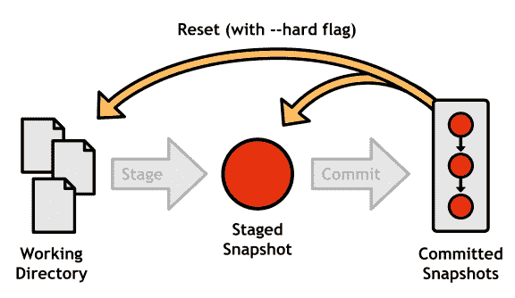
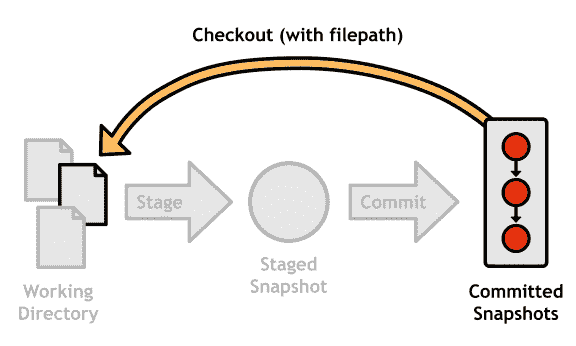
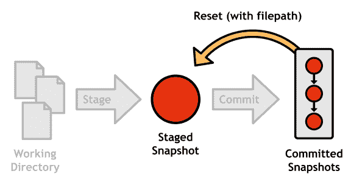
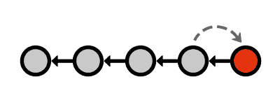
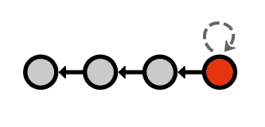

# 第 4 章撤消更改

维护软件项目“安全”副本的重点是高枕无忧：如果您的项目突然中断，您将知道您可以轻松访问功能版本，并且您将能够精确查明问题所在被介绍了。为此，在没有撤消更改的情况下，记录提交是无用的。但是，由于 Git 有很多组件，“撤消”可以有许多不同的含义。例如，您可以：

*   撤消工作目录中的更改
*   撤消暂存区域中的更改
*   撤消整个提交

为了进一步复杂化，有多种方法可以撤消提交。你可以：

1.  只需从项目历史记录中删除提交即可。
2.  保持提交不变，使用新提交撤消第一次提交引入的更改。

Git 为每种情况都有专门的工具。让我们从工作目录开始。

## 在工作目录中撤消

保存项目安全副本后的一段时间是一项伟大的创新。知道您可以自由地 _ 做任何 _，而不会损坏代码库，您可以尝试自己的内容。然而，这种无忧无虑的实验往往需要一个错误的转向，并导致一个工作目录与一堆非主题代码。到达这一点时，您可能希望运行以下命令：

git reset --hard HEAD

git clean -f

git reset 的这种配置使得工作目录和阶段匹配最近提交中的文件（也称为 HEAD ），有效地消除了 _ 跟踪的所有未提交的更改 _ ]文件。要处理 _ 未跟踪 _ 文件，您必须使用 git clean 命令。 Git 在删除代码时非常小心，因此您还必须提供 -f 选项以强制删除这些文件。

图 12：重置所有未提交的更改

### 单个文件

也可以定位单个文件。以下命令将使工作目录中的单个文件与最近提交中的版本匹配。

git checkout HEAD&lt; file&gt;

此命令根本不会更改项目历史记录，因此您可以使用提交 ID，分支或标记安全地替换 HEAD ，以使文件与该提交中的版本匹配。但是，_ 不是 _ 尝试使用 git reset ，因为它 _ 将 _ 改变你的历史（在 [_ 撤消提交 _](../Text/Git_Succinctly.htm#heading_id_32) 中解释]）。

图 13：使用 git checkout 恢复文件

## 在暂存区域中撤消

在配置下一次提交的过程中，您偶尔会在舞台上添加一个额外的文件。以下调用 git reset 将取消它：

git reset HEAD&lt; file&gt;

省略 --hard 标志告诉 Git 单独离开工作目录（与 git reset - 硬 HEAD 相反，它会重置工作目录和阶段中的每个文件）。该文件的分阶段版本与 HEAD 匹配，工作目录保留修改后的版本。正如您所料，这会导致 git status 输出中的非分段修改。

图 14：使用 git reset 取消暂存文件

## 撤消提交

有两种方法可以使用 Git 撤消提交：您可以通过简单地从项目历史中删除它来**重置**，或者**可以通过生成 _new_** 来恢复它 HTG5]提交，摆脱原来引入的变化。通过引入另一个提交进行撤销可能看起来过多，但通过完全删除提交来重写历史记录会在多用户工作流程中产生可怕的后果（详见 [_ 远程存储库 _](../Text/git-12.html#heading_id_54) ）。

### 重置

多功能 git reset 也可用于 _ 移动 _ HEAD 参考。

git reset HEAD~1

HEAD~1 语法参数指定在 HEAD 之前发生的提交（同样， HEAD~2 指的是 HEAD 之前的第二次提交]）。通过向后移动 HEAD 引用，您可以有效地从项目的历史记录中删除最近的提交。

图 15：用 git reset 将 HEAD 移动到 HEAD~1

这是一种简单的方法来删除一些偏离主题的提交，但它提出了一个严重的协作问题。如果其他开发人员已经开始构建我们删除的提交，他们将如何与我们的存储库同步？他们必须向我们询问替换提交的 ID，在您的存储库中手动跟踪它，将所有更改移动到该提交，解决合并冲突，然后再与每个人 _ 分享他们的“新”更改 _。想象一下，在一个拥有数百个贡献者的开源项目中会发生什么......

关键是， **_ 不会重置公共提交 _** ，但可以随意删除未与任何人共享的私人提交。我们将在 [_ 远程存储库 _](../Text/git-12.html#heading_id_54) 中重新审视这个概念。

### 回复

为了解决重置公共提交引入的问题，Git 开发人员设计了另一种撤消提交的方法：恢复。还原添加 _ 新 _ 提交而不是更改现有提交，撤消问题提交：

git revert&lt; commit-id&gt;

这将获取指定提交中的更改，找出如何撤消它们，并使用生成的更改集创建新提交。对于 Git 和其他用户来说，恢复提交的外观和行为与任何其他提交一样 - 它恰好可以撤消先前提交引入的更改。

图 16：使用还原提交撤消提交

这是撤消已提交到公共存储库的更改的理想方法。

### 修订

除了完全撤消提交之外，您还可以**通过像往常一样暂存更改来修改**最近的提交，然后运行：

git commit --amend

这个 _ 替换了 _ 之前的提交，而不是创建一个新提交，如果你忘了添加一个或两个文件，这非常有用。为方便起见，提交编辑器将使用旧提交的消息进行播种。再次，你必须 **_ 在使用 - theamend 标志时要小心 _** ，因为它重写历史很像 git reset 。

图 17：修改最近的提交