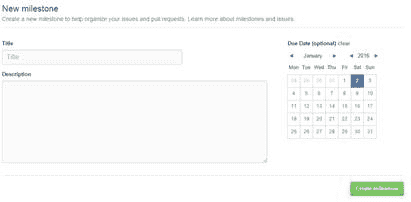

## 编辑问题

当存储库所有者发现问题时，他们将能够开始处理该问题。这允许他们对问题进行分类，将其分配给某人，将其标记为已关闭，并对该问题进行评论。

图 38：所有者视图

### 标记问题

通常，审核该问题的人将首先为其分配标签，例如错误或增强。

图 39：标记问题

图 39 中显示的七个项目是 GitHub 提供的默认标签。您可以通过单击**标签**按钮从问题列表中添加新标签。

图 40：问题列表

这将显示一个屏幕，允许您编辑标签，删除不需要的标签，并添加任何新标签。添加新标签时，GitHub 会询问标签名称并使用颜色选择器让您选择用于此问题的颜色。

图 41：新问题

添加新标签后，您可以将该标签用于所有新问题和现有问题。

### 里程碑

如果您遇到许多问题，可能需要将它们分组为里程碑。里程碑可以是您想要的任何东西，例如：

*   Sprint - 未来两周内将要解决的问题
*   测试版 - 为下一个主要版本工作
*   客户特定 - 特定客户的问题

您可以创建里程碑，类似于创建标签的方式。里程碑还将允许您选择截止日期以帮助跟踪。

图 42：里程碑屏幕

### 受让人

受让人 按钮可让您指定一个人来处理此问题。它应该是所有者或任何合作者。当您（所有者）正在查看存储库时，您可以从设置菜单添加协作者。

图 43：协作者

协作者可以分配任务。您可以通过查找用户名，电子邮件地址或全名来查看协作者列表并添加新协作者列表。您可以使用 X 按钮从项目中删除协作者。协作者也可以对您的项目进行推送访问。