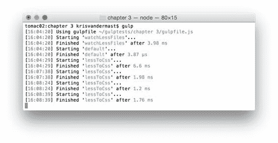
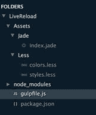
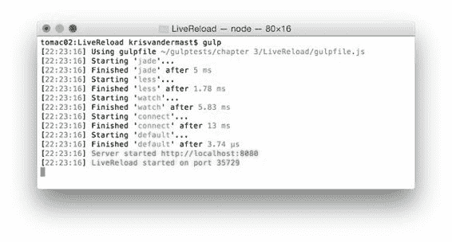
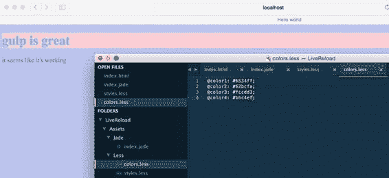

# 第 3 章观看更新

前一章完全是关于 Gulp 的面包和黄油：任务。本章将介绍文件或文件夹何时更改，然后相应地执行操作。这为 Gulp 提供了相当大的功能，使开发人员更容易使用某些场景，这样她就可以更专注于工作，而不会被重复的步骤分散注意力。

## 正在看文件

在开发您的网站或 Web 应用程序时，您知道在完成浏览器中的更改之前，您必须先执行一些手动操作。尽管 Gulp 已经让任务变得更轻松，但它仍然需要一些手动干预，比如打开一些 shell 并输入像 gulp generateCssFromLessFiles 这样的命令。

如果我们可以跳过这一部分并让 Gulp 自己解决问题，那不是很好吗？欢迎使用 Gulp watch API。

我们将开始简单并基于代码清单 5 的下一代码，我们在第 2 章中看到了它。它将被改变以实现我们的目标：减少重复性工作和自动化 Gulp 任务。在名为第 3 章的文件夹中，我将它放在与第 2 章文件夹相同的级别，创建了一个新的 **gulpfile.js** 文件，并将代码清单 11 中的代码放入其中。还要创建一个名为 **Assets** 的子文件夹，在其中放置 **.less** 文件，如下面的代码所示：

代码 13：查看文件：/gulpfile.js

```
"use
  strict";

var gulp = require('gulp');
var less = require('gulp-less');

gulp.task('watchLessFiles', function () {

  gulp.watch('./Assets/styles.less', function (event) {

  console.log('Watching
  file ' + event.path + ' being ' + event.type + ' by gulp.');

  })
});

gulp.task('default', ['watchLessFiles']);

```

  

代码清单 14：一个简单的.less 文件：/Assets/Styles.less

```
@color:#b6ff00;
@backcolor:#808080;

body {

  background-color: @backcolor;
}

a {

   color: @color;

  &:hover {

  color: @color + @backcolor;

  }
}

```

不要忘记安装所需的 Gulp 插件：

· npm install gulp --save-dev

· npm 安装 gulp-less --save-dev

现在运行默认的 Gulp 任务来启动 watch 任务。结果如下图所示。


图 12

现在正在监视 Assets 文件夹中的文件。要对此进行测试，请在文本编辑器中打开 **styles.less** 文件，并在其中键入额外的空格。现在保存它并再次查看图 13 中的输出。


图 13：正在监视的文件已更改并保存后的输出

event.path 显示我们正在观看的文件的路径，而 event.type 正确显示输出**已更改**。其他可能的类型是**添加**或**缺失**。

很高兴看到一些文件在保存时发生了变化，但我们谈到了自动化的事情。在这种情况下，将处理后的.less 文件转换为我们感兴趣的.css 文件。为此，只需更改 **gulpfile.js** 文件：

代码 15：将.less 文件处理成.css 文件/gulpfile.js

```
"use
  strict";

var gulp = require('gulp');
var less = require('gulp-less');

gulp.task('lessToCss', function () {

  gulp.src('Assets/Styles.less')

  .pipe(less())

  .pipe(gulp.dest('wwwroot/css'));
});

gulp.task('watchLessFiles', function () {

  gulp.watch('./Assets/styles.less', ['lessToCss']);
});

gulp.task('default', ['watchLessFiles']);

```

再次运行 Gulp，更改 **styles.less** 文件，然后保存。每次保存.less 文件时，这样做几次就会运行任务，正如我们在输出中看到的那样：



图 14：每次运行 task lessToCss 时都会重复保存.less 文件

这肯定可以节省宝贵的时间。为此，我们需要更改文件，保存文件，自己运行任务 lessToCss ，并在此过程中，离开我们的文本编辑器。

要停止该过程，您只需使用键盘组合 **Ctrl + C** 即可。要再次开始观看，只需再次运行默认的 Gulp 任务即可。


图 15：重复更改.less 文件

## 正在观看文件夹

在上一节中，我们了解了如何观看文件并在保存文件时采取行动。这很好，但是当我们可以为整个文件夹做这件事时真的很有趣。我们可以稍微改变代码以包含变量。这将保留路径，因此我们不必每次都输入它，并且可能通过错误输入来制造错误。

改变后的代码现在看起来像这样：

代码 16：将.less 文件处理成.css 文件/gulpfile.js

```
"use
  strict";

var gulp = require('gulp');
var less = require('gulp-less');
var lessPath = './Assets/**/*.less';

gulp.task('lessToCss', function () {

  gulp.src(lessPath)

  .pipe(less())

  .pipe(gulp.dest('wwwroot/css'));
});

gulp.task('watchLessFiles', function () {

  gulp.watch(lessPath, ['lessToCss']);
});

gulp.task('default', ['watchLessFiles']);

```

变量 lessPath 使用全局符号 Assets / ** / *。。这是一种强大的编写方式，因为它意味着“直接在 Assets 文件夹下的所有.less 文件，以及 Assets 文件夹的子文件夹中的文件。”因此，不必为每个子文件夹编写路径并通过，您有机会以一种紧凑的方式编写它。

如果我们运行代码并更改一些.less 文件（直接在 Assets 文件夹或任何子文件夹下）并保存该.less 文件，则运行任务 lessToCss 并将输出写入 wwwroot / css 文件夹并考虑 Assets 文件夹下的子文件夹。


图 16：查看多个文件和文件夹

现在，如果你尝试添加一个新的.less 文件并保存它......没有任何反应。但是，如果要在添加监视之前更改已存在的.less 文件，则新的.less 文件也将转换为.css 文件。后者是显而易见的，但我们希望它也适用于新文件。

## 文件夹中的新文件，现在是什么？

在上一节中，我们注意到在手表设置之后添加的新文件无法运行。 Gulp 的手表功能强大，但并非无所不能。它会尽力而为，但如果我们计划添加新文件，我们需要更强大的东西。

更强大的东西以插件的形式出现： gulp-watch 。要获得它，只需运行熟悉的命令 npm install --save-dev gulp-watch 。

因为它是一个插件，我们需要稍微重写一下我们的代码，因为它需要插入到流中才能使它工作。代码变成如下所示：

  

代码 17：使用 gulp-watch 插件/gulpfile.js

```
"use
  strict";

var gulp = require('gulp');
var less = require('gulp-less');
var gulpWatch = require('gulp-watch');

var lessPath = './Assets/**/*.less';

gulp.task('lessToCss', function () {

  gulp.src(lessPath)

  .pipe(gulpWatch(lessPath))

  .pipe(less())

  .pipe(gulp.dest('wwwroot/css'));
});

gulp.task('default', ['lessToCss']);

```

现在运行 Gulp 默认任务并尝试在 **/ Assets** 文件夹中添加一个新的.less 文件。您会注意到在 wwwroot / css 文件夹中会有一个新的.css 文件。

## 直播重装你的浏览器

Web 开发人员熟悉以下过程：您在文件中进行一些更改，保存它，也许您使用 Gulp 执行一些构建步骤，然后重新加载浏览器以查看前一步骤的结果。大多数 Web 开发人员或设计人员甚至不再考虑它，只需按下 Mac 上的 Ctrl + F5 或 Command + R.

如果我们能够解除其中一些步骤，那就太好了。好吧，有了像 gulp-connect 这样的便捷插件，你可以走很长的路。有一些替代品，比如 gulp-livereload ，但是它依赖于需要在浏览器中安装的插件。

此时，确保安装了所有需要的模块（ gulp ， gulp-less ， gulp-jade 和 gulp-connect ）。

  

对于这个例子，我们将利用 Jade 生成 HTML 页面，Less 生成 CSS 样式表，Gulp 任务和观察者，当然还有 gulp-connect 插件。在添加重新加载功能之前，让我们为这个小项目创建最小的最小值。布局如下：



图 17：项目文件夹和文件结构

|  | 注意：gulpfile.js 和 package.json 直接位于 LiveReload 文件夹下，而不是在 node_modules 子文件夹下。 Sublime Text 中使用的 Cobalt2 主题可能会给人留下这样的印象。 Gulpfile.js 和 package.json 总是直接在项目的根文件夹下。 |

**index.jade** 文件如下所示：

代码 18：/Assets/Jade/index.jade

```
doctype
  html
html
      head
            title
  Hello world
            link(rel="stylesheet",
  href="css/styles.css")
      body
            h1
  gulp is great
            p
  it seems like it's working
            script(src="js/main.js")

```

Less 文件如下所示：

代码 19：/Assets/Less/colors.less

```
@color1: #c9c9c9;
@color2: #e3e3e3;
@color3: #9ad3de;
@color4: #89bdd3;

```

  

代码 20：/Assets/Less/styles.less

```
@import "colors.less";

body {
      color: @color1;
      background-color: @color4;
}

h1 {
      color: @color2;
      background-color: @color3;
}

```

和 gulpfile.js：

代码 21：/gulpfile.js

```
"use
  strict";

var gulp = require('gulp'),
      less
  = require('gulp-less'),
      jade
  = require('gulp-jade'),
      connect
  = require('gulp-connect');

var jadeDir = './Assets/Jade/**/*.jade';
var lessDir = './Assets/Less/**/*.less';
var outputDirHtml = './';
var outputDirCss = './css/';

gulp.task('jade', function () {

  gulp.src(jadeDir)
            .pipe(jade())
            .pipe(gulp.dest(outputDirHtml))
});

gulp.task('less', function () {

  gulp.src(lessDir)
            .pipe(less())
            .pipe(gulp.dest(outputDirCss));
});

gulp.task('watch', function () {

  gulp.watch([jadeDir], ['jade']);

  gulp.watch([lessDir], ['less']);
})

gulp.task('default', ['jade', 'less', 'watch']);

```

从终端运行 gulp 命令可确保在监视任务添加熟悉的监视输入文件时生成 index.html 和 css 文件。尝试更改 Jade 或 Less 文件以查看它是否已更新。

现在打开浏览器并在 **index.html** 页面上打开它。更改 **index.jade** 文件中的内容，保存并刷新浏览器以查看更改。

是时候让魔法了。将 gulpfile.js 更改为以下内容：

代码 22：具有 livereload 功能的 gulpfile.js - /gulpfile.js

```
"use
  strict";

var gulp = require('gulp'),
      less
  = require('gulp-less'),
      jade
  = require('gulp-jade'),
      connect
  = require('gulp-connect');

var jadeDir = './Assets/Jade/**/*.jade';
var lessDir = './Assets/Less/**/*.less';
var outputDirHtml = './';
var outputDirCss = './css/';

gulp.task('jade', function () {

  gulp.src(jadeDir)
            .pipe(jade())
            .pipe(gulp.dest(outputDirHtml))
            .pipe(connect.reload());
});

gulp.task('less', function () {

  gulp.src(lessDir)
            .pipe(less())
            .pipe(gulp.dest(outputDirCss))
            .pipe(connect.reload());
});

gulp.task('watch', function () {

  gulp.watch([jadeDir], ['jade']);

  gulp.watch([lessDir], ['less']);
})

gulp.task('connect', function () {

  connect.server({

  root: './',

  livereload: true

  });
});

gulp.task('default', ['jade', 'less', 'watch', 'connect']);

```

要添加的另一个重要代码，一个容易被忽略的代码，就是在 Jade 文件或 Less 文件之一被更改时调用重新加载： .pipe（connect.reload（））; 。在 jade 和较少任务中，确保触发重载。在构建运行更新后，它会被触发并且浏览器会同时重新加载。运行 gulp 命令，将显示以下内容：



图 18：LiveReload

首先，它将执行任务以将 Jade 文件解析为 HTML，将 Less 文件解析为 CSS，并在前两个上添加监视。它还将执行 connect 任务。在该任务中，设置根 URL 并应启用实时重新加载选项。你需要明确地这样做;否则，它不会开始。

输出的最后两行显示导航到的位置： [http：// localhost：8080](http://localhost:8080) 。 gulp-connect 插件提供了一个内置服务器，我们将在本例中使用它。

打开所选的浏览器并浏览到 [http：// localhost：8080 / index.html](http://localhost:8080/index.html) 。您将看到如下页面：


图 19：jade 和较少任务运行后的初始结果

由于 jade 和较少任务运行，这些输出导致我们的解决方案添加了文件：


图 20：jade 之后的解决方案和更少的任务已经运行

现在为酷的部分。当您在 Jade 或 Less 文件中更改某些内容时，将浏览器保持在屏幕的可见范围内。保存后，您将在浏览器中看到即时更新。对于此演示，我选择更改相应 colors.less 文件中的颜色。



图 21：colors.less 文件已更改并保存

这有效的原因是 gulp-connect 在 HTML 中注入了额外的 JavaScript。通过使用浏览器的 F12 工具，我们可以很容易地看到以下内容：


图 22：通过 gulp-connect 注入的 JavaScript 部分

如果您熟悉 Visual Studio 和 ASP.NET Web 开发，则可能遇到过类似的问题。在那里它被称为 BrowserLink，您可以在 Visual Studio 中的 CSS 文件中更改某些内容，它会自动更新浏览器。

## 摘要

在本章中，您看到 gulp.js 不仅能够很好地运行任务，还能够注意变化。以巧妙的方式工作，您可以减轻手动不断执行 Gulp 任务的负担，甚至可以自己重新加载浏览器。这使您有更多时间专注于重要的事情：编写可以解决您业务需求的可靠代码。