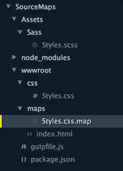

## 来源地图

源映射是一种方便的方法，可以让浏览器知道原始文件对于某个资源（如 JavaScript 或 CSS 文件）的位置。我们已经看到了本章前面 [TypeScript 段落](../Text/gulp-31.html#_TypeScript)中使用它的一瞥。在那里，这是一个可选设置。然而，并非每个 Gulp 插件都具有开箱即用的功能。幸运的是，有一个专用的 Gulp 插件可以注入流中。实际上，正如我们稍后将看到的那样，流中需要两点：一个用于初始化，另一个用于写入。

我们将在这个例子中使用 Sass;一定要使用 npm install 来获取 gulp-sass 包。就像 Less 一样，这是一种流行的 CSS 预编译器语法，越来越受欢迎。例如，着名的 Bootstrap 库的下一个版本将使用 Sass 编写，而当前版本使用 Less。请注意，Sass 文件的扩展名为.scss。为了让自己熟悉 Sass 的语法，我建议你看一下[这个指南](http://sass-lang.com/guide)。

代码 35：Styles.scss - /Assets/Sass/styles.scss

```
a.CoolLink {

  color: blue;

  &:hover {

  text-decoration: underline;

  }

  &:visited {

  color: green;

  }
}

```

代码 36：gulpfile.js - /gulpfile.js

```
var gulp = require('gulp'),
      sass
  = require('gulp-sass'),
      sourcemaps
  = require('gulp-sourcemaps');

gulp.task('css', function () {

  return gulp.src('./Assets/Sass/**/*.scss')
                        .pipe(sourcemaps.init())
                              .pipe(sass({

  outputStyle: 'compressed'
                              }))
                        .pipe(sourcemaps.write())
                        .pipe(gulp.dest('./wwwroot/css'));
});

gulp.task('default', ['css']);

```

这段代码列表相当多，所以让我们更仔细地检查 css 任务。首先，所有 Sass 文件都放入流中。然后源图被初始化。你可以把它放在 Sass 管之后，但建议先把它放进去。然后将 Sass 编译成 CSS 执行它的魔力并且源图被编写。在当前调用中，映射将写入生成的 CSS 文件中，如下所示：

代码清单 37：Styles.css 包含在文件本身中的 sourcemapping - /wwwroot/css/styles.css

```
a.CoolLink{color:blue}a.CoolLink:hover{text-decoration:underline}a.CoolLink:visited{color:green}

/*#
  sourceMappingURL= */

```

这有效，但我个人喜欢将映射保存在单独的文件中。只需更改对 write 函数的调用就可以很容易地完成此操作，如下所示：

代码 38：调整后的 gulpfile.js 将源映射写入另一个文件 - gulpfile.js

```
var gulp = require('gulp'),
      sass
  = require('gulp-sass'),
      sourcemaps
  = require('gulp-sourcemaps');

gulp.task('css', function () {

  return gulp.src('./Assets/Sass/**/*.scss')
                        .pipe(sourcemaps.init())
                              .pipe(sass({

  outputStyle: 'compressed'
                              }))
                        .pipe(sourcemaps.write('../maps'))
                        .pipe(gulp.dest('./wwwroot/css'));
});

gulp.task('default', ['css']);

```

运行默认的 Gulp 任务后，这次将创建另一个子文件夹，映射，它将保存生成的源图文件，如下所示：



图 25：Styles.css 及其相应的 Styles.css.map 文件

与以前的内联映射不同，在 Styles.css 中，单独的 Styles.css.map 文件看起来有些不同。此外，Styles.css 现在只包含浏览器可以找到映射文件的简短指示。

代码 39：Styles.css.map - /wwwroot/maps/styles.css.map

```
{"version":3,"sources":["Styles.scss"],"names":[],"mappings":"AAAC,CAAC,SAAS,CACP,KAAK,CAAE,IAAK,CADJ,AAEP,CAAC,SAAS,MAAH,AAAS,CACb,eAAe,CAAE,SAAU,CADtB,AAGR,CAAC,SAAS,QAAD,AAAS,CACf,KAAK,CAAE,KAAM,CADN","file":"Styles.css","sourcesContent":["a.CoolLink
  {\n    color: blue;\n    &:hover {\n        text-decoration:
  underline;\n    }\n    &:visited {\n        color: green;\n    }\n}"],"sourceRoot":"/source/"}

```

|  | 注意：源映射文件在您的计算机上可能看起来有点不同。在这里你看到\ n，它是 Mac OS X 上的返回和换行符，而在 Windows 上它将显示\ r \ n 而不是。此外，json 文件的属性顺序可能不同，但基本上相同的信息将在那里。 |

代码 40：Styles.css - /wwwroot/css/styles.css

```
a.CoolLink{color:blue}a.CoolLink:hover{text-decoration:underline}a.CoolLink:visited{color:green}

/*#
  sourceMappingURL=../maps/Styles.css.map */

```

要在浏览器中对此进行测试，请在 **wwwroot** 文件夹下添加一个 HTML 文件，其中包含以下内容：