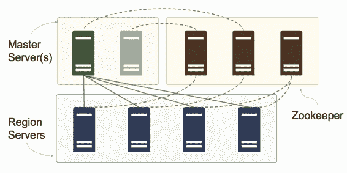
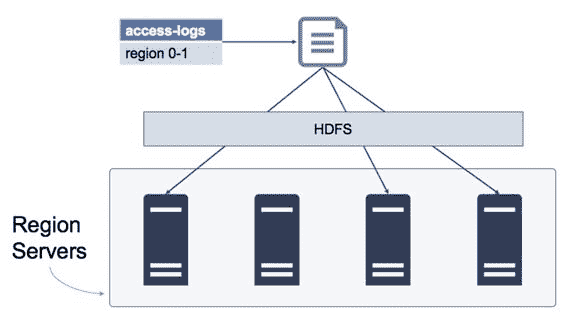

# 第 7 章 HBase 的架构

## 零部件

在 HBase 的分布式部署中，该体系结构有四个组件，它们共同构成 HBase 服务器：

· 区域服务器 - 计算托管区域并提供数据访问的节点

· 主服务器 - 协调区域服务器并运行后台作业

· Zookeeper - 包含共享配置并通知主服务器有关服务器故障

· Hadoop 分布式文件系统（HDFS） - 物理托管在主服务器和区域服务器之间的存储层

图 5 显示了 HBase 分布式安装中组件之间的关系，其中组件在多个服务器上运行：

图 5：分布式 HBase 集群

在多个服务器上托管每个组件可在生产环境中提供弹性和性能。作为首选最小值，群集应具有两个主服务器，三个 Zookeeper 节点和四个区域服务器。

 注意：HBase 集群中的每个节点都应具有专用角色。不要尝试在 Region Servers 上运行 Zookeeper - 整个集群的性能和可靠性会降低。每个节点应位于单独的物理或虚拟机上，所有这些都在同一物理或虚拟网络中。

在生产中运行 HBase 并不一定要求您调试九台服务器来运行内部部署。您可以在云中启动托管 HBase 群集，并且只在需要时支付计算能力。

## 主服务器

主服务器（也称为“HMaster”）是系统的管理员。它拥有元数据，因此它是进行表更改的地方，它还管理区域服务器。

当您在 HBase 中进行任何管理更改（如创建或更改表）时，它将通过主服务器完成。 HBase Shell 使用 Master 中的功能，这就是您无法远程运行 Shell 的原因（尽管您可以从其他远程接口调用 HMaster 功能）。

主服务器侦听来自 Zookeeper 的通知，以更改任何区域服务器的连接状态。如果 Region Server 出现故障，Master 会将其服务的所有区域重新分配给其他 Region Servers，如图 6 所示：

图 6：重新分配区域

当 Region Server 联机时（丢失的服务器重新加入，或者群集中的新服务器重新加入），在分配给它之前，它不会为任何区域提供服务。您可以手动在服务器之间分配区域，但 Master 会定期运行负载均衡器作业，该作业在活动区域​​服务器之间尽可能均匀地分配区域。

群集中只有一个活动的主服务器。如果有其他服务器可靠，它们将以主动 - 被动模式运行。被动服务器在活动主服务器状态下监听来自 Zookeeper 的通知，如果服务器发生故障，则另一台服务器接管新主服务器。

群集中不需要多个主服务器。通常，两台服务器就足够了。

客户端连接不依赖于具有有效的主服务器。如果所有主服务器都关闭，客户端仍然可以连接到区域服务器并访问数据，但系统将处于不安全状态，并且无法对区域服务器的任何故障做出反应。

## 区域服务器

区域服务器托管区域并使其可供客户端访问。从 Region Server，客户端可以执行读取和写入请求，但不能执行任何元数据更改或管理功能。

单个 Region Server 可以托管来自相同或不同表的多个区域，如图 7 所示，Region Server 是 HBase 中水平缩放的单位。要获得更高的性能，您可以添加更多区域服务器，并确保跨服务器的区域平衡分割。

图 7：跨区域服务器分布的区域

表的每个区域由单个 Region Server 托管，与其他 Region Servers 的客户端连接将无法访问该区域的数据。

要查找正确的 Region Server，客户端将查询 HBase 元数据表（称为 hbase：meta ），该表包含表，区域和已分配的 Region Servers 列表。分配区域时，主服务器使元数据表保持最新。

正如我们所见，查询 HBase 元数据以查找 Region Server 通常是在客户端代码中抽象的，因此消费者使用更高级别的概念，如表和行，客户端库负责查找正确的 Region Server 并制作连接。

区域服务器通常是 HDFS 数据节点，在健康的 HBase 环境中，每个区域服务器都将托管其服务的所有区域的本地磁盘上的数据。这是 100% 的数据位置，它意味着对于每个客户端请求，区域服务器必须做的最多是从本地磁盘读取。

当区域在服务器之间移动时，数据局部性会降低，并且区域服务器不会在本地保存其区域的数据，但需要通过网络从另一个数据节点请求它。糟糕的数据位置意味着整体性能不佳，但有一些功能可以解决这个问题，我们将在第 10 章“监控和管理 HBase”中介绍 HBase 管理。

## Zookeeper

Zookeeper 用于集中配置，以及群集中的服务器脱机或联机时的通知。 HBase 主要使用 Zookeeper 中的短暂 znode ，存储用于组件之间协调的状态数据;它不用作 HBase 数据的存储。

所有主服务器和区域服务器都使用 Zookeeper。每个服务器都有一个节点，用于表示其心跳，如图 8 所示。如果服务器失去与 Zookeeper 的连接，则心跳停止，经过一段时间后，服务器将被假定为不可用。

图 8：与 Zookeeper 的心跳连接

活动主服务器在所有区域服务器心跳节点上都有一个监视，因此它可以对脱机或联机的服务器做出反应，被动主服务器在活动主服务器的心跳节点上有监视，因此它可以对主服务器作出反应离线。

虽然 Zookeeper 不用作永久数据存储，但其可用性对于 HBase 集群的健康性能至关重要。因此，Zookeeper 集合应该运行多个服务器，一个奇数用于在出现故障时保持多数（三个节点集合可以在一个服务器丢失的情况下存活;一个五节点集合可以在两个服务器丢失的情况下存活）。

## HDFS

生产 HBase 集群是 Hadoop 集群，其中 HDFS 名称节点在主服务器上运行，数据节点在区域服务器上运行。

包含区域和列族数据的文件存储在 HDFS 中。您无需彻底了解 HDFS 即可了解它与 HBase 的匹配程度。可以说，HDFS 中的数据在数据节点中被复制三次，如图 9 所示。如果一个节点出现中断，则数据仍可从其他节点获得。

图 9：HDFS 中存储的 HBase 数据

HBase 依赖于 HDFS 来保证数据的完整性，因此 Region Server 的存储部分在概念上非常简单。当 Region Server 提交对磁盘的更改时，它假定来自 HDFS 的可靠性，并且当它从磁盘获取数据时，它假定它可用。

## 摘要

在本章中，我们介绍了 HBase 的分布式部署的体系结构。客户端交互通常使用区域服务器，区域服务器提供对表区域的访问并使用 HDFS 将数据存储在集群上。缩放 HBase 以提高性能通常意味着添加更多区域服务器并确保它们之间的负载平衡。

区域服务器由主服务器管理，如果服务器脱机或联机，则主服务器在活动服务器之间分配区域。对于所有表更改，主服务器还拥有数据库元数据。通常，HBase Master 部署在两台服务器上，以主动 - 被动形式运行。

最后是 Zookeeper，用于在其他服务器之间进行协调，用于共享状态，以及在服务器关闭时通知，以便群集可以自行修复。为了可靠性，Zookeeper 应该在奇数个服务器上运行，最少三个。

在下一章中，我们将在 Region Server 上进行分区，这是大部分工作在 HBase 中完成的地方。