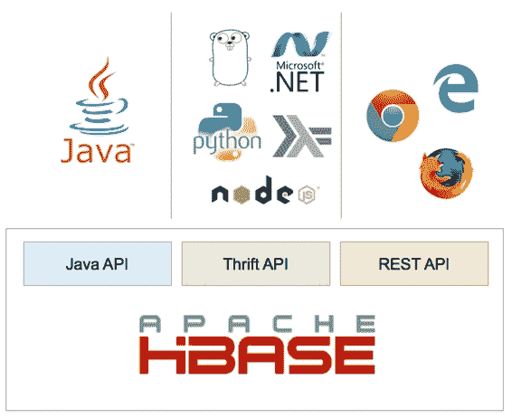

# 第 1 章 HBase 介绍

## 什么是 HBase？

HBase 是一个 NoSQL 数据库，可以在单个机器或服务器集群上运行，以实现性能和容错。它是为规模构建的 - HBase 表可以存储数十亿行和数百万列 - 但与其他面向批处理的大数据技术不同，HBase 可以实时提供数据访问。

有一些关键概念使 HBase 与其他数据库不同，在本书中我们将学习关于行键结构，列族和区域的所有信息。但 HBase 使用与其他数据库设计相同的基本概念，因此可以直接提取它。

HBase 是 Apache Foundation 提供的免费开源软件。它是一种跨平台技术，因此您可以在 Windows，Linux 或 OS / X 计算机上运行它，并且在 Amazon Web Services 和 Microsoft Azure 中都可以在云中托管 HBase 解决方案。在本书中，我们将使用 Docker 容器中所有运行 HBase 的最简单选项。

您可以使用许多客户端选项连接到 HBase，如图 1 所示.Java API 是一等公民，但使用 Thrift 和 REST API，您几乎可以使用任何语言和平台进行连接。我们将介绍本书中的所有三个 API，以及 HBase 附带的命令行界面。

图 1：HBase API 和客户端平台