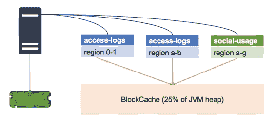

## BlockCache

HBase 对最近获取的数据使用内存缓存。每个 Region Server 都有一个 BlockCache，它在服务器托管的所有区域之间共享，如图 11 所示：

图 11：每个服务器一个 BlockCache

默认情况下，分配给 BlockCache 的内存占 Java 虚拟机堆的 25％。该大小受到服务器中物理内存的限制，这是为什么过多数量的区域会影响性能的一个原因 - 所有区域都将争夺有限的内存空间。

当 Region Server 获取读取请求时，它会检查 BlockCache 以查看数据是否在内存中。如果是这样，它返回并且读取将非常快。如果没有，则服务器检查该区域的 MemStore 以查看最近是否写入了数据。如果没有，则服务器从磁盘上的相关 HFile 读取数据。

BlockCache 使用最近最少使用的逐出策略，因此重复访问的数据项保留在缓存中，并且不经常使用的数据项会自动删除（尽管由于缓存对高性能至关重要，因此 HBase 允许您调整 BlockCache 和使用不同的缓存策略算法）。