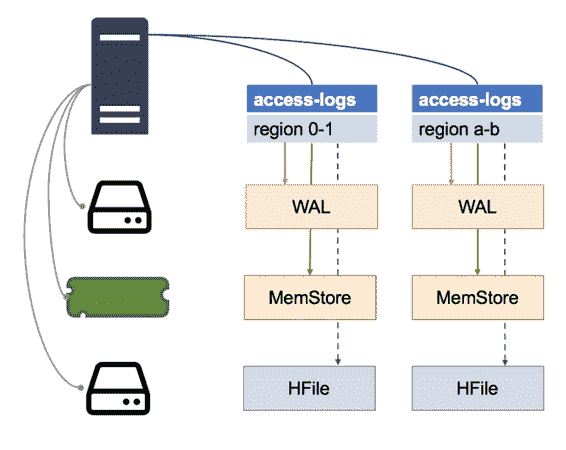

## 缓冲和提前写入日志

在写入数据时缓冲数据并定期将其刷新到磁盘可以优化 Region Server 的写入性能，但它也会造成数据丢失的可能性。如果 Region Server 出现故障，则 MemStore 中缓冲的任何写入都将丢失，因为它们不会保留到磁盘。

HBase 具有写入前向日志（WAL）所涵盖的场景，存储在 HDFS 中作为每个区域的单独物理文件。数据更新在 MemStore 中缓冲，但数据更新请求首先在 WAL 中保留，因此 WAL 会记录 MemStore 中缓存的所有更新，如图 14 所示：

图 14：预写日志文件

如果 Region Server 出现故障，当该区域被分配给另一个服务器时，它会在将该区域联机之前检查 WAL。如果在 WAL 中记录了更新，则新的 Region Server 将读取它们并将它们全部保留到 HFile，然后再使该区域可用。

在将更新提交到 WAL 之前，区域服务器不会确认写入请求，并且新区域服务器在区域联机时不接受任何请求（包括将 WAL 刷新到磁盘）。

如果服务器发生故障，当托管区域的数据不可用时，将会有一段时间的停机，但数据不会丢失。