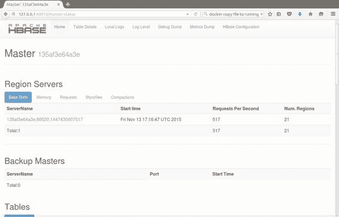
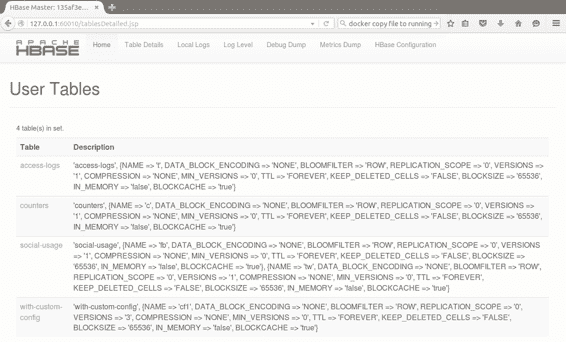

## 主服务器 UI

虽然区域服务器 UI 很有用，但主服务器 UI 在更高级别运行，显示所有区域服务器的性能和指标。这是第一个检查 HBase 系统健康状况的地方。

默认情况下，Web UI 在主服务器上的端口 60010 上运行。如果您正在运行多个主服务器，则只有活动主服务器显示任何信息。主屏幕（如图 23 所示）打开，其中包含所有区域服务器的摘要，说明每个区域服务的区域数，以及它们当前每秒处理的请求数：

图 23：主 Web UI

在“区域服务器”部分中，主 UI 还会显示“区域服务器”中的组合详细信息，以了解其内存使用情况，各个区域请求和“存储文件”。 Compactions 选项卡会告诉您是否发生了任何重大压缩，以及它们处于什么状态。

在顶级导航中，您可以访问主服务器的本地日志文件并更改日志级别，以及查看度量标准转储和 HBase 配置。 Debug Dump 为您提供了关于服务器正在做什么的非常低级的详细信息（除非它行为不当，否则您很少需要），但是 Table Details 链接为您提供了如图 24 所示的有用信息：

图 24：主 UI 中的表格详细信息

此页面显示数据库中定义的每个表，以及完整配置（您可以看到第 2 章中的 with-custom-config 表有三个为列系列指定的版本，而默认值为 1）其他表）。