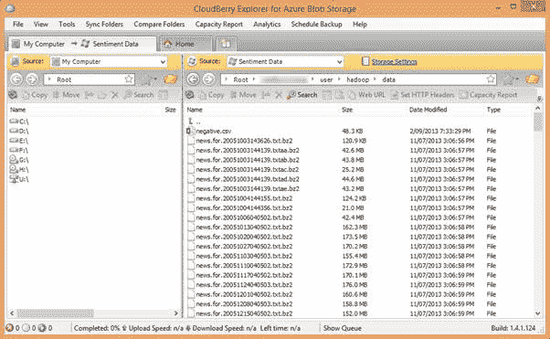

# 第 5 章 HDInsight 和 Windows Azure 存储 Blob

## 将数据加载到 Azure Blob 存储中

Hadoop 的 HDInsight 实现可以引用 Windows Azure 存储 Blob（WASB），它通过 Azure Blob 存储提供全功能 Hadoop 分布式文件系统 （HDFS）。 [&lt;sup&gt;[6]&lt;/sup&gt;](../Text/hdi-13.html#_ftn6) 这将数据与计算节点分开。这与将数据移动到计算机的一般 Hadoop 原则相冲突，以减少网络流量，这通常是性能瓶颈。在 WASB 中避免了这个瓶颈，因为它通过快速 Azure 平面网络存储从 Azure Blob 存储流式传输数据 - 也称为 “量子 10”（Q10）网络架构 - 其中确保高性能。 [&lt;sup&gt;[7]&lt;/sup&gt;](../Text/hdi-13.html#_ftn7)

这允许您将数据存储在廉价的 Azure 存储上，而不是将其保存在显着更昂贵的 HDInsight 群集的计算节点存储上。它进一步允许在启动集群之前相对较慢的上传数据的过程，并允许您的输出在关闭集群后保持不变。这使得计算组件真正过渡，并将与计算相关的成本与与存储相关的成本分开。

任何 Hadoop 进程都可以在 WASB 上引用数据，默认情况下，HDInsight 将其用于包括临时文件在内的所有存储。使用 WASB 的能力不仅适用于基本 Hadoop 功能，还适用于 Pig 和 Hive 等高级语言。

可以通过许多工具将数据加载到 Azure Blob 存储中。其中一些列在下面：

| 姓名 | GUI | 免费 | 来源 |
| AzCopy | 没有 | 是 | [http://blogs.msdn.com/b/windowsazurestorage/archive/2012/12/03/azcopy-uploading-downloading-files-for-windows-azure-blobs.aspx](http://blogs.msdn.com/b/windowsazurestorage/archive/2012/12/03/azcopy-uploading-downloading-files-for-windows-azure-blobs.aspx) |
| Azure 存储资源管理器 | 是 | 是 | [http://azurestorageexplorer.codeplex.com/](http://azurestorageexplorer.codeplex.com/) |
| Azure 存储的 CloudBerry Explorer | 是 | 是 | [http://www.cloudberrylab.com/free-microsoft-azure-explorer.aspx](http://www.cloudberrylab.com/free-microsoft-azure-explorer.aspx) |
| CloudXplorer | 是 | 没有 | [http://clumsyleaf.com/products/cloudxplorer](http://clumsyleaf.com/products/cloudxplorer) |
| 适用于.NET 专业人员的 Windows 和 SQL Azure 工具 | 是 | 没有 | [http://www.red-gate.com/products/azure-development/](http://www.red-gate.com/products/azure-development/) |

连接到此示例中使用的 Azure 存储的 CloudBerry Explorer 的屏幕截图如下：



图 3：连接到 Azure 存储的 CloudBerry Explorer

正如您所看到的，它非常像文件浏览器，并且您可以从这样的实用程序中获得大多数功能。

根据可用带宽上传大量数据进行处理可能是一个耗时的过程，因此建议您在设置群集之前上传数据，因为这些任务可以独立执行。这会阻止您在等待数据可用于处理时支付计算时间。

## 引用 Azure Blob 存储中的数据

引用 WASB 中保存的数据的方法取决于 HDInsight 实例的配置。

使用“快速创建”选项在管理门户中创建 HDInsight 群集时，可以指定现有存储帐户。创建群集还将导致在该帐户中创建新容器。使用“自定义创建”，您可以在存储帐户中指定容器。

普通的 Hadoop 文件引用如下所示：

```
hdfs://[name node path]/directory level 1/directory level 2/filename

eg:

hdfs://localhost/user/data/big_data.txt

```

WASB 引用类似，但除了引用名称节点路径外，还需要引用 Azure 存储容器：

```
wasb[s]://[<container>@]<accountname>.blob.core.windows.net/<path>

eg:

wasb://datacontainer@storageaccount.blob.core.windows.net/user/data/big_data.txt

```

对于默认容器，可以删除显式帐户/容器信息，例如：

```
hadoop fs -ls wasb://user/data/big_data.txt

```

甚至可以删除 wasb：//引用：

```
hadoop fs –ls user/data/big_data.txt

```

请注意以下全部参考选项：

* wasb [s]：[s]允许通过 SSL 进行安全连接

*容器对于默认容器是可选的

第二点突出显示，因为可能有多个与每个群集关联的存储帐户。如果使用“自定义创建”选项，则最多可以指定七个其他存储帐户。

如果您需要在创建群集后添加存储帐户，则需要更新配置文件 core-site.xml，添加该帐户的存储密钥，以便群集有权使用以下 XML 片段从该帐户读取：

```
<property> <name>fs.azure.account.key.[accountname].blob.core.windows.net</name>
<value>[accountkey]</value> </property>

```

可以在 Windows Azure 网站上找到完整的文档。 [&lt;sup&gt;[8]&lt;/sup&gt;](../Text/hdi-13.html#_ftn8)

作为最后一点，isb：//表示法用于更高级语言（例如，Hive 和 Pig），其方式与基本 Hadoop 函数完全相同。