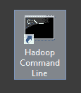
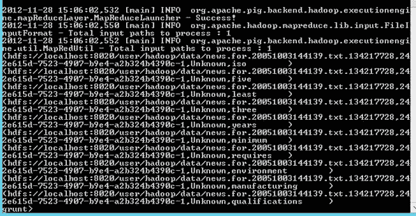
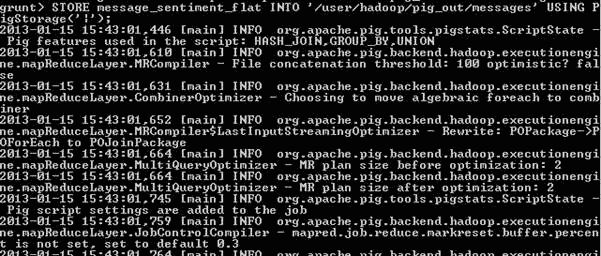

# 第 8 章使用 Pig 处理和丰富数据

根据官方 [Apache Pig 项目页面](http://pig.apache.org/)：

[](http://pig.apache.org/) 

**Apache Pig** 是一个分析大型数据集的平台，该数据集由用于表达数据分析程序的高级语言和评估基础设施组成。这些计划。 Pig 程序的显着特性是它们的结构适合于大量的并行化，这反过来又使它们能够处理非常大的数据集。

实际上，Pig 是一种语言，它允许您描述存储为原始文件（如分隔文本）的数据集，然后对 SQL 开发人员熟悉的那些数据集执行一系列操作（例如向单个行或连接和聚合集合在一起）。它的构建方式允许使用 MapReduce 范例大规模并行化作业，因为 Pig 命令被转换为 MapReduce 作业以便执行。这不直接暴露给 Pig 程序员。

## 使用猪

撰写本文时，Pig 没有可用的 GUI。所有命令都通过头节点上的命令行或从客户端桌面通过 PowerShell cmdlet 执行。 [[19]](../Text/hdi-13.html#_ftn19) 在这种情况下，我们将使用命令行，当使用 HDInsight 平台时，通过 Hadoop 命令 shell（桌面上的链接）访问：



图 4：Hadoop 命令行快捷方式

在命令行输入“pig”并按 Enter 键。这将进入 Pig 命令 Shell，当命令提示符更改为`grunt>`时可以清楚地识别：


图 5：调用 Pig 命令 Shell

从此处可以输入 Pig 命令，如文档中所述。 [[20]](../Text/hdi-13.html#_ftn20)

## 引用关系中的已处理数据

我们的第一步是引用 C# Mapper 和 Sentiment 关键字列表输出的数据。注意我故意不说加载。此时，不处理任何数据，也不会对源数据进行验证。 Pig 只接收要使用的文件的描述：

```
data_raw = LOAD 'wasb://<container>@<storageaccount>.blob.core.windows.net/user/hadoop/output/Sentiment/part-*' USING PigStorage('|') AS (filename:chararray,message_id:chararray,author_id:chararray,word:chararray);

```

这里我们使用 LOAD 命令来描述我们想要引用的文件作为关系“data_raw”，使用 Hadoop Globbing 支持的通配符。 [[21]](../Text/hdi-13.html#_ftn21) 值得注意的是，无需向 Pig 提供说明就告诉它原始数据被压缩。它可以本地处理压缩，并根据数据文件扩展名确定要使用的解压缩编解码器。

根据文档，关系是一包元组，而元组又是一组有序的字段。这是关系数据库世界的不同结构方法，因此下面的标注解释了概念（尽管建议进一步阅读）：

```
Relations, bags, tuples, and fields
Starting from the bottom up, a Field is very much like a simplified column in the relational database world. It has a name, a data type, and a value, and can be referenced using a zero-based ordinal position within the tuple.
A Tuple is similar to a row in a relational database in that it is an ordered collection of fields.
A Bag is a collection of tuples. However, this starts deviating from the relational model in that there are two types of bags: the inner and outer.
Inner Bags are a collection of tuples within tuples, for example: Tuple 1 ({Tuple 2},{Tuple 3})
Outer Bags are the overall collection of the tuples otherwise known as a Relation.

```

参考数据后，我们可以测试我们的初始数据结构以确保它是合理的：

```
temp = LIMIT data_raw 10;
DUMP temp;

```

这里我们使用 DUMP 命令从 Pig 生成一些输出并查看它是如何解释数据的。首先，我们创建一个名为“temp”的关系，它使用 LIMIT 命令引用我们的起始关系“data_raw”，该命令只选择它找到的前 10 个元组。请注意，这可能在作业之间不一致。然后，通过向 DUMP 发出命令，它生成输出到控制台，如下所示：



图 6：Pig Command Shell 的 DUMP 输出

从这里，我们可以看到我们的单词后面附有一个标签，如元组周围的右括号的偶数排列所示。

为了解决这个问题，我们使用一个简单的运算符来 TRIM 最后一个字。我们还需要从文件名中提取相关的日期信息（这可以在 Mapper 中更有效地完成，但这纯粹是为了展示 Pig 的功能）：

```
data_clean = FOREACH data_raw GENERATE SUBSTRING(filename,48,52) AS year, SUBSTRING(filename,52,54) AS month, SUBSTRING(filename,54,56) AS day, message_id, author_id, TRIM(word) AS word;

```

FOREACH 运算符将数据列处理为 GENERATE 输出。在这种情况下：

*   用于提取年，月和日值的文件名的子字符串
*   “字”字段的修改值，其中包含从字符串的开头和结尾剥离的空格（包括制表符）

## 加入数据

首先，我们需要加载我们的 Sentiment 数据字列表。使用的清单来自伊利诺伊大学的 Bing Liu 和 Mingqing Hu 的作品。 [[22]](../Text/hdi-13.html#_ftn22) [[23 ]](../Text/hdi-13.html#_ftn23) 使用以下 LOAD 命令将列表直接加载到 Pig 中，不进行预处理（除了在文本编辑器中删除文件头）：

```
positive_words = LOAD 'wasb://<container>@<storageaccount>.blob.core.windows.net/user/hadoop/data/positive.csv' USING PigStorage('|') AS (positive:chararray);
negative_words = LOAD 'wasb://<container>@<storageaccount>.blob.core.windows.net/user/hadoop/data/negative.csv' USING PigStorage('|') AS (negative:chararray);

```

要向 Sentiment 添加值以进行下游处理，我们为每个列表添加一个 Sentiment 值，使用 FOREACH / GENERATE 操作为正值分配值 1，为负词分配值-1：

```
positive = FOREACH positive_words GENERATE positive AS sentiment_word, 1 AS sentiment_value;
negative = FOREACH negative_words GENERATE negative AS sentiment_word, -1 AS sentiment_value;

```

最后，我们只需要在下游处理中对一组 Sentiment 单词进行操作，我们使用 UNION 语句将两个关系连接在一起：

```
sentiment = UNION positive, negative;

```

接下来，我们加入我们的解构消息和我们的 Sentiment 单词列表。我们将在 T-SQL 中执行类似于 Inner Join 的 Join，因为输出结果集将只包含匹配的记录。这会减小输出的大小：

```
messages_joined = JOIN data_clean BY word, sentiment BY sentiment_word;

```

这里我们使用 BY 关键字后面指定的字段加入关系 data_clean 和 positive_words。因为我们没有使用任何其他关键字（例如 LEFT 或 OUTER）修改 JOIN，所以它执行 INNER 连接，丢弃所有没有匹配的行。

此时，尚未处理任何数据。

## 汇总数据

下一步是聚合数据并计算正面情绪。在 Pig 中，分组是执行 MIN，AVG 或 COUNT 等聚合函数的单独操作，因此首先我们必须对数据进行 GROUP：

```
messages_grouped = GROUP messages_joined BY (year, month, day, message_id, author_id);

```

这会在 messages_grouped 关系中为每年，每月，每天和消息 ID 生成一组元组。使用 DESCRIBE 关键字，我们可以看到 Pig 数据结构中的内容：

```
DESCRIBE messages_grouped;

```

这会在 messages_grouped 关系中产生以下元组描述：

```
messages_grouped: {group: (data_clean::year: chararray, data_clean::month: chararray, data_clean::day: chararray, data_clean::message_id: chararray, data_clean::author_id: chararray), messages_joined: {(data_clean::year: chararray, data_clean::month: chararray, data_clean::day: chararray, data_clean::message_id: chararray, data_clean::author_id: chararray, data_clean::word: chararray, sentiment::sentiment_word:chararray, sentiment::sentiment_value: int)}}

```

但是，这有点难以阅读，为了说明的目的，我们将在下面重述它，缩短源关系名称（从 d​​ata_clean 到 dc，messages_joined 到 mj，以及分别为 s 的情绪）和剥离输出数据类型：

```
messages_grouped: {
group: (dc::year, dc::month, dc::day, dc::message_id, dc::author_id),
mj: {(dc::year, dc::month, dc::day, dc::message_id, dc::author_id, dc::word, s::sentiment_word, s::sentiment_value)}
}

```

这会创建两个字段，一个名为“group”（突出显示为绿色），这是一个元组，它包含关系为 GROUPED 的所有字段。第二个字段（突出显示为蓝色）是一个包含原始关系名称的包（在本例中为 message_joined）。

第二个字段将包含与第一个“组”字段中唯一密钥集关联的所有记录。有关此的简单示例，请参阅文档。 [[24]](../Text/hdi-13.html#_ftn24)

现在我们有了 GROUPED 记录，我们需要计算它们：

```
message_sum_sentiment = FOREACH messages_grouped GENERATE group AS message_details, SUM(messages_joined.sentiment_value) AS sentiment;

```

这使用 FOREACH 构造使用 GROUP 操作创建的“组”生成新记录，并对该组中的包执行操作。在这种情况下，执行 SUM 操作。

最后，为了获得一组数据我们可以导出到关系引擎进行进一步处理，我们需要将记录转换为关系结构可以识别的平面数据结构：

```
message_sentiment_flat = FOREACH message_sum_sentiment GENERATE FLATTEN(message_details), (int)sentiment;

```

这里我们使用 FLATTEN 命令来取消嵌套在 GROUP 和 COUNT 操作中创建的元组。

## 导出结果

最后，我们进入处理发生的阶段：

```
STORE message_sentiment_flat INTO 'wasb://<container>@<storageaccount>.blob.core.windows.net/user/hadoop/pig_out/messages' USING PigStorage('|');

```

STORE 命令将关系的内容发送到文件系统。在这里，我们使用 PigStorage 函数将 FLATTENED 关系“message_sentiment_flat”的内容放入 Azure Blob 存储中，将管道指定为分隔符。

如果您选择这样做，可以在此时压缩输出。 [[25]](../Text/hdi-13.html#_ftn25)

这会导致链中的所有关系被处理并填充关系“message_sentiment_flat”以进行输出，因此，在命令 shell 中，可以看到 MapReduce 作业启动如下：



图 7：Pig 命令启动 MapReduce 作业

此步骤完成了对 Azure Blob 存储的分析输出。

## 对字计数的补充分析

除了在消息级别进行分析之外，还进行了一些对情绪加载词的聚合分析。这将在不太详细的情况下进行讨论，但将在随后的 Hive 部分中引用。

首先，我们按字组合 data_clean 关系，这样我们就可以 COUNT 字频率：

```
words_group = GROUP data_clean BY (word);
words_count = FOREACH words_group GENERATE group AS words, COUNT (data_clean) AS count;

```

接下来，我们需要展平数据并添加 Sentiment。请注意，在 Sentiment 连接中使用了 LEFT 连接，因此保留了完整的单词列表（减去 Mapper 进程中消除的那些）：

```
words_count_flat = FOREACH words_count GENERATE FLATTEN(words), (int)count;
words_count_sentiment = JOIN words_count_flat BY words LEFT, sentiment BY sentiment_word;

```

然后我们需要按单词对记录进行 GROUP，然后使用 SUM 聚合情感，并使用 COUNT 函数计算单词频率：

```
words_count_sentiment_group = GROUP words_count_sentiment BY (words);
words_sum_sentiment = FOREACH words_count_sentiment_group GENERATE group AS words, SUM(words_count_sentiment.count) AS count, SUM(words_count_sentiment.sentiment_value) AS sentiment;

```

最后，我们需要将数据存储到 Azure Blob 存储中以进行进一步分析：

```
STORE words_sum_sentiment INTO 'wasb://<container>@<storageaccount>.blob.core.windows.net/user/hadoop/pig_out/words' USING PigStorage('|');

```